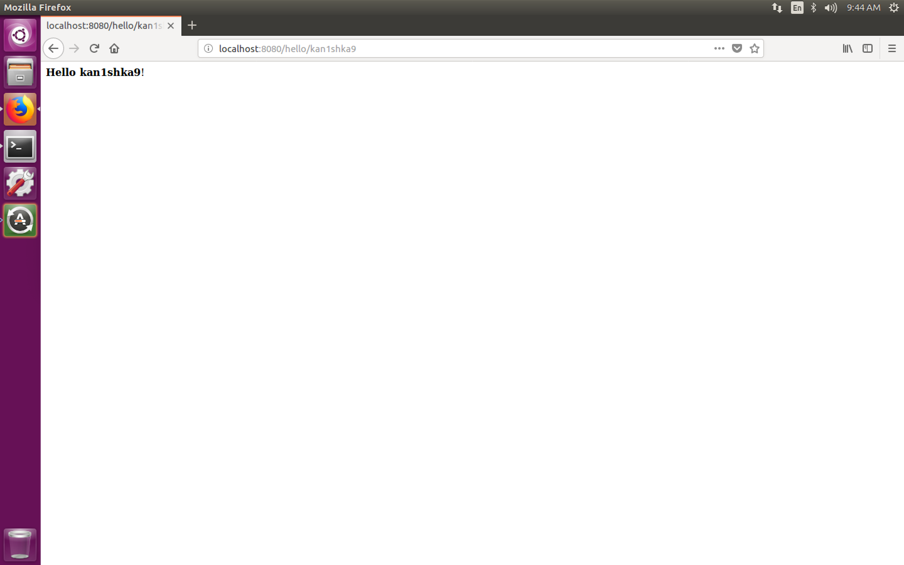
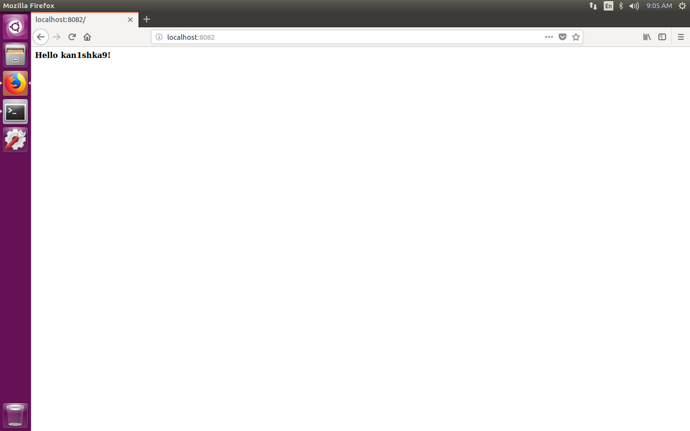
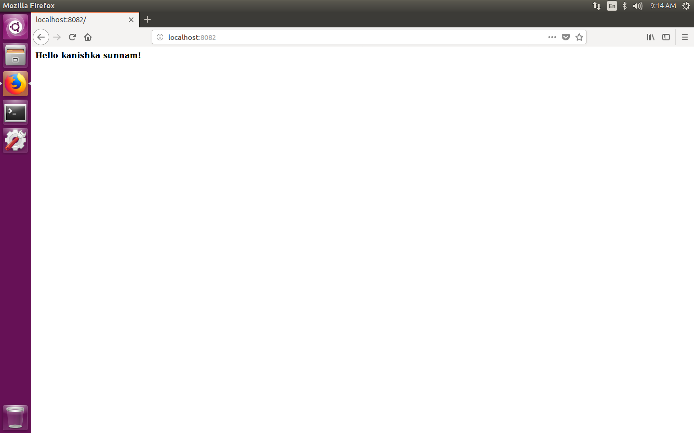

#### 0. Setup

- [Install `MongoDB` Community Edition on `Ubuntu`](https://docs.mongodb.com/getting-started/shell/tutorial/install-mongodb-on-ubuntu/)
- [Install `pip`](#install-pip)
- [Install `pymongo`](#install-pymongo)
	- [`PyMongo`](https://api.mongodb.com/python/current/)
- [Install `bottle`](#install-bottle)
	- [`Bottle: Python Web Framework`](https://bottlepy.org/docs/dev/)

###### Install `MongoDB` Community Edition on `Ubuntu`

```sh
sudo service mongod start
```

```sh
u64@vm:~$ mongo
MongoDB shell version v3.6.3
connecting to: mongodb://127.0.0.1:27017
MongoDB server version: 3.6.3
Server has startup warnings:
2018-03-12T10:26:42.962-0700 I STORAGE  [initandlisten]
2018-03-12T10:26:42.962-0700 I STORAGE  [initandlisten] ** WARNING: Using the XFS filesystem is strongly recommended with the WiredTiger storage engine
2018-03-12T10:26:42.962-0700 I STORAGE  [initandlisten] **          See http://dochub.mongodb.org/core/prodnotes-filesystem
2018-03-12T10:26:44.058-0700 I CONTROL  [initandlisten]
2018-03-12T10:26:44.058-0700 I CONTROL  [initandlisten] ** WARNING: Access control is not enabled for the database.
2018-03-12T10:26:44.058-0700 I CONTROL  [initandlisten] **          Read and write access to data and configuration is unrestricted.
2018-03-12T10:26:44.058-0700 I CONTROL  [initandlisten]
2018-03-12T10:26:44.058-0700 I CONTROL  [initandlisten]
2018-03-12T10:26:44.058-0700 I CONTROL  [initandlisten] ** WARNING: /sys/kernel/mm/transparent_hugepage/enabled is 'always'.
2018-03-12T10:26:44.058-0700 I CONTROL  [initandlisten] **        We suggest setting it to 'never'
2018-03-12T10:26:44.058-0700 I CONTROL  [initandlisten]
> db
test
> db.names.insert({'name':'First'})
WriteResult({ "nInserted" : 1 })
> db.names.find()
{ "_id" : ObjectId("5aa6b8ab2d73ad01e64e8d61"), "name" : "First" }
>
bye
u64@vm:~$
```

###### Install `pip`

```sh
sudo apt install python-pip
pip install --upgrade pip
```

###### Install `pymongo`

```sh
pip install pymongo
```

```sh
u64@vm:~$ sudo service mongod start
[sudo] password for u64:
u64@vm:~$ pgrep mongo
3417
u64@vm:~$
```

``pymongo_getting_started.py``

```python
import pymongo

from pymongo import MongoClient

# connect to database
connection = MongoClient('localhost', 27017)

db = connection.test

# handle to names collection
names = db.names

item = names.find_one()

print item['name']
```

```sh
u64@vm:~$ python pymongo_getting_started.py
First
u64@vm:~$
```

###### Install `bottle`

```
pip install bottle
```

`bottle_getting_started.py`

```python
from bottle import route, run, template

@route('/hello/<name>')
def index(name):
    return template('<b>Hello {{name}}</b>!', name=name)

run(host='localhost', port=8080)
```

```sh
u64@vm:~$ python bottle_getting_started.py
Bottle v0.12.13 server starting up (using WSGIRefServer())...
Listening on http://localhost:8080/
Hit Ctrl-C to quit.

127.0.0.1 - - [18/Mar/2018 09:42:24] "GET / HTTP/1.1" 404 720
127.0.0.1 - - [18/Mar/2018 09:42:24] "GET /favicon.ico HTTP/1.1" 404 742
127.0.0.1 - - [18/Mar/2018 09:42:39] "GET / HTTP/1.1" 404 720
127.0.0.1 - - [18/Mar/2018 09:42:39] "GET /favicon.ico HTTP/1.1" 404 742
127.0.0.1 - - [18/Mar/2018 09:43:58] "GET /hello/kan1shka9 HTTP/1.1" 200 23
```

```
http://localhost:8080/hello/kan1shka9
```



`hello_bottle.py`

```python

import bottle
import pymongo

# this is the handler for the default path of the web server
@bottle.route('/')
def index():

    # connect to mongoDB
    connection = pymongo.MongoClient('localhost', 27017)

    # attach to test database
    db = connection.test

    # get handle for names collection
    name = db.names

    # find a single document
    item = name.find_one()

    return '<b>Hello %s!</b>' % item['name']


bottle.run(host='localhost', port=8082)
```

```sh
u64@vm:~/Desktop$ python hello_bottle.py
Bottle v0.12.13 server starting up (using WSGIRefServer())...
Listening on http://localhost:8082/
Hit Ctrl-C to quit.

127.0.0.1 - - [22/Mar/2018 09:05:17] "GET / HTTP/1.1" 200 23
127.0.0.1 - - [22/Mar/2018 09:05:18] "GET /favicon.ico HTTP/1.1" 404 742
```

```
http://localhost:8082/
```



```sh
u64@vm:~/Desktop$ mongo
MongoDB shell version v3.6.3
connecting to: mongodb://127.0.0.1:27017
MongoDB server version: 3.6.3
Server has startup warnings:
2018-03-22T08:47:26.780-0700 I STORAGE  [initandlisten]
2018-03-22T08:47:26.780-0700 I STORAGE  [initandlisten] ** WARNING: Using the XFS filesystem is strongly recommended with the WiredTiger storage engine
2018-03-22T08:47:26.780-0700 I STORAGE  [initandlisten] **          See http://dochub.mongodb.org/core/prodnotes-filesystem
2018-03-22T08:47:29.249-0700 I CONTROL  [initandlisten]
2018-03-22T08:47:29.249-0700 I CONTROL  [initandlisten] ** WARNING: Access control is not enabled for the database.
2018-03-22T08:47:29.249-0700 I CONTROL  [initandlisten] **          Read and write access to data and configuration is unrestricted.
2018-03-22T08:47:29.249-0700 I CONTROL  [initandlisten]
> var j = db.names.findOne()
> j
{ "_id" : ObjectId("5ab3d1313c8be27a7b7b8876"), "name" : "kan1shka9" }
> j.name = 'kanishka sunnam'
kanishka sunnam
> db.names.save(j)
WriteResult({ "nMatched" : 1, "nUpserted" : 0, "nModified" : 1 })
> db.names.findOne()
{ "_id" : ObjectId("5ab3d1313c8be27a7b7b8876"), "name" : "kanishka sunnam" }
>
bye
u64@vm:~/Desktop$
```

```sh
u64@vm:~/Desktop$ python hello_bottle.py
Bottle v0.12.13 server starting up (using WSGIRefServer())...
Listening on http://localhost:8082/
Hit Ctrl-C to quit.

127.0.0.1 - - [22/Mar/2018 09:14:41] "GET / HTTP/1.1" 200 29
127.0.0.1 - - [22/Mar/2018 09:14:42] "GET /favicon.ico HTTP/1.1" 404 742
```

