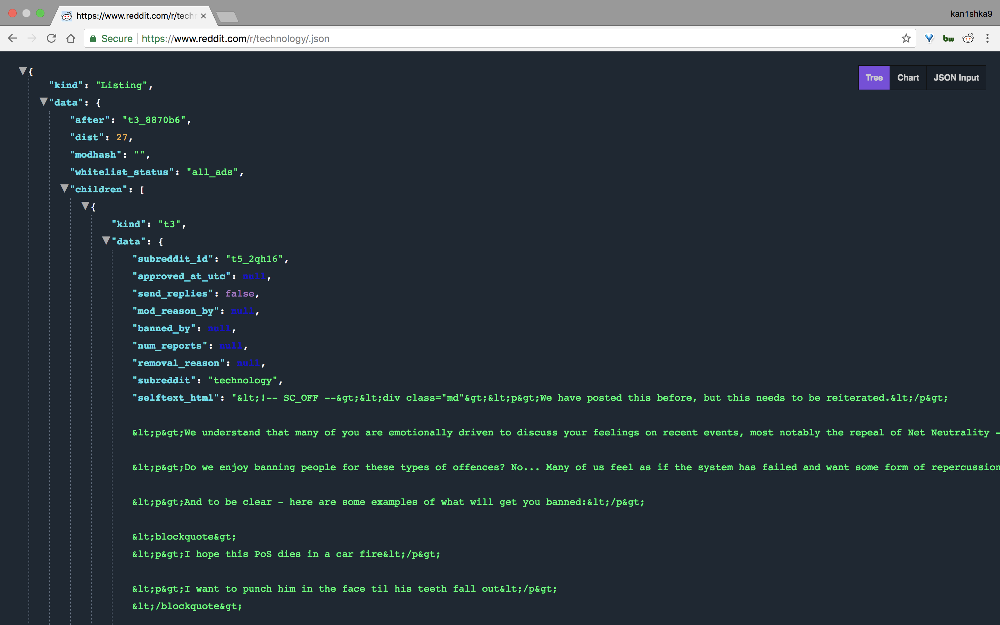
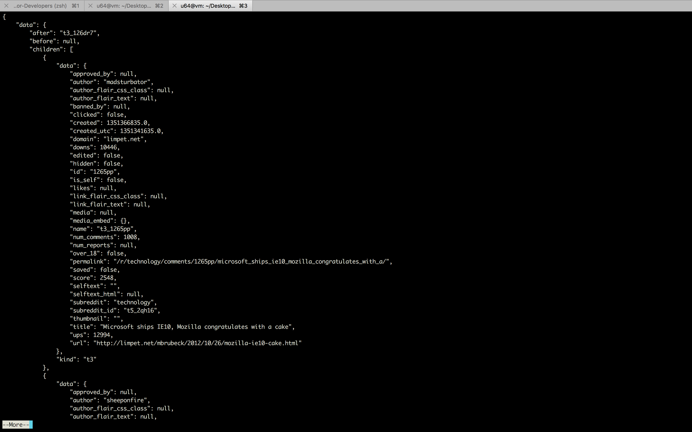

#### 18. Importing from Reddit

```
https://www.reddit.com/r/technology/.json
```



```sh
u64@vm:~/Desktop$ curl https://www.reddit.com/r/technology/.json > reddit.json
```

```sh
u64@vm:~/Desktop$ cat reddit.json | python -m json.tool | more
```



###### `read_reddit.py`

```python
#!/usr/bin/env python

import json
import urllib2
import pymongo

# connect to mongo
connection = pymongo.MongoClient("mongodb://localhost")

# get a handle to the reddit database
db = connection.reddit
stories = db.stories

# drop existing collection
stories.drop()

# get the reddit home page
request = urllib2.Request("http://www.reddit.com/r/technology/.json", headers={'User-Agent' : 'super happy flair bot by /u/spladug'})
reddit_page = urllib2.urlopen(request)

# parse the json into python objects
parsed = json.loads(reddit_page.read())

# iterate through every news item on the page
for item in parsed['data']['children']:
    # put it in mongo
    stories.insert_one(item['data'])
```

```sh
u64@vm:~/Desktop$ python read_reddit.py
```

```sh
u64@vm:~/Desktop$ mongo
MongoDB shell version v3.6.3
connecting to: mongodb://127.0.0.1:27017
MongoDB server version: 3.6.3
Server has startup warnings:
2018-03-30T09:49:35.659-0700 I STORAGE  [initandlisten]
2018-03-30T09:49:35.659-0700 I STORAGE  [initandlisten] ** WARNING: Using the XFS filesystem is strongly recommended with the WiredTiger storage engine
2018-03-30T09:49:35.659-0700 I STORAGE  [initandlisten] **          See http://dochub.mongodb.org/core/prodnotes-filesystem
2018-03-30T09:49:36.582-0700 I CONTROL  [initandlisten]
2018-03-30T09:49:36.582-0700 I CONTROL  [initandlisten] ** WARNING: Access control is not enabled for the database.
2018-03-30T09:49:36.582-0700 I CONTROL  [initandlisten] **          Read and write access to data and configuration is unrestricted.
2018-03-30T09:49:36.583-0700 I CONTROL  [initandlisten]
> show dbs
admin   0.000GB
config  0.000GB
reddit  0.000GB
school  0.000GB
> use reddit
switched to db reddit
> show collections
stories
> db.stories.findOne()
{
	"_id" : ObjectId("5abece8e686c821f5bc9a75a"),
	"is_crosspostable" : false,
	"subreddit_id" : "t5_2qh16",
	"approved_at_utc" : null,
	"mod_reason_by" : null,
	"banned_by" : null,
	"removal_reason" : null,
	"subreddit" : "technology",
	"selftext_html" : "&lt;!-- SC_OFF --&gt;&lt;div class=\"md\"&gt;&lt;p&gt;We have posted this before, but this needs to be reiterated.&lt;/p&gt;\n\n&lt;p&gt;We understand that many of you are emotionally driven to discuss your feelings on recent events, most notably the repeal of Net Neutrality - however inciting violence towards others is never ok. It is upsetting that we even have to post this. &lt;/p&gt;\n\n&lt;p&gt;Do we enjoy banning people for these types of offences? No... Many of us feel as if the system has failed and want some form of repercussion. But threats of violence and harassment are not the answer here.&lt;/p&gt;\n\n&lt;p&gt;And to be clear - here are some examples of what will get you banned:&lt;/p&gt;\n\n&lt;blockquote&gt;\n&lt;p&gt;I hope this PoS dies in a car fire&lt;/p&gt;\n\n&lt;p&gt;I want to punch him in the face til his teeth fall out&lt;/p&gt;\n&lt;/blockquote&gt;\n\n&lt;p&gt;And if you are trying to be slick by using this form&lt;/p&gt;\n\n&lt;blockquote&gt;\n&lt;p&gt;I never condone violence but...&lt;/p&gt;\n\n&lt;p&gt;I would never say he should die but...&lt;/p&gt;\n\n&lt;p&gt;Im not one to wish death upon but...&lt;/p&gt;\n&lt;/blockquote&gt;\n\n&lt;p&gt;Let&amp;#39;s keep the threads civil.&lt;/p&gt;\n\n&lt;p&gt;&lt;strong&gt;If you violate this rule, you will be banned for 30 days, no exceptions&lt;/strong&gt; &lt;/p&gt;\n&lt;/div&gt;&lt;!-- SC_ON --&gt;",
	"selftext" : "We have posted this before, but this needs to be reiterated.\n\nWe understand that many of you are emotionally driven to discuss your feelings on recent events, most notably the repeal of Net Neutrality - however inciting violence towards others is never ok. It is upsetting that we even have to post this. \n\nDo we enjoy banning people for these types of offences? No... Many of us feel as if the system has failed and want some form of repercussion. But threats of violence and harassment are not the answer here.\n\nAnd to be clear - here are some examples of what will get you banned:\n\n&gt; I hope this PoS dies in a car fire\n\n&gt; I want to punch him in the face til his teeth fall out\n\nAnd if you are trying to be slick by using this form\n\n&gt; I never condone violence but...\n\n&gt; I would never say he should die but...\n\n&gt; Im not one to wish death upon but...\n\n\nLet's keep the threads civil.\n\n**If you violate this rule, you will be banned for 30 days, no exceptions** ",
	"likes" : null,
	"suggested_sort" : null,
	"mod_note" : null,
	"user_reports" : [ ],
	"secure_media" : null,
	"is_reddit_media_domain" : false,
	"saved" : false,
	"id" : "7jv9ln",
	"banned_at_utc" : null,
	"mod_reason_title" : null,
	"view_count" : null,
	"archived" : false,
	"clicked" : false,
	"no_follow" : false,
	"author" : "zathegfx",
	"num_crossposts" : 1,
	"link_flair_text" : "Mod post",
	"can_mod_post" : false,
	"send_replies" : false,
	"pinned" : false,
	"score" : 817,
	"approved_by" : null,
	"over_18" : false,
	"domain" : "self.technology",
	"hidden" : false,
	"num_comments" : 313,
	"thumbnail" : "",
	"hide_score" : false,
	"edited" : false,
	"link_flair_css_class" : "adblock",
	"author_flair_css_class" : null,
	"contest_mode" : false,
	"gilded" : 0,
	"locked" : false,
	"downs" : 0,
	"brand_safe" : true,
	"subreddit_subscribers" : 6015038,
	"secure_media_embed" : {

	},
	"media_embed" : {

	},
	"stickied" : true,
	"can_gild" : false,
	"is_self" : true,
	"name" : "t3_7jv9ln",
	"spoiler" : false,
	"permalink" : "/r/technology/comments/7jv9ln/any_form_of_threatening_harassing_or_violence/",
	"subreddit_type" : "public",
	"parent_whitelist_status" : "all_ads",
	"report_reasons" : null,
	"created" : 1513319180,
	"url" : "https://www.reddit.com/r/technology/comments/7jv9ln/any_form_of_threatening_harassing_or_violence/",
	"author_flair_text" : null,
	"quarantine" : false,
	"whitelist_status" : "all_ads",
	"created_utc" : 1513290380,
	"subreddit_name_prefixed" : "r/technology",
	"distinguished" : null,
	"media" : null,
	"title" : "Any form of threatening, harassing, or violence / physical harm towards anyone will result in a ban",
	"mod_reports" : [ ],
	"visited" : false,
	"num_reports" : null,
	"is_video" : false,
	"ups" : 817
}
>
```