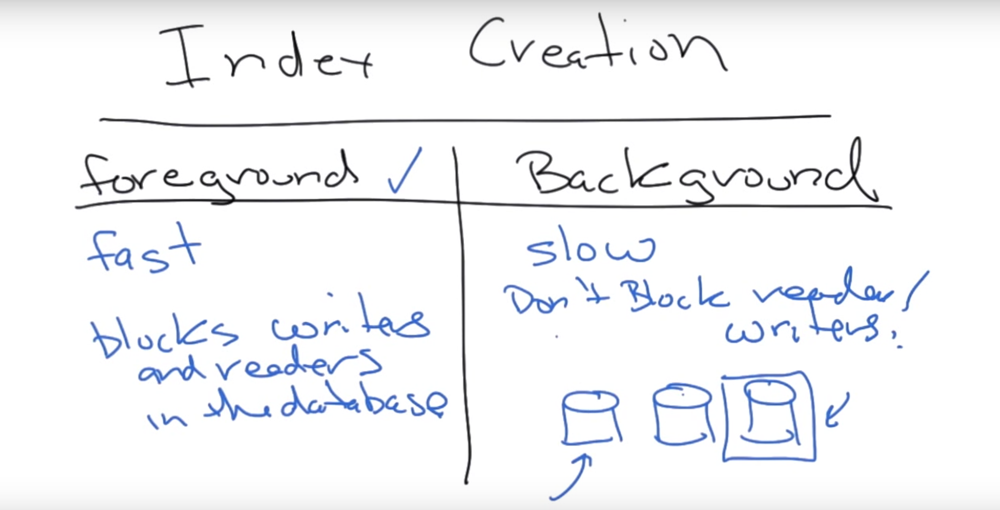
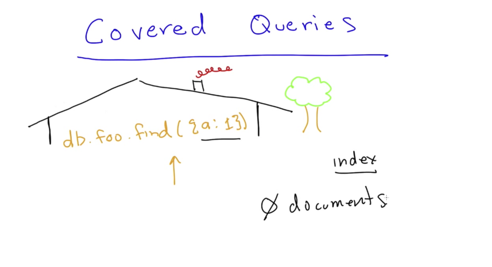
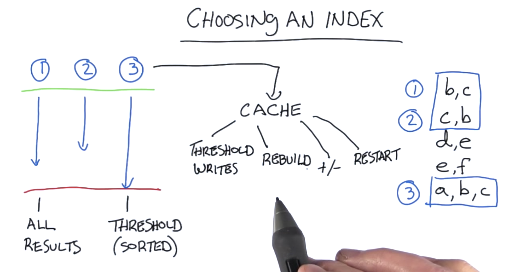

#### 29. Performance

###### Ways to increase performance

- Indexing
- Sharding
	- Distributing the database queries across multiple servers


###### Storage Engines

- MMAP
- WiredTiger &rarr; default

###### MMAP

- Collection level concurrency

```sh
☁  ~  man mmap
```


[Power of 2 Sized Allocations](https://docs.mongodb.com/manual/core/mmapv1/?_ga=2.165993854.173869112.1523378710-1834989889.1520636077#power-of-2-allocation)

###### WiredTiger

- Document level concurrency
- Supports compression of data, document, indexes
- No inplace updates

```sh
u64@vm:~$ mkdir WT
```

```sh
u64@vm:~$ mongod --storageEngine wiredTiger -dbpath WT/
2018-04-11T15:10:38.943-0700 I CONTROL  [initandlisten] MongoDB starting : pid=4722 port=27017 dbpath=WT/ 64-bit host=vm
2018-04-11T15:10:38.943-0700 I CONTROL  [initandlisten] db version v3.6.3
2018-04-11T15:10:38.944-0700 I CONTROL  [initandlisten] git version: 9586e557d54ef70f9ca4b43c26892cd55257e1a5
2018-04-11T15:10:38.944-0700 I CONTROL  [initandlisten] OpenSSL version: OpenSSL 1.0.2g  1 Mar 2016
2018-04-11T15:10:38.945-0700 I CONTROL  [initandlisten] allocator: tcmalloc
2018-04-11T15:10:38.945-0700 I CONTROL  [initandlisten] modules: none
2018-04-11T15:10:38.945-0700 I CONTROL  [initandlisten] build environment:
2018-04-11T15:10:38.946-0700 I CONTROL  [initandlisten]     distmod: ubuntu1604
2018-04-11T15:10:38.946-0700 I CONTROL  [initandlisten]     distarch: x86_64
2018-04-11T15:10:38.946-0700 I CONTROL  [initandlisten]     target_arch: x86_64
2018-04-11T15:10:38.946-0700 I CONTROL  [initandlisten] options: { storage: { dbPath: "WT/", engine: "wiredTiger" } }
2018-04-11T15:10:38.947-0700 I STORAGE  [initandlisten]
2018-04-11T15:10:38.947-0700 I STORAGE  [initandlisten] ** WARNING: Using the XFS filesystem is strongly recommended with the WiredTiger storage engine
2018-04-11T15:10:38.947-0700 I STORAGE  [initandlisten] **          See http://dochub.mongodb.org/core/prodnotes-filesystem
2018-04-11T15:10:38.947-0700 I STORAGE  [initandlisten] wiredtiger_open config: create,cache_size=473M,session_max=20000,eviction=(threads_min=4,threads_max=4),config_base=false,statistics=(fast),log=(enabled=true,archive=true,path=journal,compressor=snappy),file_manager=(close_idle_time=100000),statistics_log=(wait=0),verbose=(recovery_progress),
2018-04-11T15:10:39.530-0700 I CONTROL  [initandlisten]
2018-04-11T15:10:39.530-0700 I CONTROL  [initandlisten] ** WARNING: Access control is not enabled for the database.
2018-04-11T15:10:39.531-0700 I CONTROL  [initandlisten] **          Read and write access to data and configuration is unrestricted.
2018-04-11T15:10:39.531-0700 I CONTROL  [initandlisten]
2018-04-11T15:10:39.531-0700 I CONTROL  [initandlisten] ** WARNING: This server is bound to localhost.
2018-04-11T15:10:39.532-0700 I CONTROL  [initandlisten] **          Remote systems will be unable to connect to this server.
2018-04-11T15:10:39.532-0700 I CONTROL  [initandlisten] **          Start the server with --bind_ip <address> to specify which IP
2018-04-11T15:10:39.532-0700 I CONTROL  [initandlisten] **          addresses it should serve responses from, or with --bind_ip_all to
2018-04-11T15:10:39.533-0700 I CONTROL  [initandlisten] **          bind to all interfaces. If this behavior is desired, start the
2018-04-11T15:10:39.533-0700 I CONTROL  [initandlisten] **          server with --bind_ip 127.0.0.1 to disable this warning.
2018-04-11T15:10:39.533-0700 I CONTROL  [initandlisten]
2018-04-11T15:10:39.534-0700 I STORAGE  [initandlisten] createCollection: admin.system.version with provided UUID: c483c7b2-7f3d-421b-81bc-c4d86a1d87c0
2018-04-11T15:10:39.541-0700 I COMMAND  [initandlisten] setting featureCompatibilityVersion to 3.6
2018-04-11T15:10:39.544-0700 I STORAGE  [initandlisten] createCollection: local.startup_log with generated UUID: 6f611d2e-ba68-4d89-97c1-82e50236dc12
2018-04-11T15:10:39.549-0700 I FTDC     [initandlisten] Initializing full-time diagnostic data capture with directory 'WT/diagnostic.data'
2018-04-11T15:10:39.550-0700 I NETWORK  [initandlisten] waiting for connections on port 27017
2018-04-11T15:10:52.994-0700 I NETWORK  [listener] connection accepted from 127.0.0.1:52010 #1 (1 connection now open)
2018-04-11T15:10:52.995-0700 I NETWORK  [conn1] received client metadata from 127.0.0.1:52010 conn: { application: { name: "MongoDB Shell" }, driver: { name: "MongoDB Internal Client", version: "3.6.3" }, os: { type: "Linux", name: "Ubuntu", architecture: "x86_64", version: "16.04" } }
2018-04-11T15:12:00.998-0700 I STORAGE  [conn1] createCollection: test.foo with generated UUID: c5aaf97f-c486-4ce9-b320-55493d06a4b1
```

```sh
u64@vm:~$ mongo
MongoDB shell version v3.6.3
connecting to: mongodb://127.0.0.1:27017
MongoDB server version: 3.6.3
Server has startup warnings:
2018-04-11T15:10:38.947-0700 I STORAGE  [initandlisten]
2018-04-11T15:10:38.947-0700 I STORAGE  [initandlisten] ** WARNING: Using the XFS filesystem is strongly recommended with the WiredTiger storage engine
2018-04-11T15:10:38.947-0700 I STORAGE  [initandlisten] **          See http://dochub.mongodb.org/core/prodnotes-filesystem
2018-04-11T15:10:39.530-0700 I CONTROL  [initandlisten]
2018-04-11T15:10:39.530-0700 I CONTROL  [initandlisten] ** WARNING: Access control is not enabled for the database.
2018-04-11T15:10:39.531-0700 I CONTROL  [initandlisten] **          Read and write access to data and configuration is unrestricted.
2018-04-11T15:10:39.531-0700 I CONTROL  [initandlisten]
2018-04-11T15:10:39.531-0700 I CONTROL  [initandlisten] ** WARNING: This server is bound to localhost.
2018-04-11T15:10:39.532-0700 I CONTROL  [initandlisten] **          Remote systems will be unable to connect to this server.
2018-04-11T15:10:39.532-0700 I CONTROL  [initandlisten] **          Start the server with --bind_ip <address> to specify which IP
2018-04-11T15:10:39.532-0700 I CONTROL  [initandlisten] **          addresses it should serve responses from, or with --bind_ip_all to
2018-04-11T15:10:39.533-0700 I CONTROL  [initandlisten] **          bind to all interfaces. If this behavior is desired, start the
2018-04-11T15:10:39.533-0700 I CONTROL  [initandlisten] **          server with --bind_ip 127.0.0.1 to disable this warning.
2018-04-11T15:10:39.533-0700 I CONTROL  [initandlisten]
> db.foo.insert({'name':'kan1shka9'});
WriteResult({ "nInserted" : 1 })
> db.foo.stats()
{
	"ns" : "test.foo",
	"size" : 42,
	"count" : 1,
	"avgObjSize" : 42,
	"storageSize" : 4096,
	"capped" : false,
	"wiredTiger" : {
		"metadata" : {
			"formatVersion" : 1
		},
		"creationString" : "access_pattern_hint=none,allocation_size=4KB,app_metadata=(formatVersion=1),assert=(commit_timestamp=none,read_timestamp=none),block_allocation=best,block_compressor=snappy,cache_resident=false,checksum=on,colgroups=,collator=,columns=,dictionary=0,encryption=(keyid=,name=),exclusive=false,extractor=,format=btree,huffman_key=,huffman_value=,ignore_in_memory_cache_size=false,immutable=false,internal_item_max=0,internal_key_max=0,internal_key_truncate=true,internal_page_max=4KB,key_format=q,key_gap=10,leaf_item_max=0,leaf_key_max=0,leaf_page_max=32KB,leaf_value_max=64MB,log=(enabled=true),lsm=(auto_throttle=true,bloom=true,bloom_bit_count=16,bloom_config=,bloom_hash_count=8,bloom_oldest=false,chunk_count_limit=0,chunk_max=5GB,chunk_size=10MB,merge_custom=(prefix=,start_generation=0,suffix=),merge_max=15,merge_min=0),memory_page_max=10m,os_cache_dirty_max=0,os_cache_max=0,prefix_compression=false,prefix_compression_min=4,source=,split_deepen_min_child=0,split_deepen_per_child=0,split_pct=90,type=file,value_format=u",
		"type" : "file",
		"uri" : "statistics:table:collection-4-5954352674676732153",
		"LSM" : {
			"bloom filter false positives" : 0,
			"bloom filter hits" : 0,
			"bloom filter misses" : 0,
			"bloom filter pages evicted from cache" : 0,
			"bloom filter pages read into cache" : 0,
			"bloom filters in the LSM tree" : 0,
			"chunks in the LSM tree" : 0,
			"highest merge generation in the LSM tree" : 0,
			"queries that could have benefited from a Bloom filter that did not exist" : 0,
			"sleep for LSM checkpoint throttle" : 0,
			"sleep for LSM merge throttle" : 0,
			"total size of bloom filters" : 0
		},
		"block-manager" : {
			"allocations requiring file extension" : 0,
			"blocks allocated" : 0,
			"blocks freed" : 0,
			"checkpoint size" : 0,
			"file allocation unit size" : 4096,
			"file bytes available for reuse" : 0,
			"file magic number" : 120897,
			"file major version number" : 1,
			"file size in bytes" : 4096,
			"minor version number" : 0
		},
		"btree" : {
			"btree checkpoint generation" : 0,
			"column-store fixed-size leaf pages" : 0,
			"column-store internal pages" : 0,
			"column-store variable-size RLE encoded values" : 0,
			"column-store variable-size deleted values" : 0,
			"column-store variable-size leaf pages" : 0,
			"fixed-record size" : 0,
			"maximum internal page key size" : 368,
			"maximum internal page size" : 4096,
			"maximum leaf page key size" : 2867,
			"maximum leaf page size" : 32768,
			"maximum leaf page value size" : 67108864,
			"maximum tree depth" : 3,
			"number of key/value pairs" : 0,
			"overflow pages" : 0,
			"pages rewritten by compaction" : 0,
			"row-store internal pages" : 0,
			"row-store leaf pages" : 0
		},
		"cache" : {
			"bytes currently in the cache" : 857,
			"bytes read into cache" : 0,
			"bytes written from cache" : 0,
			"checkpoint blocked page eviction" : 0,
			"data source pages selected for eviction unable to be evicted" : 0,
			"eviction walk passes of a file" : 0,
			"eviction walk target pages histogram - 0-9" : 0,
			"eviction walk target pages histogram - 10-31" : 0,
			"eviction walk target pages histogram - 128 and higher" : 0,
			"eviction walk target pages histogram - 32-63" : 0,
			"eviction walk target pages histogram - 64-128" : 0,
			"eviction walks abandoned" : 0,
			"eviction walks gave up because they restarted their walk twice" : 0,
			"eviction walks gave up because they saw too many pages and found no candidates" : 0,
			"eviction walks gave up because they saw too many pages and found too few candidates" : 0,
			"eviction walks reached end of tree" : 0,
			"eviction walks started from root of tree" : 0,
			"eviction walks started from saved location in tree" : 0,
			"hazard pointer blocked page eviction" : 0,
			"in-memory page passed criteria to be split" : 0,
			"in-memory page splits" : 0,
			"internal pages evicted" : 0,
			"internal pages split during eviction" : 0,
			"leaf pages split during eviction" : 0,
			"modified pages evicted" : 0,
			"overflow pages read into cache" : 0,
			"page split during eviction deepened the tree" : 0,
			"page written requiring lookaside records" : 0,
			"pages read into cache" : 0,
			"pages read into cache requiring lookaside entries" : 0,
			"pages requested from the cache" : 1,
			"pages seen by eviction walk" : 0,
			"pages written from cache" : 0,
			"pages written requiring in-memory restoration" : 0,
			"tracked dirty bytes in the cache" : 675,
			"unmodified pages evicted" : 0
		},
		"cache_walk" : {
			"Average difference between current eviction generation when the page was last considered" : 0,
			"Average on-disk page image size seen" : 0,
			"Average time in cache for pages that have been visited by the eviction server" : 0,
			"Average time in cache for pages that have not been visited by the eviction server" : 0,
			"Clean pages currently in cache" : 0,
			"Current eviction generation" : 0,
			"Dirty pages currently in cache" : 0,
			"Entries in the root page" : 0,
			"Internal pages currently in cache" : 0,
			"Leaf pages currently in cache" : 0,
			"Maximum difference between current eviction generation when the page was last considered" : 0,
			"Maximum page size seen" : 0,
			"Minimum on-disk page image size seen" : 0,
			"Number of pages never visited by eviction server" : 0,
			"On-disk page image sizes smaller than a single allocation unit" : 0,
			"Pages created in memory and never written" : 0,
			"Pages currently queued for eviction" : 0,
			"Pages that could not be queued for eviction" : 0,
			"Refs skipped during cache traversal" : 0,
			"Size of the root page" : 0,
			"Total number of pages currently in cache" : 0
		},
		"compression" : {
			"compressed pages read" : 0,
			"compressed pages written" : 0,
			"page written failed to compress" : 0,
			"page written was too small to compress" : 0,
			"raw compression call failed, additional data available" : 0,
			"raw compression call failed, no additional data available" : 0,
			"raw compression call succeeded" : 0
		},
		"cursor" : {
			"bulk-loaded cursor-insert calls" : 0,
			"create calls" : 1,
			"cursor-insert key and value bytes inserted" : 43,
			"cursor-remove key bytes removed" : 0,
			"cursor-update value bytes updated" : 0,
			"insert calls" : 1,
			"modify calls" : 0,
			"next calls" : 0,
			"prev calls" : 1,
			"remove calls" : 0,
			"reserve calls" : 0,
			"reset calls" : 2,
			"restarted searches" : 0,
			"search calls" : 0,
			"search near calls" : 0,
			"truncate calls" : 0,
			"update calls" : 0
		},
		"reconciliation" : {
			"dictionary matches" : 0,
			"fast-path pages deleted" : 0,
			"internal page key bytes discarded using suffix compression" : 0,
			"internal page multi-block writes" : 0,
			"internal-page overflow keys" : 0,
			"leaf page key bytes discarded using prefix compression" : 0,
			"leaf page multi-block writes" : 0,
			"leaf-page overflow keys" : 0,
			"maximum blocks required for a page" : 0,
			"overflow values written" : 0,
			"page checksum matches" : 0,
			"page reconciliation calls" : 0,
			"page reconciliation calls for eviction" : 0,
			"pages deleted" : 0
		},
		"session" : {
			"object compaction" : 0,
			"open cursor count" : 1
		},
		"transaction" : {
			"update conflicts" : 0
		}
	},
	"nindexes" : 1,
	"totalIndexSize" : 4096,
	"indexSizes" : {
		"_id_" : 4096
	},
	"ok" : 1
}
>
```

###### Indexing

(a, b, c)

- a &rarr; ✅
- a, b &rarr; ✅
- a, b, c &rarr; ✅
- c &rarr; ❌
- c, b &rarr; ❌
- a, c &rarr; ✅

- Reads are much faster with indexes, writes to a document will happen slower. This is true, but it's worth noting a caveat here: combination operations, such as update and deletion operations, where you find the document you want and then perform a write, will benefit from the index when you're performing the query stage, and then may be slowed by the index when you perform the write. Usually you're still better off having an index, but there are some special cases where this may not be true.
- Indexes in mongodb are in `btrees`. This is true for MMAP (and therefore for MongoDB prior to 3.0), but it does depend on your storage engine. For example, when you are using WiredTiger, as of MongoDB 3.0, indexes are implemented in `b+trees`.

- [Create Index](https://docs.mongodb.com/manual/reference/method/db.collection.createIndex/index.html#examples)

`create_scores2.js`

```js
db = db.getSiblingDB('school');
db.students.drop();
types = ['exam', 'quiz', 'homework', 'homework'];
// 1 million students
for (i = 0; i < 1000000; i++) {
    // take 10 classes
    for (class_counter = 0; class_counter < 10; class_counter++) {
        scores = [];
        // and each class has 4 grades
        for (j = 0; j < 4; j++) {
            scores.push({
                type: types[j],
                score: Math.random() * 100
            });
        }

        // there are 500 different classes that they can take
        class_id = Math.floor(Math.random() * 501); // get a class id between 0 and 500

        record = {
            student_id: i,
            scores: scores,
            class_id: class_id
        };
        db.students.insert(record);
    }
}
```

```sh
u64@vm:~/Desktop$ mongo < create_scores2.js
MongoDB shell version v3.6.3
connecting to: mongodb://127.0.0.1:27017
MongoDB server version: 3.6.3
school
true
[ "exam", "quiz", "homework", "homework" ]
```

```sh
u64@vm:~/Desktop$ mongo
MongoDB shell version v3.6.3
connecting to: mongodb://127.0.0.1:27017
MongoDB server version: 3.6.3
Server has startup warnings:
2018-04-11T16:34:12.143-0700 I STORAGE  [initandlisten]
2018-04-11T16:34:12.143-0700 I STORAGE  [initandlisten] ** WARNING: Using the XFS filesystem is strongly recommended with the WiredTiger storage engine
2018-04-11T16:34:12.143-0700 I STORAGE  [initandlisten] **          See http://dochub.mongodb.org/core/prodnotes-filesystem
2018-04-11T16:34:13.561-0700 I CONTROL  [initandlisten]
2018-04-11T16:34:13.561-0700 I CONTROL  [initandlisten] ** WARNING: Access control is not enabled for the database.
2018-04-11T16:34:13.561-0700 I CONTROL  [initandlisten] **          Read and write access to data and configuration is unrestricted.
2018-04-11T16:34:13.561-0700 I CONTROL  [initandlisten]
> use school
switched to db school
> show collections
students
> db.students.findOne()
{
	"_id" : ObjectId("5ace9c7aebe2efcaba2092ba"),
	"student_id" : 0,
	"scores" : [
		{
			"type" : "exam",
			"score" : 58.49016782201176
		},
		{
			"type" : "quiz",
			"score" : 32.651691956707985
		},
		{
			"type" : "homework",
			"score" : 89.91685522977552
		},
		{
			"type" : "homework",
			"score" : 14.641713305169956
		}
	],
	"class_id" : 387
}
>
> db.students.find({student_id:5});
{ "_id" : ObjectId("5ace9c7aebe2efcaba2092ec"), "student_id" : 5, "scores" : [ { "type" : "exam", "score" : 95.52330330195716 }, { "type" : "quiz", "score" : 11.960884712927488 }, { "type" : "homework", "score" : 69.53269617882063 }, { "type" : "homework", "score" : 42.7819601828604 } ], "class_id" : 17 }
{ "_id" : ObjectId("5ace9c7aebe2efcaba2092ed"), "student_id" : 5, "scores" : [ { "type" : "exam", "score" : 66.05668238660839 }, { "type" : "quiz", "score" : 44.81616690274919 }, { "type" : "homework", "score" : 42.28926391858378 }, { "type" : "homework", "score" : 54.04613298887541 } ], "class_id" : 238 }
{ "_id" : ObjectId("5ace9c7aebe2efcaba2092ee"), "student_id" : 5, "scores" : [ { "type" : "exam", "score" : 69.71769688558975 }, { "type" : "quiz", "score" : 69.57755292761512 }, { "type" : "homework", "score" : 23.696040974255293 }, { "type" : "homework", "score" : 96.52932217835829 } ], "class_id" : 324 }
{ "_id" : ObjectId("5ace9c7aebe2efcaba2092ef"), "student_id" : 5, "scores" : [ { "type" : "exam", "score" : 24.20668342640494 }, { "type" : "quiz", "score" : 36.58621003840189 }, { "type" : "homework", "score" : 34.23365705818293 }, { "type" : "homework", "score" : 29.173029949159 } ], "class_id" : 86 }
{ "_id" : ObjectId("5ace9c7aebe2efcaba2092f0"), "student_id" : 5, "scores" : [ { "type" : "exam", "score" : 51.326475909927375 }, { "type" : "quiz", "score" : 66.25381622563324 }, { "type" : "homework", "score" : 3.189811936260567 }, { "type" : "homework", "score" : 43.040900949844804 } ], "class_id" : 350 }
{ "_id" : ObjectId("5ace9c7aebe2efcaba2092f1"), "student_id" : 5, "scores" : [ { "type" : "exam", "score" : 85.6512237852525 }, { "type" : "quiz", "score" : 12.046301423004934 }, { "type" : "homework", "score" : 10.495388859264033 }, { "type" : "homework", "score" : 97.01363803628198 } ], "class_id" : 442 }
{ "_id" : ObjectId("5ace9c7aebe2efcaba2092f2"), "student_id" : 5, "scores" : [ { "type" : "exam", "score" : 14.909550190123955 }, { "type" : "quiz", "score" : 71.93205617739764 }, { "type" : "homework", "score" : 91.3161627744069 }, { "type" : "homework", "score" : 10.164978943170178 } ], "class_id" : 499 }
{ "_id" : ObjectId("5ace9c7aebe2efcaba2092f3"), "student_id" : 5, "scores" : [ { "type" : "exam", "score" : 65.98985667191283 }, { "type" : "quiz", "score" : 93.84431092318455 }, { "type" : "homework", "score" : 74.7387197821418 }, { "type" : "homework", "score" : 43.04122253839019 } ], "class_id" : 294 }
{ "_id" : ObjectId("5ace9c7aebe2efcaba2092f4"), "student_id" : 5, "scores" : [ { "type" : "exam", "score" : 46.04740965515835 }, { "type" : "quiz", "score" : 59.32147409588783 }, { "type" : "homework", "score" : 93.92981114385145 }, { "type" : "homework", "score" : 29.128034476876906 } ], "class_id" : 59 }
{ "_id" : ObjectId("5ace9c7aebe2efcaba2092f5"), "student_id" : 5, "scores" : [ { "type" : "exam", "score" : 94.83828126157636 }, { "type" : "quiz", "score" : 49.63197232512672 }, { "type" : "homework", "score" : 88.5316240585598 }, { "type" : "homework", "score" : 79.37536985453781 } ], "class_id" : 395 }
>
> db.students.explain().find({student_id:5});
{
	"queryPlanner" : {
		"plannerVersion" : 1,
		"namespace" : "school.students",
		"indexFilterSet" : false,
		"parsedQuery" : {
			"student_id" : {
				"$eq" : 5
			}
		},
		"winningPlan" : {
			"stage" : "COLLSCAN",
			"filter" : {
				"student_id" : {
					"$eq" : 5
				}
			},
			"direction" : "forward"
		},
		"rejectedPlans" : [ ]
	},
	"serverInfo" : {
		"host" : "vm",
		"port" : 27017,
		"version" : "3.6.3",
		"gitVersion" : "9586e557d54ef70f9ca4b43c26892cd55257e1a5"
	},
	"ok" : 1
}
>
> db.students.findOne({student_id:5});
{
	"_id" : ObjectId("5ace9c7aebe2efcaba2092ec"),
	"student_id" : 5,
	"scores" : [
		{
			"type" : "exam",
			"score" : 95.52330330195716
		},
		{
			"type" : "quiz",
			"score" : 11.960884712927488
		},
		{
			"type" : "homework",
			"score" : 69.53269617882063
		},
		{
			"type" : "homework",
			"score" : 42.7819601828604
		}
	],
	"class_id" : 17
}
>
> db.students.createIndex({student_id:1});
{
	"createdCollectionAutomatically" : false,
	"numIndexesBefore" : 1,
	"numIndexesAfter" : 2,
	"ok" : 1
}
>
> db.students.find({student_id:5});
{ "_id" : ObjectId("5ace9c7aebe2efcaba2092ec"), "student_id" : 5, "scores" : [ { "type" : "exam", "score" : 95.52330330195716 }, { "type" : "quiz", "score" : 11.960884712927488 }, { "type" : "homework", "score" : 69.53269617882063 }, { "type" : "homework", "score" : 42.7819601828604 } ], "class_id" : 17 }
{ "_id" : ObjectId("5ace9c7aebe2efcaba2092ed"), "student_id" : 5, "scores" : [ { "type" : "exam", "score" : 66.05668238660839 }, { "type" : "quiz", "score" : 44.81616690274919 }, { "type" : "homework", "score" : 42.28926391858378 }, { "type" : "homework", "score" : 54.04613298887541 } ], "class_id" : 238 }
{ "_id" : ObjectId("5ace9c7aebe2efcaba2092ee"), "student_id" : 5, "scores" : [ { "type" : "exam", "score" : 69.71769688558975 }, { "type" : "quiz", "score" : 69.57755292761512 }, { "type" : "homework", "score" : 23.696040974255293 }, { "type" : "homework", "score" : 96.52932217835829 } ], "class_id" : 324 }
{ "_id" : ObjectId("5ace9c7aebe2efcaba2092ef"), "student_id" : 5, "scores" : [ { "type" : "exam", "score" : 24.20668342640494 }, { "type" : "quiz", "score" : 36.58621003840189 }, { "type" : "homework", "score" : 34.23365705818293 }, { "type" : "homework", "score" : 29.173029949159 } ], "class_id" : 86 }
{ "_id" : ObjectId("5ace9c7aebe2efcaba2092f0"), "student_id" : 5, "scores" : [ { "type" : "exam", "score" : 51.326475909927375 }, { "type" : "quiz", "score" : 66.25381622563324 }, { "type" : "homework", "score" : 3.189811936260567 }, { "type" : "homework", "score" : 43.040900949844804 } ], "class_id" : 350 }
{ "_id" : ObjectId("5ace9c7aebe2efcaba2092f1"), "student_id" : 5, "scores" : [ { "type" : "exam", "score" : 85.6512237852525 }, { "type" : "quiz", "score" : 12.046301423004934 }, { "type" : "homework", "score" : 10.495388859264033 }, { "type" : "homework", "score" : 97.01363803628198 } ], "class_id" : 442 }
{ "_id" : ObjectId("5ace9c7aebe2efcaba2092f2"), "student_id" : 5, "scores" : [ { "type" : "exam", "score" : 14.909550190123955 }, { "type" : "quiz", "score" : 71.93205617739764 }, { "type" : "homework", "score" : 91.3161627744069 }, { "type" : "homework", "score" : 10.164978943170178 } ], "class_id" : 499 }
{ "_id" : ObjectId("5ace9c7aebe2efcaba2092f3"), "student_id" : 5, "scores" : [ { "type" : "exam", "score" : 65.98985667191283 }, { "type" : "quiz", "score" : 93.84431092318455 }, { "type" : "homework", "score" : 74.7387197821418 }, { "type" : "homework", "score" : 43.04122253839019 } ], "class_id" : 294 }
{ "_id" : ObjectId("5ace9c7aebe2efcaba2092f4"), "student_id" : 5, "scores" : [ { "type" : "exam", "score" : 46.04740965515835 }, { "type" : "quiz", "score" : 59.32147409588783 }, { "type" : "homework", "score" : 93.92981114385145 }, { "type" : "homework", "score" : 29.128034476876906 } ], "class_id" : 59 }
{ "_id" : ObjectId("5ace9c7aebe2efcaba2092f5"), "student_id" : 5, "scores" : [ { "type" : "exam", "score" : 94.83828126157636 }, { "type" : "quiz", "score" : 49.63197232512672 }, { "type" : "homework", "score" : 88.5316240585598 }, { "type" : "homework", "score" : 79.37536985453781 } ], "class_id" : 395 }
>
> db.students.explain().find({student_id:5});
{
	"queryPlanner" : {
		"plannerVersion" : 1,
		"namespace" : "school.students",
		"indexFilterSet" : false,
		"parsedQuery" : {
			"student_id" : {
				"$eq" : 5
			}
		},
		"winningPlan" : {
			"stage" : "FETCH",
			"inputStage" : {
				"stage" : "IXSCAN",
				"keyPattern" : {
					"student_id" : 1
				},
				"indexName" : "student_id_1",
				"isMultiKey" : false,
				"multiKeyPaths" : {
					"student_id" : [ ]
				},
				"isUnique" : false,
				"isSparse" : false,
				"isPartial" : false,
				"indexVersion" : 2,
				"direction" : "forward",
				"indexBounds" : {
					"student_id" : [
						"[5.0, 5.0]"
					]
				}
			}
		},
		"rejectedPlans" : [ ]
	},
	"serverInfo" : {
		"host" : "vm",
		"port" : 27017,
		"version" : "3.6.3",
		"gitVersion" : "9586e557d54ef70f9ca4b43c26892cd55257e1a5"
	},
	"ok" : 1
}
>
> db.students.createIndex({student_id:1, class_id:-1});
{
	"createdCollectionAutomatically" : false,
	"numIndexesBefore" : 2,
	"numIndexesAfter" : 3,
	"ok" : 1
}
>
```

- [Discover and Delete Index](https://docs.mongodb.com/manual/reference/command/dropIndexes/index.html)

```sh
u64@vm:~/Desktop$ mongo
MongoDB shell version v3.6.3
connecting to: mongodb://127.0.0.1:27017
MongoDB server version: 3.6.3
Server has startup warnings:
2018-04-11T16:34:12.143-0700 I STORAGE  [initandlisten]
2018-04-11T16:34:12.143-0700 I STORAGE  [initandlisten] ** WARNING: Using the XFS filesystem is strongly recommended with the WiredTiger storage engine
2018-04-11T16:34:12.143-0700 I STORAGE  [initandlisten] **          See http://dochub.mongodb.org/core/prodnotes-filesystem
2018-04-11T16:34:13.561-0700 I CONTROL  [initandlisten]
2018-04-11T16:34:13.561-0700 I CONTROL  [initandlisten] ** WARNING: Access control is not enabled for the database.
2018-04-11T16:34:13.561-0700 I CONTROL  [initandlisten] **          Read and write access to data and configuration is unrestricted.
2018-04-11T16:34:13.561-0700 I CONTROL  [initandlisten]
> use school
switched to db school
> show collections
students
> db.students.getIndexes();
[
	{
		"v" : 2,
		"key" : {
			"_id" : 1
		},
		"name" : "_id_",
		"ns" : "school.students"
	},
	{
		"v" : 2,
		"key" : {
			"student_id" : 1
		},
		"name" : "student_id_1",
		"ns" : "school.students"
	},
	{
		"v" : 2,
		"key" : {
			"student_id" : 1,
			"class_id" : -1
		},
		"name" : "student_id_1_class_id_-1",
		"ns" : "school.students"
	}
]
> db.students.dropIndex({student_id:1});
{ "nIndexesWas" : 3, "ok" : 1 }
> db.students.getIndexes();
[
	{
		"v" : 2,
		"key" : {
			"_id" : 1
		},
		"name" : "_id_",
		"ns" : "school.students"
	},
	{
		"v" : 2,
		"key" : {
			"student_id" : 1,
			"class_id" : -1
		},
		"name" : "student_id_1_class_id_-1",
		"ns" : "school.students"
	}
]
>
```

- [Multikey Index](https://docs.mongodb.com/manual/core/index-multikey/#create-multikey-index)

```sh
u64@vm:~/Desktop$ mongo
MongoDB shell version v3.6.3
connecting to: mongodb://127.0.0.1:27017
MongoDB server version: 3.6.3
Server has startup warnings:
2018-04-11T16:34:12.143-0700 I STORAGE  [initandlisten]
2018-04-11T16:34:12.143-0700 I STORAGE  [initandlisten] ** WARNING: Using the XFS filesystem is strongly recommended with the WiredTiger storage engine
2018-04-11T16:34:12.143-0700 I STORAGE  [initandlisten] **          See http://dochub.mongodb.org/core/prodnotes-filesystem
2018-04-11T16:34:13.561-0700 I CONTROL  [initandlisten]
2018-04-11T16:34:13.561-0700 I CONTROL  [initandlisten] ** WARNING: Access control is not enabled for the database.
2018-04-11T16:34:13.561-0700 I CONTROL  [initandlisten] **          Read and write access to data and configuration is unrestricted.
2018-04-11T16:34:13.561-0700 I CONTROL  [initandlisten]
> db.foo.insert({a:1, b:2});
WriteResult({ "nInserted" : 1 })
> db.foo.find()
{ "_id" : ObjectId("5acea21079160f2994f5afaf"), "a" : 1, "b" : 2 }
> db.foo.createIndex({a:1, b:1});
{
	"createdCollectionAutomatically" : false,
	"numIndexesBefore" : 1,
	"numIndexesAfter" : 2,
	"ok" : 1
}
> db.foo.explain().find({a:1, b:1})
{
	"queryPlanner" : {
		"plannerVersion" : 1,
		"namespace" : "test.foo",
		"indexFilterSet" : false,
		"parsedQuery" : {
			"$and" : [
				{
					"a" : {
						"$eq" : 1
					}
				},
				{
					"b" : {
						"$eq" : 1
					}
				}
			]
		},
		"winningPlan" : {
			"stage" : "FETCH",
			"inputStage" : {
				"stage" : "IXSCAN",
				"keyPattern" : {
					"a" : 1,
					"b" : 1
				},
				"indexName" : "a_1_b_1",
				"isMultiKey" : false,
				"multiKeyPaths" : {
					"a" : [ ],
					"b" : [ ]
				},
				"isUnique" : false,
				"isSparse" : false,
				"isPartial" : false,
				"indexVersion" : 2,
				"direction" : "forward",
				"indexBounds" : {
					"a" : [
						"[1.0, 1.0]"
					],
					"b" : [
						"[1.0, 1.0]"
					]
				}
			}
		},
		"rejectedPlans" : [ ]
	},
	"serverInfo" : {
		"host" : "vm",
		"port" : 27017,
		"version" : "3.6.3",
		"gitVersion" : "9586e557d54ef70f9ca4b43c26892cd55257e1a5"
	},
	"ok" : 1
}
>
> db.foo.find()
{ "_id" : ObjectId("5acea21079160f2994f5afaf"), "a" : 1, "b" : 2 }
>
```

```sh
> db.foo.insert({a:3, b:[3,5,7]});
WriteResult({ "nInserted" : 1 })
> db.foo.find()
{ "_id" : ObjectId("5acea21079160f2994f5afaf"), "a" : 1, "b" : 2 }
{ "_id" : ObjectId("5acea2d679160f2994f5afb0"), "a" : 3, "b" : [ 3, 5, 7 ] }
> db.foo.find({a:3, b:5})
{ "_id" : ObjectId("5acea2d679160f2994f5afb0"), "a" : 3, "b" : [ 3, 5, 7 ] }
> db.foo.explain().find({a:3, b:5})
{
	"queryPlanner" : {
		"plannerVersion" : 1,
		"namespace" : "test.foo",
		"indexFilterSet" : false,
		"parsedQuery" : {
			"$and" : [
				{
					"a" : {
						"$eq" : 3
					}
				},
				{
					"b" : {
						"$eq" : 5
					}
				}
			]
		},
		"winningPlan" : {
			"stage" : "FETCH",
			"inputStage" : {
				"stage" : "IXSCAN",
				"keyPattern" : {
					"a" : 1,
					"b" : 1
				},
				"indexName" : "a_1_b_1",
				"isMultiKey" : true,
				"multiKeyPaths" : {
					"a" : [ ],
					"b" : [
						"b"
					]
				},
				"isUnique" : false,
				"isSparse" : false,
				"isPartial" : false,
				"indexVersion" : 2,
				"direction" : "forward",
				"indexBounds" : {
					"a" : [
						"[3.0, 3.0]"
					],
					"b" : [
						"[5.0, 5.0]"
					]
				}
			}
		},
		"rejectedPlans" : [ ]
	},
	"serverInfo" : {
		"host" : "vm",
		"port" : 27017,
		"version" : "3.6.3",
		"gitVersion" : "9586e557d54ef70f9ca4b43c26892cd55257e1a5"
	},
	"ok" : 1
}
>
> db.foo.getIndexes();
[
	{
		"v" : 2,
		"key" : {
			"_id" : 1
		},
		"name" : "_id_",
		"ns" : "test.foo"
	},
	{
		"v" : 2,
		"key" : {
			"a" : 1,
			"b" : 1
		},
		"name" : "a_1_b_1",
		"ns" : "test.foo"
	}
]
>
```

```sh
> db.foo.insert({a:[3,4,6],b:[7,8,9]});
WriteResult({
	"nInserted" : 0,
	"writeError" : {
		"code" : 171,
		"errmsg" : "cannot index parallel arrays [b] [a]"
	}
})
> db.foo.insert({a:[3,4,6],b:7});
WriteResult({ "nInserted" : 1 })
> db.foo.find()
{ "_id" : ObjectId("5acea21079160f2994f5afaf"), "a" : 1, "b" : 2 }
{ "_id" : ObjectId("5acea2d679160f2994f5afb0"), "a" : 3, "b" : [ 3, 5, 7 ] }
{ "_id" : ObjectId("5acea3c279160f2994f5afb2"), "a" : [ 3, 4, 6 ], "b" : 7 }
>
```

- Dot Notation and MultiKey

```sh
u64@vm:~/Desktop$ mongo
MongoDB shell version v3.6.3
connecting to: mongodb://127.0.0.1:27017
MongoDB server version: 3.6.3
Server has startup warnings:
2018-04-11T16:34:12.143-0700 I STORAGE  [initandlisten]
2018-04-11T16:34:12.143-0700 I STORAGE  [initandlisten] ** WARNING: Using the XFS filesystem is strongly recommended with the WiredTiger storage engine
2018-04-11T16:34:12.143-0700 I STORAGE  [initandlisten] **          See http://dochub.mongodb.org/core/prodnotes-filesystem
2018-04-11T16:34:13.561-0700 I CONTROL  [initandlisten]
2018-04-11T16:34:13.561-0700 I CONTROL  [initandlisten] ** WARNING: Access control is not enabled for the database.
2018-04-11T16:34:13.561-0700 I CONTROL  [initandlisten] **          Read and write access to data and configuration is unrestricted.
2018-04-11T16:34:13.561-0700 I CONTROL  [initandlisten]
> show dbs
admin   0.000GB
blog    0.000GB
config  0.000GB
local   0.000GB
school  0.703GB
test    0.008GB
video   0.001GB
> use school
switched to db school
> show collections
students
> db.students.findOne()
{
	"_id" : ObjectId("5ace9c7aebe2efcaba2092ba"),
	"student_id" : 0,
	"scores" : [
		{
			"type" : "exam",
			"score" : 58.49016782201176
		},
		{
			"type" : "quiz",
			"score" : 32.651691956707985
		},
		{
			"type" : "homework",
			"score" : 89.91685522977552
		},
		{
			"type" : "homework",
			"score" : 14.641713305169956
		}
	],
	"class_id" : 387
}
>
> db.students.createIndex({'scores.score':1})
{
	"createdCollectionAutomatically" : false,
	"numIndexesBefore" : 2,
	"numIndexesAfter" : 3,
	"ok" : 1
}
>
> db.students.getIndexes();
[
	{
		"v" : 2,
		"key" : {
			"_id" : 1
		},
		"name" : "_id_",
		"ns" : "school.students"
	},
	{
		"v" : 2,
		"key" : {
			"student_id" : 1,
			"class_id" : -1
		},
		"name" : "student_id_1_class_id_-1",
		"ns" : "school.students"
	},
	{
		"v" : 2,
		"key" : {
			"scores.score" : 1
		},
		"name" : "scores.score_1",
		"ns" : "school.students"
	}
]
>
> db.students.explain().find({'scores.score':{'$gt':99}})
{
	"queryPlanner" : {
		"plannerVersion" : 1,
		"namespace" : "school.students",
		"indexFilterSet" : false,
		"parsedQuery" : {
			"scores.score" : {
				"$gt" : 99
			}
		},
		"winningPlan" : {
			"stage" : "FETCH",
			"inputStage" : {
				"stage" : "IXSCAN",
				"keyPattern" : {
					"scores.score" : 1
				},
				"indexName" : "scores.score_1",
				"isMultiKey" : true,
				"multiKeyPaths" : {
					"scores.score" : [
						"scores"
					]
				},
				"isUnique" : false,
				"isSparse" : false,
				"isPartial" : false,
				"indexVersion" : 2,
				"direction" : "forward",
				"indexBounds" : {
					"scores.score" : [
						"(99.0, inf.0]"
					]
				}
			}
		},
		"rejectedPlans" : [ ]
	},
	"serverInfo" : {
		"host" : "vm",
		"port" : 27017,
		"version" : "3.6.3",
		"gitVersion" : "9586e557d54ef70f9ca4b43c26892cd55257e1a5"
	},
	"ok" : 1
}
>
> db.students.findOne({'scores.score':{'$gt':99}})
{
	"_id" : ObjectId("5acea977ebe2efcabaa93f38"),
	"student_id" : 895705,
	"scores" : [
		{
			"type" : "exam",
			"score" : 83.8967844923929
		},
		{
			"type" : "quiz",
			"score" : 18.56486856363513
		},
		{
			"type" : "homework",
			"score" : 72.69986643684383
		},
		{
			"type" : "homework",
			"score" : 99.00000293908411
		}
	],
	"class_id" : 223
}
>
```

- [Index Creation - Unique](https://docs.mongodb.com/manual/core/index-unique/index.html#create-a-unique-index)

```sh
u64@vm:~/Desktop$ mongo
MongoDB shell version v3.6.3
connecting to: mongodb://127.0.0.1:27017
MongoDB server version: 3.6.3
Server has startup warnings:
2018-04-11T16:34:12.143-0700 I STORAGE  [initandlisten]
2018-04-11T16:34:12.143-0700 I STORAGE  [initandlisten] ** WARNING: Using the XFS filesystem is strongly recommended with the WiredTiger storage engine
2018-04-11T16:34:12.143-0700 I STORAGE  [initandlisten] **          See http://dochub.mongodb.org/core/prodnotes-filesystem
2018-04-11T16:34:13.561-0700 I CONTROL  [initandlisten]
2018-04-11T16:34:13.561-0700 I CONTROL  [initandlisten] ** WARNING: Access control is not enabled for the database.
2018-04-11T16:34:13.561-0700 I CONTROL  [initandlisten] **          Read and write access to data and configuration is unrestricted.
2018-04-11T16:34:13.561-0700 I CONTROL  [initandlisten]
> db.stuff.drop();
false
> db.stuff.insert({'thing':'apple'});
WriteResult({ "nInserted" : 1 })
> db.stuff.insert({'thing':'pear'});
WriteResult({ "nInserted" : 1 })
> db.stuff.insert({'thing':'apple'});
WriteResult({ "nInserted" : 1 })
> db.stuff.find()
{ "_id" : ObjectId("5acebb204c1a4751ebab0086"), "thing" : "apple" }
{ "_id" : ObjectId("5acebb394c1a4751ebab0087"), "thing" : "pear" }
{ "_id" : ObjectId("5acebb3a4c1a4751ebab0088"), "thing" : "apple" }
> db.stuff.createIndex({thing:1});
{
	"createdCollectionAutomatically" : false,
	"numIndexesBefore" : 1,
	"numIndexesAfter" : 2,
	"ok" : 1
}
> db.stuff.dropIndex({thing:1});
{ "nIndexesWas" : 2, "ok" : 1 }
> db.stuff.createIndex({thing:1},{unique:true});
{
	"ok" : 0,
	"errmsg" : "E11000 duplicate key error collection: test.stuff index: thing_1 dup key: { : \"apple\" }",
	"code" : 11000,
	"codeName" : "DuplicateKey"
}
> db.stuff.remove({'thing': 'apple'},{justOne: true});
WriteResult({ "nRemoved" : 1 })
> db.stuff.find()
{ "_id" : ObjectId("5acebb394c1a4751ebab0087"), "thing" : "pear" }
{ "_id" : ObjectId("5acebb3a4c1a4751ebab0088"), "thing" : "apple" }
> db.stuff.createIndex({thing:1},{unique:true});
{
	"createdCollectionAutomatically" : false,
	"numIndexesBefore" : 1,
	"numIndexesAfter" : 2,
	"ok" : 1
}
> db.stuff.insert({'thing':'pear'});
WriteResult({
	"nInserted" : 0,
	"writeError" : {
		"code" : 11000,
		"errmsg" : "E11000 duplicate key error collection: test.stuff index: thing_1 dup key: { : \"pear\" }"
	}
})
> db.stuff.getIndexes();
[
	{
		"v" : 2,
		"key" : {
			"_id" : 1
		},
		"name" : "_id_",
		"ns" : "test.stuff"
	},
	{
		"v" : 2,
		"unique" : true,
		"key" : {
			"thing" : 1
		},
		"name" : "thing_1",
		"ns" : "test.stuff"
	}
]
>
```

- [Index Creation - Sparse](https://docs.mongodb.com/manual/core/index-sparse/#create-a-sparse-index)

```sh
u64@vm:~/Desktop$ mongo
MongoDB shell version v3.6.3
connecting to: mongodb://127.0.0.1:27017
MongoDB server version: 3.6.3
Server has startup warnings:
2018-04-11T16:34:12.143-0700 I STORAGE  [initandlisten]
2018-04-11T16:34:12.143-0700 I STORAGE  [initandlisten] ** WARNING: Using the XFS filesystem is strongly recommended with the WiredTiger storage engine
2018-04-11T16:34:12.143-0700 I STORAGE  [initandlisten] **          See http://dochub.mongodb.org/core/prodnotes-filesystem
2018-04-11T16:34:13.561-0700 I CONTROL  [initandlisten]
2018-04-11T16:34:13.561-0700 I CONTROL  [initandlisten] ** WARNING: Access control is not enabled for the database.
2018-04-11T16:34:13.561-0700 I CONTROL  [initandlisten] **          Read and write access to data and configuration is unrestricted.
2018-04-11T16:34:13.561-0700 I CONTROL  [initandlisten]
> db.stuff.drop();
true
> db.stuff.insert({'id':'1', 'name':'A', 'cell':'111'});
WriteResult({ "nInserted" : 1 })
> db.stuff.insert({'id':'2', 'name':'B', 'cell':'222'});
WriteResult({ "nInserted" : 1 })
> db.stuff.insert({'id':'3', 'name':'C'});
WriteResult({ "nInserted" : 1 })
> db.stuff.insert({'id':'4', 'name':'D'});
WriteResult({ "nInserted" : 1 })
> db.stuff.insert({'id':'5', 'name':'E'});
WriteResult({ "nInserted" : 1 })
> db.stuff.find();
{ "_id" : ObjectId("5acebe095c2bca6cf6eedc1c"), "id" : "1", "name" : "A", "cell" : "111" }
{ "_id" : ObjectId("5acebe135c2bca6cf6eedc1d"), "id" : "2", "name" : "B", "cell" : "222" }
{ "_id" : ObjectId("5acebe225c2bca6cf6eedc1e"), "id" : "3", "name" : "C" }
{ "_id" : ObjectId("5acebe285c2bca6cf6eedc1f"), "id" : "4", "name" : "D" }
{ "_id" : ObjectId("5acebe315c2bca6cf6eedc20"), "id" : "5", "name" : "E" }
> db.stuff.getIndexes();
[
	{
		"v" : 2,
		"key" : {
			"_id" : 1
		},
		"name" : "_id_",
		"ns" : "test.stuff"
	}
]
> db.stuff.createIndex({cell:1},{unique:true});
{
	"ok" : 0,
	"errmsg" : "E11000 duplicate key error collection: test.stuff index: cell_1 dup key: { : null }",
	"code" : 11000,
	"codeName" : "DuplicateKey"
}
> db.stuff.createIndex({cell:1},{unique:true, sparse:true});
{
	"createdCollectionAutomatically" : false,
	"numIndexesBefore" : 1,
	"numIndexesAfter" : 2,
	"ok" : 1
}
>
> db.stuff.getIndexes();
[
	{
		"v" : 2,
		"key" : {
			"_id" : 1
		},
		"name" : "_id_",
		"ns" : "test.stuff"
	},
	{
		"v" : 2,
		"unique" : true,
		"key" : {
			"cell" : 1
		},
		"name" : "cell_1",
		"ns" : "test.stuff",
		"sparse" : true
	}
]
>
```

- [Index Creation - Background](https://docs.mongodb.com/manual/core/index-creation/?_ga=2.129809484.173869112.1523378710-1834989889.1520636077#index-creation-background)



```sh
u64@vm:~/Desktop$ mongo
MongoDB shell version v3.6.3
connecting to: mongodb://127.0.0.1:27017
MongoDB server version: 3.6.3
Server has startup warnings:
2018-04-11T16:34:12.143-0700 I STORAGE  [initandlisten]
2018-04-11T16:34:12.143-0700 I STORAGE  [initandlisten] ** WARNING: Using the XFS filesystem is strongly recommended with the WiredTiger storage engine
2018-04-11T16:34:12.143-0700 I STORAGE  [initandlisten] **          See http://dochub.mongodb.org/core/prodnotes-filesystem
2018-04-11T16:34:13.561-0700 I CONTROL  [initandlisten]
2018-04-11T16:34:13.561-0700 I CONTROL  [initandlisten] ** WARNING: Access control is not enabled for the database.
2018-04-11T16:34:13.561-0700 I CONTROL  [initandlisten] **          Read and write access to data and configuration is unrestricted.
2018-04-11T16:34:13.561-0700 I CONTROL  [initandlisten]
> use school
switched to db school
> db.students.getIndexes();
[
	{
		"v" : 2,
		"key" : {
			"_id" : 1
		},
		"name" : "_id_",
		"ns" : "school.students"
	}
]
> db.students.createIndex({'scores.score':1},{background:true});
```

```sh
u64@vm:~/Desktop$ mongo
MongoDB shell version v3.6.3
connecting to: mongodb://127.0.0.1:27017
MongoDB server version: 3.6.3
Server has startup warnings:
2018-04-11T16:34:12.143-0700 I STORAGE  [initandlisten]
2018-04-11T16:34:12.143-0700 I STORAGE  [initandlisten] ** WARNING: Using the XFS filesystem is strongly recommended with the WiredTiger storage engine
2018-04-11T16:34:12.143-0700 I STORAGE  [initandlisten] **          See http://dochub.mongodb.org/core/prodnotes-filesystem
2018-04-11T16:34:13.561-0700 I CONTROL  [initandlisten]
2018-04-11T16:34:13.561-0700 I CONTROL  [initandlisten] ** WARNING: Access control is not enabled for the database.
2018-04-11T16:34:13.561-0700 I CONTROL  [initandlisten] **          Read and write access to data and configuration is unrestricted.
2018-04-11T16:34:13.561-0700 I CONTROL  [initandlisten]
> use school
switched to db school
> db.students.findOne();
{
	"_id" : ObjectId("5ace9c7aebe2efcaba2092ba"),
	"student_id" : 0,
	"scores" : [
		{
			"type" : "exam",
			"score" : 58.49016782201176
		},
		{
			"type" : "quiz",
			"score" : 32.651691956707985
		},
		{
			"type" : "homework",
			"score" : 89.91685522977552
		},
		{
			"type" : "homework",
			"score" : 14.641713305169956
		}
	],
	"class_id" : 387
}
>
```

###### Explain

```sh
u64@vm:~/Desktop$ mongo
MongoDB shell version v3.6.3
connecting to: mongodb://127.0.0.1:27017
MongoDB server version: 3.6.3
Server has startup warnings:
2018-04-11T16:34:12.143-0700 I STORAGE  [initandlisten]
2018-04-11T16:34:12.143-0700 I STORAGE  [initandlisten] ** WARNING: Using the XFS filesystem is strongly recommended with the WiredTiger storage engine
2018-04-11T16:34:12.143-0700 I STORAGE  [initandlisten] **          See http://dochub.mongodb.org/core/prodnotes-filesystem
2018-04-11T16:34:13.561-0700 I CONTROL  [initandlisten]
2018-04-11T16:34:13.561-0700 I CONTROL  [initandlisten] ** WARNING: Access control is not enabled for the database.
2018-04-11T16:34:13.561-0700 I CONTROL  [initandlisten] **          Read and write access to data and configuration is unrestricted.
2018-04-11T16:34:13.561-0700 I CONTROL  [initandlisten]
> for (i=0; i<100; i++) { for (j=0; j<100; j++) { x = []; for (k=0; k<100; k++) { x.push( { a: i, b: j, c : k, _id : (100 * 100 *i + 100 * j +k) } ) }; db.example.insert(x) } }
BulkWriteResult({
	"writeErrors" : [ ],
	"writeConcernErrors" : [ ],
	"nInserted" : 100,
	"nUpserted" : 0,
	"nMatched" : 0,
	"nModified" : 0,
	"nRemoved" : 0,
	"upserted" : [ ]
})
> db.example.find()
{ "_id" : 0, "a" : 0, "b" : 0, "c" : 0 }
{ "_id" : 1, "a" : 0, "b" : 0, "c" : 1 }
{ "_id" : 2, "a" : 0, "b" : 0, "c" : 2 }
{ "_id" : 3, "a" : 0, "b" : 0, "c" : 3 }
{ "_id" : 4, "a" : 0, "b" : 0, "c" : 4 }
{ "_id" : 5, "a" : 0, "b" : 0, "c" : 5 }
{ "_id" : 6, "a" : 0, "b" : 0, "c" : 6 }
{ "_id" : 7, "a" : 0, "b" : 0, "c" : 7 }
{ "_id" : 8, "a" : 0, "b" : 0, "c" : 8 }
{ "_id" : 9, "a" : 0, "b" : 0, "c" : 9 }
{ "_id" : 10, "a" : 0, "b" : 0, "c" : 10 }
{ "_id" : 11, "a" : 0, "b" : 0, "c" : 11 }
{ "_id" : 12, "a" : 0, "b" : 0, "c" : 12 }
{ "_id" : 13, "a" : 0, "b" : 0, "c" : 13 }
{ "_id" : 14, "a" : 0, "b" : 0, "c" : 14 }
{ "_id" : 15, "a" : 0, "b" : 0, "c" : 15 }
{ "_id" : 16, "a" : 0, "b" : 0, "c" : 16 }
{ "_id" : 17, "a" : 0, "b" : 0, "c" : 17 }
{ "_id" : 18, "a" : 0, "b" : 0, "c" : 18 }
{ "_id" : 19, "a" : 0, "b" : 0, "c" : 19 }
Type "it" for more
> db.example.createIndex({a:1, b:1});
{
	"createdCollectionAutomatically" : false,
	"numIndexesBefore" : 1,
	"numIndexesAfter" : 2,
	"ok" : 1
}
> db.example.createIndex({b:1});
{
	"createdCollectionAutomatically" : false,
	"numIndexesBefore" : 2,
	"numIndexesAfter" : 3,
	"ok" : 1
}
> var exp = db.example.explain()
> exp.help()
Explainable operations
	.aggregate(...) - explain an aggregation operation
	.count(...) - explain a count operation
	.distinct(...) - explain a distinct operation
	.find(...) - get an explainable query
	.findAndModify(...) - explain a findAndModify operation
	.group(...) - explain a group operation
	.remove(...) - explain a remove operation
	.update(...) - explain an update operation
Explainable collection methods
	.getCollection()
	.getVerbosity()
	.setVerbosity(verbosity)
> exp.find({a:17,b:55}).sort({b:-1});
{
	"queryPlanner" : {
		"plannerVersion" : 1,
		"namespace" : "test.example",
		"indexFilterSet" : false,
		"parsedQuery" : {
			"$and" : [
				{
					"a" : {
						"$eq" : 17
					}
				},
				{
					"b" : {
						"$eq" : 55
					}
				}
			]
		},
		"winningPlan" : {
			"stage" : "FETCH",
			"inputStage" : {
				"stage" : "IXSCAN",
				"keyPattern" : {
					"a" : 1,
					"b" : 1
				},
				"indexName" : "a_1_b_1",
				"isMultiKey" : false,
				"multiKeyPaths" : {
					"a" : [ ],
					"b" : [ ]
				},
				"isUnique" : false,
				"isSparse" : false,
				"isPartial" : false,
				"indexVersion" : 2,
				"direction" : "backward",
				"indexBounds" : {
					"a" : [
						"[17.0, 17.0]"
					],
					"b" : [
						"[55.0, 55.0]"
					]
				}
			}
		},
		"rejectedPlans" : [
			{
				"stage" : "FETCH",
				"filter" : {
					"a" : {
						"$eq" : 17
					}
				},
				"inputStage" : {
					"stage" : "IXSCAN",
					"keyPattern" : {
						"b" : 1
					},
					"indexName" : "b_1",
					"isMultiKey" : false,
					"multiKeyPaths" : {
						"b" : [ ]
					},
					"isUnique" : false,
					"isSparse" : false,
					"isPartial" : false,
					"indexVersion" : 2,
					"direction" : "backward",
					"indexBounds" : {
						"b" : [
							"[55.0, 55.0]"
						]
					}
				}
			}
		]
	},
	"serverInfo" : {
		"host" : "vm",
		"port" : 27017,
		"version" : "3.6.3",
		"gitVersion" : "9586e557d54ef70f9ca4b43c26892cd55257e1a5"
	},
	"ok" : 1
}
>
```

- Explain Verbosity


```sh
u64@vm:~/Desktop$ mongo
MongoDB shell version v3.6.3
connecting to: mongodb://127.0.0.1:27017
MongoDB server version: 3.6.3
Server has startup warnings:
2018-04-11T16:34:12.143-0700 I STORAGE  [initandlisten]
2018-04-11T16:34:12.143-0700 I STORAGE  [initandlisten] ** WARNING: Using the XFS filesystem is strongly recommended with the WiredTiger storage engine
2018-04-11T16:34:12.143-0700 I STORAGE  [initandlisten] **          See http://dochub.mongodb.org/core/prodnotes-filesystem
2018-04-11T16:34:13.561-0700 I CONTROL  [initandlisten]
2018-04-11T16:34:13.561-0700 I CONTROL  [initandlisten] ** WARNING: Access control is not enabled for the database.
2018-04-11T16:34:13.561-0700 I CONTROL  [initandlisten] **          Read and write access to data and configuration is unrestricted.
2018-04-11T16:34:13.561-0700 I CONTROL  [initandlisten]
> for (i=0; i<100; i++) { for (j=0; j<100; j++) { x = []; for (k=0; k<100; k++) { x.push( { a: i, b: j, c : k, _id : (100 * 100 *i + 100 * j +k) } ) }; db.example.insert(x) } }
BulkWriteResult({
	"writeErrors" : [ ],
	"writeConcernErrors" : [ ],
	"nInserted" : 100,
	"nUpserted" : 0,
	"nMatched" : 0,
	"nModified" : 0,
	"nRemoved" : 0,
	"upserted" : [ ]
})
> db.example.find()
{ "_id" : 0, "a" : 0, "b" : 0, "c" : 0 }
{ "_id" : 1, "a" : 0, "b" : 0, "c" : 1 }
{ "_id" : 2, "a" : 0, "b" : 0, "c" : 2 }
{ "_id" : 3, "a" : 0, "b" : 0, "c" : 3 }
{ "_id" : 4, "a" : 0, "b" : 0, "c" : 4 }
{ "_id" : 5, "a" : 0, "b" : 0, "c" : 5 }
{ "_id" : 6, "a" : 0, "b" : 0, "c" : 6 }
{ "_id" : 7, "a" : 0, "b" : 0, "c" : 7 }
{ "_id" : 8, "a" : 0, "b" : 0, "c" : 8 }
{ "_id" : 9, "a" : 0, "b" : 0, "c" : 9 }
{ "_id" : 10, "a" : 0, "b" : 0, "c" : 10 }
{ "_id" : 11, "a" : 0, "b" : 0, "c" : 11 }
{ "_id" : 12, "a" : 0, "b" : 0, "c" : 12 }
{ "_id" : 13, "a" : 0, "b" : 0, "c" : 13 }
{ "_id" : 14, "a" : 0, "b" : 0, "c" : 14 }
{ "_id" : 15, "a" : 0, "b" : 0, "c" : 15 }
{ "_id" : 16, "a" : 0, "b" : 0, "c" : 16 }
{ "_id" : 17, "a" : 0, "b" : 0, "c" : 17 }
{ "_id" : 18, "a" : 0, "b" : 0, "c" : 18 }
{ "_id" : 19, "a" : 0, "b" : 0, "c" : 19 }
Type "it" for more
> db.example.createIndex({a:1, b:1});
{
	"createdCollectionAutomatically" : false,
	"numIndexesBefore" : 1,
	"numIndexesAfter" : 2,
	"ok" : 1
}
> db.example.createIndex({b:1});
{
	"createdCollectionAutomatically" : false,
	"numIndexesBefore" : 2,
	"numIndexesAfter" : 3,
	"ok" : 1
}
>
> db.example.getIndexes();
[
	{
		"v" : 2,
		"key" : {
			"_id" : 1
		},
		"name" : "_id_",
		"ns" : "test.example"
	},
	{
		"v" : 2,
		"key" : {
			"a" : 1,
			"b" : 1
		},
		"name" : "a_1_b_1",
		"ns" : "test.example"
	},
	{
		"v" : 2,
		"key" : {
			"b" : 1
		},
		"name" : "b_1",
		"ns" : "test.example"
	}
]
> var exp = db.example.explain("executionStats");
> exp.find({a:17, b:55});
{
	"queryPlanner" : {
		"plannerVersion" : 1,
		"namespace" : "test.example",
		"indexFilterSet" : false,
		"parsedQuery" : {
			"$and" : [
				{
					"a" : {
						"$eq" : 17
					}
				},
				{
					"b" : {
						"$eq" : 55
					}
				}
			]
		},
		"winningPlan" : {
			"stage" : "FETCH",
			"inputStage" : {
				"stage" : "IXSCAN",
				"keyPattern" : {
					"a" : 1,
					"b" : 1
				},
				"indexName" : "a_1_b_1",
				"isMultiKey" : false,
				"multiKeyPaths" : {
					"a" : [ ],
					"b" : [ ]
				},
				"isUnique" : false,
				"isSparse" : false,
				"isPartial" : false,
				"indexVersion" : 2,
				"direction" : "forward",
				"indexBounds" : {
					"a" : [
						"[17.0, 17.0]"
					],
					"b" : [
						"[55.0, 55.0]"
					]
				}
			}
		},
		"rejectedPlans" : [
			{
				"stage" : "FETCH",
				"filter" : {
					"a" : {
						"$eq" : 17
					}
				},
				"inputStage" : {
					"stage" : "IXSCAN",
					"keyPattern" : {
						"b" : 1
					},
					"indexName" : "b_1",
					"isMultiKey" : false,
					"multiKeyPaths" : {
						"b" : [ ]
					},
					"isUnique" : false,
					"isSparse" : false,
					"isPartial" : false,
					"indexVersion" : 2,
					"direction" : "forward",
					"indexBounds" : {
						"b" : [
							"[55.0, 55.0]"
						]
					}
				}
			}
		]
	},
	"executionStats" : {
		"executionSuccess" : true,
		"nReturned" : 100,
		"executionTimeMillis" : 62,
		"totalKeysExamined" : 100,
		"totalDocsExamined" : 100,
		"executionStages" : {
			"stage" : "FETCH",
			"nReturned" : 100,
			"executionTimeMillisEstimate" : 0,
			"works" : 102,
			"advanced" : 100,
			"needTime" : 0,
			"needYield" : 0,
			"saveState" : 3,
			"restoreState" : 3,
			"isEOF" : 1,
			"invalidates" : 0,
			"docsExamined" : 100,
			"alreadyHasObj" : 0,
			"inputStage" : {
				"stage" : "IXSCAN",
				"nReturned" : 100,
				"executionTimeMillisEstimate" : 0,
				"works" : 101,
				"advanced" : 100,
				"needTime" : 0,
				"needYield" : 0,
				"saveState" : 3,
				"restoreState" : 3,
				"isEOF" : 1,
				"invalidates" : 0,
				"keyPattern" : {
					"a" : 1,
					"b" : 1
				},
				"indexName" : "a_1_b_1",
				"isMultiKey" : false,
				"multiKeyPaths" : {
					"a" : [ ],
					"b" : [ ]
				},
				"isUnique" : false,
				"isSparse" : false,
				"isPartial" : false,
				"indexVersion" : 2,
				"direction" : "forward",
				"indexBounds" : {
					"a" : [
						"[17.0, 17.0]"
					],
					"b" : [
						"[55.0, 55.0]"
					]
				},
				"keysExamined" : 100,
				"seeks" : 1,
				"dupsTested" : 0,
				"dupsDropped" : 0,
				"seenInvalidated" : 0
			}
		}
	},
	"serverInfo" : {
		"host" : "vm",
		"port" : 27017,
		"version" : "3.6.3",
		"gitVersion" : "9586e557d54ef70f9ca4b43c26892cd55257e1a5"
	},
	"ok" : 1
}
>
> var exp = db.example.explain("allPlansExecution");
> exp.find({a:17, b:55});
{
	"queryPlanner" : {
		"plannerVersion" : 1,
		"namespace" : "test.example",
		"indexFilterSet" : false,
		"parsedQuery" : {
			"$and" : [
				{
					"a" : {
						"$eq" : 17
					}
				},
				{
					"b" : {
						"$eq" : 55
					}
				}
			]
		},
		"winningPlan" : {
			"stage" : "FETCH",
			"inputStage" : {
				"stage" : "IXSCAN",
				"keyPattern" : {
					"a" : 1,
					"b" : 1
				},
				"indexName" : "a_1_b_1",
				"isMultiKey" : false,
				"multiKeyPaths" : {
					"a" : [ ],
					"b" : [ ]
				},
				"isUnique" : false,
				"isSparse" : false,
				"isPartial" : false,
				"indexVersion" : 2,
				"direction" : "forward",
				"indexBounds" : {
					"a" : [
						"[17.0, 17.0]"
					],
					"b" : [
						"[55.0, 55.0]"
					]
				}
			}
		},
		"rejectedPlans" : [
			{
				"stage" : "FETCH",
				"filter" : {
					"a" : {
						"$eq" : 17
					}
				},
				"inputStage" : {
					"stage" : "IXSCAN",
					"keyPattern" : {
						"b" : 1
					},
					"indexName" : "b_1",
					"isMultiKey" : false,
					"multiKeyPaths" : {
						"b" : [ ]
					},
					"isUnique" : false,
					"isSparse" : false,
					"isPartial" : false,
					"indexVersion" : 2,
					"direction" : "forward",
					"indexBounds" : {
						"b" : [
							"[55.0, 55.0]"
						]
					}
				}
			}
		]
	},
	"executionStats" : {
		"executionSuccess" : true,
		"nReturned" : 100,
		"executionTimeMillis" : 5,
		"totalKeysExamined" : 100,
		"totalDocsExamined" : 100,
		"executionStages" : {
			"stage" : "FETCH",
			"nReturned" : 100,
			"executionTimeMillisEstimate" : 0,
			"works" : 102,
			"advanced" : 100,
			"needTime" : 0,
			"needYield" : 0,
			"saveState" : 3,
			"restoreState" : 3,
			"isEOF" : 1,
			"invalidates" : 0,
			"docsExamined" : 100,
			"alreadyHasObj" : 0,
			"inputStage" : {
				"stage" : "IXSCAN",
				"nReturned" : 100,
				"executionTimeMillisEstimate" : 0,
				"works" : 101,
				"advanced" : 100,
				"needTime" : 0,
				"needYield" : 0,
				"saveState" : 3,
				"restoreState" : 3,
				"isEOF" : 1,
				"invalidates" : 0,
				"keyPattern" : {
					"a" : 1,
					"b" : 1
				},
				"indexName" : "a_1_b_1",
				"isMultiKey" : false,
				"multiKeyPaths" : {
					"a" : [ ],
					"b" : [ ]
				},
				"isUnique" : false,
				"isSparse" : false,
				"isPartial" : false,
				"indexVersion" : 2,
				"direction" : "forward",
				"indexBounds" : {
					"a" : [
						"[17.0, 17.0]"
					],
					"b" : [
						"[55.0, 55.0]"
					]
				},
				"keysExamined" : 100,
				"seeks" : 1,
				"dupsTested" : 0,
				"dupsDropped" : 0,
				"seenInvalidated" : 0
			}
		},
		"allPlansExecution" : [
			{
				"nReturned" : 0,
				"executionTimeMillisEstimate" : 11,
				"totalKeysExamined" : 101,
				"totalDocsExamined" : 101,
				"executionStages" : {
					"stage" : "FETCH",
					"filter" : {
						"a" : {
							"$eq" : 17
						}
					},
					"nReturned" : 0,
					"executionTimeMillisEstimate" : 11,
					"works" : 101,
					"advanced" : 0,
					"needTime" : 101,
					"needYield" : 0,
					"saveState" : 2,
					"restoreState" : 2,
					"isEOF" : 0,
					"invalidates" : 0,
					"docsExamined" : 101,
					"alreadyHasObj" : 0,
					"inputStage" : {
						"stage" : "IXSCAN",
						"nReturned" : 101,
						"executionTimeMillisEstimate" : 11,
						"works" : 101,
						"advanced" : 101,
						"needTime" : 0,
						"needYield" : 0,
						"saveState" : 2,
						"restoreState" : 2,
						"isEOF" : 0,
						"invalidates" : 0,
						"keyPattern" : {
							"b" : 1
						},
						"indexName" : "b_1",
						"isMultiKey" : false,
						"multiKeyPaths" : {
							"b" : [ ]
						},
						"isUnique" : false,
						"isSparse" : false,
						"isPartial" : false,
						"indexVersion" : 2,
						"direction" : "forward",
						"indexBounds" : {
							"b" : [
								"[55.0, 55.0]"
							]
						},
						"keysExamined" : 101,
						"seeks" : 1,
						"dupsTested" : 0,
						"dupsDropped" : 0,
						"seenInvalidated" : 0
					}
				}
			},
			{
				"nReturned" : 100,
				"executionTimeMillisEstimate" : 0,
				"totalKeysExamined" : 100,
				"totalDocsExamined" : 100,
				"executionStages" : {
					"stage" : "FETCH",
					"nReturned" : 100,
					"executionTimeMillisEstimate" : 0,
					"works" : 101,
					"advanced" : 100,
					"needTime" : 0,
					"needYield" : 0,
					"saveState" : 2,
					"restoreState" : 2,
					"isEOF" : 1,
					"invalidates" : 0,
					"docsExamined" : 100,
					"alreadyHasObj" : 0,
					"inputStage" : {
						"stage" : "IXSCAN",
						"nReturned" : 100,
						"executionTimeMillisEstimate" : 0,
						"works" : 101,
						"advanced" : 100,
						"needTime" : 0,
						"needYield" : 0,
						"saveState" : 2,
						"restoreState" : 2,
						"isEOF" : 1,
						"invalidates" : 0,
						"keyPattern" : {
							"a" : 1,
							"b" : 1
						},
						"indexName" : "a_1_b_1",
						"isMultiKey" : false,
						"multiKeyPaths" : {
							"a" : [ ],
							"b" : [ ]
						},
						"isUnique" : false,
						"isSparse" : false,
						"isPartial" : false,
						"indexVersion" : 2,
						"direction" : "forward",
						"indexBounds" : {
							"a" : [
								"[17.0, 17.0]"
							],
							"b" : [
								"[55.0, 55.0]"
							]
						},
						"keysExamined" : 100,
						"seeks" : 1,
						"dupsTested" : 0,
						"dupsDropped" : 0,
						"seenInvalidated" : 0
					}
				}
			}
		]
	},
	"serverInfo" : {
		"host" : "vm",
		"port" : 27017,
		"version" : "3.6.3",
		"gitVersion" : "9586e557d54ef70f9ca4b43c26892cd55257e1a5"
	},
	"ok" : 1
}
>
```

###### [Covered Query](https://docs.mongodb.com/manual/core/query-optimization/#covered-query)



###### Choosing an Index



###### Size of the index

```sh
u64@vm:~$ mongo
MongoDB shell version v3.6.3
connecting to: mongodb://127.0.0.1:27017
MongoDB server version: 3.6.3
Server has startup warnings:
2018-04-11T16:34:12.143-0700 I STORAGE  [initandlisten]
2018-04-11T16:34:12.143-0700 I STORAGE  [initandlisten] ** WARNING: Using the XFS filesystem is strongly recommended with the WiredTiger storage engine
2018-04-11T16:34:12.143-0700 I STORAGE  [initandlisten] **          See http://dochub.mongodb.org/core/prodnotes-filesystem
2018-04-11T16:34:13.561-0700 I CONTROL  [initandlisten]
2018-04-11T16:34:13.561-0700 I CONTROL  [initandlisten] ** WARNING: Access control is not enabled for the database.
2018-04-11T16:34:13.561-0700 I CONTROL  [initandlisten] **          Read and write access to data and configuration is unrestricted.
2018-04-11T16:34:13.561-0700 I CONTROL  [initandlisten]
> use school
switched to db school
> show collections
students
> db.students.stats()
{
	"ns" : "school.students",
	"size" : 2330000000,
	"count" : 10000000,
	"avgObjSize" : 233,
	"storageSize" : 699740160,
	"capped" : false,
	"wiredTiger" : {
		"metadata" : {
			"formatVersion" : 1
		},
		"creationString" : "access_pattern_hint=none,allocation_size=4KB,app_metadata=(formatVersion=1),assert=(commit_timestamp=none,read_timestamp=none),block_allocation=best,block_compressor=snappy,cache_resident=false,checksum=on,colgroups=,collator=,columns=,dictionary=0,encryption=(keyid=,name=),exclusive=false,extractor=,format=btree,huffman_key=,huffman_value=,ignore_in_memory_cache_size=false,immutable=false,internal_item_max=0,internal_key_max=0,internal_key_truncate=true,internal_page_max=4KB,key_format=q,key_gap=10,leaf_item_max=0,leaf_key_max=0,leaf_page_max=32KB,leaf_value_max=64MB,log=(enabled=true),lsm=(auto_throttle=true,bloom=true,bloom_bit_count=16,bloom_config=,bloom_hash_count=8,bloom_oldest=false,chunk_count_limit=0,chunk_max=5GB,chunk_size=10MB,merge_custom=(prefix=,start_generation=0,suffix=),merge_max=15,merge_min=0),memory_page_max=10m,os_cache_dirty_max=0,os_cache_max=0,prefix_compression=false,prefix_compression_min=4,source=,split_deepen_min_child=0,split_deepen_per_child=0,split_pct=90,type=file,value_format=u",
		"type" : "file",
		"uri" : "statistics:table:collection-4--7034805029158854096",
		"LSM" : {
			"bloom filter false positives" : 0,
			"bloom filter hits" : 0,
			"bloom filter misses" : 0,
			"bloom filter pages evicted from cache" : 0,
			"bloom filter pages read into cache" : 0,
			"bloom filters in the LSM tree" : 0,
			"chunks in the LSM tree" : 0,
			"highest merge generation in the LSM tree" : 0,
			"queries that could have benefited from a Bloom filter that did not exist" : 0,
			"sleep for LSM checkpoint throttle" : 0,
			"sleep for LSM merge throttle" : 0,
			"total size of bloom filters" : 0
		},
		"block-manager" : {
			"allocations requiring file extension" : 85997,
			"blocks allocated" : 87593,
			"blocks freed" : 1532,
			"checkpoint size" : 699604992,
			"file allocation unit size" : 4096,
			"file bytes available for reuse" : 118784,
			"file magic number" : 120897,
			"file major version number" : 1,
			"file size in bytes" : 699740160,
			"minor version number" : 0
		},
		"btree" : {
			"btree checkpoint generation" : 316,
			"column-store fixed-size leaf pages" : 0,
			"column-store internal pages" : 0,
			"column-store variable-size RLE encoded values" : 0,
			"column-store variable-size deleted values" : 0,
			"column-store variable-size leaf pages" : 0,
			"fixed-record size" : 0,
			"maximum internal page key size" : 368,
			"maximum internal page size" : 4096,
			"maximum leaf page key size" : 2867,
			"maximum leaf page size" : 32768,
			"maximum leaf page value size" : 67108864,
			"maximum tree depth" : 4,
			"number of key/value pairs" : 0,
			"overflow pages" : 0,
			"pages rewritten by compaction" : 0,
			"row-store internal pages" : 0,
			"row-store leaf pages" : 0
		},
		"cache" : {
			"bytes currently in the cache" : 190013,
			"bytes read into cache" : 5140735292,
			"bytes written from cache" : 2440285194,
			"checkpoint blocked page eviction" : 2,
			"data source pages selected for eviction unable to be evicted" : 5333,
			"eviction walk passes of a file" : 88623,
			"eviction walk target pages histogram - 0-9" : 9220,
			"eviction walk target pages histogram - 10-31" : 42757,
			"eviction walk target pages histogram - 128 and higher" : 0,
			"eviction walk target pages histogram - 32-63" : 9485,
			"eviction walk target pages histogram - 64-128" : 27161,
			"eviction walks abandoned" : 678,
			"eviction walks gave up because they restarted their walk twice" : 4696,
			"eviction walks gave up because they saw too many pages and found no candidates" : 2862,
			"eviction walks gave up because they saw too many pages and found too few candidates" : 360,
			"eviction walks reached end of tree" : 18849,
			"eviction walks started from root of tree" : 8607,
			"eviction walks started from saved location in tree" : 80016,
			"hazard pointer blocked page eviction" : 5294,
			"in-memory page passed criteria to be split" : 620,
			"in-memory page splits" : 310,
			"internal pages evicted" : 1987,
			"internal pages split during eviction" : 8,
			"leaf pages split during eviction" : 1147,
			"modified pages evicted" : 5610,
			"overflow pages read into cache" : 0,
			"page split during eviction deepened the tree" : 1,
			"page written requiring lookaside records" : 34,
			"pages read into cache" : 182036,
			"pages read into cache requiring lookaside entries" : 0,
			"pages requested from the cache" : 39838810,
			"pages seen by eviction walk" : 8495047,
			"pages written from cache" : 87438,
			"pages written requiring in-memory restoration" : 3610,
			"tracked dirty bytes in the cache" : 0,
			"unmodified pages evicted" : 253235
		},
		"cache_walk" : {
			"Average difference between current eviction generation when the page was last considered" : 0,
			"Average on-disk page image size seen" : 0,
			"Average time in cache for pages that have been visited by the eviction server" : 0,
			"Average time in cache for pages that have not been visited by the eviction server" : 0,
			"Clean pages currently in cache" : 0,
			"Current eviction generation" : 0,
			"Dirty pages currently in cache" : 0,
			"Entries in the root page" : 0,
			"Internal pages currently in cache" : 0,
			"Leaf pages currently in cache" : 0,
			"Maximum difference between current eviction generation when the page was last considered" : 0,
			"Maximum page size seen" : 0,
			"Minimum on-disk page image size seen" : 0,
			"Number of pages never visited by eviction server" : 0,
			"On-disk page image sizes smaller than a single allocation unit" : 0,
			"Pages created in memory and never written" : 0,
			"Pages currently queued for eviction" : 0,
			"Pages that could not be queued for eviction" : 0,
			"Refs skipped during cache traversal" : 0,
			"Size of the root page" : 0,
			"Total number of pages currently in cache" : 0
		},
		"compression" : {
			"compressed pages read" : 180839,
			"compressed pages written" : 86015,
			"page written failed to compress" : 0,
			"page written was too small to compress" : 1423,
			"raw compression call failed, additional data available" : 0,
			"raw compression call failed, no additional data available" : 0,
			"raw compression call succeeded" : 0
		},
		"cursor" : {
			"bulk-loaded cursor-insert calls" : 0,
			"create calls" : 3,
			"cursor-insert key and value bytes inserted" : 2369917635,
			"cursor-remove key bytes removed" : 0,
			"cursor-update value bytes updated" : 0,
			"insert calls" : 10000000,
			"modify calls" : 0,
			"next calls" : 27776452,
			"prev calls" : 1,
			"remove calls" : 0,
			"reserve calls" : 0,
			"reset calls" : 20494091,
			"restarted searches" : 0,
			"search calls" : 113,
			"search near calls" : 10494067,
			"truncate calls" : 0,
			"update calls" : 0
		},
		"reconciliation" : {
			"dictionary matches" : 0,
			"fast-path pages deleted" : 0,
			"internal page key bytes discarded using suffix compression" : 179270,
			"internal page multi-block writes" : 164,
			"internal-page overflow keys" : 0,
			"leaf page key bytes discarded using prefix compression" : 0,
			"leaf page multi-block writes" : 1201,
			"leaf-page overflow keys" : 0,
			"maximum blocks required for a page" : 1,
			"overflow values written" : 0,
			"page checksum matches" : 5297,
			"page reconciliation calls" : 6026,
			"page reconciliation calls for eviction" : 4951,
			"pages deleted" : 46
		},
		"session" : {
			"object compaction" : 0,
			"open cursor count" : 1
		},
		"transaction" : {
			"update conflicts" : 0
		}
	},
	"nindexes" : 2,
	"totalIndexSize" : 1612259328,
	"indexSizes" : {
		"_id_" : 100933632,
		"scores.score_1" : 1511325696
	},
	"ok" : 1
}
>
> db.students.totalIndexSize()
1612259328
>
```

```sh
u64@vm:~$ mongod --storageEngine wiredTiger --wiredTigerIndexPrefixCompression true -dbpath WT/
2018-04-11T22:34:06.662-0700 I CONTROL  [initandlisten] MongoDB starting : pid=8009 port=27017 dbpath=WT/ 64-bit host=vm
2018-04-11T22:34:06.663-0700 I CONTROL  [initandlisten] db version v3.6.3
2018-04-11T22:34:06.663-0700 I CONTROL  [initandlisten] git version: 9586e557d54ef70f9ca4b43c26892cd55257e1a5
2018-04-11T22:34:06.663-0700 I CONTROL  [initandlisten] OpenSSL version: OpenSSL 1.0.2g  1 Mar 2016
2018-04-11T22:34:06.664-0700 I CONTROL  [initandlisten] allocator: tcmalloc
2018-04-11T22:34:06.664-0700 I CONTROL  [initandlisten] modules: none
2018-04-11T22:34:06.664-0700 I CONTROL  [initandlisten] build environment:
2018-04-11T22:34:06.665-0700 I CONTROL  [initandlisten]     distmod: ubuntu1604
2018-04-11T22:34:06.665-0700 I CONTROL  [initandlisten]     distarch: x86_64
2018-04-11T22:34:06.665-0700 I CONTROL  [initandlisten]     target_arch: x86_64
2018-04-11T22:34:06.666-0700 I CONTROL  [initandlisten] options: { storage: { dbPath: "WT/", engine: "wiredTiger", wiredTiger: { indexConfig: { prefixCompression: true } } } }
2018-04-11T22:34:06.667-0700 I STORAGE  [initandlisten]
2018-04-11T22:34:06.668-0700 I STORAGE  [initandlisten] ** WARNING: Using the XFS filesystem is strongly recommended with the WiredTiger storage engine
2018-04-11T22:34:06.668-0700 I STORAGE  [initandlisten] **          See http://dochub.mongodb.org/core/prodnotes-filesystem
2018-04-11T22:34:06.671-0700 I STORAGE  [initandlisten] wiredtiger_open config: create,cache_size=473M,session_max=20000,eviction=(threads_min=4,threads_max=4),config_base=false,statistics=(fast),log=(enabled=true,archive=true,path=journal,compressor=snappy),file_manager=(close_idle_time=100000),statistics_log=(wait=0),verbose=(recovery_progress),
2018-04-11T22:34:07.438-0700 I STORAGE  [initandlisten] WiredTiger message [1523511247:438563][8009:0x7fb39bde69c0], txn-recover: Main recovery loop: starting at 2/96758784
2018-04-11T22:34:07.505-0700 I STORAGE  [initandlisten] WiredTiger message [1523511247:505606][8009:0x7fb39bde69c0], txn-recover: Recovering log 2 through 3
2018-04-11T22:34:07.515-0700 I STORAGE  [initandlisten] WiredTiger message [1523511247:515399][8009:0x7fb39bde69c0], txn-recover: Recovering log 3 through 3
2018-04-11T22:34:07.631-0700 I CONTROL  [initandlisten]
2018-04-11T22:34:07.632-0700 I CONTROL  [initandlisten] ** WARNING: Access control is not enabled for the database.
2018-04-11T22:34:07.633-0700 I CONTROL  [initandlisten] **          Read and write access to data and configuration is unrestricted.
2018-04-11T22:34:07.633-0700 I CONTROL  [initandlisten]
2018-04-11T22:34:07.633-0700 I CONTROL  [initandlisten] ** WARNING: This server is bound to localhost.
2018-04-11T22:34:07.633-0700 I CONTROL  [initandlisten] **          Remote systems will be unable to connect to this server.
2018-04-11T22:34:07.634-0700 I CONTROL  [initandlisten] **          Start the server with --bind_ip <address> to specify which IP
2018-04-11T22:34:07.634-0700 I CONTROL  [initandlisten] **          addresses it should serve responses from, or with --bind_ip_all to
2018-04-11T22:34:07.635-0700 I CONTROL  [initandlisten] **          bind to all interfaces. If this behavior is desired, start the
2018-04-11T22:34:07.635-0700 I CONTROL  [initandlisten] **          server with --bind_ip 127.0.0.1 to disable this warning.
2018-04-11T22:34:07.635-0700 I CONTROL  [initandlisten]
2018-04-11T22:34:07.722-0700 I FTDC     [initandlisten] Initializing full-time diagnostic data capture with directory 'WT/diagnostic.data'
2018-04-11T22:34:07.723-0700 I NETWORK  [initandlisten] waiting for connections on port 27017
2018-04-11T22:34:10.231-0700 I NETWORK  [listener] connection accepted from 127.0.0.1:52072 #1 (1 connection now open)
2018-04-11T22:34:10.232-0700 I NETWORK  [conn1] received client metadata from 127.0.0.1:52072 conn: { application: { name: "MongoDB Shell" }, driver: { name: "MongoDB Internal Client", version: "3.6.3" }, os: { type: "Linux", name: "Ubuntu", architecture: "x86_64", version: "16.04" } }
```

```sh
u64@vm:~$ mongo
MongoDB shell version v3.6.3
connecting to: mongodb://127.0.0.1:27017
MongoDB server version: 3.6.3
Server has startup warnings:
2018-04-11T22:34:06.667-0700 I STORAGE  [initandlisten]
2018-04-11T22:34:06.668-0700 I STORAGE  [initandlisten] ** WARNING: Using the XFS filesystem is strongly recommended with the WiredTiger storage engine
2018-04-11T22:34:06.668-0700 I STORAGE  [initandlisten] **          See http://dochub.mongodb.org/core/prodnotes-filesystem
2018-04-11T22:34:07.631-0700 I CONTROL  [initandlisten]
2018-04-11T22:34:07.632-0700 I CONTROL  [initandlisten] ** WARNING: Access control is not enabled for the database.
2018-04-11T22:34:07.633-0700 I CONTROL  [initandlisten] **          Read and write access to data and configuration is unrestricted.
2018-04-11T22:34:07.633-0700 I CONTROL  [initandlisten]
2018-04-11T22:34:07.633-0700 I CONTROL  [initandlisten] ** WARNING: This server is bound to localhost.
2018-04-11T22:34:07.633-0700 I CONTROL  [initandlisten] **          Remote systems will be unable to connect to this server.
2018-04-11T22:34:07.634-0700 I CONTROL  [initandlisten] **          Start the server with --bind_ip <address> to specify which IP
2018-04-11T22:34:07.634-0700 I CONTROL  [initandlisten] **          addresses it should serve responses from, or with --bind_ip_all to
2018-04-11T22:34:07.635-0700 I CONTROL  [initandlisten] **          bind to all interfaces. If this behavior is desired, start the
2018-04-11T22:34:07.635-0700 I CONTROL  [initandlisten] **          server with --bind_ip 127.0.0.1 to disable this warning.
2018-04-11T22:34:07.635-0700 I CONTROL  [initandlisten]
> use school
switched to db school
> db.students.findOne()
{
	"_id" : ObjectId("5ace9b3ff37cf98cc67cfe76"),
	"student_id" : 0,
	"scores" : [
		{
			"type" : "exam",
			"score" : 93.1825434360325
		},
		{
			"type" : "quiz",
			"score" : 80.40404495857995
		},
		{
			"type" : "homework",
			"score" : 71.80206025710841
		},
		{
			"type" : "homework",
			"score" : 8.046231025865168
		}
	],
	"class_id" : 370
}
> db.students.getIndexes()
[
	{
		"v" : 2,
		"key" : {
			"_id" : 1
		},
		"name" : "_id_",
		"ns" : "school.students"
	}
]
> db.students.stats()
{
	"ns" : "school.students",
	"size" : 29238704,
	"count" : 125488,
	"avgObjSize" : 233,
	"storageSize" : 8708096,
	"capped" : false,
	"wiredTiger" : {
		"metadata" : {
			"formatVersion" : 1
		},
		"creationString" : "access_pattern_hint=none,allocation_size=4KB,app_metadata=(formatVersion=1),assert=(commit_timestamp=none,read_timestamp=none),block_allocation=best,block_compressor=snappy,cache_resident=false,checksum=on,colgroups=,collator=,columns=,dictionary=0,encryption=(keyid=,name=),exclusive=false,extractor=,format=btree,huffman_key=,huffman_value=,ignore_in_memory_cache_size=false,immutable=false,internal_item_max=0,internal_key_max=0,internal_key_truncate=true,internal_page_max=4KB,key_format=q,key_gap=10,leaf_item_max=0,leaf_key_max=0,leaf_page_max=32KB,leaf_value_max=64MB,log=(enabled=true),lsm=(auto_throttle=true,bloom=true,bloom_bit_count=16,bloom_config=,bloom_hash_count=8,bloom_oldest=false,chunk_count_limit=0,chunk_max=5GB,chunk_size=10MB,merge_custom=(prefix=,start_generation=0,suffix=),merge_max=15,merge_min=0),memory_page_max=10m,os_cache_dirty_max=0,os_cache_max=0,prefix_compression=false,prefix_compression_min=4,source=,split_deepen_min_child=0,split_deepen_per_child=0,split_pct=90,type=file,value_format=u",
		"type" : "file",
		"uri" : "statistics:table:collection-15-5954352674676732153",
		"LSM" : {
			"bloom filter false positives" : 0,
			"bloom filter hits" : 0,
			"bloom filter misses" : 0,
			"bloom filter pages evicted from cache" : 0,
			"bloom filter pages read into cache" : 0,
			"bloom filters in the LSM tree" : 0,
			"chunks in the LSM tree" : 0,
			"highest merge generation in the LSM tree" : 0,
			"queries that could have benefited from a Bloom filter that did not exist" : 0,
			"sleep for LSM checkpoint throttle" : 0,
			"sleep for LSM merge throttle" : 0,
			"total size of bloom filters" : 0
		},
		"block-manager" : {
			"allocations requiring file extension" : 0,
			"blocks allocated" : 0,
			"blocks freed" : 0,
			"checkpoint size" : 8695808,
			"file allocation unit size" : 4096,
			"file bytes available for reuse" : 0,
			"file magic number" : 120897,
			"file major version number" : 1,
			"file size in bytes" : 8708096,
			"minor version number" : 0
		},
		"btree" : {
			"btree checkpoint generation" : 3,
			"column-store fixed-size leaf pages" : 0,
			"column-store internal pages" : 0,
			"column-store variable-size RLE encoded values" : 0,
			"column-store variable-size deleted values" : 0,
			"column-store variable-size leaf pages" : 0,
			"fixed-record size" : 0,
			"maximum internal page key size" : 368,
			"maximum internal page size" : 4096,
			"maximum leaf page key size" : 2867,
			"maximum leaf page size" : 32768,
			"maximum leaf page value size" : 67108864,
			"maximum tree depth" : 0,
			"number of key/value pairs" : 0,
			"overflow pages" : 0,
			"pages rewritten by compaction" : 0,
			"row-store internal pages" : 0,
			"row-store leaf pages" : 0
		},
		"cache" : {
			"bytes currently in the cache" : 104452,
			"bytes read into cache" : 67283,
			"bytes written from cache" : 0,
			"checkpoint blocked page eviction" : 0,
			"data source pages selected for eviction unable to be evicted" : 0,
			"eviction walk passes of a file" : 0,
			"eviction walk target pages histogram - 0-9" : 0,
			"eviction walk target pages histogram - 10-31" : 0,
			"eviction walk target pages histogram - 128 and higher" : 0,
			"eviction walk target pages histogram - 32-63" : 0,
			"eviction walk target pages histogram - 64-128" : 0,
			"eviction walks abandoned" : 0,
			"eviction walks gave up because they restarted their walk twice" : 0,
			"eviction walks gave up because they saw too many pages and found no candidates" : 0,
			"eviction walks gave up because they saw too many pages and found too few candidates" : 0,
			"eviction walks reached end of tree" : 0,
			"eviction walks started from root of tree" : 0,
			"eviction walks started from saved location in tree" : 0,
			"hazard pointer blocked page eviction" : 0,
			"in-memory page passed criteria to be split" : 0,
			"in-memory page splits" : 0,
			"internal pages evicted" : 0,
			"internal pages split during eviction" : 0,
			"leaf pages split during eviction" : 0,
			"modified pages evicted" : 0,
			"overflow pages read into cache" : 0,
			"page split during eviction deepened the tree" : 0,
			"page written requiring lookaside records" : 0,
			"pages read into cache" : 5,
			"pages read into cache requiring lookaside entries" : 0,
			"pages requested from the cache" : 4,
			"pages seen by eviction walk" : 0,
			"pages written from cache" : 0,
			"pages written requiring in-memory restoration" : 0,
			"tracked dirty bytes in the cache" : 0,
			"unmodified pages evicted" : 0
		},
		"cache_walk" : {
			"Average difference between current eviction generation when the page was last considered" : 0,
			"Average on-disk page image size seen" : 0,
			"Average time in cache for pages that have been visited by the eviction server" : 0,
			"Average time in cache for pages that have not been visited by the eviction server" : 0,
			"Clean pages currently in cache" : 0,
			"Current eviction generation" : 0,
			"Dirty pages currently in cache" : 0,
			"Entries in the root page" : 0,
			"Internal pages currently in cache" : 0,
			"Leaf pages currently in cache" : 0,
			"Maximum difference between current eviction generation when the page was last considered" : 0,
			"Maximum page size seen" : 0,
			"Minimum on-disk page image size seen" : 0,
			"Number of pages never visited by eviction server" : 0,
			"On-disk page image sizes smaller than a single allocation unit" : 0,
			"Pages created in memory and never written" : 0,
			"Pages currently queued for eviction" : 0,
			"Pages that could not be queued for eviction" : 0,
			"Refs skipped during cache traversal" : 0,
			"Size of the root page" : 0,
			"Total number of pages currently in cache" : 0
		},
		"compression" : {
			"compressed pages read" : 2,
			"compressed pages written" : 0,
			"page written failed to compress" : 0,
			"page written was too small to compress" : 0,
			"raw compression call failed, additional data available" : 0,
			"raw compression call failed, no additional data available" : 0,
			"raw compression call succeeded" : 0
		},
		"cursor" : {
			"bulk-loaded cursor-insert calls" : 0,
			"create calls" : 1,
			"cursor-insert key and value bytes inserted" : 0,
			"cursor-remove key bytes removed" : 0,
			"cursor-update value bytes updated" : 0,
			"insert calls" : 0,
			"modify calls" : 0,
			"next calls" : 1,
			"prev calls" : 1,
			"remove calls" : 0,
			"reserve calls" : 0,
			"reset calls" : 2,
			"restarted searches" : 0,
			"search calls" : 0,
			"search near calls" : 0,
			"truncate calls" : 0,
			"update calls" : 0
		},
		"reconciliation" : {
			"dictionary matches" : 0,
			"fast-path pages deleted" : 0,
			"internal page key bytes discarded using suffix compression" : 0,
			"internal page multi-block writes" : 0,
			"internal-page overflow keys" : 0,
			"leaf page key bytes discarded using prefix compression" : 0,
			"leaf page multi-block writes" : 0,
			"leaf-page overflow keys" : 0,
			"maximum blocks required for a page" : 0,
			"overflow values written" : 0,
			"page checksum matches" : 0,
			"page reconciliation calls" : 0,
			"page reconciliation calls for eviction" : 0,
			"pages deleted" : 0
		},
		"session" : {
			"object compaction" : 0,
			"open cursor count" : 1
		},
		"transaction" : {
			"update conflicts" : 0
		}
	},
	"nindexes" : 1,
	"totalIndexSize" : 1150976,
	"indexSizes" : {
		"_id_" : 1150976
	},
	"ok" : 1
}
>
```