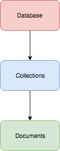

#### 2. CRUD

- Create, read, update and delete



```sh
sudo service mongod start
```

```sh
u64@vm:~$ mongo
MongoDB shell version v3.6.3
connecting to: mongodb://127.0.0.1:27017
MongoDB server version: 3.6.3
Server has startup warnings:
2018-03-21T11:07:59.855-0700 I STORAGE  [initandlisten]
2018-03-21T11:07:59.855-0700 I STORAGE  [initandlisten] ** WARNING: Using the XFS filesystem is strongly recommended with the WiredTiger storage engine
2018-03-21T11:07:59.855-0700 I STORAGE  [initandlisten] **          See http://dochub.mongodb.org/core/prodnotes-filesystem
2018-03-21T11:08:01.502-0700 I CONTROL  [initandlisten]
2018-03-21T11:08:01.502-0700 I CONTROL  [initandlisten] ** WARNING: Access control is not enabled for the database.
2018-03-21T11:08:01.502-0700 I CONTROL  [initandlisten] **          Read and write access to data and configuration is unrestricted.
2018-03-21T11:08:01.502-0700 I CONTROL  [initandlisten]
>
```

```
> help
	db.help()                    help on db methods
	db.mycoll.help()             help on collection methods
	sh.help()                    sharding helpers
	rs.help()                    replica set helpers
	help admin                   administrative help
	help connect                 connecting to a db help
	help keys                    key shortcuts
	help misc                    misc things to know
	help mr                      mapreduce

	show dbs                     show database names
	show collections             show collections in current database
	show users                   show users in current database
	show profile                 show most recent system.profile entries with time >= 1ms
	show logs                    show the accessible logger names
	show log [name]              prints out the last segment of log in memory, 'global' is default
	use <db_name>                set current database
	db.foo.find()                list objects in collection foo
	db.foo.find( { a : 1 } )     list objects in foo where a == 1
	it                           result of the last line evaluated; use to further iterate
	DBQuery.shellBatchSize = x   set default number of items to display on shell
	exit                         quit the mongo shell
>
```

```
> show dbs
admin   0.000GB
config  0.000GB
local   0.000GB
test    0.000GB
>
```

```
> use video
switched to db video
>
```

```
> db.movies.insertOne({ "title": "Jaws", "year": 1975, "imdb": "tt0073195" });
{
	"acknowledged" : true,
	"insertedId" : ObjectId("5ab2a3ac8e973022bee91009")
}
>
```

```
> db.movies.insertOne({ "title": "Mad Max 2: The Road Warrior", "year": 1981, "imdb": "tt0082694" })
{
	"acknowledged" : true,
	"insertedId" : ObjectId("5ab2a3f08e973022bee9100a")
}
>
```

```
> db.movies.insertOne({ "title": "Raiders of the Lost Ark", "year": 1981, "imdb": "tt0082971" })
{
	"acknowledged" : true,
	"insertedId" : ObjectId("5ab2a3f68e973022bee9100b")
}
>
```

```
> db.movies.find()
{ "_id" : ObjectId("5ab2a3ac8e973022bee91009"), "title" : "Jaws", "year" : 1975, "imdb" : "tt0073195" }
{ "_id" : ObjectId("5ab2a3f08e973022bee9100a"), "title" : "Mad Max 2: The Road Warrior", "year" : 1981, "imdb" : "tt0082694" }
{ "_id" : ObjectId("5ab2a3f68e973022bee9100b"), "title" : "Raiders of the Lost Ark", "year" : 1981, "imdb" : "tt0082971" }
>
```

```
> db.movies.find().pretty()
{
	"_id" : ObjectId("5ab2a3ac8e973022bee91009"),
	"title" : "Jaws",
	"year" : 1975,
	"imdb" : "tt0073195"
}
{
	"_id" : ObjectId("5ab2a3f08e973022bee9100a"),
	"title" : "Mad Max 2: The Road Warrior",
	"year" : 1981,
	"imdb" : "tt0082694"
}
{
	"_id" : ObjectId("5ab2a3f68e973022bee9100b"),
	"title" : "Raiders of the Lost Ark",
	"year" : 1981,
	"imdb" : "tt0082971"
}
>
```

```
> db.movies.find({}).pretty()
{
	"_id" : ObjectId("5ab2a3ac8e973022bee91009"),
	"title" : "Jaws",
	"year" : 1975,
	"imdb" : "tt0073195"
}
{
	"_id" : ObjectId("5ab2a3f08e973022bee9100a"),
	"title" : "Mad Max 2: The Road Warrior",
	"year" : 1981,
	"imdb" : "tt0082694"
}
{
	"_id" : ObjectId("5ab2a3f68e973022bee9100b"),
	"title" : "Raiders of the Lost Ark",
	"year" : 1981,
	"imdb" : "tt0082971"
}
>
```

```
> db.movies.find({"title": "Jaws"}).pretty()
{
	"_id" : ObjectId("5ab2a3ac8e973022bee91009"),
	"title" : "Jaws",
	"year" : 1975,
	"imdb" : "tt0073195"
}
>
```

```
> db.movies.find({"year": 1981}).pretty()
{
	"_id" : ObjectId("5ab2a3f08e973022bee9100a"),
	"title" : "Mad Max 2: The Road Warrior",
	"year" : 1981,
	"imdb" : "tt0082694"
}
{
	"_id" : ObjectId("5ab2a3f68e973022bee9100b"),
	"title" : "Raiders of the Lost Ark",
	"year" : 1981,
	"imdb" : "tt0082971"
}
>
```

```
> var c = db.movies.find()
> c.hasNext()
true
> c.next()
{
	"_id" : ObjectId("5ab2a3ac8e973022bee91009"),
	"title" : "Jaws",
	"year" : 1975,
	"imdb" : "tt0073195"
}
> c.next()
{
	"_id" : ObjectId("5ab2a3f08e973022bee9100a"),
	"title" : "Mad Max 2: The Road Warrior",
	"year" : 1981,
	"imdb" : "tt0082694"
}
> c.next()
{
	"_id" : ObjectId("5ab2a3f68e973022bee9100b"),
	"title" : "Raiders of the Lost Ark",
	"year" : 1981,
	"imdb" : "tt0082971"
}
> c.next()
2018-03-21T11:37:45.243-0700 E QUERY    [thread1] Error: error hasNext: false :
DBQuery.prototype.next@src/mongo/shell/query.js:305:1
@(shell):1:1
> c.hasNext()
false
>
```

```
> db.names.find()
{ "_id" : ObjectId("5ab3d1313c8be27a7b7b8876"), "name" : "First" }
> var j = db.names.findOne()
> j
{ "_id" : ObjectId("5ab3d1313c8be27a7b7b8876"), "name" : "First" }
> j.name = "kan1shka9"
kan1shka9
> db.names.save(j)
WriteResult({ "nMatched" : 1, "nUpserted" : 0, "nModified" : 1 })
> j
{ "_id" : ObjectId("5ab3d1313c8be27a7b7b8876"), "name" : "kan1shka9" }
> db.names.find()
{ "_id" : ObjectId("5ab3d1313c8be27a7b7b8876"), "name" : "kan1shka9" }
>
```

```sh
u64@vm:~/Desktop$ python pymongo_getting_started.py
kan1shka9
u64@vm:~/Desktop$
```

```
> db.names.save
function (obj, opts) {
    if (obj == null)
        throw Error("can't save a null");

    if (typeof(obj) == "number" || typeof(obj) == "string")
        throw Error("can't save a number or string");

    if (typeof(obj._id) == "undefined") {
        obj._id = new ObjectId();
        return this.insert(obj, opts);
    } else {
        return this.update({_id: obj._id}, obj, Object.merge({upsert: true}, opts));
    }
}
>
```