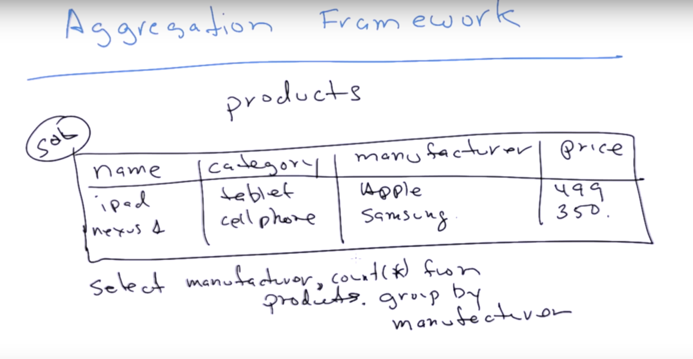
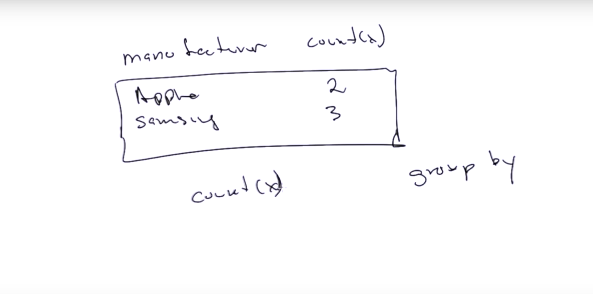
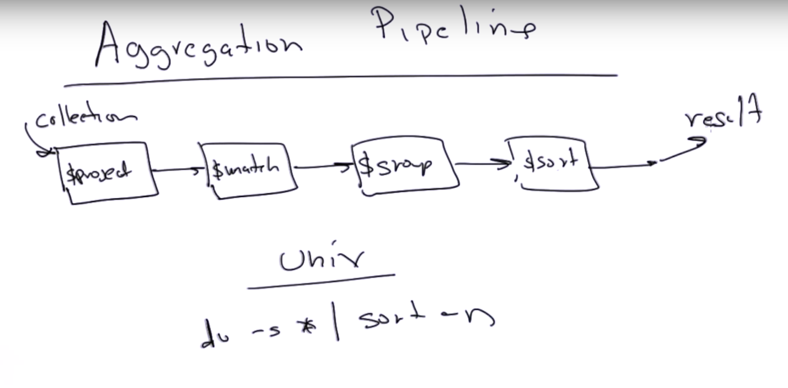
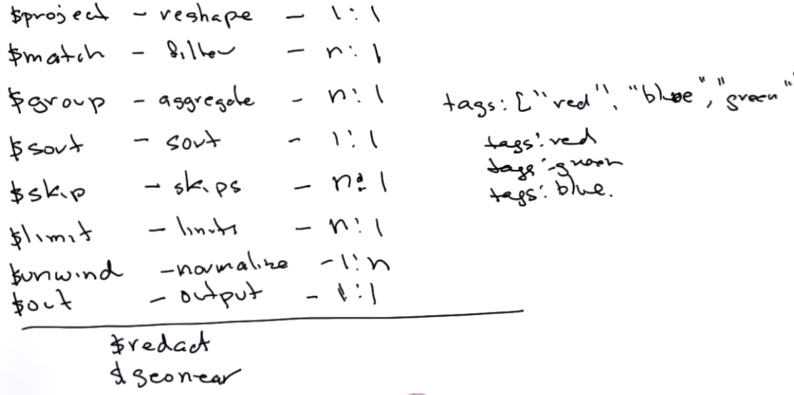
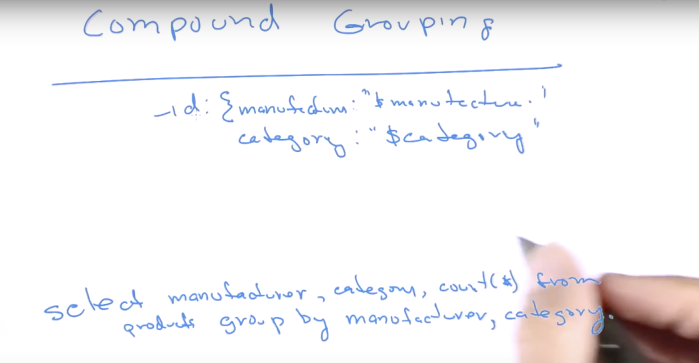
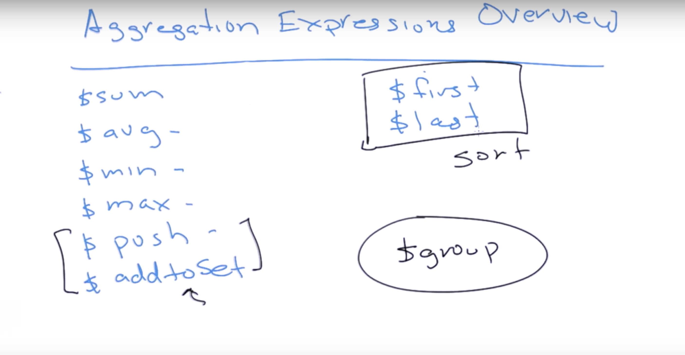

#### 30. Aggregation

###### Framework





```sh
u64@vm:~/Desktop$ sudo service mongod start
```

`products__m101p_52b20120e2d42362670d8231.js`

```js
use agg
db.products.drop()

db.products.insert({'name':'iPad 16GB Wifi', 'manufacturer':"Apple",
		    'category':'Tablets',
		    'price':499.00})
db.products.insert({'name':'iPad 32GB Wifi', 'category':'Tablets',
		    'manufacturer':"Apple",
		    'price':599.00})
db.products.insert({'name':'iPad 64GB Wifi', 'category':'Tablets',
		    'manufacturer':"Apple",
		    'price':699.00})
db.products.insert({'name':'Galaxy S3', 'category':'Cell Phones',
		    'manufacturer':'Samsung',
		    'price':563.99})
db.products.insert({'name':'Galaxy Tab 10', 'category':'Tablets',
		    'manufacturer':'Samsung',
		    'price':450.99})
db.products.insert({'name':'Vaio', 'category':'Laptops',
		    'manufacturer':"Sony",
		    'price':499.00})
db.products.insert({'name':'Macbook Air 13inch', 'category':'Laptops',
		    'manufacturer':"Apple",
		    'price':499.00})
db.products.insert({'name':'Nexus 7', 'category':'Tablets',
		    'manufacturer':"Google",
		    'price':199.00})
db.products.insert({'name':'Kindle Paper White', 'category':'Tablets',
		    'manufacturer':"Amazon",
		    'price':129.00})
db.products.insert({'name':'Kindle Fire', 'category':'Tablets',
		    'manufacturer':"Amazon",
		    'price':199.00})
```

```sh
u64@vm:~/Desktop$ mongo < products__m101p_52b20120e2d42362670d8231.js
MongoDB shell version v3.6.3
connecting to: mongodb://127.0.0.1:27017
MongoDB server version: 3.6.3
switched to db agg
false
WriteResult({ "nInserted" : 1 })
WriteResult({ "nInserted" : 1 })
WriteResult({ "nInserted" : 1 })
WriteResult({ "nInserted" : 1 })
WriteResult({ "nInserted" : 1 })
WriteResult({ "nInserted" : 1 })
WriteResult({ "nInserted" : 1 })
WriteResult({ "nInserted" : 1 })
WriteResult({ "nInserted" : 1 })
WriteResult({ "nInserted" : 1 })
bye
u64@vm:~/Desktop$
```

```sh
u64@vm:~/Desktop$ mongo
MongoDB shell version v3.6.3
connecting to: mongodb://127.0.0.1:27017
MongoDB server version: 3.6.3
Server has startup warnings:
2018-04-22T11:05:02.839-0700 I STORAGE  [initandlisten]
2018-04-22T11:05:02.839-0700 I STORAGE  [initandlisten] ** WARNING: Using the XFS filesystem is strongly recommended with the WiredTiger storage engine
2018-04-22T11:05:02.839-0700 I STORAGE  [initandlisten] **          See http://dochub.mongodb.org/core/prodnotes-filesystem
2018-04-22T11:05:05.406-0700 I CONTROL  [initandlisten]
2018-04-22T11:05:05.406-0700 I CONTROL  [initandlisten] ** WARNING: Access control is not enabled for the database.
2018-04-22T11:05:05.406-0700 I CONTROL  [initandlisten] **          Read and write access to data and configuration is unrestricted.
2018-04-22T11:05:05.406-0700 I CONTROL  [initandlisten]
> show dbs
admin     0.000GB
agg       0.000GB
blog      0.011GB
config    0.000GB
local     0.000GB
m101      0.000GB
school    2.153GB
students  0.001GB
test      0.046GB
video     0.001GB
> use agg
switched to db agg
> show collections
products
> db.products.findOne()
{
	"_id" : ObjectId("5adcced6bed72169a41edcb1"),
	"name" : "iPad 16GB Wifi",
	"manufacturer" : "Apple",
	"category" : "Tablets",
	"price" : 499
}
> db.products.find().pretty()
{
	"_id" : ObjectId("5adcced6bed72169a41edcb1"),
	"name" : "iPad 16GB Wifi",
	"manufacturer" : "Apple",
	"category" : "Tablets",
	"price" : 499
}
{
	"_id" : ObjectId("5adcced6bed72169a41edcb2"),
	"name" : "iPad 32GB Wifi",
	"category" : "Tablets",
	"manufacturer" : "Apple",
	"price" : 599
}
{
	"_id" : ObjectId("5adcced6bed72169a41edcb3"),
	"name" : "iPad 64GB Wifi",
	"category" : "Tablets",
	"manufacturer" : "Apple",
	"price" : 699
}
{
	"_id" : ObjectId("5adcced6bed72169a41edcb4"),
	"name" : "Galaxy S3",
	"category" : "Cell Phones",
	"manufacturer" : "Samsung",
	"price" : 563.99
}
{
	"_id" : ObjectId("5adcced6bed72169a41edcb5"),
	"name" : "Galaxy Tab 10",
	"category" : "Tablets",
	"manufacturer" : "Samsung",
	"price" : 450.99
}
{
	"_id" : ObjectId("5adcced6bed72169a41edcb6"),
	"name" : "Vaio",
	"category" : "Laptops",
	"manufacturer" : "Sony",
	"price" : 499
}
{
	"_id" : ObjectId("5adcced6bed72169a41edcb7"),
	"name" : "Macbook Air 13inch",
	"category" : "Laptops",
	"manufacturer" : "Apple",
	"price" : 499
}
{
	"_id" : ObjectId("5adcced6bed72169a41edcb8"),
	"name" : "Nexus 7",
	"category" : "Tablets",
	"manufacturer" : "Google",
	"price" : 199
}
{
	"_id" : ObjectId("5adcced6bed72169a41edcb9"),
	"name" : "Kindle Paper White",
	"category" : "Tablets",
	"manufacturer" : "Amazon",
	"price" : 129
}
{
	"_id" : ObjectId("5adcced6bed72169a41edcba"),
	"name" : "Kindle Fire",
	"category" : "Tablets",
	"manufacturer" : "Amazon",
	"price" : 199
}
>
```

`simple_example__m101p_52b1e9abe2d4235b7e5ebb63.js`

```js
use agg
db.products.aggregate([
    {$group:
     {
	 _id:"$manufacturer",
	 num_products:{$sum:1}
     }
    }
])
```

```sh
u64@vm:~/Desktop$ mongo < simple_example__m101p_52b1e9abe2d4235b7e5ebb63.js
MongoDB shell version v3.6.3
connecting to: mongodb://127.0.0.1:27017
MongoDB server version: 3.6.3
switched to db agg
{ "_id" : "Amazon", "num_products" : 2 }
{ "_id" : "Apple", "num_products" : 4 }
{ "_id" : "Google", "num_products" : 1 }
{ "_id" : "Samsung", "num_products" : 2 }
{ "_id" : "Sony", "num_products" : 1 }
bye
u64@vm:~/Desktop$
```

###### Pipeline





###### Compound Grouping



`simple_example1__m101p_52b1ef62e2d4235b7e5ebb6c.js`

```js
use agg
db.products.aggregate([
    {$group:
     {
	 _id: {'manufacturer':"$manufacturer"},
	 num_products:{$sum:1}
     }
    }
])
```

```sh
u64@vm:~/Desktop$ mongo < simple_example1__m101p_52b1ef62e2d4235b7e5ebb6c.js
MongoDB shell version v3.6.3
connecting to: mongodb://127.0.0.1:27017
MongoDB server version: 3.6.3
switched to db agg
{ "_id" : { "manufacturer" : "Amazon" }, "num_products" : 2 }
{ "_id" : { "manufacturer" : "Apple" }, "num_products" : 4 }
{ "_id" : { "manufacturer" : "Google" }, "num_products" : 1 }
{ "_id" : { "manufacturer" : "Samsung" }, "num_products" : 2 }
{ "_id" : { "manufacturer" : "Sony" }, "num_products" : 1 }
bye
u64@vm:~/Desktop$
```

`compound1__m101p_52b1edebe2d4235b7e5ebb69.js`

```js
use agg
db.products.aggregate([
    {$group:
     {
	 _id: {
	     "manufacturer":"$manufacturer",
	     "category" : "$category"},
	 num_products:{$sum:1}
     }
    }
])
```

```sh
u64@vm:~/Desktop$ mongo < compound1__m101p_52b1edebe2d4235b7e5ebb69.js
MongoDB shell version v3.6.3
connecting to: mongodb://127.0.0.1:27017
MongoDB server version: 3.6.3
switched to db agg
{ "_id" : { "manufacturer" : "Amazon", "category" : "Tablets" }, "num_products" : 2 }
{ "_id" : { "manufacturer" : "Apple", "category" : "Laptops" }, "num_products" : 1 }
{ "_id" : { "manufacturer" : "Apple", "category" : "Tablets" }, "num_products" : 3 }
{ "_id" : { "manufacturer" : "Samsung", "category" : "Cell Phones" }, "num_products" : 1 }
{ "_id" : { "manufacturer" : "Samsung", "category" : "Tablets" }, "num_products" : 1 }
{ "_id" : { "manufacturer" : "Google", "category" : "Tablets" }, "num_products" : 1 }
{ "_id" : { "manufacturer" : "Sony", "category" : "Laptops" }, "num_products" : 1 }
bye
u64@vm:~/Desktop$
```

###### _id field can be a document

```sh
u64@vm:~/Desktop$ mongo
MongoDB shell version v3.6.3
connecting to: mongodb://127.0.0.1:27017
MongoDB server version: 3.6.3
Server has startup warnings:
2018-04-22T11:05:02.839-0700 I STORAGE  [initandlisten]
2018-04-22T11:05:02.839-0700 I STORAGE  [initandlisten] ** WARNING: Using the XFS filesystem is strongly recommended with the WiredTiger storage engine
2018-04-22T11:05:02.839-0700 I STORAGE  [initandlisten] **          See http://dochub.mongodb.org/core/prodnotes-filesystem
2018-04-22T11:05:05.406-0700 I CONTROL  [initandlisten]
2018-04-22T11:05:05.406-0700 I CONTROL  [initandlisten] ** WARNING: Access control is not enabled for the database.
2018-04-22T11:05:05.406-0700 I CONTROL  [initandlisten] **          Read and write access to data and configuration is unrestricted.
2018-04-22T11:05:05.406-0700 I CONTROL  [initandlisten]
> db.foo.insert({_id:{name:"kan1shka9", class:"m101"}, hometown:"LA"})
WriteResult({ "nInserted" : 1 })
> db.foo.find()
{ "_id" : ObjectId("5acea21079160f2994f5afaf"), "a" : 1, "b" : 2 }
{ "_id" : ObjectId("5acea2d679160f2994f5afb0"), "a" : 3, "b" : [ 3, 5, 7 ] }
{ "_id" : ObjectId("5acea3c279160f2994f5afb2"), "a" : [ 3, 4, 6 ], "b" : 7 }
{ "_id" : { "name" : "kan1shka9", "class" : "m101" }, "hometown" : "LA" }
>
> db.foo.insert({_id:{name:"kan1shka9", class:"m101"}, hometown:"LA"})
WriteResult({
	"nInserted" : 0,
	"writeError" : {
		"code" : 11000,
		"errmsg" : "E11000 duplicate key error collection: test.foo index: _id_ dup key: { : { name: \"kan1shka9\", class: \"m101\" } }"
	}
})
>
```

###### Aggregation Expressions



###### sum

`using_sum__m101p_52b1f103e2d4235b7e5ebb74.js`

```js
use agg
db.products.aggregate([
    {$group:
     {
	 _id: {
	     "maker":"$manufacturer"
	 },
	 sum_prices:{$sum:"$price"}
     }
    }
])
```

```sh
u64@vm:~/Desktop$ mongo < using_sum__m101p_52b1f103e2d4235b7e5ebb74.js
MongoDB shell version v3.6.3
connecting to: mongodb://127.0.0.1:27017
MongoDB server version: 3.6.3
switched to db agg
{ "_id" : { "maker" : "Amazon" }, "sum_prices" : 328 }
{ "_id" : { "maker" : "Apple" }, "sum_prices" : 2296 }
{ "_id" : { "maker" : "Google" }, "sum_prices" : 199 }
{ "_id" : { "maker" : "Samsung" }, "sum_prices" : 1014.98 }
{ "_id" : { "maker" : "Sony" }, "sum_prices" : 499 }
bye
u64@vm:~/Desktop$
```

```sh
u64@vm:~/Desktop$ mongoimport zips.json
2018-04-22T12:01:23.313-0700	no collection specified
2018-04-22T12:01:23.315-0700	using filename 'zips' as collection
2018-04-22T12:01:23.339-0700	connected to: localhost
2018-04-22T12:01:23.825-0700	imported 29353 documents
u64@vm:~/Desktop$
```

`quiz_sum_by_state__m101p_52b208b5e2d42362670d8246.js`

```js
use agg;
db.zips.aggregate([{"$group":{"_id":"$state", "population":{$sum:"$pop"}}}])
```

```sh
u64@vm:~/Desktop$ mongo < quiz_sum_by_state__m101p_52b208b5e2d42362670d8246.js
MongoDB shell version v3.6.3
connecting to: mongodb://127.0.0.1:27017
MongoDB server version: 3.6.3
switched to db agg
bye
u64@vm:~/Desktop$
```

###### avg

`using_avg__m101p_52b1f306e2d4235b7e5ebb77.js`

```js
use agg
db.products.aggregate([
    {$group:
     {
	 _id: {
	     "category":"$category"
	 },
	 avg_price:{$avg:"$price"}
     }
    }
])
```

```sh
u64@vm:~/Desktop$ mongo < using_avg__m101p_52b1f306e2d4235b7e5ebb77.js
MongoDB shell version v3.6.3
connecting to: mongodb://127.0.0.1:27017
MongoDB server version: 3.6.3
switched to db agg
{ "_id" : { "category" : "Laptops" }, "avg_price" : 499 }
{ "_id" : { "category" : "Cell Phones" }, "avg_price" : 563.99 }
{ "_id" : { "category" : "Tablets" }, "avg_price" : 396.4271428571428 }
bye
u64@vm:~/Desktop$
```

###### addToSet

`using_addToSet__m101p_52b1f3dde2d4235b7e5ebb79.js`

```js
use agg
db.products.aggregate([
    {$group:
     {
	 _id: {
	     "maker":"$manufacturer"
	 },
	 categories:{$addToSet:"$category"}
     }
    }
])
```

```sh
u64@vm:~/Desktop$ mongo < using_addToSet__m101p_52b1f3dde2d4235b7e5ebb79.js
MongoDB shell version v3.6.3
connecting to: mongodb://127.0.0.1:27017
MongoDB server version: 3.6.3
switched to db agg
{ "_id" : { "maker" : "Amazon" }, "categories" : [ "Tablets" ] }
{ "_id" : { "maker" : "Apple" }, "categories" : [ "Laptops", "Tablets" ] }
{ "_id" : { "maker" : "Google" }, "categories" : [ "Tablets" ] }
{ "_id" : { "maker" : "Samsung" }, "categories" : [ "Tablets", "Cell Phones" ] }
{ "_id" : { "maker" : "Sony" }, "categories" : [ "Laptops" ] }
bye
u64@vm:~/Desktop$
```

###### push

`using_push__m101p_52b1f44ae2d4235b7e5ebb7c.js`

```js
use agg
db.products.aggregate([
    {$group:
     {
	 _id: {
	     "maker":"$manufacturer"
	 },
	 categories:{$push:"$category"}
     }
    }
])
```

```sh
u64@vm:~/Desktop$ mongo < using_push__m101p_52b1f44ae2d4235b7e5ebb7c.js
MongoDB shell version v3.6.3
connecting to: mongodb://127.0.0.1:27017
MongoDB server version: 3.6.3
switched to db agg
{ "_id" : { "maker" : "Amazon" }, "categories" : [ "Tablets", "Tablets" ] }
{ "_id" : { "maker" : "Apple" }, "categories" : [ "Tablets", "Tablets", "Tablets", "Laptops" ] }
{ "_id" : { "maker" : "Google" }, "categories" : [ "Tablets" ] }
{ "_id" : { "maker" : "Samsung" }, "categories" : [ "Cell Phones", "Tablets" ] }
{ "_id" : { "maker" : "Sony" }, "categories" : [ "Laptops" ] }
bye
u64@vm:~/Desktop$
```

###### max and min

`using_max__m101p_52b1f47ae2d4235b7e5ebb7f.js`

```js
use agg
db.products.aggregate([
    {$group:
     {
	 _id: {
	     "maker":"$manufacturer"
	 },
	 maxprice:{$max:"$price"}
     }
    }
])
```

```sh
u64@vm:~/Desktop$ mongo < using_max__m101p_52b1f47ae2d4235b7e5ebb7f.js
MongoDB shell version v3.6.3
connecting to: mongodb://127.0.0.1:27017
MongoDB server version: 3.6.3
switched to db agg
{ "_id" : { "maker" : "Amazon" }, "maxprice" : 199 }
{ "_id" : { "maker" : "Apple" }, "maxprice" : 699 }
{ "_id" : { "maker" : "Google" }, "maxprice" : 199 }
{ "_id" : { "maker" : "Samsung" }, "maxprice" : 563.99 }
{ "_id" : { "maker" : "Sony" }, "maxprice" : 499 }
bye
u64@vm:~/Desktop$
```