#### 30. [Aggregation](https://docs.mongodb.com/manual/aggregation/)

###### Framework


```sh
u64@vm:~/Desktop$ sudo service mongod start
```

`products__m101p_52b20120e2d42362670d8231.js`

```js
use agg
db.products.drop()

db.products.insert({'name':'iPad 16GB Wifi', 'manufacturer':"Apple",
		    'category':'Tablets',
		    'price':499.00})
db.products.insert({'name':'iPad 32GB Wifi', 'category':'Tablets',
		    'manufacturer':"Apple",
		    'price':599.00})
db.products.insert({'name':'iPad 64GB Wifi', 'category':'Tablets',
		    'manufacturer':"Apple",
		    'price':699.00})
db.products.insert({'name':'Galaxy S3', 'category':'Cell Phones',
		    'manufacturer':'Samsung',
		    'price':563.99})
db.products.insert({'name':'Galaxy Tab 10', 'category':'Tablets',
		    'manufacturer':'Samsung',
		    'price':450.99})
db.products.insert({'name':'Vaio', 'category':'Laptops',
		    'manufacturer':"Sony",
		    'price':499.00})
db.products.insert({'name':'Macbook Air 13inch', 'category':'Laptops',
		    'manufacturer':"Apple",
		    'price':499.00})
db.products.insert({'name':'Nexus 7', 'category':'Tablets',
		    'manufacturer':"Google",
		    'price':199.00})
db.products.insert({'name':'Kindle Paper White', 'category':'Tablets',
		    'manufacturer':"Amazon",
		    'price':129.00})
db.products.insert({'name':'Kindle Fire', 'category':'Tablets',
		    'manufacturer':"Amazon",
		    'price':199.00})
```

```sh
u64@vm:~/Desktop$ mongo < products__m101p_52b20120e2d42362670d8231.js
MongoDB shell version v3.6.3
connecting to: mongodb://127.0.0.1:27017
MongoDB server version: 3.6.3
switched to db agg
false
WriteResult({ "nInserted" : 1 })
WriteResult({ "nInserted" : 1 })
WriteResult({ "nInserted" : 1 })
WriteResult({ "nInserted" : 1 })
WriteResult({ "nInserted" : 1 })
WriteResult({ "nInserted" : 1 })
WriteResult({ "nInserted" : 1 })
WriteResult({ "nInserted" : 1 })
WriteResult({ "nInserted" : 1 })
WriteResult({ "nInserted" : 1 })
bye
u64@vm:~/Desktop$
```

```sh
u64@vm:~/Desktop$ mongo
MongoDB shell version v3.6.3
connecting to: mongodb://127.0.0.1:27017
MongoDB server version: 3.6.3
Server has startup warnings:
2018-04-22T11:05:02.839-0700 I STORAGE  [initandlisten]
2018-04-22T11:05:02.839-0700 I STORAGE  [initandlisten] ** WARNING: Using the XFS filesystem is strongly recommended with the WiredTiger storage engine
2018-04-22T11:05:02.839-0700 I STORAGE  [initandlisten] **          See http://dochub.mongodb.org/core/prodnotes-filesystem
2018-04-22T11:05:05.406-0700 I CONTROL  [initandlisten]
2018-04-22T11:05:05.406-0700 I CONTROL  [initandlisten] ** WARNING: Access control is not enabled for the database.
2018-04-22T11:05:05.406-0700 I CONTROL  [initandlisten] **          Read and write access to data and configuration is unrestricted.
2018-04-22T11:05:05.406-0700 I CONTROL  [initandlisten]
> show dbs
admin     0.000GB
agg       0.000GB
blog      0.011GB
config    0.000GB
local     0.000GB
m101      0.000GB
school    2.153GB
students  0.001GB
test      0.046GB
video     0.001GB
> use agg
switched to db agg
> show collections
products
> db.products.findOne()
{
	"_id" : ObjectId("5adcced6bed72169a41edcb1"),
	"name" : "iPad 16GB Wifi",
	"manufacturer" : "Apple",
	"category" : "Tablets",
	"price" : 499
}
> db.products.find().pretty()
{
	"_id" : ObjectId("5adcced6bed72169a41edcb1"),
	"name" : "iPad 16GB Wifi",
	"manufacturer" : "Apple",
	"category" : "Tablets",
	"price" : 499
}
{
	"_id" : ObjectId("5adcced6bed72169a41edcb2"),
	"name" : "iPad 32GB Wifi",
	"category" : "Tablets",
	"manufacturer" : "Apple",
	"price" : 599
}
{
	"_id" : ObjectId("5adcced6bed72169a41edcb3"),
	"name" : "iPad 64GB Wifi",
	"category" : "Tablets",
	"manufacturer" : "Apple",
	"price" : 699
}
{
	"_id" : ObjectId("5adcced6bed72169a41edcb4"),
	"name" : "Galaxy S3",
	"category" : "Cell Phones",
	"manufacturer" : "Samsung",
	"price" : 563.99
}
{
	"_id" : ObjectId("5adcced6bed72169a41edcb5"),
	"name" : "Galaxy Tab 10",
	"category" : "Tablets",
	"manufacturer" : "Samsung",
	"price" : 450.99
}
{
	"_id" : ObjectId("5adcced6bed72169a41edcb6"),
	"name" : "Vaio",
	"category" : "Laptops",
	"manufacturer" : "Sony",
	"price" : 499
}
{
	"_id" : ObjectId("5adcced6bed72169a41edcb7"),
	"name" : "Macbook Air 13inch",
	"category" : "Laptops",
	"manufacturer" : "Apple",
	"price" : 499
}
{
	"_id" : ObjectId("5adcced6bed72169a41edcb8"),
	"name" : "Nexus 7",
	"category" : "Tablets",
	"manufacturer" : "Google",
	"price" : 199
}
{
	"_id" : ObjectId("5adcced6bed72169a41edcb9"),
	"name" : "Kindle Paper White",
	"category" : "Tablets",
	"manufacturer" : "Amazon",
	"price" : 129
}
{
	"_id" : ObjectId("5adcced6bed72169a41edcba"),
	"name" : "Kindle Fire",
	"category" : "Tablets",
	"manufacturer" : "Amazon",
	"price" : 199
}
>
```

`simple_example__m101p_52b1e9abe2d4235b7e5ebb63.js`

```js
use agg
db.products.aggregate([
    {$group:
     {
	 _id:"$manufacturer",
	 num_products:{$sum:1}
     }
    }
])
```

```sh
u64@vm:~/Desktop$ mongo < simple_example__m101p_52b1e9abe2d4235b7e5ebb63.js
MongoDB shell version v3.6.3
connecting to: mongodb://127.0.0.1:27017
MongoDB server version: 3.6.3
switched to db agg
{ "_id" : "Amazon", "num_products" : 2 }
{ "_id" : "Apple", "num_products" : 4 }
{ "_id" : "Google", "num_products" : 1 }
{ "_id" : "Samsung", "num_products" : 2 }
{ "_id" : "Sony", "num_products" : 1 }
bye
u64@vm:~/Desktop$
```

###### Pipeline


###### Compound Grouping


`simple_example1__m101p_52b1ef62e2d4235b7e5ebb6c.js`

```js
use agg
db.products.aggregate([
    {$group:
     {
	 _id: {'manufacturer':"$manufacturer"},
	 num_products:{$sum:1}
     }
    }
])
```

```sh
u64@vm:~/Desktop$ mongo < simple_example1__m101p_52b1ef62e2d4235b7e5ebb6c.js
MongoDB shell version v3.6.3
connecting to: mongodb://127.0.0.1:27017
MongoDB server version: 3.6.3
switched to db agg
{ "_id" : { "manufacturer" : "Amazon" }, "num_products" : 2 }
{ "_id" : { "manufacturer" : "Apple" }, "num_products" : 4 }
{ "_id" : { "manufacturer" : "Google" }, "num_products" : 1 }
{ "_id" : { "manufacturer" : "Samsung" }, "num_products" : 2 }
{ "_id" : { "manufacturer" : "Sony" }, "num_products" : 1 }
bye
u64@vm:~/Desktop$
```

`compound1__m101p_52b1edebe2d4235b7e5ebb69.js`

```js
use agg
db.products.aggregate([
    {$group:
     {
	 _id: {
	     "manufacturer":"$manufacturer",
	     "category" : "$category"},
	 num_products:{$sum:1}
     }
    }
])
```

```sh
u64@vm:~/Desktop$ mongo < compound1__m101p_52b1edebe2d4235b7e5ebb69.js
MongoDB shell version v3.6.3
connecting to: mongodb://127.0.0.1:27017
MongoDB server version: 3.6.3
switched to db agg
{ "_id" : { "manufacturer" : "Amazon", "category" : "Tablets" }, "num_products" : 2 }
{ "_id" : { "manufacturer" : "Apple", "category" : "Laptops" }, "num_products" : 1 }
{ "_id" : { "manufacturer" : "Apple", "category" : "Tablets" }, "num_products" : 3 }
{ "_id" : { "manufacturer" : "Samsung", "category" : "Cell Phones" }, "num_products" : 1 }
{ "_id" : { "manufacturer" : "Samsung", "category" : "Tablets" }, "num_products" : 1 }
{ "_id" : { "manufacturer" : "Google", "category" : "Tablets" }, "num_products" : 1 }
{ "_id" : { "manufacturer" : "Sony", "category" : "Laptops" }, "num_products" : 1 }
bye
u64@vm:~/Desktop$
```

###### _id field can be a document

```sh
u64@vm:~/Desktop$ mongo
MongoDB shell version v3.6.3
connecting to: mongodb://127.0.0.1:27017
MongoDB server version: 3.6.3
Server has startup warnings:
2018-04-22T11:05:02.839-0700 I STORAGE  [initandlisten]
2018-04-22T11:05:02.839-0700 I STORAGE  [initandlisten] ** WARNING: Using the XFS filesystem is strongly recommended with the WiredTiger storage engine
2018-04-22T11:05:02.839-0700 I STORAGE  [initandlisten] **          See http://dochub.mongodb.org/core/prodnotes-filesystem
2018-04-22T11:05:05.406-0700 I CONTROL  [initandlisten]
2018-04-22T11:05:05.406-0700 I CONTROL  [initandlisten] ** WARNING: Access control is not enabled for the database.
2018-04-22T11:05:05.406-0700 I CONTROL  [initandlisten] **          Read and write access to data and configuration is unrestricted.
2018-04-22T11:05:05.406-0700 I CONTROL  [initandlisten]
> db.foo.insert({_id:{name:"kan1shka9", class:"m101"}, hometown:"LA"})
WriteResult({ "nInserted" : 1 })
> db.foo.find()
{ "_id" : ObjectId("5acea21079160f2994f5afaf"), "a" : 1, "b" : 2 }
{ "_id" : ObjectId("5acea2d679160f2994f5afb0"), "a" : 3, "b" : [ 3, 5, 7 ] }
{ "_id" : ObjectId("5acea3c279160f2994f5afb2"), "a" : [ 3, 4, 6 ], "b" : 7 }
{ "_id" : { "name" : "kan1shka9", "class" : "m101" }, "hometown" : "LA" }
>
> db.foo.insert({_id:{name:"kan1shka9", class:"m101"}, hometown:"LA"})
WriteResult({
	"nInserted" : 0,
	"writeError" : {
		"code" : 11000,
		"errmsg" : "E11000 duplicate key error collection: test.foo index: _id_ dup key: { : { name: \"kan1shka9\", class: \"m101\" } }"
	}
})
>
```

###### Aggregation Expressions


###### sum

`using_sum__m101p_52b1f103e2d4235b7e5ebb74.js`

```js
use agg
db.products.aggregate([
    {$group:
     {
	 _id: {
	     "maker":"$manufacturer"
	 },
	 sum_prices:{$sum:"$price"}
     }
    }
])
```

```sh
u64@vm:~/Desktop$ mongo < using_sum__m101p_52b1f103e2d4235b7e5ebb74.js
MongoDB shell version v3.6.3
connecting to: mongodb://127.0.0.1:27017
MongoDB server version: 3.6.3
switched to db agg
{ "_id" : { "maker" : "Amazon" }, "sum_prices" : 328 }
{ "_id" : { "maker" : "Apple" }, "sum_prices" : 2296 }
{ "_id" : { "maker" : "Google" }, "sum_prices" : 199 }
{ "_id" : { "maker" : "Samsung" }, "sum_prices" : 1014.98 }
{ "_id" : { "maker" : "Sony" }, "sum_prices" : 499 }
bye
u64@vm:~/Desktop$
```

```sh
u64@vm:~/Desktop$ mongoimport zips.json
2018-04-22T12:01:23.313-0700	no collection specified
2018-04-22T12:01:23.315-0700	using filename 'zips' as collection
2018-04-22T12:01:23.339-0700	connected to: localhost
2018-04-22T12:01:23.825-0700	imported 29353 documents
u64@vm:~/Desktop$
```

`quiz_sum_by_state__m101p_52b208b5e2d42362670d8246.js`

```js
use agg;
db.zips.aggregate([{"$group":{"_id":"$state", "population":{$sum:"$pop"}}}])
```

```sh
u64@vm:~/Desktop$ mongo < quiz_sum_by_state__m101p_52b208b5e2d42362670d8246.js
MongoDB shell version v3.6.3
connecting to: mongodb://127.0.0.1:27017
MongoDB server version: 3.6.3
switched to db agg
bye
u64@vm:~/Desktop$
```

###### avg

`using_avg__m101p_52b1f306e2d4235b7e5ebb77.js`

```js
use agg
db.products.aggregate([
    {$group:
     {
	 _id: {
	     "category":"$category"
	 },
	 avg_price:{$avg:"$price"}
     }
    }
])
```

```sh
u64@vm:~/Desktop$ mongo < using_avg__m101p_52b1f306e2d4235b7e5ebb77.js
MongoDB shell version v3.6.3
connecting to: mongodb://127.0.0.1:27017
MongoDB server version: 3.6.3
switched to db agg
{ "_id" : { "category" : "Laptops" }, "avg_price" : 499 }
{ "_id" : { "category" : "Cell Phones" }, "avg_price" : 563.99 }
{ "_id" : { "category" : "Tablets" }, "avg_price" : 396.4271428571428 }
bye
u64@vm:~/Desktop$
```

###### addToSet

`using_addToSet__m101p_52b1f3dde2d4235b7e5ebb79.js`

```js
use agg
db.products.aggregate([
    {$group:
     {
	 _id: {
	     "maker":"$manufacturer"
	 },
	 categories:{$addToSet:"$category"}
     }
    }
])
```

```sh
u64@vm:~/Desktop$ mongo < using_addToSet__m101p_52b1f3dde2d4235b7e5ebb79.js
MongoDB shell version v3.6.3
connecting to: mongodb://127.0.0.1:27017
MongoDB server version: 3.6.3
switched to db agg
{ "_id" : { "maker" : "Amazon" }, "categories" : [ "Tablets" ] }
{ "_id" : { "maker" : "Apple" }, "categories" : [ "Laptops", "Tablets" ] }
{ "_id" : { "maker" : "Google" }, "categories" : [ "Tablets" ] }
{ "_id" : { "maker" : "Samsung" }, "categories" : [ "Tablets", "Cell Phones" ] }
{ "_id" : { "maker" : "Sony" }, "categories" : [ "Laptops" ] }
bye
u64@vm:~/Desktop$
```

###### push

`using_push__m101p_52b1f44ae2d4235b7e5ebb7c.js`

```js
use agg
db.products.aggregate([
    {$group:
     {
	 _id: {
	     "maker":"$manufacturer"
	 },
	 categories:{$push:"$category"}
     }
    }
])
```

```sh
u64@vm:~/Desktop$ mongo < using_push__m101p_52b1f44ae2d4235b7e5ebb7c.js
MongoDB shell version v3.6.3
connecting to: mongodb://127.0.0.1:27017
MongoDB server version: 3.6.3
switched to db agg
{ "_id" : { "maker" : "Amazon" }, "categories" : [ "Tablets", "Tablets" ] }
{ "_id" : { "maker" : "Apple" }, "categories" : [ "Tablets", "Tablets", "Tablets", "Laptops" ] }
{ "_id" : { "maker" : "Google" }, "categories" : [ "Tablets" ] }
{ "_id" : { "maker" : "Samsung" }, "categories" : [ "Cell Phones", "Tablets" ] }
{ "_id" : { "maker" : "Sony" }, "categories" : [ "Laptops" ] }
bye
u64@vm:~/Desktop$
```

###### max and min

`using_max__m101p_52b1f47ae2d4235b7e5ebb7f.js`

```js
use agg
db.products.aggregate([
    {$group:
     {
	 _id: {
	     "maker":"$manufacturer"
	 },
	 maxprice:{$max:"$price"}
     }
    }
])
```

```sh
u64@vm:~/Desktop$ mongo < using_max__m101p_52b1f47ae2d4235b7e5ebb7f.js
MongoDB shell version v3.6.3
connecting to: mongodb://127.0.0.1:27017
MongoDB server version: 3.6.3
switched to db agg
{ "_id" : { "maker" : "Amazon" }, "maxprice" : 199 }
{ "_id" : { "maker" : "Apple" }, "maxprice" : 699 }
{ "_id" : { "maker" : "Google" }, "maxprice" : 199 }
{ "_id" : { "maker" : "Samsung" }, "maxprice" : 563.99 }
{ "_id" : { "maker" : "Sony" }, "maxprice" : 499 }
bye
u64@vm:~/Desktop$
```

###### Double group stages

`single_group__m101p_52b1f5b5e2d4235b7e5ebb87.js`

```js
use agg
db.grades.aggregate([
    {'$group':{_id:{class_id:"$class_id", student_id:"$student_id"}, 'average':{"$avg":"$score"}}}])
```

```sh
u64@vm:~/Desktop$ mongo < single_group__m101p_52b1f5b5e2d4235b7e5ebb87.js
MongoDB shell version v3.6.3
connecting to: mongodb://127.0.0.1:27017
MongoDB server version: 3.6.3
switched to db agg
bye
u64@vm:~/Desktop$
```

`double_group__m101p_52b1f544e2d4235b7e5ebb84.js`

```js
use agg
db.grades.aggregate([
    {'$group':{_id:{class_id:"$class_id", student_id:"$student_id"}, 'average':{"$avg":"$score"}}},
    {'$group':{_id:"$_id.class_id", 'average':{"$avg":"$average"}}}])
```

```sh
u64@vm:~/Desktop$ mongo < double_group__m101p_52b1f544e2d4235b7e5ebb84.js
MongoDB shell version v3.6.3
connecting to: mongodb://127.0.0.1:27017
MongoDB server version: 3.6.3
switched to db agg
bye
u64@vm:~/Desktop$
```

###### project

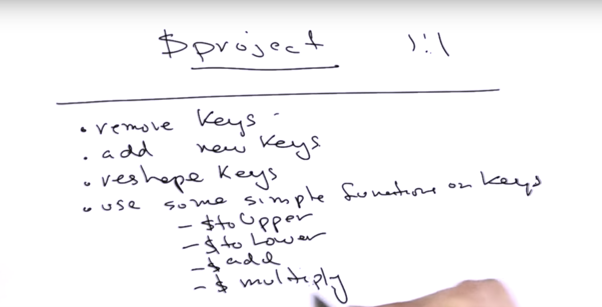

`quiz_using_project__m101p_52b1f62ae2d42360b66c713f.js`

```js
use agg
db.zips.aggregate([{$project:{_id:0, city:{$toLower:"$city"}, pop:1, state:1, zip:"$_id"}}])
```

```sh
u64@vm:~/Desktop$ mongo < quiz_using_project__m101p_52b1f62ae2d42360b66c713f.js
MongoDB shell version v3.6.3
connecting to: mongodb://127.0.0.1:27017
MongoDB server version: 3.6.3
switched to db agg
bye
u64@vm:~/Desktop$
```

`reshape_products__m101p_52b1f77ee2d42360b66c7140.js`

```js
use agg
db.products.aggregate([
    {$project:
     {
	 _id:0,
	 'maker': {$toLower:"$manufacturer"},
	 'details': {'category': "$category",
		     'price' : {"$multiply":["$price",10]}
		    },
	 'item':'$name'
     }
    }
])
```

```sh
u64@vm:~/Desktop$ mongo < reshape_products__m101p_52b1f77ee2d42360b66c7140.js
MongoDB shell version v3.6.3
connecting to: mongodb://127.0.0.1:27017
MongoDB server version: 3.6.3
switched to db agg
{ "maker" : "apple", "details" : { "category" : "Tablets", "price" : 4990 }, "item" : "iPad 16GB Wifi" }
{ "maker" : "apple", "details" : { "category" : "Tablets", "price" : 5990 }, "item" : "iPad 32GB Wifi" }
{ "maker" : "apple", "details" : { "category" : "Tablets", "price" : 6990 }, "item" : "iPad 64GB Wifi" }
{ "maker" : "samsung", "details" : { "category" : "Cell Phones", "price" : 5639.9 }, "item" : "Galaxy S3" }
{ "maker" : "samsung", "details" : { "category" : "Tablets", "price" : 4509.9 }, "item" : "Galaxy Tab 10" }
{ "maker" : "sony", "details" : { "category" : "Laptops", "price" : 4990 }, "item" : "Vaio" }
{ "maker" : "apple", "details" : { "category" : "Laptops", "price" : 4990 }, "item" : "Macbook Air 13inch" }
{ "maker" : "google", "details" : { "category" : "Tablets", "price" : 1990 }, "item" : "Nexus 7" }
{ "maker" : "amazon", "details" : { "category" : "Tablets", "price" : 1290 }, "item" : "Kindle Paper White" }
{ "maker" : "amazon", "details" : { "category" : "Tablets", "price" : 1990 }, "item" : "Kindle Fire" }
bye
u64@vm:~/Desktop$
```

###### match

`match__m101p_52b203fce2d42362670d8234.js`

```js
use agg
db.zips.aggregate([
    {$match:
     {
	 state:"NY"
     }
    }
])
```

`match_and_group__m101p_52b20442e2d42362670d8235.js`

```js
use agg
db.zips.aggregate([
    {$match:
     {
	 state:"NY"
     }
    },
    {$group:
     {
	 _id: "$city",
	 population: {$sum:"$pop"},
	 zip_codes: {$addToSet: "$_id"}
     }
    }
])
```

`match_group_and_project__m101p_52b20448e2d42362670d8236.js`

```js
use agg
db.zips.aggregate([
    {$match:
     {
	 state:"NY"
     }
    },
    {$group:
     {
	 _id: "$city",
	 population: {$sum:"$pop"},
	 zip_codes: {$addToSet: "$_id"}
     }
    },
    {$project:
     {
	 _id: 0,
	 city: "$_id",
	 population: 1,
	 zip_codes:1
     }
    }

])
```

###### text

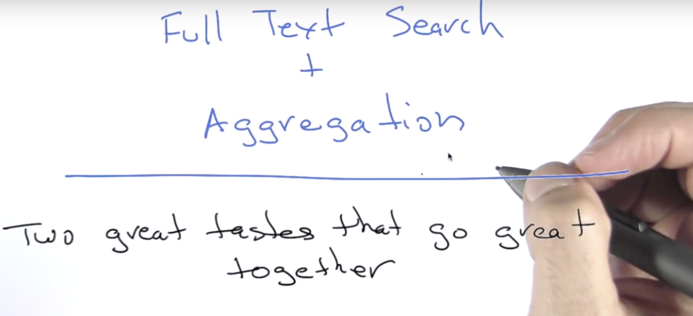

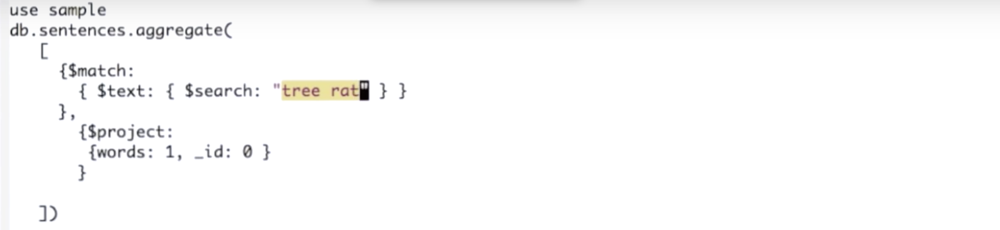

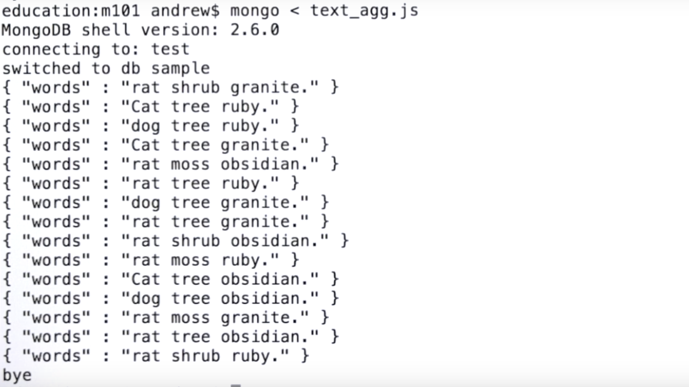

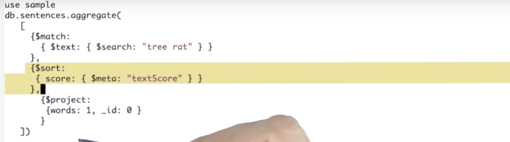

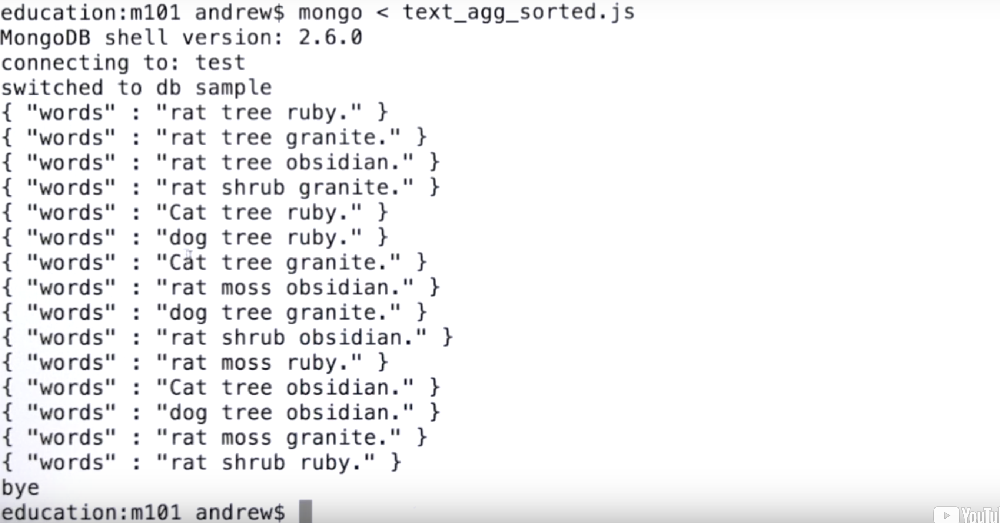

###### sort

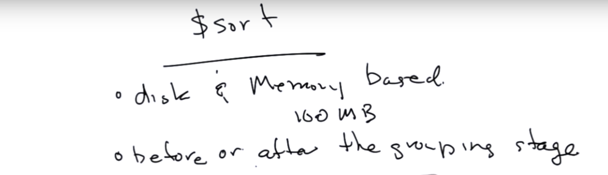

`sort__m101p_52b20714e2d42362670d823d.js`

```js
use agg
db.zips.aggregate([
    {$match:
     {
	 state:"NY"
     }
    },
    {$group:
     {
	 _id: "$city",
	 population: {$sum:"$pop"},
     }
    },
    {$project:
     {
	 _id: 0,
	 city: "$_id",
	 population: 1,
     }
    },
    {$sort:
     {
	 population:-1
     }
    }


])
```

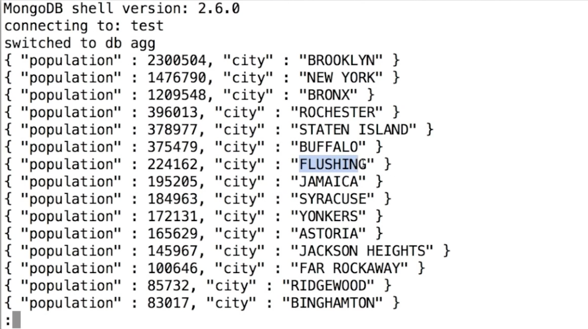

###### limit and skip

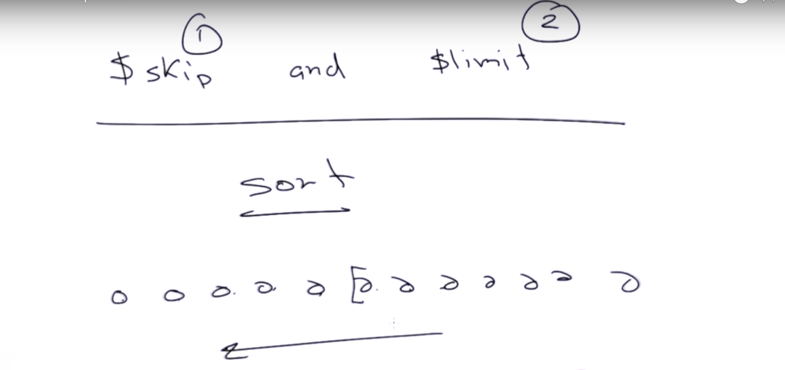

`limit__m101p_52b2071ae2d42362670d823e.js`

```js
use agg
db.zips.aggregate([
    {$match:
     {
	 state:"NY"
     }
    },
    {$group:
     {
	 _id: "$city",
	 population: {$sum:"$pop"},
     }
    },
    {$project:
     {
	 _id: 0,
	 city: "$_id",
	 population: 1,
     }
    },
    {$sort:
     {
	 population:-1
     }
    },
    {$skip: 10},
    {$limit: 5}
])
```

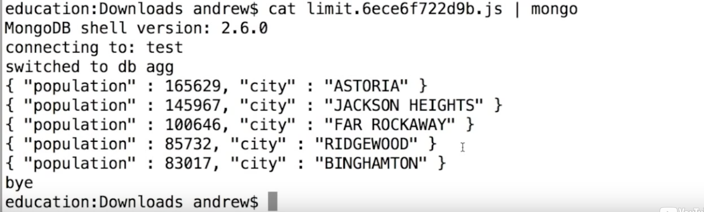

###### first and last

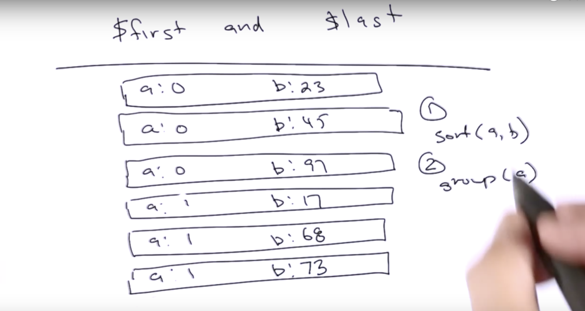

`first__m101p_52b208b6e2d42362670d8247.js`

```js
use agg
db.zips.aggregate([
    /* get the population of every city in every state */
    {$group:
     {
	 _id: {state:"$state", city:"$city"},
	 population: {$sum:"$pop"},
     }
    },
     /* sort by state, population */
    {$sort:
     {"_id.state":1, "population":-1}
    },

    /* group by state, get the first item in each group */
    {$group:
     {
	 _id:"$_id.state",
	 city: {$first: "$_id.city"},
	 population: {$first:"$population"}
     }
    },

    /* now sort by state again */
    {$sort:
     {"_id":1}
    }
])
```

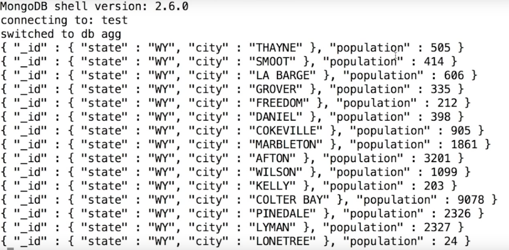

`first_phase1__m101p_52b208b4e2d42362670d8245.js`

```js
use agg
db.zips.aggregate([
    /* get the population of every city in every state */
    {$group:
     {
	 _id: {state:"$state", city:"$city"},
	 population: {$sum:"$pop"},
     }
    }
])
```

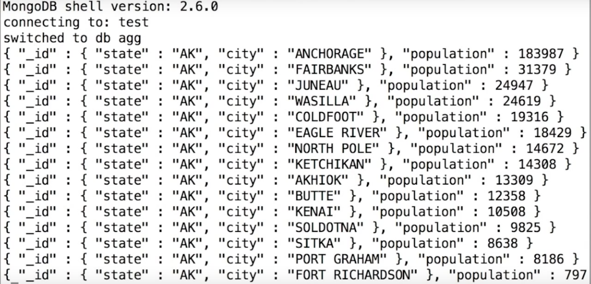

`first_phase2__m101p_52b208b3e2d42362670d8244.js`

```js
use agg
db.zips.aggregate([
    /* get the population of every city in every state */
    {$group:
     {
	 _id: {state:"$state", city:"$city"},
	 population: {$sum:"$pop"},
     }
    },
     /* sort by state, population */
    {$sort:
     {"_id.state":1, "population":-1}
    }
])
```

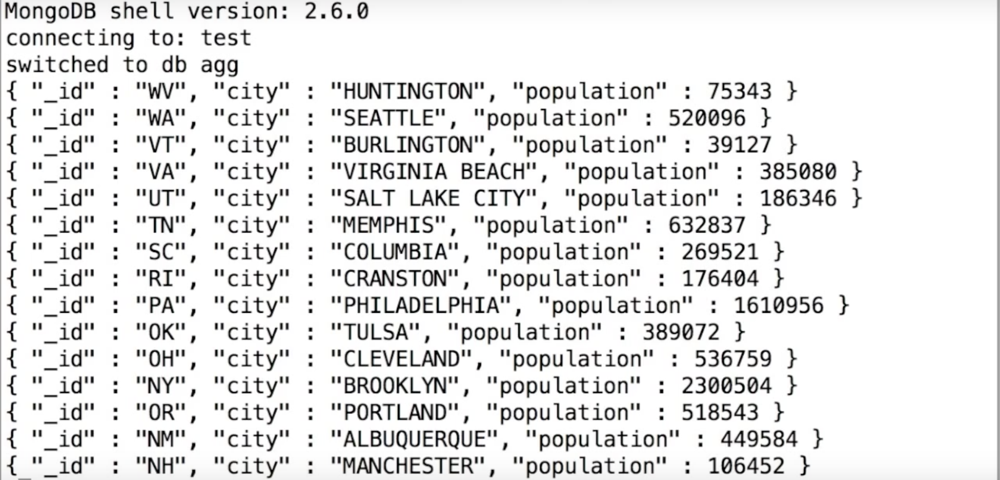

`first_phase3__m101p_52b208b2e2d42362670d8243.js`

```js
use agg
db.zips.aggregate([
    /* get the population of every city in every state */
    {$group:
     {
	 _id: {state:"$state", city:"$city"},
	 population: {$sum:"$pop"},
     }
    },
     /* sort by state, population */
    {$sort:
     {"_id.state":1, "population":-1}
    },
    /* group by state, get the first item in each group */
    {$group:
     {
	 _id:"$_id.state",
	 city: {$first: "$_id.city"},
	 population: {$first:"$population"}
     }
    }
])
```

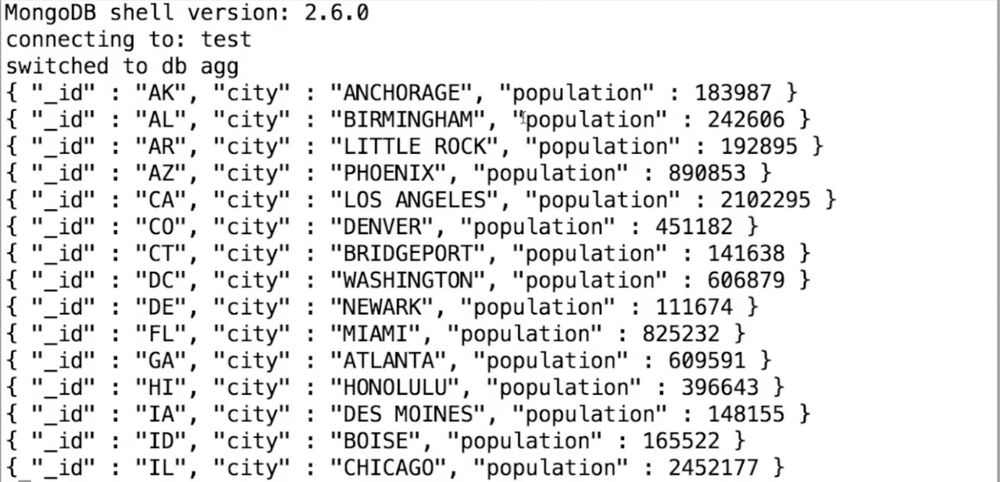

###### unwind

`quiz_unwind__m101p_52b208b7e2d42362670d8248.js`

```js
use agg;
db.items.drop();
db.items.insert({_id:'nail', 'attributes':['hard', 'shiny', 'pointy', 'thin']});
db.items.insert({_id:'hammer', 'attributes':['heavy', 'black', 'blunt']});
db.items.insert({_id:'screwdriver', 'attributes':['long', 'black', 'flat']});
db.items.insert({_id:'rock', 'attributes':['heavy', 'rough', 'roundish']});
db.items.aggregate([{$unwind:"$attributes"}]);
```

```sh
u64@vm:~/Desktop$ mongo < quiz_unwind__m101p_52b208b7e2d42362670d8248.js
MongoDB shell version v3.6.3
connecting to: mongodb://127.0.0.1:27017
MongoDB server version: 3.6.3
switched to db agg
false
WriteResult({ "nInserted" : 1 })
WriteResult({ "nInserted" : 1 })
WriteResult({ "nInserted" : 1 })
WriteResult({ "nInserted" : 1 })
{ "_id" : "nail", "attributes" : "hard" }
{ "_id" : "nail", "attributes" : "shiny" }
{ "_id" : "nail", "attributes" : "pointy" }
{ "_id" : "nail", "attributes" : "thin" }
{ "_id" : "hammer", "attributes" : "heavy" }
{ "_id" : "hammer", "attributes" : "black" }
{ "_id" : "hammer", "attributes" : "blunt" }
{ "_id" : "screwdriver", "attributes" : "long" }
{ "_id" : "screwdriver", "attributes" : "black" }
{ "_id" : "screwdriver", "attributes" : "flat" }
{ "_id" : "rock", "attributes" : "heavy" }
{ "_id" : "rock", "attributes" : "rough" }
{ "_id" : "rock", "attributes" : "roundish" }
bye
u64@vm:~/Desktop$
```

- Unwind blog example

```sh
u64@vm:~/Desktop$ mongo
MongoDB shell version v3.6.3
connecting to: mongodb://127.0.0.1:27017
MongoDB server version: 3.6.3
Server has startup warnings:
2018-04-22T11:05:02.839-0700 I STORAGE  [initandlisten]
2018-04-22T11:05:02.839-0700 I STORAGE  [initandlisten] ** WARNING: Using the XFS filesystem is strongly recommended with the WiredTiger storage engine
2018-04-22T11:05:02.839-0700 I STORAGE  [initandlisten] **          See http://dochub.mongodb.org/core/prodnotes-filesystem
2018-04-22T11:05:05.406-0700 I CONTROL  [initandlisten]
2018-04-22T11:05:05.406-0700 I CONTROL  [initandlisten] ** WARNING: Access control is not enabled for the database.
2018-04-22T11:05:05.406-0700 I CONTROL  [initandlisten] **          Read and write access to data and configuration is unrestricted.
2018-04-22T11:05:05.406-0700 I CONTROL  [initandlisten]
> show dbs
admin     0.000GB
agg       0.000GB
blog      0.011GB
config    0.000GB
local     0.000GB
m101      0.000GB
school    2.153GB
students  0.001GB
test      0.048GB
video     0.001GB
> use blog
switched to db blog
> db.posts.findOne({},{comments:0})
{
	"_id" : ObjectId("50ab0f8bbcf1bfe2536dc3f8"),
	"body" : "We the People of the United States, in Order to form a more perfect Union, establish Justice, insure domestic Tranquility, provide for the common defence, promote the general Welfare, and secure the Blessings of Liberty to ourselves and our Posterity, do ordain and establish this Constitution for the United States of America.\n<p>Article. I.<p><p>Section. 1.<p><p>All legislative Powers herein granted shall be vested in a Congress of the United States, which shall consist of a Senate and House of Representatives.<p><p>Section. 2.<p><p>The House of Representatives shall be composed of Members chosen every second Year by the People of the several States, and the Electors in each State shall have the Qualifications requisite for Electors of the most numerous Branch of the State Legislature.<p><p>No Person shall be a Representative who shall not have attained to the Age of twenty five Years, and been seven Years a Citizen of the United States, and who shall not, when elected, be an Inhabitant of that State in which he shall be chosen.<p><p>Representatives and direct Taxes shall be apportioned among the several States which may be included within this Union, according to their respective Numbers, which shall be determined by adding to the whole Number of free Persons, including those bound to Service for a Term of Years, and excluding Indians not taxed, three fifths of all other Persons. The actual Enumeration shall be made within three Years after the first Meeting of the Congress of the United States, and within every subsequent Term of ten Years, in such Manner as they shall by Law direct. The Number of Representatives shall not exceed one for every thirty Thousand, but each State shall have at Least one Representative; and until such enumeration shall be made, the State of New Hampshire shall be entitled to chuse three, Massachusetts eight, Rhode-Island and Providence Plantations one, Connecticut five, New-York six, New Jersey four, Pennsylvania eight, Delaware one, Maryland six, Virginia ten, North Carolina five, South Carolina five, and Georgia three.<p><p>When vacancies happen in the Representation from any State, the Executive Authority thereof shall issue Writs of Election to fill such Vacancies.<p><p>The House of Representatives shall chuse their Speaker and other Officers; and shall have the sole Power of Impeachment.<p><p>Section. 3.<p><p>The Senate of the United States shall be composed of two Senators from each State, chosen by the Legislature thereof for six Years; and each Senator shall have one Vote.<p><p>Immediately after they shall be assembled in Consequence of the first Election, they shall be divided as equally as may be into three Classes. The Seats of the Senators of the first Class shall be vacated at the Expiration of the second Year, of the second Class at the Expiration of the fourth Year, and of the third Class at the Expiration of the sixth Year, so that one third may be chosen every second Year; and if Vacancies happen by Resignation, or otherwise, during the Recess of the Legislature of any State, the Executive thereof may make temporary Appointments until the next Meeting of the Legislature, which shall then fill such Vacancies.<p><p>No Person shall be a Senator who shall not have attained to the Age of thirty Years, and been nine Years a Citizen of the United States, and who shall not, when elected, be an Inhabitant of that State for which he shall be chosen.<p><p>The Vice President of the United States shall be President of the Senate, but shall have no Vote, unless they be equally divided.<p><p>The Senate shall chuse their other Officers, and also a President pro tempore, in the Absence of the Vice President, or when he shall exercise the Office of President of the United States.<p><p>The Senate shall have the sole Power to try all Impeachments. When sitting for that Purpose, they shall be on Oath or Affirmation. When the President of the United States is tried, the Chief Justice shall preside: And no Person shall be convicted without the Concurrence of two thirds of the Members present.<p><p>Judgment in Cases of Impeachment shall not extend further than to removal from Office, and disqualification to hold and enjoy any Office of honor, Trust or Profit under the United States: but the Party convicted shall nevertheless be liable and subject to Indictment, Trial, Judgment and Punishment, according to Law.<p><p>Section. 4.<p><p>The Times, Places and Manner of holding Elections for Senators and Representatives, shall be prescribed in each State by the Legislature thereof; but the Congress may at any time by Law make or alter such Regulations, except as to the Places of chusing Senators.<p><p>The Congress shall assemble at least once in every Year, and such Meeting shall be on the first Monday in December, unless they shall by Law appoint a different Day.<p><p>Section. 5.<p><p>Each House shall be the Judge of the Elections, Returns and Qualifications of its own Members, and a Majority of each shall constitute a Quorum to do Business; but a smaller Number may adjourn from day to day, and may be authorized to compel the Attendance of absent Members, in such Manner, and under such Penalties as each House may provide.<p><p>Each House may determine the Rules of its Proceedings, punish its Members for disorderly Behaviour, and, with the Concurrence of two thirds, expel a Member.<p><p>Each House shall keep a Journal of its Proceedings, and from time to time publish the same, excepting such Parts as may in their Judgment require Secrecy; and the Yeas and Nays of the Members of either House on any question shall, at the Desire of one fifth of those Present, be entered on the Journal.<p><p>Neither House, during the Session of Congress, shall, without the Consent of the other, adjourn for more than three days, nor to any other Place than that in which the two Houses shall be sitting.<p><p>Section. 6.<p><p>The Senators and Representatives shall receive a Compensation for their Services, to be ascertained by Law, and paid out of the Treasury of the United States. They shall in all Cases, except Treason, Felony and Breach of the Peace, be privileged from Arrest during their Attendance at the Session of their respective Houses, and in going to and returning from the same; and for any Speech or Debate in either House, they shall not be questioned in any other Place.<p><p>No Senator or Representative shall, during the Time for which he was elected, be appointed to any civil Office under the Authority of the United States, which shall have been created, or the Emoluments whereof shall have been encreased during such time; and no Person holding any Office under the United States, shall be a Member of either House during his Continuance in Office.<p><p>Section. 7.<p><p>All Bills for raising Revenue shall originate in the House of Representatives; but the Senate may propose or concur with Amendments as on other Bills.<p><p>Every Bill which shall have passed the House of Representatives and the Senate, shall, before it become a Law, be presented to the President of the United States: If he approve he shall sign it, but if not he shall return it, with his Objections to that House in which it shall have originated, who shall enter the Objections at large on their Journal, and proceed to reconsider it. If after such Reconsideration two thirds of that House shall agree to pass the Bill, it shall be sent, together with the Objections, to the other House, by which it shall likewise be reconsidered, and if approved by two thirds of that House, it shall become a Law. But in all such Cases the Votes of both Houses shall be determined by yeas and Nays, and the Names of the Persons voting for and against the Bill shall be entered on the Journal of each House respectively. If any Bill shall not be returned by the President within ten Days (Sundays excepted) after it shall have been presented to him, the Same shall be a Law, in like Manner as if he had signed it, unless the Congress by their Adjournment prevent its Return, in which Case it shall not be a Law.<p><p>Every Order, Resolution, or Vote to which the Concurrence of the Senate and House of Representatives may be necessary (except on a question of Adjournment) shall be presented to the President of the United States; and before the Same shall take Effect, shall be approved by him, or being disapproved by him, shall be repassed by two thirds of the Senate and House of Representatives, according to the Rules and Limitations prescribed in the Case of a Bill.<p><p>Section. 8.<p><p>The Congress shall have Power To lay and collect Taxes, Duties, Imposts and Excises, to pay the Debts and provide for the common Defence and general Welfare of the United States; but all Duties, Imposts and Excises shall be uniform throughout the United States;<p><p>To borrow Money on the credit of the United States;<p><p>To regulate Commerce with foreign Nations, and among the several States, and with the Indian Tribes;<p><p>To establish an uniform Rule of Naturalization, and uniform Laws on the subject of Bankruptcies throughout the United States;<p><p>To coin Money, regulate the Value thereof, and of foreign Coin, and fix the Standard of Weights and Measures;<p><p>To provide for the Punishment of counterfeiting the Securities and current Coin of the United States;<p><p>To establish Post Offices and post Roads;<p><p>To promote the Progress of Science and useful Arts, by securing for limited Times to Authors and Inventors the exclusive Right to their respective Writings and Discoveries;<p><p>To constitute Tribunals inferior to the supreme Court;<p><p>To define and punish Piracies and Felonies committed on the high Seas, and Offences against the Law of Nations;<p><p>To declare War, grant Letters of Marque and Reprisal, and make Rules concerning Captures on Land and Water;<p><p>To raise and support Armies, but no Appropriation of Money to that Use shall be for a longer Term than two Years;<p><p>To provide and maintain a Navy;<p><p>To make Rules for the Government and Regulation of the land and naval Forces;<p><p>To provide for calling forth the Militia to execute the Laws of the Union, suppress Insurrections and repel Invasions;<p><p>To provide for organizing, arming, and disciplining, the Militia, and for governing such Part of them as may be employed in the Service of the United States, reserving to the States respectively, the Appointment of the Officers, and the Authority of training the Militia according to the discipline prescribed by Congress;<p><p>To exercise exclusive Legislation in all Cases whatsoever, over such District (not exceeding ten Miles square) as may, by Cession of particular States, and the Acceptance of Congress, become the Seat of the Government of the United States, and to exercise like Authority over all Places purchased by the Consent of the Legislature of the State in which the Same shall be, for the Erection of Forts, Magazines, Arsenals, dock-Yards, and other needful Buildings;--And<p><p>To make all Laws which shall be necessary and proper for carrying into Execution the foregoing Powers, and all other Powers vested by this Constitution in the Government of the United States, or in any Department or Officer thereof.<p><p>Section. 9.<p><p>The Migration or Importation of such Persons as any of the States now existing shall think proper to admit, shall not be prohibited by the Congress prior to the Year one thousand eight hundred and eight, but a Tax or duty may be imposed on such Importation, not exceeding ten dollars for each Person.<p><p>The Privilege of the Writ of Habeas Corpus shall not be suspended, unless when in Cases of Rebellion or Invasion the public Safety may require it.<p><p>No Bill of Attainder or ex post facto Law shall be passed.<p><p>No Capitation, or other direct, Tax shall be laid, unless in Proportion to the Census or enumeration herein before directed to be taken.<p><p>No Tax or Duty shall be laid on Articles exported from any State.<p><p>No Preference shall be given by any Regulation of Commerce or Revenue to the Ports of one State over those of another; nor shall Vessels bound to, or from, one State, be obliged to enter, clear, or pay Duties in another.<p><p>No Money shall be drawn from the Treasury, but in Consequence of Appropriations made by Law; and a regular Statement and Account of the Receipts and Expenditures of all public Money shall be published from time to time.<p><p>No Title of Nobility shall be granted by the United States: And no Person holding any Office of Profit or Trust under them, shall, without the Consent of the Congress, accept of any present, Emolument, Office, or Title, of any kind whatever, from any King, Prince, or foreign State.<p><p>Section. 10.<p><p>No State shall enter into any Treaty, Alliance, or Confederation; grant Letters of Marque and Reprisal; coin Money; emit Bills of Credit; make any Thing but gold and silver Coin a Tender in Payment of Debts; pass any Bill of Attainder, ex post facto Law, or Law impairing the Obligation of Contracts, or grant any Title of Nobility.<p><p>No State shall, without the Consent of the Congress, lay any Imposts or Duties on Imports or Exports, except what may be absolutely necessary for executing it's inspection Laws: and the net Produce of all Duties and Imposts, laid by any State on Imports or Exports, shall be for the Use of the Treasury of the United States; and all such Laws shall be subject to the Revision and Controul of the Congress.<p><p>No State shall, without the Consent of Congress, lay any Duty of Tonnage, keep Troops, or Ships of War in time of Peace, enter into any Agreement or Compact with another State, or with a foreign Power, or engage in War, unless actually invaded, or in such imminent Danger as will not admit of delay.<p><p>Article. II.<p><p>Section. 1.<p><p>The executive Power shall be vested in a President of the United States of America. He shall hold his Office during the Term of four Years, and, together with the Vice President, chosen for the same Term, be elected, as follows:<p><p>Each State shall appoint, in such Manner as the Legislature thereof may direct, a Number of Electors, equal to the whole Number of Senators and Representatives to which the State may be entitled in the Congress: but no Senator or Representative, or Person holding an Office of Trust or Profit under the United States, shall be appointed an Elector.<p><p>The Electors shall meet in their respective States, and vote by Ballot for two Persons, of whom one at least shall not be an Inhabitant of the same State with themselves. And they shall make a List of all the Persons voted for, and of the Number of Votes for each; which List they shall sign and certify, and transmit sealed to the Seat of the Government of the United States, directed to the President of the Senate. The President of the Senate shall, in the Presence of the Senate and House of Representatives, open all the Certificates, and the Votes shall then be counted. The Person having the greatest Number of Votes shall be the President, if such Number be a Majority of the whole Number of Electors appointed; and if there be more than one who have such Majority, and have an equal Number of Votes, then the House of Representatives shall immediately chuse by Ballot one of them for President; and if no Person have a Majority, then from the five highest on the List the said House shall in like Manner chuse the President. But in chusing the President, the Votes shall be taken by States, the Representation from each State having one Vote; A quorum for this purpose shall consist of a Member or Members from two thirds of the States, and a Majority of all the States shall be necessary to a Choice. In every Case, after the Choice of the President, the Person having the greatest Number of Votes of the Electors shall be the Vice President. But if there should remain two or more who have equal Votes, the Senate shall chuse from them by Ballot the Vice President.<p><p>The Congress may determine the Time of chusing the Electors, and the Day on which they shall give their Votes; which Day shall be the same throughout the United States.<p><p>No Person except a natural born Citizen, or a Citizen of the United States, at the time of the Adoption of this Constitution, shall be eligible to the Office of President; neither shall any Person be eligible to that Office who shall not have attained to the Age of thirty five Years, and been fourteen Years a Resident within the United States.<p><p>In Case of the Removal of the President from Office, or of his Death, Resignation, or Inability to discharge the Powers and Duties of the said Office, the Same shall devolve on the Vice President, and the Congress may by Law provide for the Case of Removal, Death, Resignation or Inability, both of the President and Vice President, declaring what Officer shall then act as President, and such Officer shall act accordingly, until the Disability be removed, or a President shall be elected.<p><p>The President shall, at stated Times, receive for his Services, a Compensation, which shall neither be increased nor diminished during the Period for which he shall have been elected, and he shall not receive within that Period any other Emolument from the United States, or any of them.<p><p>Before he enter on the Execution of his Office, he shall take the following Oath or Affirmation:--\"I do solemnly swear (or affirm) that I will faithfully execute the Office of President of the United States, and will to the best of my Ability, preserve, protect and defend the Constitution of the United States.\"<p><p>Section. 2.<p><p>The President shall be Commander in Chief of the Army and Navy of the United States, and of the Militia of the several States, when called into the actual Service of the United States; he may require the Opinion, in writing, of the principal Officer in each of the executive Departments, upon any Subject relating to the Duties of their respective Offices, and he shall have Power to grant Reprieves and Pardons for Offences against the United States, except in Cases of Impeachment.<p><p>He shall have Power, by and with the Advice and Consent of the Senate, to make Treaties, provided two thirds of the Senators present concur; and he shall nominate, and by and with the Advice and Consent of the Senate, shall appoint Ambassadors, other public Ministers and Consuls, Judges of the supreme Court, and all other Officers of the United States, whose Appointments are not herein otherwise provided for, and which shall be established by Law: but the Congress may by Law vest the Appointment of such inferior Officers, as they think proper, in the President alone, in the Courts of Law, or in the Heads of Departments.<p><p>The President shall have Power to fill up all Vacancies that may happen during the Recess of the Senate, by granting Commissions which shall expire at the End of their next Session.<p><p>Section. 3.<p><p>He shall from time to time give to the Congress Information of the State of the Union, and recommend to their Consideration such Measures as he shall judge necessary and expedient; he may, on extraordinary Occasions, convene both Houses, or either of them, and in Case of Disagreement between them, with Respect to the Time of Adjournment, he may adjourn them to such Time as he shall think proper; he shall receive Ambassadors and other public Ministers; he shall take Care that the Laws be faithfully executed, and shall Commission all the Officers of the United States.<p><p>Section. 4.<p><p>The President, Vice President and all civil Officers of the United States, shall be removed from Office on Impeachment for, and Conviction of, Treason, Bribery, or other high Crimes and Misdemeanors.<p><p>Article III.<p><p>Section. 1.<p><p>The judicial Power of the United States shall be vested in one supreme Court, and in such inferior Courts as the Congress may from time to time ordain and establish. The Judges, both of the supreme and inferior Courts, shall hold their Offices during good Behaviour, and shall, at stated Times, receive for their Services a Compensation, which shall not be diminished during their Continuance in Office.<p><p>Section. 2.<p><p>The judicial Power shall extend to all Cases, in Law and Equity, arising under this Constitution, the Laws of the United States, and Treaties made, or which shall be made, under their Authority;--to all Cases affecting Ambassadors, other public Ministers and Consuls;--to all Cases of admiralty and maritime Jurisdiction;--to Controversies to which the United States shall be a Party;--to Controversies between two or more States;-- between a State and Citizens of another State,--between Citizens of different States,--between Citizens of the same State claiming Lands under Grants of different States, and between a State, or the Citizens thereof, and foreign States, Citizens or Subjects.<p><p>In all Cases affecting Ambassadors, other public Ministers and Consuls, and those in which a State shall be Party, the supreme Court shall have original Jurisdiction. In all the other Cases before mentioned, the supreme Court shall have appellate Jurisdiction, both as to Law and Fact, with such Exceptions, and under such Regulations as the Congress shall make.<p><p>The Trial of all Crimes, except in Cases of Impeachment, shall be by Jury; and such Trial shall be held in the State where the said Crimes shall have been committed; but when not committed within any State, the Trial shall be at such Place or Places as the Congress may by Law have directed.<p><p>Section. 3.<p><p>Treason against the United States, shall consist only in levying War against them, or in adhering to their Enemies, giving them Aid and Comfort. No Person shall be convicted of Treason unless on the Testimony of two Witnesses to the same overt Act, or on Confession in open Court.<p><p>The Congress shall have Power to declare the Punishment of Treason, but no Attainder of Treason shall work Corruption of Blood, or Forfeiture except during the Life of the Person attainted.<p><p>Article. IV.<p><p>Section. 1.<p><p>Full Faith and Credit shall be given in each State to the public Acts, Records, and judicial Proceedings of every other State. And the Congress may by general Laws prescribe the Manner in which such Acts, Records and Proceedings shall be proved, and the Effect thereof.<p><p>Section. 2.<p><p>The Citizens of each State shall be entitled to all Privileges and Immunities of Citizens in the several States.<p><p>A Person charged in any State with Treason, Felony, or other Crime, who shall flee from Justice, and be found in another State, shall on Demand of the executive Authority of the State from which he fled, be delivered up, to be removed to the State having Jurisdiction of the Crime.<p><p>No Person held to Service or Labour in one State, under the Laws thereof, escaping into another, shall, in Consequence of any Law or Regulation therein, be discharged from such Service or Labour, but shall be delivered up on Claim of the Party to whom such Service or Labour may be due.<p><p>Section. 3.<p><p>New States may be admitted by the Congress into this Union; but no new State shall be formed or erected within the Jurisdiction of any other State; nor any State be formed by the Junction of two or more States, or Parts of States, without the Consent of the Legislatures of the States concerned as well as of the Congress.<p><p>The Congress shall have Power to dispose of and make all needful Rules and Regulations respecting the Territory or other Property belonging to the United States; and nothing in this Constitution shall be so construed as to Prejudice any Claims of the United States, or of any particular State.<p><p>Section. 4.<p><p>The United States shall guarantee to every State in this Union a Republican Form of Government, and shall protect each of them against Invasion; and on Application of the Legislature, or of the Executive (when the Legislature cannot be convened), against domestic Violence.<p><p>Article. V.<p><p>The Congress, whenever two thirds of both Houses shall deem it necessary, shall propose Amendments to this Constitution, or, on the Application of the Legislatures of two thirds of the several States, shall call a Convention for proposing Amendments, which, in either Case, shall be valid to all Intents and Purposes, as Part of this Constitution, when ratified by the Legislatures of three fourths of the several States, or by Conventions in three fourths thereof, as the one or the other Mode of Ratification may be proposed by the Congress; Provided that no Amendment which may be made prior to the Year One thousand eight hundred and eight shall in any Manner affect the first and fourth Clauses in the Ninth Section of the first Article; and that no State, without its Consent, shall be deprived of its equal Suffrage in the Senate.<p><p>Article. VI.<p><p>All Debts contracted and Engagements entered into, before the Adoption of this Constitution, shall be as valid against the United States under this Constitution, as under the Confederation.<p><p>This Constitution, and the Laws of the United States which shall be made in Pursuance thereof; and all Treaties made, or which shall be made, under the Authority of the United States, shall be the supreme Law of the Land; and the Judges in every State shall be bound thereby, any Thing in the Constitution or Laws of any State to the Contrary notwithstanding.<p><p>The Senators and Representatives before mentioned, and the Members of the several State Legislatures, and all executive and judicial Officers, both of the United States and of the several States, shall be bound by Oath or Affirmation, to support this Constitution; but no religious Test shall ever be required as a Qualification to any Office or public Trust under the United States.<p><p>Article. VII.<p><p>The Ratification of the Conventions of nine States, shall be sufficient for the Establishment of this Constitution between the States so ratifying the Same.<p><p>The Word, \"the,\" being interlined between the seventh and eighth Lines of the first Page, the Word \"Thirty\" being partly written on an Erazure in the fifteenth Line of the first Page, The Words \"is tried\" being interlined between the thirty second and thirty third Lines of the first Page and the Word \"the\" being interlined between the forty third and forty fourth Lines of the second Page.<p><p>Attest William Jackson Secretary<p><p>done in Convention by the Unanimous Consent of the States present the Seventeenth Day of September in the Year of our Lord one thousand seven hundred and Eighty seven and of the Independance of the United States of America the Twelfth In witness whereof We have hereunto subscribed our Names,<p>\n",
	"permalink" : "TqoHkbHyUgLyCKWgPLqm",
	"author" : "machine",
	"title" : "US Constitution",
	"tags" : [
		"trade",
		"fowl",
		"forecast",
		"pest",
		"professor",
		"willow",
		"rise",
		"brace",
		"ink",
		"road"
	],
	"date" : ISODate("2012-11-20T05:05:15.229Z")
}
>
```

`blog_tags__m101p_52b20b16e2d42362670d8255.js`

```js
use blog;
db.posts.aggregate([
    /* unwind by tags */
    {"$unwind":"$tags"},
    /* now group by tags, counting each tag */
    {"$group":
     {"_id":"$tags",
      "count":{$sum:1}
     }
    },
    /* sort by popularity */
    {"$sort":{"count":-1}},
    /* show me the top 10 */
    {"$limit": 10},
    /* change the name of _id to be tag */
    {"$project":
     {_id:0,
      'tag':'$_id',
      'count' : 1
     }
    }
    ])
```

```sh
u64@vm:~/Desktop$ mongo < blog_tags__m101p_52b20b16e2d42362670d8255.js
MongoDB shell version v3.6.3
connecting to: mongodb://127.0.0.1:27017
MongoDB server version: 3.6.3
switched to db blog
{ "count" : 13, "tag" : "sphynx" }
{ "count" : 12, "tag" : "lunchroom" }
{ "count" : 11, "tag" : "decade" }
{ "count" : 11, "tag" : "puppy" }
{ "count" : 11, "tag" : "hair" }
{ "count" : 11, "tag" : "imprisonment" }
{ "count" : 11, "tag" : "soldier" }
{ "count" : 11, "tag" : "stopsign" }
{ "count" : 11, "tag" : "crowd" }
{ "count" : 11, "tag" : "leo" }
bye
u64@vm:~/Desktop$
```

###### Double unwind

`double_unwind__m101p_52b20bdbe2d42362670d8258.js`

```js
use agg;
db.inventory.drop();
db.inventory.insert({'name':"Polo Shirt", 'sizes':["Small", "Medium", "Large"], 'colors':['navy', 'white', 'orange', 'red']})
db.inventory.insert({'name':"T-Shirt", 'sizes':["Small", "Medium", "Large", "X-Large"], 'colors':['navy', "black",  'orange', 'red']})
db.inventory.insert({'name':"Chino Pants", 'sizes':["32x32", "31x30", "36x32"], 'colors':['navy', 'white', 'orange', 'violet']})
db.inventory.aggregate([
    {$unwind: "$sizes"},
    {$unwind: "$colors"},
    {$group:
     {
	'_id': {'size':'$sizes', 'color':'$colors'},
	'count' : {'$sum':1}
     }
    }
])
```

```sh
u64@vm:~/Desktop$ mongo < double_unwind__m101p_52b20bdbe2d42362670d8258.js
MongoDB shell version v3.6.3
connecting to: mongodb://127.0.0.1:27017
MongoDB server version: 3.6.3
switched to db agg
true
WriteResult({ "nInserted" : 1 })
WriteResult({ "nInserted" : 1 })
WriteResult({ "nInserted" : 1 })
{ "_id" : { "size" : "36x32", "color" : "violet" }, "count" : 1 }
{ "_id" : { "size" : "36x32", "color" : "navy" }, "count" : 1 }
{ "_id" : { "size" : "31x30", "color" : "orange" }, "count" : 1 }
{ "_id" : { "size" : "31x30", "color" : "navy" }, "count" : 1 }
{ "_id" : { "size" : "36x32", "color" : "white" }, "count" : 1 }
{ "_id" : { "size" : "32x32", "color" : "violet" }, "count" : 1 }
{ "_id" : { "size" : "Medium", "color" : "white" }, "count" : 1 }
{ "_id" : { "size" : "Large", "color" : "navy" }, "count" : 2 }
{ "_id" : { "size" : "Small", "color" : "red" }, "count" : 2 }
{ "_id" : { "size" : "Large", "color" : "white" }, "count" : 1 }
{ "_id" : { "size" : "Medium", "color" : "red" }, "count" : 2 }
{ "_id" : { "size" : "31x30", "color" : "violet" }, "count" : 1 }
{ "_id" : { "size" : "Medium", "color" : "orange" }, "count" : 2 }
{ "_id" : { "size" : "31x30", "color" : "white" }, "count" : 1 }
{ "_id" : { "size" : "Medium", "color" : "navy" }, "count" : 2 }
{ "_id" : { "size" : "X-Large", "color" : "navy" }, "count" : 1 }
{ "_id" : { "size" : "Large", "color" : "orange" }, "count" : 2 }
{ "_id" : { "size" : "Small", "color" : "orange" }, "count" : 2 }
{ "_id" : { "size" : "Large", "color" : "red" }, "count" : 2 }
{ "_id" : { "size" : "Small", "color" : "black" }, "count" : 1 }
Type "it" for more
bye
u64@vm:~/Desktop$
```

`reversing_double_unwind__m101p_52b20cc4e2d42362670d825b.js`

```js
use agg;
db.inventory.drop();
db.inventory.insert({'name':"Polo Shirt", 'sizes':["Small", "Medium", "Large"], 'colors':['navy', 'white', 'orange', 'red']})
db.inventory.insert({'name':"T-Shirt", 'sizes':["Small", "Medium", "Large", "X-Large"], 'colors':['navy', "black",  'orange', 'red']})
db.inventory.insert({'name':"Chino Pants", 'sizes':["32x32", "31x30", "36x32"], 'colors':['navy', 'white', 'orange', 'violet']})
db.inventory.aggregate([
    {$unwind: "$sizes"},
    {$unwind: "$colors"},
    {$group:
     {
	'_id': "$name",
	 'sizes': {$addToSet: "$sizes"},
	 'colors': {$addToSet: "$colors"},
     }
    }
])
```

```sh
u64@vm:~/Desktop$ mongo < reversing_double_unwind__m101p_52b20cc4e2d42362670d825b.js
MongoDB shell version v3.6.3
connecting to: mongodb://127.0.0.1:27017
MongoDB server version: 3.6.3
switched to db agg
false
WriteResult({ "nInserted" : 1 })
WriteResult({ "nInserted" : 1 })
WriteResult({ "nInserted" : 1 })
{ "_id" : "Chino Pants", "sizes" : [ "36x32", "31x30", "32x32" ], "colors" : [ "violet", "orange", "white", "navy" ] }
{ "_id" : "T-Shirt", "sizes" : [ "Medium", "X-Large", "Large", "Small" ], "colors" : [ "red", "orange", "black", "navy" ] }
{ "_id" : "Polo Shirt", "sizes" : [ "Medium", "Large", "Small" ], "colors" : [ "orange", "red", "white", "navy" ] }
bye
u64@vm:~/Desktop$
```

`reversing_double_unwind2__m101p_52b20cf0e2d42362670d825e.js`

```js
use agg;
db.inventory.drop();
db.inventory.insert({'name':"Polo Shirt", 'sizes':["Small", "Medium", "Large"], 'colors':['navy', 'white', 'orange', 'red']})
db.inventory.insert({'name':"T-Shirt", 'sizes':["Small", "Medium", "Large", "X-Large"], 'colors':['navy', "black",  'orange', 'red']})
db.inventory.insert({'name':"Chino Pants", 'sizes':["32x32", "31x30", "36x32"], 'colors':['navy', 'white', 'orange', 'violet']})
db.inventory.aggregate([
    {$unwind: "$sizes"},
    {$unwind: "$colors"},
    /* create the color array */
    {$group:
     {
	'_id': {name:"$name",size:"$sizes"},
	 'colors': {$push: "$colors"},
     }
    },
    /* create the size array */
    {$group:
     {
	'_id': {'name':"$_id.name",
		'colors' : "$colors"},
	 'sizes': {$push: "$_id.size"}
     }
    },
    /* reshape for beauty */
    {$project:
     {
	 _id:0,
	 "name":"$_id.name",
	 "sizes":1,
	 "colors": "$_id.colors"
     }
    }
])
```

```sh
u64@vm:~/Desktop$ mongo < reversing_double_unwind2__m101p_52b20cf0e2d42362670d825e.js
MongoDB shell version v3.6.3
connecting to: mongodb://127.0.0.1:27017
MongoDB server version: 3.6.3
switched to db agg
true
WriteResult({ "nInserted" : 1 })
WriteResult({ "nInserted" : 1 })
WriteResult({ "nInserted" : 1 })
{ "sizes" : [ "Medium", "Small", "Large" ], "name" : "Polo Shirt", "colors" : [ "navy", "white", "orange", "red" ] }
{ "sizes" : [ "Large", "Medium", "X-Large", "Small" ], "name" : "T-Shirt", "colors" : [ "navy", "black", "orange", "red" ] }
{ "sizes" : [ "36x32", "31x30", "32x32" ], "name" : "Chino Pants", "colors" : [ "navy", "white", "orange", "violet" ] }
bye
u64@vm:~/Desktop$
```

###### out


###### Python and Aggregation

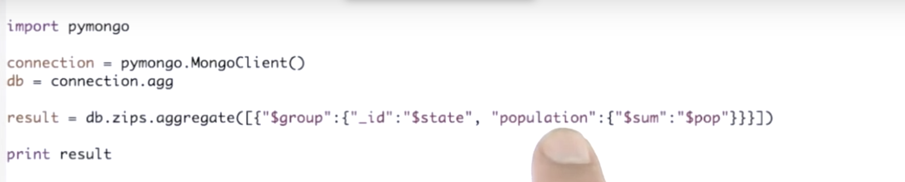

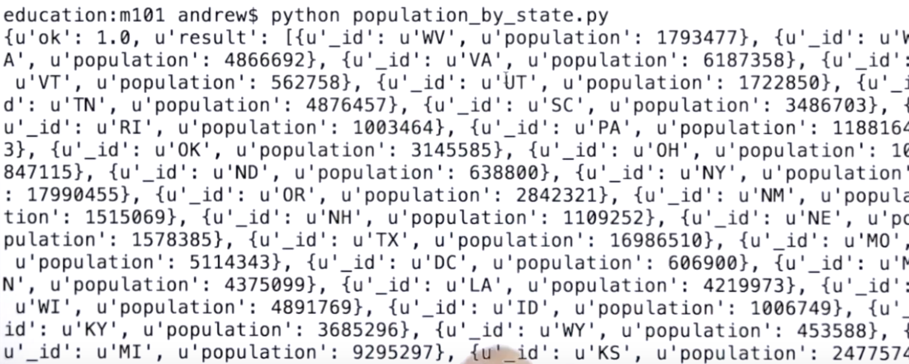

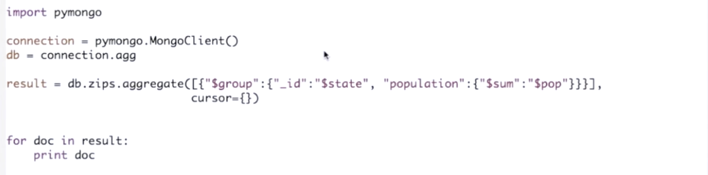

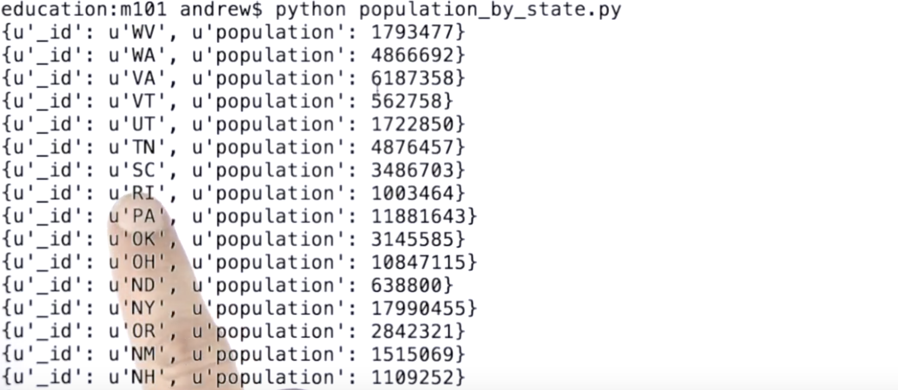

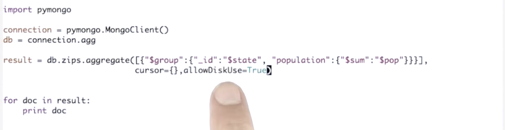

###### [SQL to Aggregation Mapping Chart](https://docs.mongodb.com/manual/reference/sql-aggregation-comparison/)

###### Limitations of Aggregation

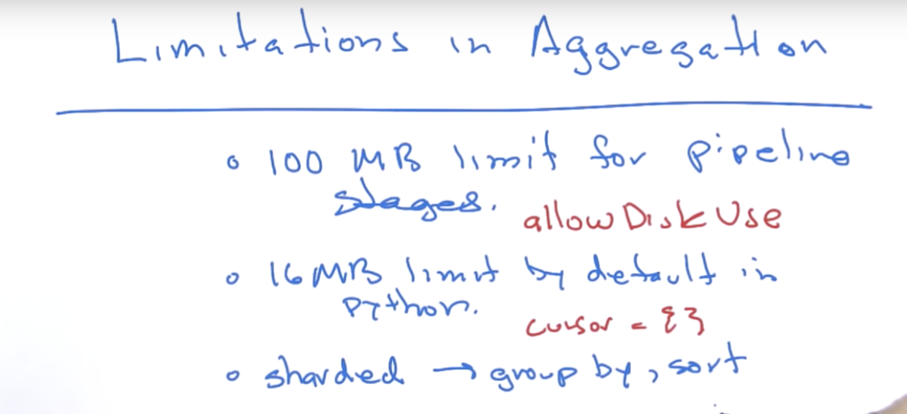

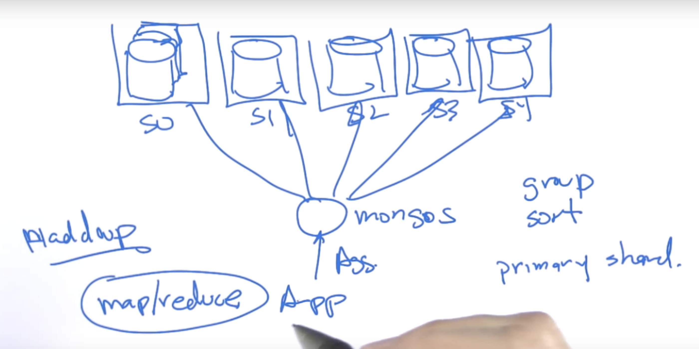

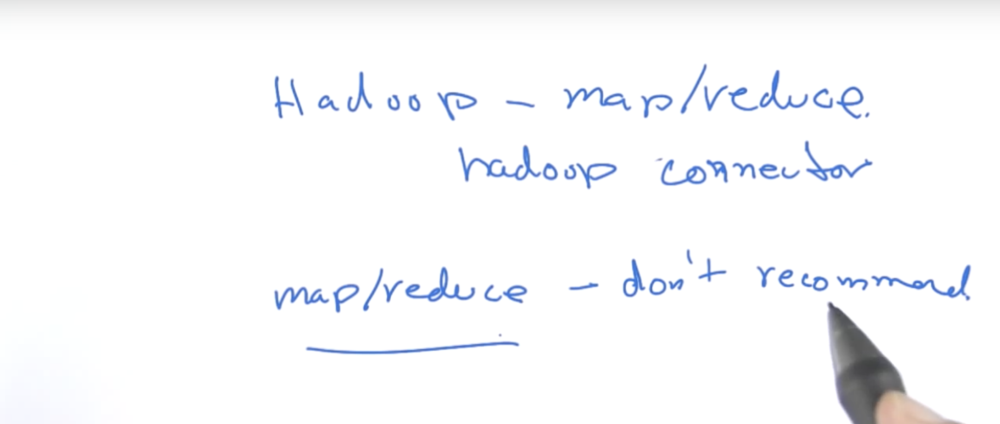