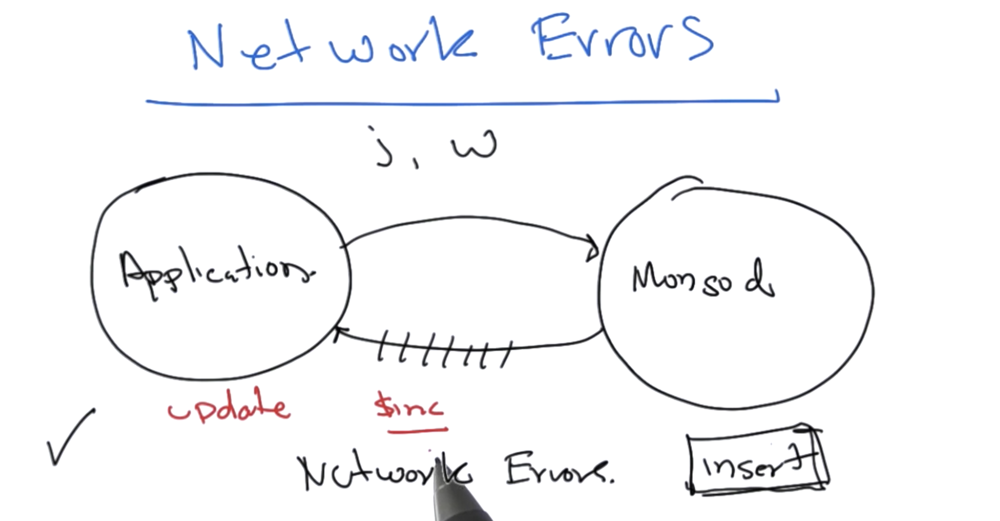
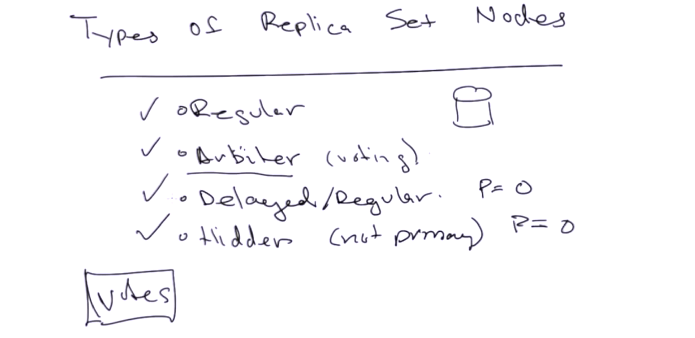
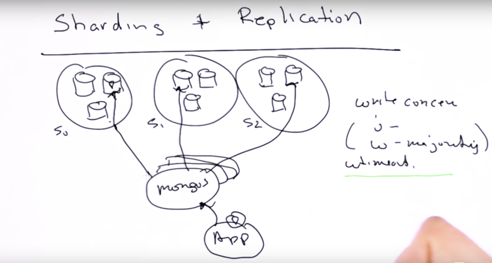

#### 31. Application Engineering

- Write Concern


- Network Concern



###### Introduction to Replication

- Availability
- Fault Tolerance


###### Replica Set Elections



###### Write Consistency


###### Creating a Replica Set

`create_replica_set__m101p_52b35df6e2d423678d3b9d48.sh`

```sh
#!/usr/bin/env bash

mkdir -p /data/rs1 /data/rs2 /data/rs3
mongod --replSet m101 --logpath "1.log" --dbpath /data/rs1 --port 27017 --oplogSize 64 --fork --smallfiles
mongod --replSet m101 --logpath "2.log" --dbpath /data/rs2 --port 27018 --oplogSize 64 --smallfiles --fork
mongod --replSet m101 --logpath "3.log" --dbpath /data/rs3 --port 27019 --oplogSize 64 --smallfiles --fork
```

```sh
u64@vm:~/Desktop$ sudo bash < create_replica_set__m101p_52b35df6e2d423678d3b9d48.sh
[sudo] password for u64:
about to fork child process, waiting until server is ready for connections.
forked process: 3667
child process started successfully, parent exiting
about to fork child process, waiting until server is ready for connections.
forked process: 3695
child process started successfully, parent exiting
about to fork child process, waiting until server is ready for connections.
forked process: 3723
child process started successfully, parent exiting
u64@vm:~/Desktop$
```

`init_replica__m101p_52b35e02e2d423678d3b9d4d.js`

```js
config = { _id: "m101", members:[
          { _id : 0, host : "localhost:27017"},
          { _id : 1, host : "localhost:27018"},
          { _id : 2, host : "localhost:27019"} ]
};

rs.initiate(config);
rs.status();
```

```sh
u64@vm:~/Desktop$ mongo --port 27018 < init_replica__m101p_52b35e02e2d423678d3b9d4d.js
MongoDB shell version v3.6.3
connecting to: mongodb://127.0.0.1:27018/
MongoDB server version: 3.6.3
{
	"_id" : "m101",
	"members" : [
		{
			"_id" : 0,
			"host" : "localhost:27017"
		},
		{
			"_id" : 1,
			"host" : "localhost:27018"
		},
		{
			"_id" : 2,
			"host" : "localhost:27019"
		}
	]
}
{
	"ok" : 1,
	"operationTime" : Timestamp(1525099101, 1),
	"$clusterTime" : {
		"clusterTime" : Timestamp(1525099101, 1),
		"signature" : {
			"hash" : BinData(0,"AAAAAAAAAAAAAAAAAAAAAAAAAAA="),
			"keyId" : NumberLong(0)
		}
	}
}
{
	"set" : "m101",
	"date" : ISODate("2018-04-30T14:38:21.324Z"),
	"myState" : 2,
	"term" : NumberLong(0),
	"heartbeatIntervalMillis" : NumberLong(2000),
	"optimes" : {
		"lastCommittedOpTime" : {
			"ts" : Timestamp(0, 0),
			"t" : NumberLong(-1)
		},
		"appliedOpTime" : {
			"ts" : Timestamp(1525099101, 1),
			"t" : NumberLong(-1)
		},
		"durableOpTime" : {
			"ts" : Timestamp(1525099101, 1),
			"t" : NumberLong(-1)
		}
	},
	"members" : [
		{
			"_id" : 0,
			"name" : "localhost:27017",
			"health" : 1,
			"state" : 0,
			"stateStr" : "STARTUP",
			"uptime" : 0,
			"optime" : {
				"ts" : Timestamp(0, 0),
				"t" : NumberLong(-1)
			},
			"optimeDurable" : {
				"ts" : Timestamp(0, 0),
				"t" : NumberLong(-1)
			},
			"optimeDate" : ISODate("1970-01-01T00:00:00Z"),
			"optimeDurableDate" : ISODate("1970-01-01T00:00:00Z"),
			"lastHeartbeat" : ISODate("2018-04-30T14:38:21.319Z"),
			"lastHeartbeatRecv" : ISODate("1970-01-01T00:00:00Z"),
			"pingMs" : NumberLong(1),
			"configVersion" : -2
		},
		{
			"_id" : 1,
			"name" : "localhost:27018",
			"health" : 1,
			"state" : 2,
			"stateStr" : "SECONDARY",
			"uptime" : 204,
			"optime" : {
				"ts" : Timestamp(1525099101, 1),
				"t" : NumberLong(-1)
			},
			"optimeDate" : ISODate("2018-04-30T14:38:21Z"),
			"configVersion" : 1,
			"self" : true
		},
		{
			"_id" : 2,
			"name" : "localhost:27019",
			"health" : 1,
			"state" : 0,
			"stateStr" : "STARTUP",
			"uptime" : 0,
			"optime" : {
				"ts" : Timestamp(0, 0),
				"t" : NumberLong(-1)
			},
			"optimeDurable" : {
				"ts" : Timestamp(0, 0),
				"t" : NumberLong(-1)
			},
			"optimeDate" : ISODate("1970-01-01T00:00:00Z"),
			"optimeDurableDate" : ISODate("1970-01-01T00:00:00Z"),
			"lastHeartbeat" : ISODate("2018-04-30T14:38:21.319Z"),
			"lastHeartbeatRecv" : ISODate("1970-01-01T00:00:00Z"),
			"pingMs" : NumberLong(0),
			"configVersion" : -2
		}
	],
	"ok" : 1,
	"operationTime" : Timestamp(1525099101, 1),
	"$clusterTime" : {
		"clusterTime" : Timestamp(1525099101, 1),
		"signature" : {
			"hash" : BinData(0,"AAAAAAAAAAAAAAAAAAAAAAAAAAA="),
			"keyId" : NumberLong(0)
		}
	}
}
bye
u64@vm:~/Desktop$
```

```sh
u64@vm:~/Desktop$ mongo --port 27018
MongoDB shell version v3.6.3
connecting to: mongodb://127.0.0.1:27018/
MongoDB server version: 3.6.3
Server has startup warnings:
2018-04-30T07:34:57.850-0700 I STORAGE  [initandlisten]
2018-04-30T07:34:57.850-0700 I STORAGE  [initandlisten] ** WARNING: Using the XFS filesystem is strongly recommended with the WiredTiger storage engine
2018-04-30T07:34:57.850-0700 I STORAGE  [initandlisten] **          See http://dochub.mongodb.org/core/prodnotes-filesystem
2018-04-30T07:34:58.698-0700 I CONTROL  [initandlisten]
2018-04-30T07:34:58.698-0700 I CONTROL  [initandlisten] ** WARNING: Access control is not enabled for the database.
2018-04-30T07:34:58.698-0700 I CONTROL  [initandlisten] **          Read and write access to data and configuration is unrestricted.
2018-04-30T07:34:58.698-0700 I CONTROL  [initandlisten] ** WARNING: You are running this process as the root user, which is not recommended.
2018-04-30T07:34:58.698-0700 I CONTROL  [initandlisten]
2018-04-30T07:34:58.698-0700 I CONTROL  [initandlisten] ** WARNING: This server is bound to localhost.
2018-04-30T07:34:58.698-0700 I CONTROL  [initandlisten] **          Remote systems will be unable to connect to this server.
2018-04-30T07:34:58.698-0700 I CONTROL  [initandlisten] **          Start the server with --bind_ip <address> to specify which IP
2018-04-30T07:34:58.698-0700 I CONTROL  [initandlisten] **          addresses it should serve responses from, or with --bind_ip_all to
2018-04-30T07:34:58.699-0700 I CONTROL  [initandlisten] **          bind to all interfaces. If this behavior is desired, start the
2018-04-30T07:34:58.699-0700 I CONTROL  [initandlisten] **          server with --bind_ip 127.0.0.1 to disable this warning.
2018-04-30T07:34:58.699-0700 I CONTROL  [initandlisten]
m101:PRIMARY> rs.status()
{
	"set" : "m101",
	"date" : ISODate("2018-04-30T14:40:08.253Z"),
	"myState" : 1,
	"term" : NumberLong(1),
	"heartbeatIntervalMillis" : NumberLong(2000),
	"optimes" : {
		"lastCommittedOpTime" : {
			"ts" : Timestamp(1525099198, 2),
			"t" : NumberLong(1)
		},
		"readConcernMajorityOpTime" : {
			"ts" : Timestamp(1525099198, 2),
			"t" : NumberLong(1)
		},
		"appliedOpTime" : {
			"ts" : Timestamp(1525099198, 2),
			"t" : NumberLong(1)
		},
		"durableOpTime" : {
			"ts" : Timestamp(1525099198, 2),
			"t" : NumberLong(1)
		}
	},
	"members" : [
		{
			"_id" : 0,
			"name" : "localhost:27017",
			"health" : 1,
			"state" : 2,
			"stateStr" : "SECONDARY",
			"uptime" : 106,
			"optime" : {
				"ts" : Timestamp(1525099198, 2),
				"t" : NumberLong(1)
			},
			"optimeDurable" : {
				"ts" : Timestamp(1525099198, 2),
				"t" : NumberLong(1)
			},
			"optimeDate" : ISODate("2018-04-30T14:39:58Z"),
			"optimeDurableDate" : ISODate("2018-04-30T14:39:58Z"),
			"lastHeartbeat" : ISODate("2018-04-30T14:40:07.546Z"),
			"lastHeartbeatRecv" : ISODate("2018-04-30T14:40:06.474Z"),
			"pingMs" : NumberLong(0),
			"syncingTo" : "localhost:27018",
			"configVersion" : 1
		},
		{
			"_id" : 1,
			"name" : "localhost:27018",
			"health" : 1,
			"state" : 1,
			"stateStr" : "PRIMARY",
			"uptime" : 311,
			"optime" : {
				"ts" : Timestamp(1525099198, 2),
				"t" : NumberLong(1)
			},
			"optimeDate" : ISODate("2018-04-30T14:39:58Z"),
			"infoMessage" : "could not find member to sync from",
			"electionTime" : Timestamp(1525099111, 1),
			"electionDate" : ISODate("2018-04-30T14:38:31Z"),
			"configVersion" : 1,
			"self" : true
		},
		{
			"_id" : 2,
			"name" : "localhost:27019",
			"health" : 1,
			"state" : 2,
			"stateStr" : "SECONDARY",
			"uptime" : 106,
			"optime" : {
				"ts" : Timestamp(1525099198, 2),
				"t" : NumberLong(1)
			},
			"optimeDurable" : {
				"ts" : Timestamp(1525099198, 2),
				"t" : NumberLong(1)
			},
			"optimeDate" : ISODate("2018-04-30T14:39:58Z"),
			"optimeDurableDate" : ISODate("2018-04-30T14:39:58Z"),
			"lastHeartbeat" : ISODate("2018-04-30T14:40:07.546Z"),
			"lastHeartbeatRecv" : ISODate("2018-04-30T14:40:06.474Z"),
			"pingMs" : NumberLong(0),
			"syncingTo" : "localhost:27018",
			"configVersion" : 1
		}
	],
	"ok" : 1,
	"operationTime" : Timestamp(1525099198, 2),
	"$clusterTime" : {
		"clusterTime" : Timestamp(1525099198, 2),
		"signature" : {
			"hash" : BinData(0,"AAAAAAAAAAAAAAAAAAAAAAAAAAA="),
			"keyId" : NumberLong(0)
		}
	}
}
m101:PRIMARY>
bye
```

```sh
u64@vm:~/Desktop$ mongo --port 27017
MongoDB shell version v3.6.3
connecting to: mongodb://127.0.0.1:27017/
MongoDB server version: 3.6.3
Server has startup warnings:
2018-04-30T07:34:56.737-0700 I STORAGE  [initandlisten]
2018-04-30T07:34:56.738-0700 I STORAGE  [initandlisten] ** WARNING: Using the XFS filesystem is strongly recommended with the WiredTiger storage engine
2018-04-30T07:34:56.738-0700 I STORAGE  [initandlisten] **          See http://dochub.mongodb.org/core/prodnotes-filesystem
2018-04-30T07:34:57.590-0700 I CONTROL  [initandlisten]
2018-04-30T07:34:57.591-0700 I CONTROL  [initandlisten] ** WARNING: Access control is not enabled for the database.
2018-04-30T07:34:57.591-0700 I CONTROL  [initandlisten] **          Read and write access to data and configuration is unrestricted.
2018-04-30T07:34:57.591-0700 I CONTROL  [initandlisten] ** WARNING: You are running this process as the root user, which is not recommended.
2018-04-30T07:34:57.591-0700 I CONTROL  [initandlisten]
2018-04-30T07:34:57.591-0700 I CONTROL  [initandlisten] ** WARNING: This server is bound to localhost.
2018-04-30T07:34:57.591-0700 I CONTROL  [initandlisten] **          Remote systems will be unable to connect to this server.
2018-04-30T07:34:57.591-0700 I CONTROL  [initandlisten] **          Start the server with --bind_ip <address> to specify which IP
2018-04-30T07:34:57.591-0700 I CONTROL  [initandlisten] **          addresses it should serve responses from, or with --bind_ip_all to
2018-04-30T07:34:57.591-0700 I CONTROL  [initandlisten] **          bind to all interfaces. If this behavior is desired, start the
2018-04-30T07:34:57.591-0700 I CONTROL  [initandlisten] **          server with --bind_ip 127.0.0.1 to disable this warning.
2018-04-30T07:34:57.591-0700 I CONTROL  [initandlisten]
m101:SECONDARY>
bye
u64@vm:~/Desktop$
```

```sh
u64@vm:~/Desktop$ mongo --port 27019
MongoDB shell version v3.6.3
connecting to: mongodb://127.0.0.1:27019/
MongoDB server version: 3.6.3
Server has startup warnings:
2018-04-30T07:34:58.830-0700 I STORAGE  [initandlisten]
2018-04-30T07:34:58.830-0700 I STORAGE  [initandlisten] ** WARNING: Using the XFS filesystem is strongly recommended with the WiredTiger storage engine
2018-04-30T07:34:58.831-0700 I STORAGE  [initandlisten] **          See http://dochub.mongodb.org/core/prodnotes-filesystem
2018-04-30T07:34:59.705-0700 I CONTROL  [initandlisten]
2018-04-30T07:34:59.705-0700 I CONTROL  [initandlisten] ** WARNING: Access control is not enabled for the database.
2018-04-30T07:34:59.705-0700 I CONTROL  [initandlisten] **          Read and write access to data and configuration is unrestricted.
2018-04-30T07:34:59.705-0700 I CONTROL  [initandlisten] ** WARNING: You are running this process as the root user, which is not recommended.
2018-04-30T07:34:59.705-0700 I CONTROL  [initandlisten]
2018-04-30T07:34:59.705-0700 I CONTROL  [initandlisten] ** WARNING: This server is bound to localhost.
2018-04-30T07:34:59.705-0700 I CONTROL  [initandlisten] **          Remote systems will be unable to connect to this server.
2018-04-30T07:34:59.705-0700 I CONTROL  [initandlisten] **          Start the server with --bind_ip <address> to specify which IP
2018-04-30T07:34:59.705-0700 I CONTROL  [initandlisten] **          addresses it should serve responses from, or with --bind_ip_all to
2018-04-30T07:34:59.705-0700 I CONTROL  [initandlisten] **          bind to all interfaces. If this behavior is desired, start the
2018-04-30T07:34:59.705-0700 I CONTROL  [initandlisten] **          server with --bind_ip 127.0.0.1 to disable this warning.
2018-04-30T07:34:59.705-0700 I CONTROL  [initandlisten]
m101:SECONDARY>
bye
u64@vm:~/Desktop$
```

```sh
u64@vm:~/Desktop$ mongo --port 27018
MongoDB shell version v3.6.3
connecting to: mongodb://127.0.0.1:27018/
MongoDB server version: 3.6.3
Server has startup warnings:
2018-04-30T07:34:57.850-0700 I STORAGE  [initandlisten]
2018-04-30T07:34:57.850-0700 I STORAGE  [initandlisten] ** WARNING: Using the XFS filesystem is strongly recommended with the WiredTiger storage engine
2018-04-30T07:34:57.850-0700 I STORAGE  [initandlisten] **          See http://dochub.mongodb.org/core/prodnotes-filesystem
2018-04-30T07:34:58.698-0700 I CONTROL  [initandlisten]
2018-04-30T07:34:58.698-0700 I CONTROL  [initandlisten] ** WARNING: Access control is not enabled for the database.
2018-04-30T07:34:58.698-0700 I CONTROL  [initandlisten] **          Read and write access to data and configuration is unrestricted.
2018-04-30T07:34:58.698-0700 I CONTROL  [initandlisten] ** WARNING: You are running this process as the root user, which is not recommended.
2018-04-30T07:34:58.698-0700 I CONTROL  [initandlisten]
2018-04-30T07:34:58.698-0700 I CONTROL  [initandlisten] ** WARNING: This server is bound to localhost.
2018-04-30T07:34:58.698-0700 I CONTROL  [initandlisten] **          Remote systems will be unable to connect to this server.
2018-04-30T07:34:58.698-0700 I CONTROL  [initandlisten] **          Start the server with --bind_ip <address> to specify which IP
2018-04-30T07:34:58.698-0700 I CONTROL  [initandlisten] **          addresses it should serve responses from, or with --bind_ip_all to
2018-04-30T07:34:58.699-0700 I CONTROL  [initandlisten] **          bind to all interfaces. If this behavior is desired, start the
2018-04-30T07:34:58.699-0700 I CONTROL  [initandlisten] **          server with --bind_ip 127.0.0.1 to disable this warning.
2018-04-30T07:34:58.699-0700 I CONTROL  [initandlisten]
m101:PRIMARY> db.people.insert({'name': 'kan1shka9'})
WriteResult({ "nInserted" : 1 })
m101:PRIMARY>
bye
u64@vm:~/Desktop$
```

```sh
u64@vm:~/Desktop$ mongo --port 27017
MongoDB shell version v3.6.3
connecting to: mongodb://127.0.0.1:27017/
MongoDB server version: 3.6.3
Server has startup warnings:
2018-04-30T07:34:56.737-0700 I STORAGE  [initandlisten]
2018-04-30T07:34:56.738-0700 I STORAGE  [initandlisten] ** WARNING: Using the XFS filesystem is strongly recommended with the WiredTiger storage engine
2018-04-30T07:34:56.738-0700 I STORAGE  [initandlisten] **          See http://dochub.mongodb.org/core/prodnotes-filesystem
2018-04-30T07:34:57.590-0700 I CONTROL  [initandlisten]
2018-04-30T07:34:57.591-0700 I CONTROL  [initandlisten] ** WARNING: Access control is not enabled for the database.
2018-04-30T07:34:57.591-0700 I CONTROL  [initandlisten] **          Read and write access to data and configuration is unrestricted.
2018-04-30T07:34:57.591-0700 I CONTROL  [initandlisten] ** WARNING: You are running this process as the root user, which is not recommended.
2018-04-30T07:34:57.591-0700 I CONTROL  [initandlisten]
2018-04-30T07:34:57.591-0700 I CONTROL  [initandlisten] ** WARNING: This server is bound to localhost.
2018-04-30T07:34:57.591-0700 I CONTROL  [initandlisten] **          Remote systems will be unable to connect to this server.
2018-04-30T07:34:57.591-0700 I CONTROL  [initandlisten] **          Start the server with --bind_ip <address> to specify which IP
2018-04-30T07:34:57.591-0700 I CONTROL  [initandlisten] **          addresses it should serve responses from, or with --bind_ip_all to
2018-04-30T07:34:57.591-0700 I CONTROL  [initandlisten] **          bind to all interfaces. If this behavior is desired, start the
2018-04-30T07:34:57.591-0700 I CONTROL  [initandlisten] **          server with --bind_ip 127.0.0.1 to disable this warning.
2018-04-30T07:34:57.591-0700 I CONTROL  [initandlisten]
m101:SECONDARY> db.people.find()
Error: error: {
	"operationTime" : Timestamp(1525099373, 1),
	"ok" : 0,
	"errmsg" : "not master and slaveOk=false",
	"code" : 13435,
	"codeName" : "NotMasterNoSlaveOk",
	"$clusterTime" : {
		"clusterTime" : Timestamp(1525099373, 1),
		"signature" : {
			"hash" : BinData(0,"AAAAAAAAAAAAAAAAAAAAAAAAAAA="),
			"keyId" : NumberLong(0)
		}
	}
}
m101:SECONDARY> rs.slaveOk()
m101:SECONDARY> db.people.find()
{ "_id" : ObjectId("5ae72b617926ba407b0c7365"), "name" : "kan1shka9" }
m101:SECONDARY>
bye
u64@vm:~/Desktop$
```

###### Replication Internals

```sh
u64@vm:~/Desktop$ ps -ef | grep mongo
root       3667      1  0 07:34 ?        00:00:04 mongod --replSet m101 --logpath 1.log --dbpath /data/rs1 --port 27017 --oplogSize 64 --fork --smallfiles
root       3695      1  0 07:34 ?        00:00:04 mongod --replSet m101 --logpath 2.log --dbpath /data/rs2 --port 27018 --oplogSize 64 --smallfiles --fork
root       3723      1  0 07:34 ?        00:00:04 mongod --replSet m101 --logpath 3.log --dbpath /data/rs3 --port 27019 --oplogSize 64 --smallfiles --fork
u64        4186   3021  0 07:50 pts/4    00:00:00 grep --color=auto mongo
u64@vm:~/Desktop$
```

```sh
u64@vm:~/Desktop$ mongo --port 27017
MongoDB shell version v3.6.3
connecting to: mongodb://127.0.0.1:27017/
MongoDB server version: 3.6.3
Server has startup warnings:
2018-04-30T07:34:56.737-0700 I STORAGE  [initandlisten]
2018-04-30T07:34:56.738-0700 I STORAGE  [initandlisten] ** WARNING: Using the XFS filesystem is strongly recommended with the WiredTiger storage engine
2018-04-30T07:34:56.738-0700 I STORAGE  [initandlisten] **          See http://dochub.mongodb.org/core/prodnotes-filesystem
2018-04-30T07:34:57.590-0700 I CONTROL  [initandlisten]
2018-04-30T07:34:57.591-0700 I CONTROL  [initandlisten] ** WARNING: Access control is not enabled for the database.
2018-04-30T07:34:57.591-0700 I CONTROL  [initandlisten] **          Read and write access to data and configuration is unrestricted.
2018-04-30T07:34:57.591-0700 I CONTROL  [initandlisten] ** WARNING: You are running this process as the root user, which is not recommended.
2018-04-30T07:34:57.591-0700 I CONTROL  [initandlisten]
2018-04-30T07:34:57.591-0700 I CONTROL  [initandlisten] ** WARNING: This server is bound to localhost.
2018-04-30T07:34:57.591-0700 I CONTROL  [initandlisten] **          Remote systems will be unable to connect to this server.
2018-04-30T07:34:57.591-0700 I CONTROL  [initandlisten] **          Start the server with --bind_ip <address> to specify which IP
2018-04-30T07:34:57.591-0700 I CONTROL  [initandlisten] **          addresses it should serve responses from, or with --bind_ip_all to
2018-04-30T07:34:57.591-0700 I CONTROL  [initandlisten] **          bind to all interfaces. If this behavior is desired, start the
2018-04-30T07:34:57.591-0700 I CONTROL  [initandlisten] **          server with --bind_ip 127.0.0.1 to disable this warning.
2018-04-30T07:34:57.591-0700 I CONTROL  [initandlisten]
m101:SECONDARY> rs.status()
{
	"set" : "m101",
	"date" : ISODate("2018-04-30T14:51:02.174Z"),
	"myState" : 2,
	"term" : NumberLong(1),
	"syncingTo" : "localhost:27018",
	"heartbeatIntervalMillis" : NumberLong(2000),
	"optimes" : {
		"lastCommittedOpTime" : {
			"ts" : Timestamp(1525099853, 1),
			"t" : NumberLong(1)
		},
		"readConcernMajorityOpTime" : {
			"ts" : Timestamp(1525099853, 1),
			"t" : NumberLong(1)
		},
		"appliedOpTime" : {
			"ts" : Timestamp(1525099853, 1),
			"t" : NumberLong(1)
		},
		"durableOpTime" : {
			"ts" : Timestamp(1525099853, 1),
			"t" : NumberLong(1)
		}
	},
	"members" : [
		{
			"_id" : 0,
			"name" : "localhost:27017",
			"health" : 1,
			"state" : 2,
			"stateStr" : "SECONDARY",
			"uptime" : 966,
			"optime" : {
				"ts" : Timestamp(1525099853, 1),
				"t" : NumberLong(1)
			},
			"optimeDate" : ISODate("2018-04-30T14:50:53Z"),
			"syncingTo" : "localhost:27018",
			"configVersion" : 1,
			"self" : true
		},
		{
			"_id" : 1,
			"name" : "localhost:27018",
			"health" : 1,
			"state" : 1,
			"stateStr" : "PRIMARY",
			"uptime" : 758,
			"optime" : {
				"ts" : Timestamp(1525099853, 1),
				"t" : NumberLong(1)
			},
			"optimeDurable" : {
				"ts" : Timestamp(1525099853, 1),
				"t" : NumberLong(1)
			},
			"optimeDate" : ISODate("2018-04-30T14:50:53Z"),
			"optimeDurableDate" : ISODate("2018-04-30T14:50:53Z"),
			"lastHeartbeat" : ISODate("2018-04-30T14:51:00.892Z"),
			"lastHeartbeatRecv" : ISODate("2018-04-30T14:51:02.049Z"),
			"pingMs" : NumberLong(0),
			"electionTime" : Timestamp(1525099111, 1),
			"electionDate" : ISODate("2018-04-30T14:38:31Z"),
			"configVersion" : 1
		},
		{
			"_id" : 2,
			"name" : "localhost:27019",
			"health" : 1,
			"state" : 2,
			"stateStr" : "SECONDARY",
			"uptime" : 758,
			"optime" : {
				"ts" : Timestamp(1525099853, 1),
				"t" : NumberLong(1)
			},
			"optimeDurable" : {
				"ts" : Timestamp(1525099853, 1),
				"t" : NumberLong(1)
			},
			"optimeDate" : ISODate("2018-04-30T14:50:53Z"),
			"optimeDurableDate" : ISODate("2018-04-30T14:50:53Z"),
			"lastHeartbeat" : ISODate("2018-04-30T14:51:00.892Z"),
			"lastHeartbeatRecv" : ISODate("2018-04-30T14:51:00.893Z"),
			"pingMs" : NumberLong(0),
			"syncingTo" : "localhost:27018",
			"configVersion" : 1
		}
	],
	"ok" : 1,
	"operationTime" : Timestamp(1525099853, 1),
	"$clusterTime" : {
		"clusterTime" : Timestamp(1525099853, 1),
		"signature" : {
			"hash" : BinData(0,"AAAAAAAAAAAAAAAAAAAAAAAAAAA="),
			"keyId" : NumberLong(0)
		}
	}
}
m101:SECONDARY>
bye
u64@vm:~/Desktop$
```

```sh
u64@vm:~/Desktop$ mongo --port 27018
MongoDB shell version v3.6.3
connecting to: mongodb://127.0.0.1:27018/
MongoDB server version: 3.6.3
Server has startup warnings:
2018-04-30T07:34:57.850-0700 I STORAGE  [initandlisten]
2018-04-30T07:34:57.850-0700 I STORAGE  [initandlisten] ** WARNING: Using the XFS filesystem is strongly recommended with the WiredTiger storage engine
2018-04-30T07:34:57.850-0700 I STORAGE  [initandlisten] **          See http://dochub.mongodb.org/core/prodnotes-filesystem
2018-04-30T07:34:58.698-0700 I CONTROL  [initandlisten]
2018-04-30T07:34:58.698-0700 I CONTROL  [initandlisten] ** WARNING: Access control is not enabled for the database.
2018-04-30T07:34:58.698-0700 I CONTROL  [initandlisten] **          Read and write access to data and configuration is unrestricted.
2018-04-30T07:34:58.698-0700 I CONTROL  [initandlisten] ** WARNING: You are running this process as the root user, which is not recommended.
2018-04-30T07:34:58.698-0700 I CONTROL  [initandlisten]
2018-04-30T07:34:58.698-0700 I CONTROL  [initandlisten] ** WARNING: This server is bound to localhost.
2018-04-30T07:34:58.698-0700 I CONTROL  [initandlisten] **          Remote systems will be unable to connect to this server.
2018-04-30T07:34:58.698-0700 I CONTROL  [initandlisten] **          Start the server with --bind_ip <address> to specify which IP
2018-04-30T07:34:58.698-0700 I CONTROL  [initandlisten] **          addresses it should serve responses from, or with --bind_ip_all to
2018-04-30T07:34:58.699-0700 I CONTROL  [initandlisten] **          bind to all interfaces. If this behavior is desired, start the
2018-04-30T07:34:58.699-0700 I CONTROL  [initandlisten] **          server with --bind_ip 127.0.0.1 to disable this warning.
2018-04-30T07:34:58.699-0700 I CONTROL  [initandlisten]
m101:PRIMARY> db.people.insert({'name': 'sun'})
WriteResult({ "nInserted" : 1 })
m101:PRIMARY> use local
switched to db local
m101:PRIMARY> show collections
me
oplog.rs
replset.election
replset.minvalid
startup_log
system.replset
system.rollback.id
m101:PRIMARY> db.oplog.rs.findOne()
{
	"ts" : Timestamp(1525099101, 1),
	"h" : NumberLong("-2794100766421610601"),
	"v" : 2,
	"op" : "n",
	"ns" : "",
	"wall" : ISODate("2018-04-30T14:38:21.303Z"),
	"o" : {
		"msg" : "initiating set"
	}
}
m101:PRIMARY>
bye
u64@vm:~/Desktop$
```

```sh
u64@vm:~/Desktop$ mongo --port 27017
MongoDB shell version v3.6.3
connecting to: mongodb://127.0.0.1:27017/
MongoDB server version: 3.6.3
Server has startup warnings:
2018-04-30T07:34:56.737-0700 I STORAGE  [initandlisten]
2018-04-30T07:34:56.738-0700 I STORAGE  [initandlisten] ** WARNING: Using the XFS filesystem is strongly recommended with the WiredTiger storage engine
2018-04-30T07:34:56.738-0700 I STORAGE  [initandlisten] **          See http://dochub.mongodb.org/core/prodnotes-filesystem
2018-04-30T07:34:57.590-0700 I CONTROL  [initandlisten]
2018-04-30T07:34:57.591-0700 I CONTROL  [initandlisten] ** WARNING: Access control is not enabled for the database.
2018-04-30T07:34:57.591-0700 I CONTROL  [initandlisten] **          Read and write access to data and configuration is unrestricted.
2018-04-30T07:34:57.591-0700 I CONTROL  [initandlisten] ** WARNING: You are running this process as the root user, which is not recommended.
2018-04-30T07:34:57.591-0700 I CONTROL  [initandlisten]
2018-04-30T07:34:57.591-0700 I CONTROL  [initandlisten] ** WARNING: This server is bound to localhost.
2018-04-30T07:34:57.591-0700 I CONTROL  [initandlisten] **          Remote systems will be unable to connect to this server.
2018-04-30T07:34:57.591-0700 I CONTROL  [initandlisten] **          Start the server with --bind_ip <address> to specify which IP
2018-04-30T07:34:57.591-0700 I CONTROL  [initandlisten] **          addresses it should serve responses from, or with --bind_ip_all to
2018-04-30T07:34:57.591-0700 I CONTROL  [initandlisten] **          bind to all interfaces. If this behavior is desired, start the
2018-04-30T07:34:57.591-0700 I CONTROL  [initandlisten] **          server with --bind_ip 127.0.0.1 to disable this warning.
2018-04-30T07:34:57.591-0700 I CONTROL  [initandlisten]
m101:SECONDARY> use test
switched to db test
m101:SECONDARY> rs.slaveOk()
m101:SECONDARY> db.people.find()
{ "_id" : ObjectId("5ae72b617926ba407b0c7365"), "name" : "kan1shka9" }
{ "_id" : ObjectId("5ae72d88ba362ac57db3bda8"), "name" : "sun" }
m101:SECONDARY> use local
switched to db local
m101:SECONDARY>
m101:SECONDARY> rs.status()
{
	"set" : "m101",
	"date" : ISODate("2018-04-30T14:57:42.381Z"),
	"myState" : 2,
	"term" : NumberLong(1),
	"syncingTo" : "localhost:27018",
	"heartbeatIntervalMillis" : NumberLong(2000),
	"optimes" : {
		"lastCommittedOpTime" : {
			"ts" : Timestamp(1525100253, 1),
			"t" : NumberLong(1)
		},
		"readConcernMajorityOpTime" : {
			"ts" : Timestamp(1525100253, 1),
			"t" : NumberLong(1)
		},
		"appliedOpTime" : {
			"ts" : Timestamp(1525100253, 1),
			"t" : NumberLong(1)
		},
		"durableOpTime" : {
			"ts" : Timestamp(1525100253, 1),
			"t" : NumberLong(1)
		}
	},
	"members" : [
		{
			"_id" : 0,
			"name" : "localhost:27017",
			"health" : 1,
			"state" : 2,
			"stateStr" : "SECONDARY",
			"uptime" : 1366,
			"optime" : {
				"ts" : Timestamp(1525100253, 1),
				"t" : NumberLong(1)
			},
			"optimeDate" : ISODate("2018-04-30T14:57:33Z"),
			"syncingTo" : "localhost:27018",
			"configVersion" : 1,
			"self" : true
		},
		{
			"_id" : 1,
			"name" : "localhost:27018",
			"health" : 1,
			"state" : 1,
			"stateStr" : "PRIMARY",
			"uptime" : 1159,
			"optime" : {
				"ts" : Timestamp(1525100253, 1),
				"t" : NumberLong(1)
			},
			"optimeDurable" : {
				"ts" : Timestamp(1525100253, 1),
				"t" : NumberLong(1)
			},
			"optimeDate" : ISODate("2018-04-30T14:57:33Z"),
			"optimeDurableDate" : ISODate("2018-04-30T14:57:33Z"),
			"lastHeartbeat" : ISODate("2018-04-30T14:57:41.143Z"),
			"lastHeartbeatRecv" : ISODate("2018-04-30T14:57:42.351Z"),
			"pingMs" : NumberLong(0),
			"electionTime" : Timestamp(1525099111, 1),
			"electionDate" : ISODate("2018-04-30T14:38:31Z"),
			"configVersion" : 1
		},
		{
			"_id" : 2,
			"name" : "localhost:27019",
			"health" : 1,
			"state" : 2,
			"stateStr" : "SECONDARY",
			"uptime" : 1159,
			"optime" : {
				"ts" : Timestamp(1525100253, 1),
				"t" : NumberLong(1)
			},
			"optimeDurable" : {
				"ts" : Timestamp(1525100253, 1),
				"t" : NumberLong(1)
			},
			"optimeDate" : ISODate("2018-04-30T14:57:33Z"),
			"optimeDurableDate" : ISODate("2018-04-30T14:57:33Z"),
			"lastHeartbeat" : ISODate("2018-04-30T14:57:41.143Z"),
			"lastHeartbeatRecv" : ISODate("2018-04-30T14:57:41.143Z"),
			"pingMs" : NumberLong(0),
			"syncingTo" : "localhost:27018",
			"configVersion" : 1
		}
	],
	"ok" : 1,
	"operationTime" : Timestamp(1525100253, 1),
	"$clusterTime" : {
		"clusterTime" : Timestamp(1525100253, 1),
		"signature" : {
			"hash" : BinData(0,"AAAAAAAAAAAAAAAAAAAAAAAAAAA="),
			"keyId" : NumberLong(0)
		}
	}
}
m101:SECONDARY>
```

```sh
u64@vm:~$ ps -ef | grep mongo
root       3667      1  0 07:34 ?        00:00:07 mongod --replSet m101 --logpath 1.log --dbpath /data/rs1 --port 27017 --oplogSize 64 --fork --smallfiles
root       3695      1  0 07:34 ?        00:00:07 mongod --replSet m101 --logpath 2.log --dbpath /data/rs2 --port 27018 --oplogSize 64 --smallfiles --fork
root       3723      1  0 07:34 ?        00:00:07 mongod --replSet m101 --logpath 3.log --dbpath /data/rs3 --port 27019 --oplogSize 64 --smallfiles --fork
u64        4259   3021  0 07:55 pts/4    00:00:00 mongo --port 27017
u64        4366   4343  0 08:00 pts/18   00:00:00 grep --color=auto mongo
u64@vm:~$
u64@vm:~$ kill 4259
u64@vm:~$
u64@vm:~$ ps -ef | grep mongo
root       3667      1  0 07:34 ?        00:00:07 mongod --replSet m101 --logpath 1.log --dbpath /data/rs1 --port 27017 --oplogSize 64 --fork --smallfiles
root       3695      1  0 07:34 ?        00:00:07 mongod --replSet m101 --logpath 2.log --dbpath /data/rs2 --port 27018 --oplogSize 64 --smallfiles --fork
root       3723      1  0 07:34 ?        00:00:07 mongod --replSet m101 --logpath 3.log --dbpath /data/rs3 --port 27019 --oplogSize 64 --smallfiles --fork
u64        4371   4343  0 08:01 pts/18   00:00:00 grep --color=auto mongo
u64@vm:~$
```

###### Failover and Rollover


###### Create Replica Set Pymongo

`pymongo_to_replset__m101p_52b35e01e2d423678d3b9d4c.py`

```python
import pymongo
import sys

c = pymongo.MongoClient(host=["mongodb://localhost:27017",
                              "mongodb://localhost:27018",
                              "mongodb://localhost:27019"],
                               replicaSet="m101",
                              w=1,
                              j=True)

db = c.m101
people = db.people

try:
    print "inserting"
    people.insert_one({"name":"Andrew Erlichson", "favorite_color":"blue"})
    print "inserting"
    people.insert_one({"name":"Richard Krueter", "favorite_color":"red"})
    print "inserting"
    people.insert_one({"name":"Dwight Merriman", "favorite_color":"green"})
except Exception as e:
    print "Unexpected error:", type(e), e
print "completed the inserts"
```

```sh
u64@vm:~/Desktop$ mongo
MongoDB shell version v3.6.3
connecting to: mongodb://127.0.0.1:27017
MongoDB server version: 3.6.3
Server has startup warnings:
2018-04-30T08:14:49.426-0700 I STORAGE  [initandlisten]
2018-04-30T08:14:49.426-0700 I STORAGE  [initandlisten] ** WARNING: Using the XFS filesystem is strongly recommended with the WiredTiger storage engine
2018-04-30T08:14:49.426-0700 I STORAGE  [initandlisten] **          See http://dochub.mongodb.org/core/prodnotes-filesystem
2018-04-30T08:14:50.702-0700 I CONTROL  [initandlisten]
2018-04-30T08:14:50.702-0700 I CONTROL  [initandlisten] ** WARNING: Access control is not enabled for the database.
2018-04-30T08:14:50.702-0700 I CONTROL  [initandlisten] **          Read and write access to data and configuration is unrestricted.
2018-04-30T08:14:50.702-0700 I CONTROL  [initandlisten] ** WARNING: You are running this process as the root user, which is not recommended.
2018-04-30T08:14:50.702-0700 I CONTROL  [initandlisten]
2018-04-30T08:14:50.702-0700 I CONTROL  [initandlisten] ** WARNING: This server is bound to localhost.
2018-04-30T08:14:50.702-0700 I CONTROL  [initandlisten] **          Remote systems will be unable to connect to this server.
2018-04-30T08:14:50.702-0700 I CONTROL  [initandlisten] **          Start the server with --bind_ip <address> to specify which IP
2018-04-30T08:14:50.702-0700 I CONTROL  [initandlisten] **          addresses it should serve responses from, or with --bind_ip_all to
2018-04-30T08:14:50.702-0700 I CONTROL  [initandlisten] **          bind to all interfaces. If this behavior is desired, start the
2018-04-30T08:14:50.702-0700 I CONTROL  [initandlisten] **          server with --bind_ip 127.0.0.1 to disable this warning.
2018-04-30T08:14:50.702-0700 I CONTROL  [initandlisten]
m101:SECONDARY> use m101
switched to db m101
m101:PRIMARY> db.people.find()
{ "_id" : ObjectId("5ae7328b686c8211aec9f13b"), "favorite_color" : "blue", "name" : "Andrew Erlichson" }
{ "_id" : ObjectId("5ae7328b686c8211aec9f13c"), "favorite_color" : "red", "name" : "Richard Krueter" }
{ "_id" : ObjectId("5ae7328b686c8211aec9f13d"), "favorite_color" : "green", "name" : "Dwight Merriman" }
m101:PRIMARY>
```

###### What happens when failover occurs


`insert_naively__m101p_552ffedad8ca3950b977e053.py`

```js
import pymongo
import sys
import time

c = pymongo.MongoClient(host=["mongodb://localhost:27017",
                              "mongodb://localhost:27018",
                              "mongodb://localhost:27019"],
                        replicaSet="m101")

db = c.m101

things = db.things
things.delete_many({})   # remove all the docs in the collection


for i in range(0,500):
    things.insert_one({'_id':i})
    print "Inserted Document: " + str(i)
    time.sleep(.1)
```

```sh
u64@vm:~/Desktop$ mongo
MongoDB shell version v3.6.3
connecting to: mongodb://127.0.0.1:27017
MongoDB server version: 3.6.3
Server has startup warnings:
2018-04-30T08:14:49.426-0700 I STORAGE  [initandlisten]
2018-04-30T08:14:49.426-0700 I STORAGE  [initandlisten] ** WARNING: Using the XFS filesystem is strongly recommended with the WiredTiger storage engine
2018-04-30T08:14:49.426-0700 I STORAGE  [initandlisten] **          See http://dochub.mongodb.org/core/prodnotes-filesystem
2018-04-30T08:14:50.702-0700 I CONTROL  [initandlisten]
2018-04-30T08:14:50.702-0700 I CONTROL  [initandlisten] ** WARNING: Access control is not enabled for the database.
2018-04-30T08:14:50.702-0700 I CONTROL  [initandlisten] **          Read and write access to data and configuration is unrestricted.
2018-04-30T08:14:50.702-0700 I CONTROL  [initandlisten] ** WARNING: You are running this process as the root user, which is not recommended.
2018-04-30T08:14:50.702-0700 I CONTROL  [initandlisten]
2018-04-30T08:14:50.702-0700 I CONTROL  [initandlisten] ** WARNING: This server is bound to localhost.
2018-04-30T08:14:50.702-0700 I CONTROL  [initandlisten] **          Remote systems will be unable to connect to this server.
2018-04-30T08:14:50.702-0700 I CONTROL  [initandlisten] **          Start the server with --bind_ip <address> to specify which IP
2018-04-30T08:14:50.702-0700 I CONTROL  [initandlisten] **          addresses it should serve responses from, or with --bind_ip_all to
2018-04-30T08:14:50.702-0700 I CONTROL  [initandlisten] **          bind to all interfaces. If this behavior is desired, start the
2018-04-30T08:14:50.702-0700 I CONTROL  [initandlisten] **          server with --bind_ip 127.0.0.1 to disable this warning.
2018-04-30T08:14:50.702-0700 I CONTROL  [initandlisten]
m101:PRIMARY> rs.status()
{
	"set" : "m101",
	"date" : ISODate("2018-04-30T15:37:50.204Z"),
	"myState" : 1,
	"term" : NumberLong(2),
	"heartbeatIntervalMillis" : NumberLong(2000),
	"optimes" : {
		"lastCommittedOpTime" : {
			"ts" : Timestamp(1525102663, 1),
			"t" : NumberLong(2)
		},
		"readConcernMajorityOpTime" : {
			"ts" : Timestamp(1525102663, 1),
			"t" : NumberLong(2)
		},
		"appliedOpTime" : {
			"ts" : Timestamp(1525102663, 1),
			"t" : NumberLong(2)
		},
		"durableOpTime" : {
			"ts" : Timestamp(1525102663, 1),
			"t" : NumberLong(2)
		}
	},
	"members" : [
		{
			"_id" : 0,
			"name" : "localhost:27017",
			"health" : 1,
			"state" : 1,
			"stateStr" : "PRIMARY",
			"uptime" : 1381,
			"optime" : {
				"ts" : Timestamp(1525102663, 1),
				"t" : NumberLong(2)
			},
			"optimeDate" : ISODate("2018-04-30T15:37:43Z"),
			"electionTime" : Timestamp(1525101301, 1),
			"electionDate" : ISODate("2018-04-30T15:15:01Z"),
			"configVersion" : 1,
			"self" : true
		},
		{
			"_id" : 1,
			"name" : "localhost:27018",
			"health" : 1,
			"state" : 2,
			"stateStr" : "SECONDARY",
			"uptime" : 1374,
			"optime" : {
				"ts" : Timestamp(1525102663, 1),
				"t" : NumberLong(2)
			},
			"optimeDurable" : {
				"ts" : Timestamp(1525102663, 1),
				"t" : NumberLong(2)
			},
			"optimeDate" : ISODate("2018-04-30T15:37:43Z"),
			"optimeDurableDate" : ISODate("2018-04-30T15:37:43Z"),
			"lastHeartbeat" : ISODate("2018-04-30T15:37:49.765Z"),
			"lastHeartbeatRecv" : ISODate("2018-04-30T15:37:48.539Z"),
			"pingMs" : NumberLong(0),
			"syncingTo" : "localhost:27019",
			"configVersion" : 1
		},
		{
			"_id" : 2,
			"name" : "localhost:27019",
			"health" : 1,
			"state" : 2,
			"stateStr" : "SECONDARY",
			"uptime" : 1374,
			"optime" : {
				"ts" : Timestamp(1525102663, 1),
				"t" : NumberLong(2)
			},
			"optimeDurable" : {
				"ts" : Timestamp(1525102663, 1),
				"t" : NumberLong(2)
			},
			"optimeDate" : ISODate("2018-04-30T15:37:43Z"),
			"optimeDurableDate" : ISODate("2018-04-30T15:37:43Z"),
			"lastHeartbeat" : ISODate("2018-04-30T15:37:49.765Z"),
			"lastHeartbeatRecv" : ISODate("2018-04-30T15:37:48.815Z"),
			"pingMs" : NumberLong(0),
			"syncingTo" : "localhost:27017",
			"configVersion" : 1
		}
	],
	"ok" : 1,
	"operationTime" : Timestamp(1525102663, 1),
	"$clusterTime" : {
		"clusterTime" : Timestamp(1525102663, 1),
		"signature" : {
			"hash" : BinData(0,"AAAAAAAAAAAAAAAAAAAAAAAAAAA="),
			"keyId" : NumberLong(0)
		}
	}
}
m101:PRIMARY>
bye
u64@vm:~/Desktop$
```

```sh
u64@vm:~/Desktop$ mongo --port 27017
MongoDB shell version v3.6.3
connecting to: mongodb://127.0.0.1:27017/
MongoDB server version: 3.6.3
Server has startup warnings:
2018-04-30T08:14:49.426-0700 I STORAGE  [initandlisten]
2018-04-30T08:14:49.426-0700 I STORAGE  [initandlisten] ** WARNING: Using the XFS filesystem is strongly recommended with the WiredTiger storage engine
2018-04-30T08:14:49.426-0700 I STORAGE  [initandlisten] **          See http://dochub.mongodb.org/core/prodnotes-filesystem
2018-04-30T08:14:50.702-0700 I CONTROL  [initandlisten]
2018-04-30T08:14:50.702-0700 I CONTROL  [initandlisten] ** WARNING: Access control is not enabled for the database.
2018-04-30T08:14:50.702-0700 I CONTROL  [initandlisten] **          Read and write access to data and configuration is unrestricted.
2018-04-30T08:14:50.702-0700 I CONTROL  [initandlisten] ** WARNING: You are running this process as the root user, which is not recommended.
2018-04-30T08:14:50.702-0700 I CONTROL  [initandlisten]
2018-04-30T08:14:50.702-0700 I CONTROL  [initandlisten] ** WARNING: This server is bound to localhost.
2018-04-30T08:14:50.702-0700 I CONTROL  [initandlisten] **          Remote systems will be unable to connect to this server.
2018-04-30T08:14:50.702-0700 I CONTROL  [initandlisten] **          Start the server with --bind_ip <address> to specify which IP
2018-04-30T08:14:50.702-0700 I CONTROL  [initandlisten] **          addresses it should serve responses from, or with --bind_ip_all to
2018-04-30T08:14:50.702-0700 I CONTROL  [initandlisten] **          bind to all interfaces. If this behavior is desired, start the
2018-04-30T08:14:50.702-0700 I CONTROL  [initandlisten] **          server with --bind_ip 127.0.0.1 to disable this warning.
2018-04-30T08:14:50.702-0700 I CONTROL  [initandlisten]
m101:PRIMARY> rs.stepDown()
2018-04-30T08:38:59.840-0700 E QUERY    [thread1] Error: error doing query: failed: network error while attempting to run command 'replSetStepDown' on host '127.0.0.1:27017'  :
DB.prototype.runCommand@src/mongo/shell/db.js:168:1
DB.prototype.adminCommand@src/mongo/shell/db.js:186:16
rs.stepDown@src/mongo/shell/utils.js:1308:12
@(shell):1:1
2018-04-30T08:38:59.844-0700 I NETWORK  [thread1] trying reconnect to 127.0.0.1:27017 (127.0.0.1) failed
2018-04-30T08:38:59.845-0700 I NETWORK  [thread1] reconnect 127.0.0.1:27017 (127.0.0.1) ok
m101:SECONDARY>
```

```sh
u64@vm:~/Desktop$ python insert_naively__m101p_552ffedad8ca3950b977e053.py
Inserted Document: 0
Inserted Document: 1
Inserted Document: 2
Inserted Document: 3
Inserted Document: 4
Inserted Document: 5
Inserted Document: 6
Inserted Document: 7
Inserted Document: 8
Inserted Document: 9
Inserted Document: 10
Inserted Document: 11
Inserted Document: 12
Inserted Document: 13
Inserted Document: 14
Inserted Document: 15
Inserted Document: 16
Inserted Document: 17
Traceback (most recent call last):
  File "insert_naively__m101p_552ffedad8ca3950b977e053.py", line 18, in <module>
    things.insert_one({'_id':i})
  File "/home/u64/.local/lib/python2.7/site-packages/pymongo/collection.py", line 683, in insert_one
    session=session),
  File "/home/u64/.local/lib/python2.7/site-packages/pymongo/collection.py", line 599, in _insert
    bypass_doc_val, session)
  File "/home/u64/.local/lib/python2.7/site-packages/pymongo/collection.py", line 579, in _insert_one
    True, _insert_command, session)
  File "/home/u64/.local/lib/python2.7/site-packages/pymongo/mongo_client.py", line 1102, in _retryable_write
    return self._retry_with_session(retryable, func, s, None)
  File "/home/u64/.local/lib/python2.7/site-packages/pymongo/mongo_client.py", line 1079, in _retry_with_session
    return func(session, sock_info, retryable)
  File "/home/u64/.local/lib/python2.7/site-packages/pymongo/collection.py", line 576, in _insert_command
    retryable_write=retryable_write)
  File "/home/u64/.local/lib/python2.7/site-packages/pymongo/pool.py", line 522, in command
    self._raise_connection_failure(error)
  File "/home/u64/.local/lib/python2.7/site-packages/pymongo/pool.py", line 677, in _raise_connection_failure
    raise error
pymongo.errors.AutoReconnect: connection closed
u64@vm:~/Desktop$
```

###### Detect Failover

`insert_with_abandon__m101p_55300247d8ca3950b977e056.py`

```python
import pymongo
import sys
import time

c = pymongo.MongoClient(host=["mongodb://localhost:27017",
                              "mongodb://localhost:27018",
                              "mongodb://localhost:27019"],
                        replicaSet="m101")

db = c.m101

things = db.things
things.delete_many({})   # remove all the docs in the collection


for i in range(0,500):
    try:
        things.insert_one({'_id':i})
        print "Inserted Document: " + str(i)
        time.sleep(.1)
    except Exception as e:
        print "Exception ",type(e), e
```

```sh
u64@vm:~/Desktop$ mongo
MongoDB shell version v3.6.3
connecting to: mongodb://127.0.0.1:27017
MongoDB server version: 3.6.3
Server has startup warnings:
2018-04-30T08:14:49.426-0700 I STORAGE  [initandlisten]
2018-04-30T08:14:49.426-0700 I STORAGE  [initandlisten] ** WARNING: Using the XFS filesystem is strongly recommended with the WiredTiger storage engine
2018-04-30T08:14:49.426-0700 I STORAGE  [initandlisten] **          See http://dochub.mongodb.org/core/prodnotes-filesystem
2018-04-30T08:14:50.702-0700 I CONTROL  [initandlisten]
2018-04-30T08:14:50.702-0700 I CONTROL  [initandlisten] ** WARNING: Access control is not enabled for the database.
2018-04-30T08:14:50.702-0700 I CONTROL  [initandlisten] **          Read and write access to data and configuration is unrestricted.
2018-04-30T08:14:50.702-0700 I CONTROL  [initandlisten] ** WARNING: You are running this process as the root user, which is not recommended.
2018-04-30T08:14:50.702-0700 I CONTROL  [initandlisten]
2018-04-30T08:14:50.702-0700 I CONTROL  [initandlisten] ** WARNING: This server is bound to localhost.
2018-04-30T08:14:50.702-0700 I CONTROL  [initandlisten] **          Remote systems will be unable to connect to this server.
2018-04-30T08:14:50.702-0700 I CONTROL  [initandlisten] **          Start the server with --bind_ip <address> to specify which IP
2018-04-30T08:14:50.702-0700 I CONTROL  [initandlisten] **          addresses it should serve responses from, or with --bind_ip_all to
2018-04-30T08:14:50.702-0700 I CONTROL  [initandlisten] **          bind to all interfaces. If this behavior is desired, start the
2018-04-30T08:14:50.702-0700 I CONTROL  [initandlisten] **          server with --bind_ip 127.0.0.1 to disable this warning.
2018-04-30T08:14:50.702-0700 I CONTROL  [initandlisten]
m101:SECONDARY> rs.status()
{
	"set" : "m101",
	"date" : ISODate("2018-04-30T15:45:29.048Z"),
	"myState" : 2,
	"term" : NumberLong(3),
	"syncingTo" : "localhost:27019",
	"heartbeatIntervalMillis" : NumberLong(2000),
	"optimes" : {
		"lastCommittedOpTime" : {
			"ts" : Timestamp(1525103121, 1),
			"t" : NumberLong(3)
		},
		"readConcernMajorityOpTime" : {
			"ts" : Timestamp(1525103121, 1),
			"t" : NumberLong(3)
		},
		"appliedOpTime" : {
			"ts" : Timestamp(1525103121, 1),
			"t" : NumberLong(3)
		},
		"durableOpTime" : {
			"ts" : Timestamp(1525103121, 1),
			"t" : NumberLong(3)
		}
	},
	"members" : [
		{
			"_id" : 0,
			"name" : "localhost:27017",
			"health" : 1,
			"state" : 2,
			"stateStr" : "SECONDARY",
			"uptime" : 1840,
			"optime" : {
				"ts" : Timestamp(1525103121, 1),
				"t" : NumberLong(3)
			},
			"optimeDate" : ISODate("2018-04-30T15:45:21Z"),
			"syncingTo" : "localhost:27019",
			"configVersion" : 1,
			"self" : true
		},
		{
			"_id" : 1,
			"name" : "localhost:27018",
			"health" : 1,
			"state" : 2,
			"stateStr" : "SECONDARY",
			"uptime" : 1833,
			"optime" : {
				"ts" : Timestamp(1525103121, 1),
				"t" : NumberLong(3)
			},
			"optimeDurable" : {
				"ts" : Timestamp(1525103121, 1),
				"t" : NumberLong(3)
			},
			"optimeDate" : ISODate("2018-04-30T15:45:21Z"),
			"optimeDurableDate" : ISODate("2018-04-30T15:45:21Z"),
			"lastHeartbeat" : ISODate("2018-04-30T15:45:27.084Z"),
			"lastHeartbeatRecv" : ISODate("2018-04-30T15:45:28.998Z"),
			"pingMs" : NumberLong(0),
			"syncingTo" : "localhost:27019",
			"configVersion" : 1
		},
		{
			"_id" : 2,
			"name" : "localhost:27019",
			"health" : 1,
			"state" : 1,
			"stateStr" : "PRIMARY",
			"uptime" : 1833,
			"optime" : {
				"ts" : Timestamp(1525103121, 1),
				"t" : NumberLong(3)
			},
			"optimeDurable" : {
				"ts" : Timestamp(1525103121, 1),
				"t" : NumberLong(3)
			},
			"optimeDate" : ISODate("2018-04-30T15:45:21Z"),
			"optimeDurableDate" : ISODate("2018-04-30T15:45:21Z"),
			"lastHeartbeat" : ISODate("2018-04-30T15:45:27.084Z"),
			"lastHeartbeatRecv" : ISODate("2018-04-30T15:45:28.426Z"),
			"pingMs" : NumberLong(0),
			"electionTime" : Timestamp(1525102750, 1),
			"electionDate" : ISODate("2018-04-30T15:39:10Z"),
			"configVersion" : 1
		}
	],
	"ok" : 1,
	"operationTime" : Timestamp(1525103121, 1),
	"$clusterTime" : {
		"clusterTime" : Timestamp(1525103121, 1),
		"signature" : {
			"hash" : BinData(0,"AAAAAAAAAAAAAAAAAAAAAAAAAAA="),
			"keyId" : NumberLong(0)
		}
	}
}
m101:SECONDARY>
bye
u64@vm:~/Desktop$
```

```sh
u64@vm:~/Desktop$ mongo --port 27019
MongoDB shell version v3.6.3
connecting to: mongodb://127.0.0.1:27019/
MongoDB server version: 3.6.3
Server has startup warnings:
2018-04-30T08:14:52.096-0700 I STORAGE  [initandlisten]
2018-04-30T08:14:52.096-0700 I STORAGE  [initandlisten] ** WARNING: Using the XFS filesystem is strongly recommended with the WiredTiger storage engine
2018-04-30T08:14:52.096-0700 I STORAGE  [initandlisten] **          See http://dochub.mongodb.org/core/prodnotes-filesystem
2018-04-30T08:14:53.312-0700 I CONTROL  [initandlisten]
2018-04-30T08:14:53.312-0700 I CONTROL  [initandlisten] ** WARNING: Access control is not enabled for the database.
2018-04-30T08:14:53.312-0700 I CONTROL  [initandlisten] **          Read and write access to data and configuration is unrestricted.
2018-04-30T08:14:53.312-0700 I CONTROL  [initandlisten] ** WARNING: You are running this process as the root user, which is not recommended.
2018-04-30T08:14:53.312-0700 I CONTROL  [initandlisten]
2018-04-30T08:14:53.312-0700 I CONTROL  [initandlisten] ** WARNING: This server is bound to localhost.
2018-04-30T08:14:53.312-0700 I CONTROL  [initandlisten] **          Remote systems will be unable to connect to this server.
2018-04-30T08:14:53.312-0700 I CONTROL  [initandlisten] **          Start the server with --bind_ip <address> to specify which IP
2018-04-30T08:14:53.312-0700 I CONTROL  [initandlisten] **          addresses it should serve responses from, or with --bind_ip_all to
2018-04-30T08:14:53.312-0700 I CONTROL  [initandlisten] **          bind to all interfaces. If this behavior is desired, start the
2018-04-30T08:14:53.312-0700 I CONTROL  [initandlisten] **          server with --bind_ip 127.0.0.1 to disable this warning.
2018-04-30T08:14:53.312-0700 I CONTROL  [initandlisten]
m101:PRIMARY> rs.stepDown()
2018-04-30T08:46:31.364-0700 E QUERY    [thread1] Error: error doing query: failed: network error while attempting to run command 'replSetStepDown' on host '127.0.0.1:27019'  :
DB.prototype.runCommand@src/mongo/shell/db.js:168:1
DB.prototype.adminCommand@src/mongo/shell/db.js:186:16
rs.stepDown@src/mongo/shell/utils.js:1308:12
@(shell):1:1
2018-04-30T08:46:31.366-0700 I NETWORK  [thread1] trying reconnect to 127.0.0.1:27019 (127.0.0.1) failed
2018-04-30T08:46:31.366-0700 I NETWORK  [thread1] reconnect 127.0.0.1:27019 (127.0.0.1) ok
m101:SECONDARY>
bye
u64@vm:~/Desktop$
```

```sh
u64@vm:~/Desktop$ python insert_with_abandon__m101p_55300247d8ca3950b977e056.py
Inserted Document: 0
Inserted Document: 1
Inserted Document: 2
Inserted Document: 3
Inserted Document: 4
Inserted Document: 5
Inserted Document: 6
Inserted Document: 7
Inserted Document: 8
Inserted Document: 9
Inserted Document: 10
Inserted Document: 11
Inserted Document: 12
Inserted Document: 13
Inserted Document: 14
Inserted Document: 15
Exception  <class 'pymongo.errors.AutoReconnect'> connection closed
Inserted Document: 17
Inserted Document: 18
Inserted Document: 19
Inserted Document: 20
Inserted Document: 21
Inserted Document: 22
Inserted Document: 23
Inserted Document: 24
Inserted Document: 25
Inserted Document: 26
Inserted Document: 27
Inserted Document: 28
Inserted Document: 29
Inserted Document: 30
Inserted Document: 31
Inserted Document: 32
Inserted Document: 33
Inserted Document: 34
^CTraceback (most recent call last):
  File "insert_with_abandon__m101p_55300247d8ca3950b977e056.py", line 21, in <module>
    time.sleep(.1)
KeyboardInterrupt
u64@vm:~/Desktop$
```

###### Proper Handeling of Failover for inserts

`insert_robustly__m101p_55300351d8ca3950b577e004.py`

```python
import pymongo
import sys
import time

c = pymongo.MongoClient(host=["mongodb://localhost:27017",
                              "mongodb://localhost:27018",
                              "mongodb://localhost:27019"],
                        replicaSet="m101")

db = c.m101

things = db.things
things.delete_many({})   # remove all the docs in the collection


for i in range(0,500):
    for retry in range (3):
        try:
            things.insert_one({'_id':i})
            print "Inserted Document: " + str(i)
            time.sleep(.1)
            break
        except pymongo.errors.AutoReconnect as e:
            print "Exception ",type(e), e
            print "Retrying.."
            time.sleep(5)
        except pymongo.errors.DuplicateKeyError as e:
            print "duplicate..but it worked"
            break
```

```sh
u64@vm:~/Desktop$ mongo
MongoDB shell version v3.6.3
connecting to: mongodb://127.0.0.1:27017
MongoDB server version: 3.6.3
Server has startup warnings:
2018-04-30T08:14:49.426-0700 I STORAGE  [initandlisten]
2018-04-30T08:14:49.426-0700 I STORAGE  [initandlisten] ** WARNING: Using the XFS filesystem is strongly recommended with the WiredTiger storage engine
2018-04-30T08:14:49.426-0700 I STORAGE  [initandlisten] **          See http://dochub.mongodb.org/core/prodnotes-filesystem
2018-04-30T08:14:50.702-0700 I CONTROL  [initandlisten]
2018-04-30T08:14:50.702-0700 I CONTROL  [initandlisten] ** WARNING: Access control is not enabled for the database.
2018-04-30T08:14:50.702-0700 I CONTROL  [initandlisten] **          Read and write access to data and configuration is unrestricted.
2018-04-30T08:14:50.702-0700 I CONTROL  [initandlisten] ** WARNING: You are running this process as the root user, which is not recommended.
2018-04-30T08:14:50.702-0700 I CONTROL  [initandlisten]
2018-04-30T08:14:50.702-0700 I CONTROL  [initandlisten] ** WARNING: This server is bound to localhost.
2018-04-30T08:14:50.702-0700 I CONTROL  [initandlisten] **          Remote systems will be unable to connect to this server.
2018-04-30T08:14:50.702-0700 I CONTROL  [initandlisten] **          Start the server with --bind_ip <address> to specify which IP
2018-04-30T08:14:50.702-0700 I CONTROL  [initandlisten] **          addresses it should serve responses from, or with --bind_ip_all to
2018-04-30T08:14:50.702-0700 I CONTROL  [initandlisten] **          bind to all interfaces. If this behavior is desired, start the
2018-04-30T08:14:50.702-0700 I CONTROL  [initandlisten] **          server with --bind_ip 127.0.0.1 to disable this warning.
2018-04-30T08:14:50.702-0700 I CONTROL  [initandlisten]
m101:PRIMARY> rs.status()
{
	"set" : "m101",
	"date" : ISODate("2018-04-30T16:02:41.487Z"),
	"myState" : 1,
	"term" : NumberLong(4),
	"heartbeatIntervalMillis" : NumberLong(2000),
	"optimes" : {
		"lastCommittedOpTime" : {
			"ts" : Timestamp(1525104156, 1),
			"t" : NumberLong(4)
		},
		"readConcernMajorityOpTime" : {
			"ts" : Timestamp(1525104156, 1),
			"t" : NumberLong(4)
		},
		"appliedOpTime" : {
			"ts" : Timestamp(1525104156, 1),
			"t" : NumberLong(4)
		},
		"durableOpTime" : {
			"ts" : Timestamp(1525104156, 1),
			"t" : NumberLong(4)
		}
	},
	"members" : [
		{
			"_id" : 0,
			"name" : "localhost:27017",
			"health" : 1,
			"state" : 1,
			"stateStr" : "PRIMARY",
			"uptime" : 2872,
			"optime" : {
				"ts" : Timestamp(1525104156, 1),
				"t" : NumberLong(4)
			},
			"optimeDate" : ISODate("2018-04-30T16:02:36Z"),
			"electionTime" : Timestamp(1525103202, 1),
			"electionDate" : ISODate("2018-04-30T15:46:42Z"),
			"configVersion" : 1,
			"self" : true
		},
		{
			"_id" : 1,
			"name" : "localhost:27018",
			"health" : 1,
			"state" : 2,
			"stateStr" : "SECONDARY",
			"uptime" : 2865,
			"optime" : {
				"ts" : Timestamp(1525104156, 1),
				"t" : NumberLong(4)
			},
			"optimeDurable" : {
				"ts" : Timestamp(1525104156, 1),
				"t" : NumberLong(4)
			},
			"optimeDate" : ISODate("2018-04-30T16:02:36Z"),
			"optimeDurableDate" : ISODate("2018-04-30T16:02:36Z"),
			"lastHeartbeat" : ISODate("2018-04-30T16:02:39.932Z"),
			"lastHeartbeatRecv" : ISODate("2018-04-30T16:02:39.499Z"),
			"pingMs" : NumberLong(0),
			"syncingTo" : "localhost:27019",
			"configVersion" : 1
		},
		{
			"_id" : 2,
			"name" : "localhost:27019",
			"health" : 1,
			"state" : 2,
			"stateStr" : "SECONDARY",
			"uptime" : 2865,
			"optime" : {
				"ts" : Timestamp(1525104156, 1),
				"t" : NumberLong(4)
			},
			"optimeDurable" : {
				"ts" : Timestamp(1525104156, 1),
				"t" : NumberLong(4)
			},
			"optimeDate" : ISODate("2018-04-30T16:02:36Z"),
			"optimeDurableDate" : ISODate("2018-04-30T16:02:36Z"),
			"lastHeartbeat" : ISODate("2018-04-30T16:02:39.933Z"),
			"lastHeartbeatRecv" : ISODate("2018-04-30T16:02:39.798Z"),
			"pingMs" : NumberLong(0),
			"syncingTo" : "localhost:27017",
			"configVersion" : 1
		}
	],
	"ok" : 1,
	"operationTime" : Timestamp(1525104156, 1),
	"$clusterTime" : {
		"clusterTime" : Timestamp(1525104156, 1),
		"signature" : {
			"hash" : BinData(0,"AAAAAAAAAAAAAAAAAAAAAAAAAAA="),
			"keyId" : NumberLong(0)
		}
	}
}
m101:PRIMARY> rs.stepDown()
2018-04-30T09:02:56.990-0700 E QUERY    [thread1] Error: error doing query: failed: network error while attempting to run command 'replSetStepDown' on host '127.0.0.1:27017'  :
DB.prototype.runCommand@src/mongo/shell/db.js:168:1
DB.prototype.adminCommand@src/mongo/shell/db.js:186:16
rs.stepDown@src/mongo/shell/utils.js:1308:12
@(shell):1:1
2018-04-30T09:02:56.993-0700 I NETWORK  [thread1] trying reconnect to 127.0.0.1:27017 (127.0.0.1) failed
2018-04-30T09:02:56.994-0700 I NETWORK  [thread1] reconnect 127.0.0.1:27017 (127.0.0.1) ok
m101:SECONDARY>
```

```sh
u64@vm:~/Desktop$ python insert_robustly__m101p_55300351d8ca3950b577e004.py
Inserted Document: 0
Inserted Document: 1
Inserted Document: 2
Inserted Document: 3
Inserted Document: 4
Inserted Document: 5
Inserted Document: 6
Inserted Document: 7
Inserted Document: 8
Inserted Document: 9
Inserted Document: 10
Inserted Document: 11
Inserted Document: 12
Inserted Document: 13
Inserted Document: 14
Inserted Document: 15
Inserted Document: 16
Exception  <class 'pymongo.errors.AutoReconnect'> connection closed
Retrying..
Inserted Document: 17
Inserted Document: 18
Inserted Document: 19
Inserted Document: 20
Inserted Document: 21
Inserted Document: 22
Inserted Document: 23
Inserted Document: 24
Inserted Document: 25
Inserted Document: 26
Inserted Document: 27
Inserted Document: 28
Inserted Document: 29
Inserted Document: 30
Inserted Document: 31
Inserted Document: 32
Inserted Document: 33
Inserted Document: 34
Inserted Document: 35
Inserted Document: 36
Inserted Document: 37
^CTraceback (most recent call last):
  File "insert_robustly__m101p_55300351d8ca3950b577e004.py", line 22, in <module>
    time.sleep(.1)
KeyboardInterrupt
u64@vm:~/Desktop$
```

###### Proper Handeling of Failover for reads

`read_robustly__m101p_55300f97d8ca3950b977e05e.py`

```python
import pymongo
import sys
import time

c = pymongo.MongoClient(host=["mongodb://localhost:27017",
                              "mongodb://localhost:27018",
                              "mongodb://localhost:27019"],
                        replicaSet="m101")

db = c.m101

things = db.things

for i in range(0,500):
    for retry in range (3):
        try:
            things.find_one({'_id':i})
            print "read document: " + str(i)
            time.sleep(.1)
            break
        except pymongo.errors.AutoReconnect as e:
            print "Exception ",type(e), e
            print "Retrying.."
            time.sleep(5)
```

```sh
u64@vm:~/Desktop$ mongo
MongoDB shell version v3.6.3
connecting to: mongodb://127.0.0.1:27017
MongoDB server version: 3.6.3
Server has startup warnings:
2018-04-30T08:14:49.426-0700 I STORAGE  [initandlisten]
2018-04-30T08:14:49.426-0700 I STORAGE  [initandlisten] ** WARNING: Using the XFS filesystem is strongly recommended with the WiredTiger storage engine
2018-04-30T08:14:49.426-0700 I STORAGE  [initandlisten] **          See http://dochub.mongodb.org/core/prodnotes-filesystem
2018-04-30T08:14:50.702-0700 I CONTROL  [initandlisten]
2018-04-30T08:14:50.702-0700 I CONTROL  [initandlisten] ** WARNING: Access control is not enabled for the database.
2018-04-30T08:14:50.702-0700 I CONTROL  [initandlisten] **          Read and write access to data and configuration is unrestricted.
2018-04-30T08:14:50.702-0700 I CONTROL  [initandlisten] ** WARNING: You are running this process as the root user, which is not recommended.
2018-04-30T08:14:50.702-0700 I CONTROL  [initandlisten]
2018-04-30T08:14:50.702-0700 I CONTROL  [initandlisten] ** WARNING: This server is bound to localhost.
2018-04-30T08:14:50.702-0700 I CONTROL  [initandlisten] **          Remote systems will be unable to connect to this server.
2018-04-30T08:14:50.702-0700 I CONTROL  [initandlisten] **          Start the server with --bind_ip <address> to specify which IP
2018-04-30T08:14:50.702-0700 I CONTROL  [initandlisten] **          addresses it should serve responses from, or with --bind_ip_all to
2018-04-30T08:14:50.702-0700 I CONTROL  [initandlisten] **          bind to all interfaces. If this behavior is desired, start the
2018-04-30T08:14:50.702-0700 I CONTROL  [initandlisten] **          server with --bind_ip 127.0.0.1 to disable this warning.
2018-04-30T08:14:50.702-0700 I CONTROL  [initandlisten]
m101:SECONDARY> rs.status()
{
	"set" : "m101",
	"date" : ISODate("2018-04-30T16:07:34.233Z"),
	"myState" : 2,
	"term" : NumberLong(5),
	"syncingTo" : "localhost:27019",
	"heartbeatIntervalMillis" : NumberLong(2000),
	"optimes" : {
		"lastCommittedOpTime" : {
			"ts" : Timestamp(1525104449, 1),
			"t" : NumberLong(5)
		},
		"readConcernMajorityOpTime" : {
			"ts" : Timestamp(1525104449, 1),
			"t" : NumberLong(5)
		},
		"appliedOpTime" : {
			"ts" : Timestamp(1525104449, 1),
			"t" : NumberLong(5)
		},
		"durableOpTime" : {
			"ts" : Timestamp(1525104449, 1),
			"t" : NumberLong(5)
		}
	},
	"members" : [
		{
			"_id" : 0,
			"name" : "localhost:27017",
			"health" : 1,
			"state" : 2,
			"stateStr" : "SECONDARY",
			"uptime" : 3165,
			"optime" : {
				"ts" : Timestamp(1525104449, 1),
				"t" : NumberLong(5)
			},
			"optimeDate" : ISODate("2018-04-30T16:07:29Z"),
			"syncingTo" : "localhost:27019",
			"configVersion" : 1,
			"self" : true
		},
		{
			"_id" : 1,
			"name" : "localhost:27018",
			"health" : 1,
			"state" : 2,
			"stateStr" : "SECONDARY",
			"uptime" : 3158,
			"optime" : {
				"ts" : Timestamp(1525104449, 1),
				"t" : NumberLong(5)
			},
			"optimeDurable" : {
				"ts" : Timestamp(1525104449, 1),
				"t" : NumberLong(5)
			},
			"optimeDate" : ISODate("2018-04-30T16:07:29Z"),
			"optimeDurableDate" : ISODate("2018-04-30T16:07:29Z"),
			"lastHeartbeat" : ISODate("2018-04-30T16:07:34.158Z"),
			"lastHeartbeatRecv" : ISODate("2018-04-30T16:07:33.157Z"),
			"pingMs" : NumberLong(0),
			"syncingTo" : "localhost:27019",
			"configVersion" : 1
		},
		{
			"_id" : 2,
			"name" : "localhost:27019",
			"health" : 1,
			"state" : 1,
			"stateStr" : "PRIMARY",
			"uptime" : 3158,
			"optime" : {
				"ts" : Timestamp(1525104449, 1),
				"t" : NumberLong(5)
			},
			"optimeDurable" : {
				"ts" : Timestamp(1525104449, 1),
				"t" : NumberLong(5)
			},
			"optimeDate" : ISODate("2018-04-30T16:07:29Z"),
			"optimeDurableDate" : ISODate("2018-04-30T16:07:29Z"),
			"lastHeartbeat" : ISODate("2018-04-30T16:07:33.158Z"),
			"lastHeartbeatRecv" : ISODate("2018-04-30T16:07:33.729Z"),
			"pingMs" : NumberLong(0),
			"electionTime" : Timestamp(1525104187, 1),
			"electionDate" : ISODate("2018-04-30T16:03:07Z"),
			"configVersion" : 1
		}
	],
	"ok" : 1,
	"operationTime" : Timestamp(1525104449, 1),
	"$clusterTime" : {
		"clusterTime" : Timestamp(1525104449, 1),
		"signature" : {
			"hash" : BinData(0,"AAAAAAAAAAAAAAAAAAAAAAAAAAA="),
			"keyId" : NumberLong(0)
		}
	}
}
m101:SECONDARY>
bye
u64@vm:~/Desktop$
```

```sh
u64@vm:~/Desktop$ mongo --port 27019
MongoDB shell version v3.6.3
connecting to: mongodb://127.0.0.1:27019/
MongoDB server version: 3.6.3
Server has startup warnings:
2018-04-30T08:14:52.096-0700 I STORAGE  [initandlisten]
2018-04-30T08:14:52.096-0700 I STORAGE  [initandlisten] ** WARNING: Using the XFS filesystem is strongly recommended with the WiredTiger storage engine
2018-04-30T08:14:52.096-0700 I STORAGE  [initandlisten] **          See http://dochub.mongodb.org/core/prodnotes-filesystem
2018-04-30T08:14:53.312-0700 I CONTROL  [initandlisten]
2018-04-30T08:14:53.312-0700 I CONTROL  [initandlisten] ** WARNING: Access control is not enabled for the database.
2018-04-30T08:14:53.312-0700 I CONTROL  [initandlisten] **          Read and write access to data and configuration is unrestricted.
2018-04-30T08:14:53.312-0700 I CONTROL  [initandlisten] ** WARNING: You are running this process as the root user, which is not recommended.
2018-04-30T08:14:53.312-0700 I CONTROL  [initandlisten]
2018-04-30T08:14:53.312-0700 I CONTROL  [initandlisten] ** WARNING: This server is bound to localhost.
2018-04-30T08:14:53.312-0700 I CONTROL  [initandlisten] **          Remote systems will be unable to connect to this server.
2018-04-30T08:14:53.312-0700 I CONTROL  [initandlisten] **          Start the server with --bind_ip <address> to specify which IP
2018-04-30T08:14:53.312-0700 I CONTROL  [initandlisten] **          addresses it should serve responses from, or with --bind_ip_all to
2018-04-30T08:14:53.312-0700 I CONTROL  [initandlisten] **          bind to all interfaces. If this behavior is desired, start the
2018-04-30T08:14:53.312-0700 I CONTROL  [initandlisten] **          server with --bind_ip 127.0.0.1 to disable this warning.
2018-04-30T08:14:53.312-0700 I CONTROL  [initandlisten]
m101:PRIMARY> rs.stepDown()
2018-04-30T09:08:33.362-0700 E QUERY    [thread1] Error: error doing query: failed: network error while attempting to run command 'replSetStepDown' on host '127.0.0.1:27019'  :
DB.prototype.runCommand@src/mongo/shell/db.js:168:1
DB.prototype.adminCommand@src/mongo/shell/db.js:186:16
rs.stepDown@src/mongo/shell/utils.js:1308:12
@(shell):1:1
2018-04-30T09:08:33.365-0700 I NETWORK  [thread1] trying reconnect to 127.0.0.1:27019 (127.0.0.1) failed
2018-04-30T09:08:33.366-0700 I NETWORK  [thread1] reconnect 127.0.0.1:27019 (127.0.0.1) ok
m101:SECONDARY>
```

```sh
u64@vm:~/Desktop$ python read_robustly__m101p_55300f97d8ca3950b977e05e.py
read document: 0
read document: 1
read document: 2
read document: 3
read document: 4
read document: 5
read document: 6
read document: 7
read document: 8
read document: 9
read document: 10
read document: 11
read document: 12
read document: 13
read document: 14
read document: 15
read document: 16
read document: 17
read document: 18
Exception  <class 'pymongo.errors.AutoReconnect'> connection closed
Retrying..
read document: 19
read document: 20
read document: 21
read document: 22
read document: 23
read document: 24
read document: 25
read document: 26
read document: 27
read document: 28
read document: 29
read document: 30
read document: 31
read document: 32
read document: 33
read document: 34
read document: 35
read document: 36
^CTraceback (most recent call last):
  File "read_robustly__m101p_55300f97d8ca3950b977e05e.py", line 20, in <module>
    time.sleep(.1)
KeyboardInterrupt
u64@vm:~/Desktop$
```

###### Proper Handeling of Failover for Updates

`proper_handling_of_failure_for_updates_55f0428ed8ca39414ccb6449.py`

```python
#!/usr/bin/env python
"""
Updates documents in a safe manner and catches expected errors.
"""

import pymongo
import time


# Previous code; left here for reference.
# for i in range(0,500):
#     for retry in range (3):
#         try:
#             things.update_one({'_id':i}, {'$inc':{'votes':1}})
#             print "Updated Document: " + str(i)
#             time.sleep(.1)
#             break
#         except pymongo.errors.AutoReconnect as e:
#             print "Exception ",type(e), e
#             print "Retrying.."
#             time.sleep(5)


def main():
    client = pymongo.MongoClient(host=["mongodb://localhost:27017",
                                       "mongodb://localhost:27018",
                                       "mongodb://localhost:27019"],
                                 replicaSet="m101")

    db = client.m101
    things = db.things

    for i in xrange(500):
        time.sleep(.1)  # Don't want this to go too fast.
        for retry in xrange(3):
            try:  # to read the doc up to 3 times.
                votes = things.find_one({'_id': i})["votes"] + 1
                break
            except pymongo.errors.AutoReconnect as e:  # failover!
                print ("Exception reading doc with _id = {_id}. " +
                       "{te}: {e}").format(_id=i, te=type(e), e=e)
                print "Retrying..."
                time.sleep(5)
        else:
            print "Unable to read from the database. Aborting."
            exit()
        for retry in xrange(3):
            try:  # to read the doc up to 3 times.
                things.update_one({'_id': i}, {'$set': {'votes': votes}})
                print "Updated Document with _id = {_id}".format(_id=i)
                break
            except pymongo.errors.AutoReconnect as e:  # failover!
                print ("Exception writing doc with _id = {_id}. " +
                       "{te}: {e}").format(_id=i, te=type(e), e=e)
                print "Retrying..."
                time.sleep(5)
        else:  # If no break, we failed to write the document. Abort.
            print ("We have failed to increment the 'votes' field for " +
                   "the document with _id = {_id} to {votes}. Exiting."
                  ).format(_id=i, votes=votes)
            exit()


if __name__ == '__main__':
    main()
```

###### Write Concern


`simple_inserts__m101p_52b36d2ee2d423678d3b9d7b.py`

```python
import pymongo

read_pref = pymongo.read_preferences.ReadPreference.SECONDARY

c = pymongo.MongoClient(host="mongodb://localhost:27017",
                        replicaSet="rs1",
                        w=3, wtimeout=10000, j=True,
                        read_preference=read_pref)

db = c.m101
people = db.people

print "inserting"
people.insert({"name":"Andrew Erlichson", "favorite_color":"blue"})
print "inserting"
people.insert({"name":"Richard Krueter", "favorite_color":"red"})
print "inserting"
people.insert({"name":"Dwight Merriman", "favorite_color":"green"})
```

###### Read Preferences


`read_from_secondary__m101p_55308538d8ca3950b977e065.py`

```python
import pymongo
import time

read_pref = pymongo.read_preferences.ReadPreference.SECONDARY

c = pymongo.MongoClient(host=["mongodb://localhost:27017",
                              "mongodb://localhost:27018",
                              "mongodb://localhost:27019"],
                              read_preference=read_pref)

db = c.m101
things = db.things

for i in range(1000):
    doc = things.find_one({'_id':i})
    print "Found doc ", doc
    time.sleep(.1)
```

```sh
u64@vm:~/Desktop$ python read_from_secondary__m101p_55308538d8ca3950b977e065.py
Found doc  {u'_id': 0}
Found doc  {u'_id': 1}
Found doc  {u'_id': 2}
Found doc  {u'_id': 3}
Found doc  {u'_id': 4}
Found doc  {u'_id': 5}
Found doc  {u'_id': 6}
Found doc  {u'_id': 7}
Found doc  {u'_id': 8}
Found doc  {u'_id': 9}
Found doc  {u'_id': 10}
Found doc  {u'_id': 11}
Found doc  {u'_id': 12}
^CTraceback (most recent call last):
  File "read_from_secondary__m101p_55308538d8ca3950b977e065.py", line 18, in <module>
    time.sleep(.1)
KeyboardInterrupt
u64@vm:~/Desktop$
```

###### Implications of Replication


###### [Introduction to Sharding](https://docs.mongodb.com/manual/sharding/)


###### Building a Sharded Environment

`init_sharded_env__m101p_52b36d2de2d423678d3b9d7a.sh`

```sh
# Andrew Erlichson
# Nathan Leniz - modified to update for MongoDB 3.4
# MongoDB
# script to start a sharded environment on localhost

# clean everything up
echo "killing mongod and mongos"
killall mongod
killall mongos
echo "removing data files"
rm -rf /data/config
rm -rf /data/shard*


# start a replica set and tell it that it will be shard0
echo "starting servers for shard 0"
mkdir -p /data/shard0/rs0 /data/shard0/rs1 /data/shard0/rs2
mongod --replSet s0 --logpath "s0-r0.log" --dbpath /data/shard0/rs0 --port 37017 --fork --shardsvr
mongod --replSet s0 --logpath "s0-r1.log" --dbpath /data/shard0/rs1 --port 37018 --fork --shardsvr
mongod --replSet s0 --logpath "s0-r2.log" --dbpath /data/shard0/rs2 --port 37019 --fork --shardsvr

sleep 5
# connect to one server and initiate the set
echo "Configuring s0 replica set"
mongo --port 37017 << 'EOF'
config = { _id: "s0", members:[
          { _id : 0, host : "localhost:37017" },
          { _id : 1, host : "localhost:37018" },
          { _id : 2, host : "localhost:37019" }]};
rs.initiate(config)
EOF

# start a replicate set and tell it that it will be a shard1
echo "starting servers for shard 1"
mkdir -p /data/shard1/rs0 /data/shard1/rs1 /data/shard1/rs2
mongod --replSet s1 --logpath "s1-r0.log" --dbpath /data/shard1/rs0 --port 47017 --fork --shardsvr
mongod --replSet s1 --logpath "s1-r1.log" --dbpath /data/shard1/rs1 --port 47018 --fork --shardsvr
mongod --replSet s1 --logpath "s1-r2.log" --dbpath /data/shard1/rs2 --port 47019 --fork --shardsvr

sleep 5

echo "Configuring s1 replica set"
mongo --port 47017 << 'EOF'
config = { _id: "s1", members:[
          { _id : 0, host : "localhost:47017" },
          { _id : 1, host : "localhost:47018" },
          { _id : 2, host : "localhost:47019" }]};
rs.initiate(config)
EOF

# start a replicate set and tell it that it will be a shard2
echo "starting servers for shard 2"
mkdir -p /data/shard2/rs0 /data/shard2/rs1 /data/shard2/rs2
mongod --replSet s2 --logpath "s2-r0.log" --dbpath /data/shard2/rs0 --port 57017 --fork --shardsvr
mongod --replSet s2 --logpath "s2-r1.log" --dbpath /data/shard2/rs1 --port 57018 --fork --shardsvr
mongod --replSet s2 --logpath "s2-r2.log" --dbpath /data/shard2/rs2 --port 57019 --fork --shardsvr

sleep 5

echo "Configuring s2 replica set"
mongo --port 57017 << 'EOF'
config = { _id: "s2", members:[
          { _id : 0, host : "localhost:57017" },
          { _id : 1, host : "localhost:57018" },
          { _id : 2, host : "localhost:57019" }]};
rs.initiate(config)
EOF


# now start 3 config servers
echo "Starting config servers"
mkdir -p /data/config/config-a /data/config/config-b /data/config/config-c
mongod --replSet csReplSet --logpath "cfg-a.log" --dbpath /data/config/config-a --port 57040 --fork --configsvr
mongod --replSet csReplSet --logpath "cfg-b.log" --dbpath /data/config/config-b --port 57041 --fork --configsvr
mongod --replSet csReplSet --logpath "cfg-c.log" --dbpath /data/config/config-c --port 57042 --fork --configsvr

echo "Configuring configuration server replica set"
mongo --port 57040 << 'EOF'
config = { _id: "csReplSet", members:[
          { _id : 0, host : "localhost:57040" },
          { _id : 1, host : "localhost:57041" },
          { _id : 2, host : "localhost:57042" }]};
rs.initiate(config)
EOF

# now start the mongos on a standard port
mongos --logpath "mongos-1.log" --configdb csReplSet/localhost:57040,localhost:57041,localhost:57042 --fork
echo "Waiting 60 seconds for the replica sets to fully come online"
sleep 60
echo "Connnecting to mongos and enabling sharding"

# add shards and enable sharding on the test db
mongo <<'EOF'
use admin
db.runCommand( { addshard : "s0/localhost:37017" } );
db.runCommand( { addshard : "s1/localhost:47017" } );
db.runCommand( { addshard : "s2/localhost:57017" } );
db.runCommand( { enableSharding: "school" } );
db.runCommand( { shardCollection: "school.students", key: { student_id:1 } } );
EOF
```

`create_scores3__m101p_55315b14d8ca3950b977e06a.js`

```js
db=db.getSiblingDB("school");
types = ['exam', 'quiz', 'homework', 'homework'];
// 10,000 students
for (i = 0; i < 10000; i++) {

    // take 10 classes
    for (class_counter = 0; class_counter < 10; class_counter ++) {
	scores = []
	    // and each class has 4 grades
	    for (j = 0; j < 4; j++) {
		scores.push({'type':types[j],'score':Math.random()*100});
	    }

	// there are 500 different classes that they can take
	class_id = Math.floor(Math.random()*501); // get a class id between 0 and 500

	record = {'student_id':i, 'scores':scores, 'class_id':class_id};
	db.students.insert(record);

    }

}
```

```sh
u64@vm:~/Desktop$ mongo < create_scores3__m101p_55315b14d8ca3950b977e06a.js
MongoDB shell version v3.6.3
connecting to: mongodb://127.0.0.1:27017
MongoDB server version: 3.6.3
school
[ "exam", "quiz", "homework", "homework" ]
WriteResult({ "writeError" : { "code" : 10107, "errmsg" : "not master" } })
bye
u64@vm:~/Desktop$
```

```sh
u64@vm:~/Desktop$ sudo sh init_sharded_env__m101p_52b36d2de2d423678d3b9d7a.sh
[sudo] password for u64:
killing mongod and mongos
mongos: no process found
removing data files
starting servers for shard 0
about to fork child process, waiting until server is ready for connections.
forked process: 7261
child process started successfully, parent exiting
about to fork child process, waiting until server is ready for connections.
forked process: 7288
child process started successfully, parent exiting
about to fork child process, waiting until server is ready for connections.
forked process: 7315
child process started successfully, parent exiting
Configuring s0 replica set
MongoDB shell version v3.6.3
connecting to: mongodb://127.0.0.1:37017/
MongoDB server version: 3.6.3
{
	"_id" : "s0",
	"members" : [
		{
			"_id" : 0,
			"host" : "localhost:37017"
		},
		{
			"_id" : 1,
			"host" : "localhost:37018"
		},
		{
			"_id" : 2,
			"host" : "localhost:37019"
		}
	]
}
{ "ok" : 1 }
bye
starting servers for shard 1
about to fork child process, waiting until server is ready for connections.
forked process: 7400
child process started successfully, parent exiting
about to fork child process, waiting until server is ready for connections.
forked process: 7427
child process started successfully, parent exiting
about to fork child process, waiting until server is ready for connections.
forked process: 7558
child process started successfully, parent exiting
Configuring s1 replica set
MongoDB shell version v3.6.3
connecting to: mongodb://127.0.0.1:47017/
MongoDB server version: 3.6.3
{
	"_id" : "s1",
	"members" : [
		{
			"_id" : 0,
			"host" : "localhost:47017"
		},
		{
			"_id" : 1,
			"host" : "localhost:47018"
		},
		{
			"_id" : 2,
			"host" : "localhost:47019"
		}
	]
}
{ "ok" : 1 }
bye
starting servers for shard 2
about to fork child process, waiting until server is ready for connections.
forked process: 7649
child process started successfully, parent exiting
about to fork child process, waiting until server is ready for connections.
forked process: 7784
child process started successfully, parent exiting
about to fork child process, waiting until server is ready for connections.
forked process: 7811
child process started successfully, parent exiting
Configuring s2 replica set
MongoDB shell version v3.6.3
connecting to: mongodb://127.0.0.1:57017/
MongoDB server version: 3.6.3
{
	"_id" : "s2",
	"members" : [
		{
			"_id" : 0,
			"host" : "localhost:57017"
		},
		{
			"_id" : 1,
			"host" : "localhost:57018"
		},
		{
			"_id" : 2,
			"host" : "localhost:57019"
		}
	]
}
{ "ok" : 1 }
bye
Starting config servers
about to fork child process, waiting until server is ready for connections.
forked process: 7902
child process started successfully, parent exiting
about to fork child process, waiting until server is ready for connections.
forked process: 7997
child process started successfully, parent exiting
about to fork child process, waiting until server is ready for connections.
forked process: 8074
child process started successfully, parent exiting
Configuring configuration server replica set
MongoDB shell version v3.6.3
connecting to: mongodb://127.0.0.1:57040/
MongoDB server version: 3.6.3
{
	"_id" : "csReplSet",
	"members" : [
		{
			"_id" : 0,
			"host" : "localhost:57040"
		},
		{
			"_id" : 1,
			"host" : "localhost:57041"
		},
		{
			"_id" : 2,
			"host" : "localhost:57042"
		}
	]
}
{
	"ok" : 1,
	"operationTime" : Timestamp(1525112468, 1),
	"$gleStats" : {
		"lastOpTime" : Timestamp(1525112468, 1),
		"electionId" : ObjectId("000000000000000000000000")
	},
	"$clusterTime" : {
		"clusterTime" : Timestamp(1525112468, 1),
		"signature" : {
			"hash" : BinData(0,"AAAAAAAAAAAAAAAAAAAAAAAAAAA="),
			"keyId" : NumberLong(0)
		}
	}
}
bye
about to fork child process, waiting until server is ready for connections.
forked process: 8162
child process started successfully, parent exiting
Waiting 60 seconds for the replica sets to fully come online
Connnecting to mongos and enabling sharding
MongoDB shell version v3.6.3
connecting to: mongodb://127.0.0.1:27017
MongoDB server version: 3.6.3
switched to db admin
{
	"shardAdded" : "s0",
	"ok" : 1,
	"$clusterTime" : {
		"clusterTime" : Timestamp(1525112542, 7),
		"signature" : {
			"hash" : BinData(0,"AAAAAAAAAAAAAAAAAAAAAAAAAAA="),
			"keyId" : NumberLong(0)
		}
	},
	"operationTime" : Timestamp(1525112542, 7)
}
{
	"shardAdded" : "s1",
	"ok" : 1,
	"$clusterTime" : {
		"clusterTime" : Timestamp(1525112543, 1),
		"signature" : {
			"hash" : BinData(0,"AAAAAAAAAAAAAAAAAAAAAAAAAAA="),
			"keyId" : NumberLong(0)
		}
	},
	"operationTime" : Timestamp(1525112543, 1)
}
{
	"shardAdded" : "s2",
	"ok" : 1,
	"$clusterTime" : {
		"clusterTime" : Timestamp(1525112543, 6),
		"signature" : {
			"hash" : BinData(0,"AAAAAAAAAAAAAAAAAAAAAAAAAAA="),
			"keyId" : NumberLong(0)
		}
	},
	"operationTime" : Timestamp(1525112543, 6)
}
{
	"ok" : 1,
	"$clusterTime" : {
		"clusterTime" : Timestamp(1525112543, 14),
		"signature" : {
			"hash" : BinData(0,"AAAAAAAAAAAAAAAAAAAAAAAAAAA="),
			"keyId" : NumberLong(0)
		}
	},
	"operationTime" : Timestamp(1525112543, 14)
}
{
	"collectionsharded" : "school.students",
	"collectionUUID" : UUID("3a5a7651-3638-4633-acfb-180442b09bdb"),
	"ok" : 1,
	"$clusterTime" : {
		"clusterTime" : Timestamp(1525112544, 4),
		"signature" : {
			"hash" : BinData(0,"AAAAAAAAAAAAAAAAAAAAAAAAAAA="),
			"keyId" : NumberLong(0)
		}
	},
	"operationTime" : Timestamp(1525112544, 4)
}
bye
u64@vm:~/Desktop$
```

```sh
u64@vm:~/Desktop$ mongo
MongoDB shell version v3.6.3
connecting to: mongodb://127.0.0.1:27017
MongoDB server version: 3.6.3
Server has startup warnings:
2018-04-30T11:21:09.450-0700 I CONTROL  [main]
2018-04-30T11:21:09.451-0700 I CONTROL  [main] ** WARNING: Access control is not enabled for the database.
2018-04-30T11:21:09.451-0700 I CONTROL  [main] **          Read and write access to data and configuration is unrestricted.
2018-04-30T11:21:09.451-0700 I CONTROL  [main] ** WARNING: You are running this process as the root user, which is not recommended.
2018-04-30T11:21:09.451-0700 I CONTROL  [main]
2018-04-30T11:21:09.451-0700 I CONTROL  [main] ** WARNING: This server is bound to localhost.
2018-04-30T11:21:09.451-0700 I CONTROL  [main] **          Remote systems will be unable to connect to this server.
2018-04-30T11:21:09.451-0700 I CONTROL  [main] **          Start the server with --bind_ip <address> to specify which IP
2018-04-30T11:21:09.451-0700 I CONTROL  [main] **          addresses it should serve responses from, or with --bind_ip_all to
2018-04-30T11:21:09.452-0700 I CONTROL  [main] **          bind to all interfaces. If this behavior is desired, start the
2018-04-30T11:21:09.452-0700 I CONTROL  [main] **          server with --bind_ip 127.0.0.1 to disable this warning.
2018-04-30T11:21:09.452-0700 I CONTROL  [main]
mongos> sh.status()
--- Sharding Status ---
  sharding version: {
  	"_id" : 1,
  	"minCompatibleVersion" : 5,
  	"currentVersion" : 6,
  	"clusterId" : ObjectId("5ae75ea0c43c21fcb10b38da")
  }
  shards:
        {  "_id" : "s0",  "host" : "s0/localhost:37017,localhost:37018,localhost:37019",  "state" : 1 }
        {  "_id" : "s1",  "host" : "s1/localhost:47017,localhost:47018,localhost:47019",  "state" : 1 }
        {  "_id" : "s2",  "host" : "s2/localhost:57017,localhost:57018,localhost:57019",  "state" : 1 }
  active mongoses:
        "3.6.3" : 1
  autosplit:
        Currently enabled: yes
  balancer:
        Currently enabled:  yes
        Currently running:  no
        Failed balancer rounds in last 5 attempts:  0
        Migration Results for the last 24 hours:
                No recent migrations
  databases:
        {  "_id" : "config",  "primary" : "config",  "partitioned" : true }
        {  "_id" : "school",  "primary" : "s0",  "partitioned" : true }
                school.students
                        shard key: { "student_id" : 1 }
                        unique: false
                        balancing: true
                        chunks:
                                s0	1
                        { "student_id" : { "$minKey" : 1 } } -->> { "student_id" : { "$maxKey" : 1 } } on : s0 Timestamp(1, 0)

mongos> use school
switched to db school
mongos> db.students.getIndexes()
[
	{
		"v" : 2,
		"key" : {
			"_id" : 1
		},
		"name" : "_id_",
		"ns" : "school.students"
	},
	{
		"v" : 2,
		"key" : {
			"student_id" : 1
		},
		"name" : "student_id_1",
		"ns" : "school.students"
	}
]
mongos> db.students.explain().find({})
{
	"queryPlanner" : {
		"mongosPlannerVersion" : 1,
		"winningPlan" : {
			"stage" : "SINGLE_SHARD",
			"shards" : [
				{
					"shardName" : "s0",
					"connectionString" : "s0/localhost:37017,localhost:37018,localhost:37019",
					"serverInfo" : {
						"host" : "vm",
						"port" : 37017,
						"version" : "3.6.3",
						"gitVersion" : "9586e557d54ef70f9ca4b43c26892cd55257e1a5"
					},
					"plannerVersion" : 1,
					"namespace" : "school.students",
					"indexFilterSet" : false,
					"parsedQuery" : {

					},
					"winningPlan" : {
						"stage" : "SHARDING_FILTER",
						"inputStage" : {
							"stage" : "COLLSCAN",
							"direction" : "forward"
						}
					},
					"rejectedPlans" : [ ]
				}
			]
		}
	},
	"ok" : 1,
	"$clusterTime" : {
		"clusterTime" : Timestamp(1525112772, 1),
		"signature" : {
			"hash" : BinData(0,"AAAAAAAAAAAAAAAAAAAAAAAAAAA="),
			"keyId" : NumberLong(0)
		}
	},
	"operationTime" : Timestamp(1525112767, 1)
}
mongos> db.students.explain().find({student_id:1000})
{
	"queryPlanner" : {
		"mongosPlannerVersion" : 1,
		"winningPlan" : {
			"stage" : "SINGLE_SHARD",
			"shards" : [
				{
					"shardName" : "s0",
					"connectionString" : "s0/localhost:37017,localhost:37018,localhost:37019",
					"serverInfo" : {
						"host" : "vm",
						"port" : 37017,
						"version" : "3.6.3",
						"gitVersion" : "9586e557d54ef70f9ca4b43c26892cd55257e1a5"
					},
					"plannerVersion" : 1,
					"namespace" : "school.students",
					"indexFilterSet" : false,
					"parsedQuery" : {
						"student_id" : {
							"$eq" : 1000
						}
					},
					"winningPlan" : {
						"stage" : "FETCH",
						"inputStage" : {
							"stage" : "SHARDING_FILTER",
							"inputStage" : {
								"stage" : "IXSCAN",
								"keyPattern" : {
									"student_id" : 1
								},
								"indexName" : "student_id_1",
								"isMultiKey" : false,
								"multiKeyPaths" : {
									"student_id" : [ ]
								},
								"isUnique" : false,
								"isSparse" : false,
								"isPartial" : false,
								"indexVersion" : 2,
								"direction" : "forward",
								"indexBounds" : {
									"student_id" : [
										"[1000.0, 1000.0]"
									]
								}
							}
						}
					},
					"rejectedPlans" : [ ]
				}
			]
		}
	},
	"ok" : 1,
	"$clusterTime" : {
		"clusterTime" : Timestamp(1525112882, 1),
		"signature" : {
			"hash" : BinData(0,"AAAAAAAAAAAAAAAAAAAAAAAAAAA="),
			"keyId" : NumberLong(0)
		}
	},
	"operationTime" : Timestamp(1525112876, 1)
}
mongos>
```

###### Implications of Sharding


###### Sharding + Replication



###### Choosing a Shard key

