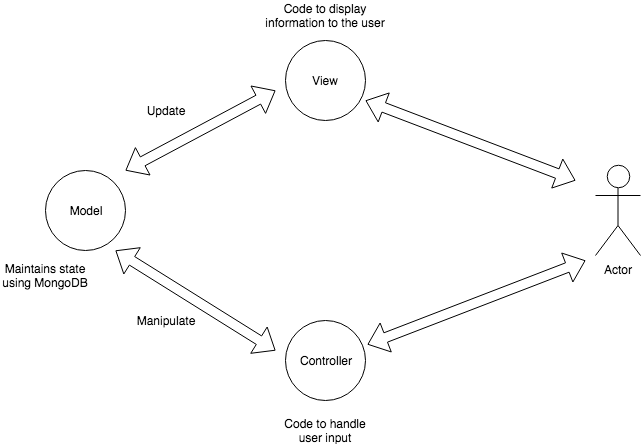
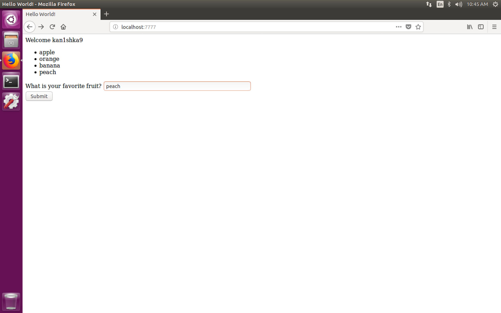
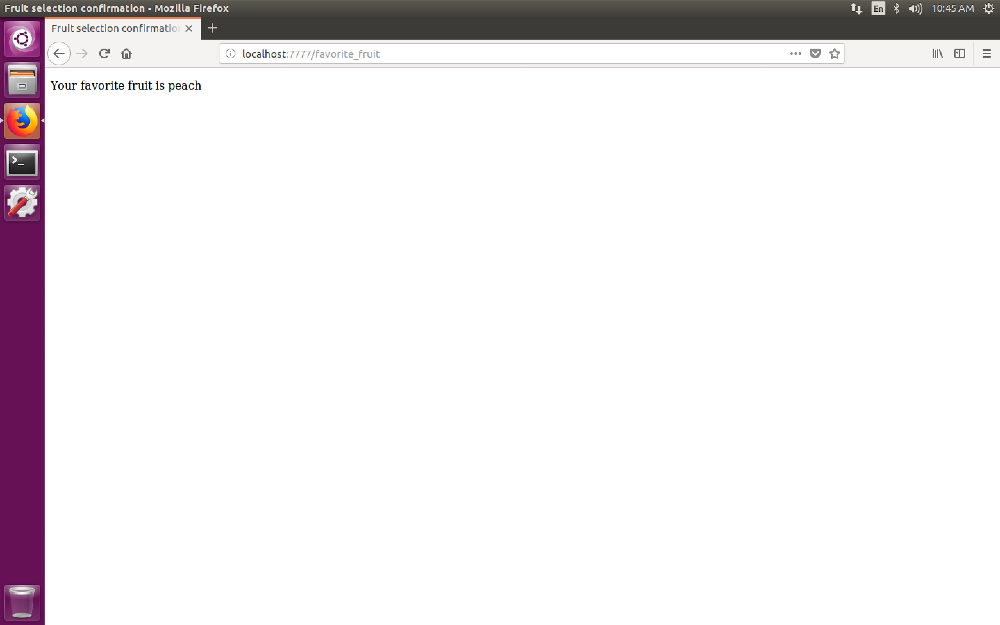
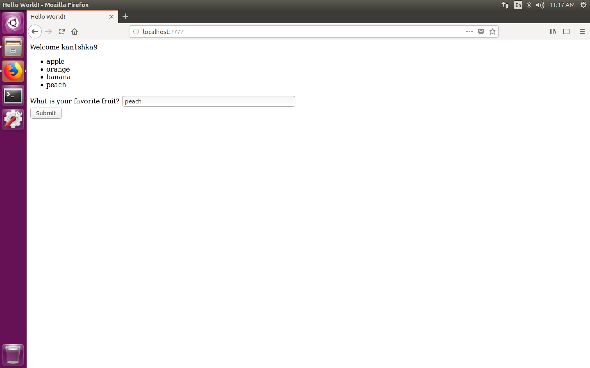
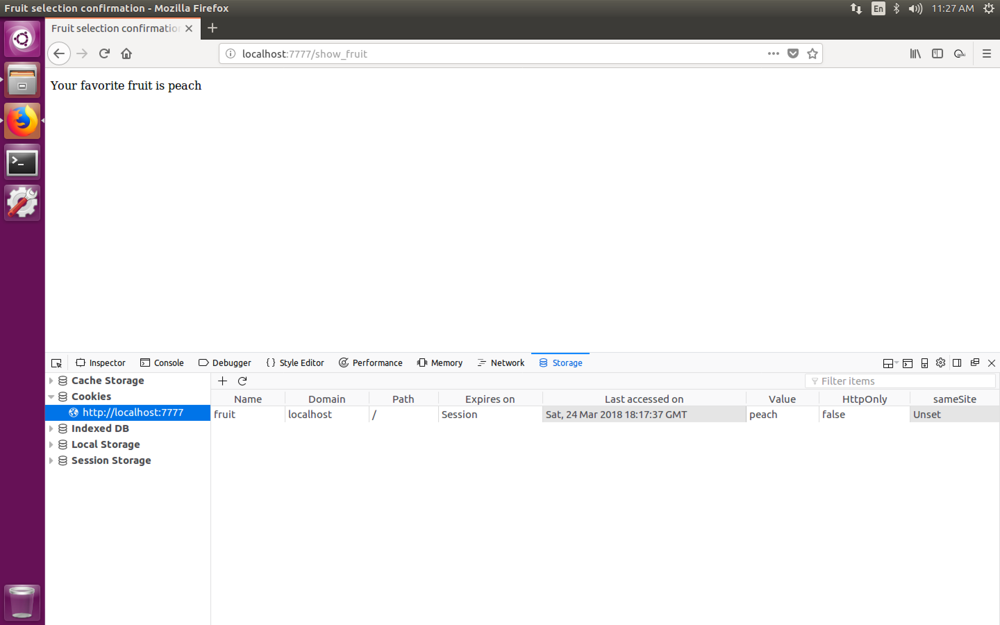

#### 4. Bottle Framework



```sh
u64@vm:~/Desktop/bottle-lab$ tree
.
├── fruit_form.py
├── hello_world.py
└── views
    ├── fruit_selection.tpl
    └── hello_world.tpl

1 directory, 4 files
u64@vm:~/Desktop/bottle-lab$
```

```sh
u64@vm:~/Desktop/bottle-lab$ python hello_world.py
Bottle v0.12.13 server starting up (using WSGIRefServer())...
Listening on http://localhost:7777/
Hit Ctrl-C to quit.

127.0.0.1 - - [24/Mar/2018 10:44:57] "GET / HTTP/1.1" 200 366
127.0.0.1 - - [24/Mar/2018 10:45:02] "POST /favorite_fruit HTTP/1.1" 200 142
```

```
http://localhost:7777/
```





```sh
u64@vm:~/Desktop/bottle-lab$ python fruit_form.py
Bottle v0.12.13 server starting up (using WSGIRefServer())...
Listening on http://localhost:7777/
Hit Ctrl-C to quit.

127.0.0.1 - - [24/Mar/2018 11:17:29] "GET / HTTP/1.1" 200 366
127.0.0.1 - - [24/Mar/2018 11:17:37] "POST /favorite_fruit HTTP/1.1" 303 0
127.0.0.1 - - [24/Mar/2018 11:17:37] "GET /show_fruit HTTP/1.1" 200 142
```



