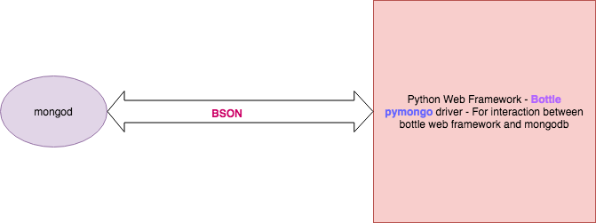
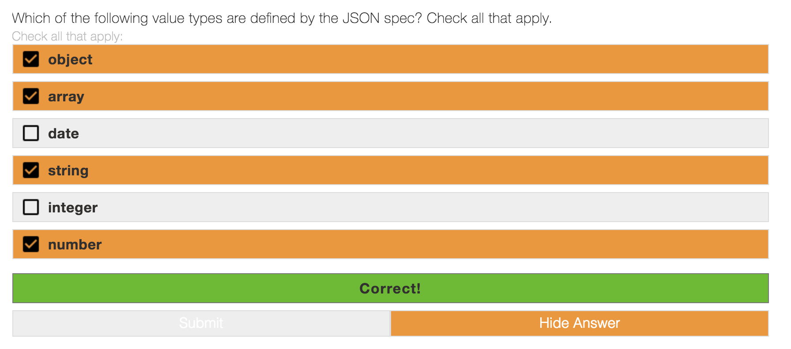
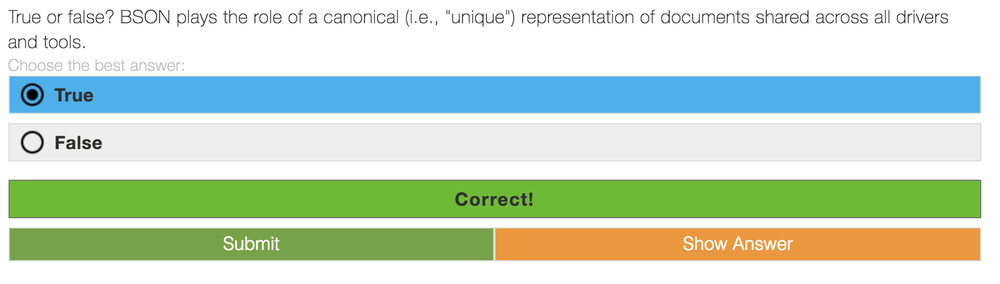
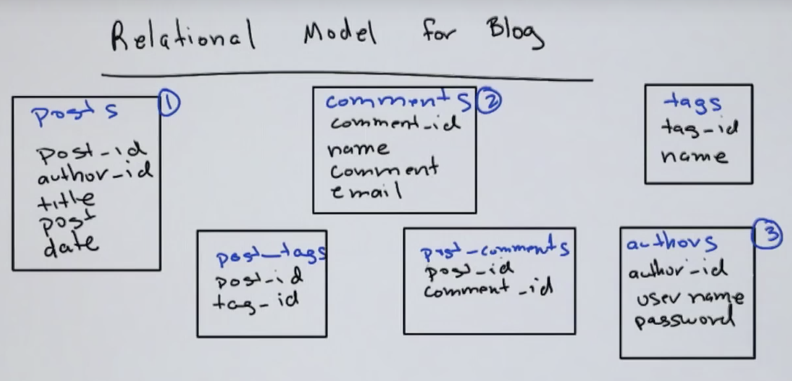
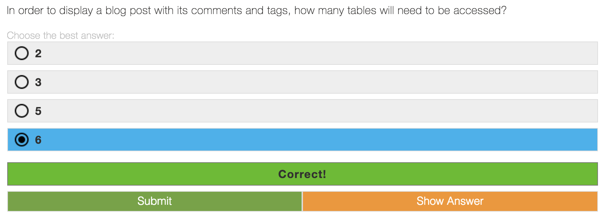
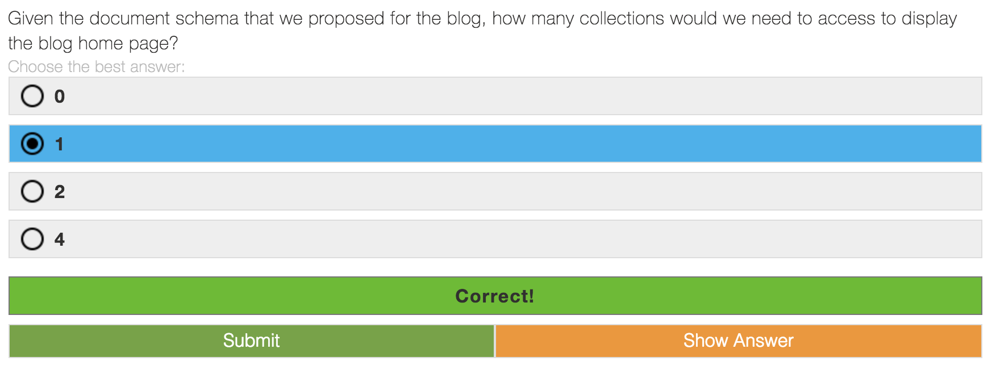

#### Random Notes

###### MongoDB

- DocumentDB
- Data model
- Scalable 
- High performance
- Agile 

###### Binaries

- `mongod`
- `mongo`

###### [`JSON`](https://www.json.org/) vs [`BSON`](http://bsonspec.org/)

- JavaScript Object Notation
- Binary JavaScript Object Notation
	- Lightweight
	- Traversable
	- Efficient
- [Is there a shell one-liner to convert JSON to BSON?](https://unix.stackexchange.com/questions/129404/is-there-a-shell-one-liner-to-convert-json-to-bson)
- [JSON ⇌ BSON](https://json-bson-converter.appspot.com/)

###### Application Architecture

###### Quiz

