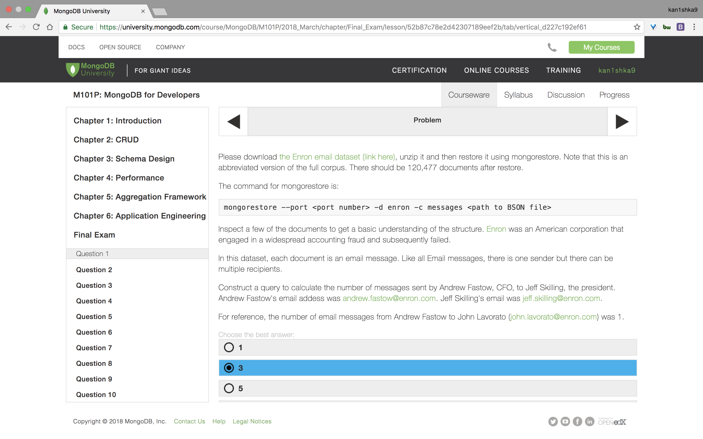
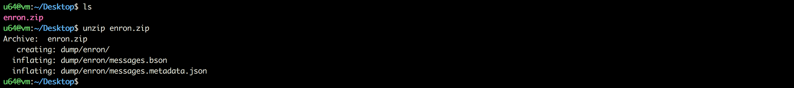
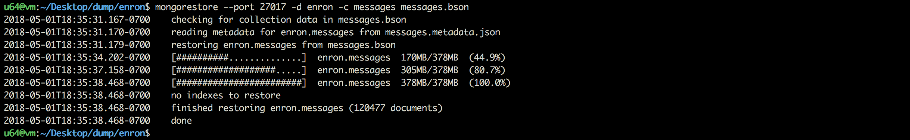
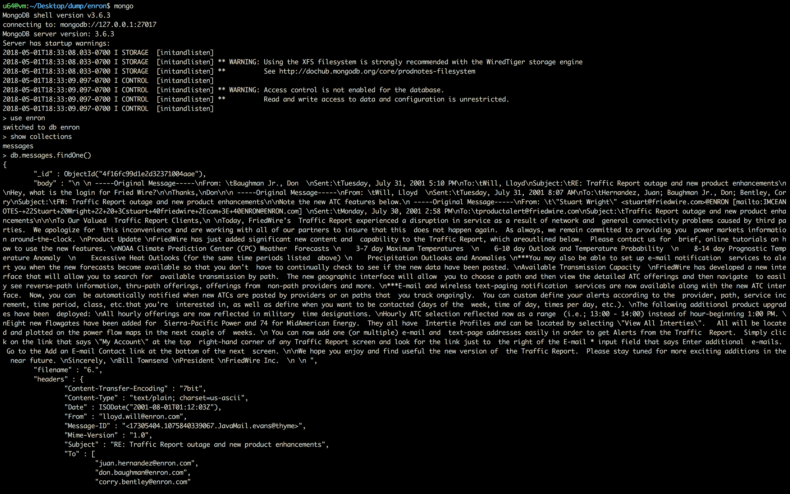
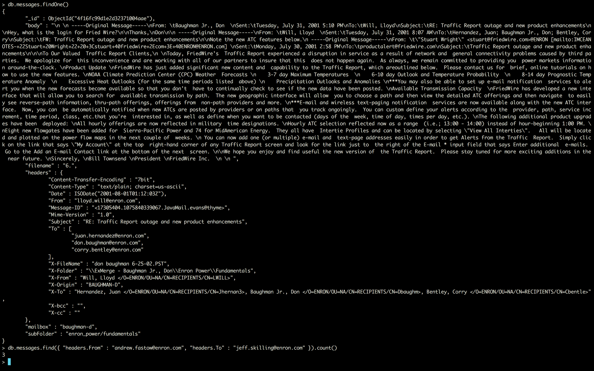

#### Question 1



```sh
u64@vm:~/Desktop$ sudo service mongod start
[sudo] password for u64:
u64@vm:~/Desktop$
```

```sh
u64@vm:~/Desktop$ ls
enron.zip
u64@vm:~/Desktop$ unzip enron.zip
Archive:  enron.zip
   creating: dump/enron/
  inflating: dump/enron/messages.bson
  inflating: dump/enron/messages.metadata.json
u64@vm:~/Desktop$
```

```sh
u64@vm:~/Desktop$ cd dump/enron/
u64@vm:~/Desktop/dump/enron$ ll
total 386968
drwxrwxr-x 2 u64 u64      4096 Dec 10  2012 ./
drwxrwxr-x 3 u64 u64      4096 May  1 18:31 ../
-rw-rw-r-- 1 u64 u64 396236668 Dec 10  2012 messages.bson
-rw-rw-r-- 1 u64 u64        88 Dec 10  2012 messages.metadata.json
u64@vm:~/Desktop/dump/enron$
```

```sh
u64@vm:~/Desktop/dump/enron$ mongorestore --port 27017 -d enron -c messages messages.bson
2018-05-01T18:35:31.167-0700	checking for collection data in messages.bson
2018-05-01T18:35:31.170-0700	reading metadata for enron.messages from messages.metadata.json
2018-05-01T18:35:31.179-0700	restoring enron.messages from messages.bson
2018-05-01T18:35:34.202-0700	[##########..............]  enron.messages  170MB/378MB  (44.9%)
2018-05-01T18:35:37.158-0700	[###################.....]  enron.messages  305MB/378MB  (80.7%)
2018-05-01T18:35:38.468-0700	[########################]  enron.messages  378MB/378MB  (100.0%)
2018-05-01T18:35:38.468-0700	no indexes to restore
2018-05-01T18:35:38.468-0700	finished restoring enron.messages (120477 documents)
2018-05-01T18:35:38.468-0700	done
u64@vm:~/Desktop/dump/enron$
```

```sh
u64@vm:~/Desktop/dump/enron$ mongo
MongoDB shell version v3.6.3
connecting to: mongodb://127.0.0.1:27017
MongoDB server version: 3.6.3
Server has startup warnings:
2018-05-01T18:33:08.033-0700 I STORAGE  [initandlisten]
2018-05-01T18:33:08.033-0700 I STORAGE  [initandlisten] ** WARNING: Using the XFS filesystem is strongly recommended with the WiredTiger storage engine
2018-05-01T18:33:08.033-0700 I STORAGE  [initandlisten] **          See http://dochub.mongodb.org/core/prodnotes-filesystem
2018-05-01T18:33:09.097-0700 I CONTROL  [initandlisten]
2018-05-01T18:33:09.097-0700 I CONTROL  [initandlisten] ** WARNING: Access control is not enabled for the database.
2018-05-01T18:33:09.097-0700 I CONTROL  [initandlisten] **          Read and write access to data and configuration is unrestricted.
2018-05-01T18:33:09.097-0700 I CONTROL  [initandlisten]
> use enron
switched to db enron
> show collections
messages
> db.messages.findOne()
{
	"_id" : ObjectId("4f16fc99d1e2d32371004aae"),
	"body" : "\n \n -----Original Message-----\nFrom: \tBaughman Jr., Don  \nSent:\tTuesday, July 31, 2001 5:10 PM\nTo:\tWill, Lloyd\nSubject:\tRE: Traffic Report outage and new product enhancements\n\nHey, what is the login for Fried Wire?\n\nThanks,\nDon\n\n -----Original Message-----\nFrom: \tWill, Lloyd  \nSent:\tTuesday, July 31, 2001 8:07 AM\nTo:\tHernandez, Juan; Baughman Jr., Don; Bentley, Corry\nSubject:\tFW: Traffic Report outage and new product enhancements\n\nNote the new ATC features below.\n -----Original Message-----\nFrom: \t\"Stuart Wright\" <stuart@friedwire.com>@ENRON [mailto:IMCEANOTES-+22Stuart+20Wright+22+20+3Cstuart+40friedwire+2Ecom+3E+40ENRON@ENRON.com] \nSent:\tMonday, July 30, 2001 2:58 PM\nTo:\tproductalert@friedwire.com\nSubject:\tTraffic Report outage and new product enhancements\n\n\nTo Our Valued  Traffic Report Clients,\n \nToday, FriedWire's  Traffic Report experienced a disruption in service as a result of network and  general connectivity problems caused by third parties.  We apologize for  this inconvenience and are working with all of our partners to insure that this  does not happen again.  As always, we remain committed to providing you  power markets information around-the-clock. \nProduct Update \nFriedWire has just added significant new content and  capability to the Traffic Report, which areoutlined below.  Please contact us for  brief, online tutorials on how to use the new features. \nNOAA Climate Prediction Center (CPC) Weather  Forecasts \n    3-7 day Maximum Temperatures  \n    6-10 day Outlook and Temperature Probability  \n    8-14 day Prognostic Temperature Anomaly  \n    Excessive Heat Outlooks (for the same time periods listed  above) \n    Precipitation Outlooks and Anomalies \n***You may also be able to set up e-mail notification  services to alert you when the new forecasts become available so that you don't  have to continually check to see if the new data have been posted. \nAvailable Transmission Capacity  \nFriedWire has developed a new interface that will allow you to search for  available transmission by path.  The new geographic interface will allow  you to choose a path and then view the detailed ATC offerings and then navigate  to easily see reverse-path information, thru-path offerings, offerings from  non-path providers and more. \n***E-mail and wireless text-paging notification  services are now available along with the new ATC interface.  Now, you can  be automatically notified when new ATCs are posted by providers or on paths that  you track ongoingly.  You can custom define your alerts according to the  provider, path, service increment, time period, class, etc.that you're  interested in, as well as define when you want to be contacted (days of the  week, time of day, times per day, etc.). \nThe following additional product upgrades have been  deployed: \nAll hourly offerings are now reflected in military  time designations. \nHourly ATC selection reflected now as a range  (i.e.; 13:00 - 14:00) instead of hour-beginning 1:00 PM. \nEight new flowgates have been added for  Sierra-Pacific Power and 74 for MidAmerican Energy.  They all have  Intertie Profiles and can be located by selecting \"View All Interties\".   All will be located and plotted on the power flow maps in the next couple of  weeks. \n You can now add one (or multiple) e-mail and  text-page addresses easily in order to get Alerts from the Traffic  Report.  Simply click on the link that says \"My Account\" at the top  right-hand corner of any Traffic Report screen and look for the link just to  the right of the E-mail * input field that says Enter additional  e-mails.  Go to the Add an E-mail Contact link at the bottom of the next  screen. \n\nWe hope you enjoy and find useful the new version of  the Traffic Report.  Please stay tuned for more exciting additions in the  near future. \nSincerely, \nBill Townsend \nPresident \nFriedWire Inc.  \n \n ",
	"filename" : "6.",
	"headers" : {
		"Content-Transfer-Encoding" : "7bit",
		"Content-Type" : "text/plain; charset=us-ascii",
		"Date" : ISODate("2001-08-01T01:12:03Z"),
		"From" : "lloyd.will@enron.com",
		"Message-ID" : "<17305404.1075840339067.JavaMail.evans@thyme>",
		"Mime-Version" : "1.0",
		"Subject" : "RE: Traffic Report outage and new product enhancements",
		"To" : [
			"juan.hernandez@enron.com",
			"don.baughman@enron.com",
			"corry.bentley@enron.com"
		],
		"X-FileName" : "don baughman 6-25-02.PST",
		"X-Folder" : "\\ExMerge - Baughman Jr., Don\\Enron Power\\Fundamentals",
		"X-From" : "Will, Lloyd </O=ENRON/OU=NA/CN=RECIPIENTS/CN=LWILL>",
		"X-Origin" : "BAUGHMAN-D",
		"X-To" : "Hernandez, Juan </O=ENRON/OU=NA/CN=RECIPIENTS/CN=Jhernan3>, Baughman Jr., Don </O=ENRON/OU=NA/CN=RECIPIENTS/CN=Dbaughm>, Bentley, Corry </O=ENRON/OU=NA/CN=RECIPIENTS/CN=Cbentle>",
		"X-bcc" : "",
		"X-cc" : ""
	},
	"mailbox" : "baughman-d",
	"subFolder" : "enron_power/fundamentals"
}
> db.messages.find({ "headers.From" : "andrew.fastow@enron.com", "headers.To" : "jeff.skilling@enron.com" }).count()
3
>
```







