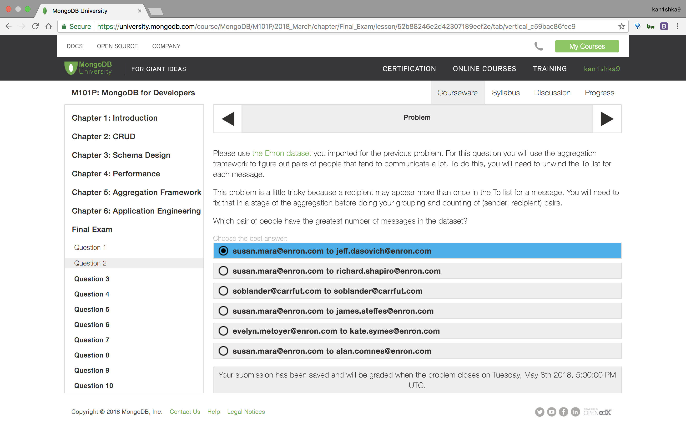
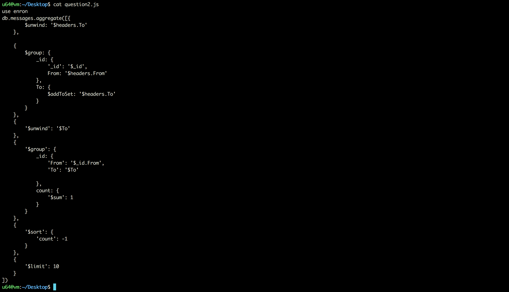
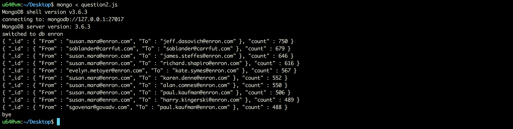

#### Question 2



`question2.js`

```js
use enron
db.messages.aggregate([{
        $unwind: '$headers.To'
    },

    {
        $group: {
            _id: {
                '_id': '$_id',
                From: '$headers.From'
            },
            To: {
                $addToSet: '$headers.To'
            }
        }
    },
    {
        '$unwind': '$To'
    },
    {
        '$group': {
            _id: {
                'From': '$_id.From',
                'To': '$To'

            },
            count: {
                '$sum': 1
            }
        }
    },
    {
        '$sort': {
            'count': -1
        }
    },
    {
        '$limit': 10
    }
])
```

```sh
u64@vm:~/Desktop$ mongo < question2.js
MongoDB shell version v3.6.3
connecting to: mongodb://127.0.0.1:27017
MongoDB server version: 3.6.3
switched to db enron
{ "_id" : { "From" : "susan.mara@enron.com", "To" : "jeff.dasovich@enron.com" }, "count" : 750 }
{ "_id" : { "From" : "soblander@carrfut.com", "To" : "soblander@carrfut.com" }, "count" : 679 }
{ "_id" : { "From" : "susan.mara@enron.com", "To" : "james.steffes@enron.com" }, "count" : 646 }
{ "_id" : { "From" : "susan.mara@enron.com", "To" : "richard.shapiro@enron.com" }, "count" : 616 }
{ "_id" : { "From" : "evelyn.metoyer@enron.com", "To" : "kate.symes@enron.com" }, "count" : 567 }
{ "_id" : { "From" : "susan.mara@enron.com", "To" : "karen.denne@enron.com" }, "count" : 552 }
{ "_id" : { "From" : "susan.mara@enron.com", "To" : "alan.comnes@enron.com" }, "count" : 550 }
{ "_id" : { "From" : "susan.mara@enron.com", "To" : "paul.kaufman@enron.com" }, "count" : 506 }
{ "_id" : { "From" : "susan.mara@enron.com", "To" : "harry.kingerski@enron.com" }, "count" : 489 }
{ "_id" : { "From" : "sgovenar@govadv.com", "To" : "paul.kaufman@enron.com" }, "count" : 488 }
bye
u64@vm:~/Desktop$
```



