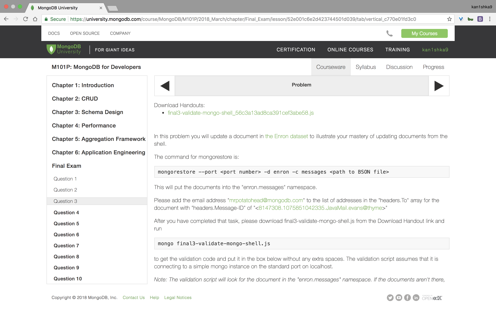
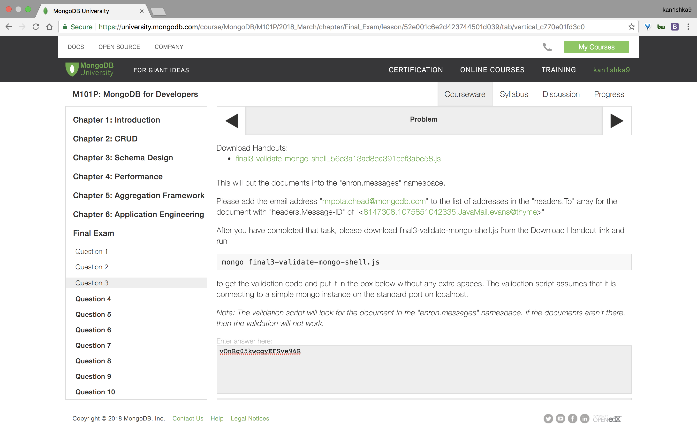
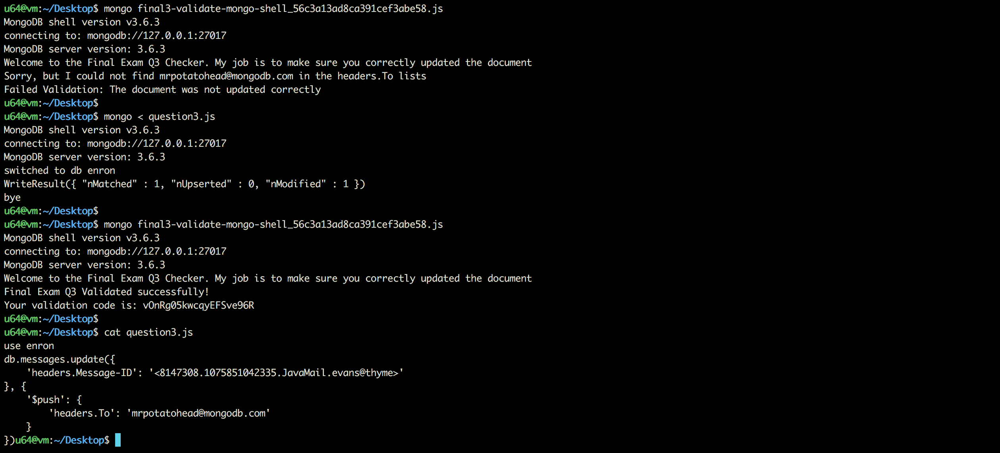

#### Question 3





```sh
u64@vm:~/Desktop$ mongo final3-validate-mongo-shell_56c3a13ad8ca391cef3abe58.js
MongoDB shell version v3.6.3
connecting to: mongodb://127.0.0.1:27017
MongoDB server version: 3.6.3
Welcome to the Final Exam Q3 Checker. My job is to make sure you correctly updated the document
Sorry, but I could not find mrpotatohead@mongodb.com in the headers.To lists
Failed Validation: The document was not updated correctly
u64@vm:~/Desktop$
```

`question3.js`

```js
use enron
db.messages.update({
    'headers.Message-ID': '<8147308.1075851042335.JavaMail.evans@thyme>'
}, {
    '$push': {
        'headers.To': 'mrpotatohead@mongodb.com'
    }
})
```

```sh
u64@vm:~/Desktop$ mongo < question3.js
MongoDB shell version v3.6.3
connecting to: mongodb://127.0.0.1:27017
MongoDB server version: 3.6.3
switched to db enron
WriteResult({ "nMatched" : 1, "nUpserted" : 0, "nModified" : 1 })
bye
u64@vm:~/Desktop$
```

```sh
u64@vm:~/Desktop$ mongo final3-validate-mongo-shell_56c3a13ad8ca391cef3abe58.js
MongoDB shell version v3.6.3
connecting to: mongodb://127.0.0.1:27017
MongoDB server version: 3.6.3
Welcome to the Final Exam Q3 Checker. My job is to make sure you correctly updated the document
Final Exam Q3 Validated successfully!
Your validation code is: vOnRg05kwcqyEFSve96R
u64@vm:~/Desktop$
```

