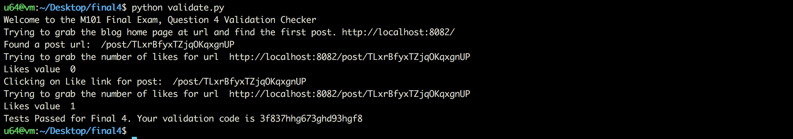

#### Question 4


```sh
u64@vm:~/Desktop/final4$ ll
total 68
drwxrwxr-x 3 u64 u64  4096 May  1 19:37 ./
drwxr-xr-x 4 u64 u64  4096 May  1 19:26 ../
-rw-r--r-- 1 u64 u64  5728 May  1 19:39 blogPostDAO.py
-rw-r--r-- 1 u64 u64  3976 May  1 19:37 blogPostDAO.pyc
-rw-rw-r-- 1 u64 u64 11944 Jan 23 17:00 blog.py
-rw-rw-r-- 1 u64 u64  2307 Jan 23 17:00 sessionDAO.py
-rw-rw-r-- 1 u64 u64  1993 May  1 19:27 sessionDAO.pyc
-rw-rw-r-- 1 u64 u64  2564 Jan 23 17:00 userDAO.py
-rw-rw-r-- 1 u64 u64  2192 May  1 19:27 userDAO.pyc
-rw-rw-r-- 1 u64 u64 13816 Jan 23 17:00 validate.py
drwxrwxr-x 2 u64 u64  4096 May  1 19:26 views/
u64@vm:~/Desktop/final4$
u64@vm:~/Desktop/final4$ python blog.py
Bottle v0.12.13 server starting up (using WSGIRefServer())...
Listening on http://localhost:8082/
Hit Ctrl-C to quit.
```


```sh
u64@vm:~/Desktop/final4$ python validate.py
Welcome to the M101 Final Exam, Question 4 Validation Checker
Trying to grab the blog home page at url and find the first post. http://localhost:8082/
Found a post url:  /post/TLxrBfyxTZjqOKqxgnUP
Trying to grab the number of likes for url  http://localhost:8082/post/TLxrBfyxTZjqOKqxgnUP
Likes value  0
Clicking on Like link for post:  /post/TLxrBfyxTZjqOKqxgnUP
Trying to grab the number of likes for url  http://localhost:8082/post/TLxrBfyxTZjqOKqxgnUP
Likes value  0
I was not able to increment the likes on a comment
old likes value was  0
likes value after I clicked was  0
Sorry, you have not solved it yet.
u64@vm:~/Desktop/final4$
```


```python
# increments the number of likes on a particular comment. Returns the number of documented updated
def increment_likes(self, permalink, comment_ordinal):

	 #
	 # XXX Final exam 
	 # Work here. You need to update the num_likes value in the comment being liked
	 # 
	 try:
		last_error = self.posts.update({'permalink': permalink}, {'$inc': {"comments."+str(comment_ordinal)+".num_likes": 1}}, upsert=False)
		return last_error['n']

	 except:
		print "Could not increment the number of likes"
		print "Unexpected error:", sys.exc_info()[0]
        
		return 0
```


```sh
u64@vm:~/Desktop/final4$ python validate.py
Welcome to the M101 Final Exam, Question 4 Validation Checker
Trying to grab the blog home page at url and find the first post. http://localhost:8082/
Found a post url:  /post/TLxrBfyxTZjqOKqxgnUP
Trying to grab the number of likes for url  http://localhost:8082/post/TLxrBfyxTZjqOKqxgnUP
Likes value  0
Clicking on Like link for post:  /post/TLxrBfyxTZjqOKqxgnUP
Trying to grab the number of likes for url  http://localhost:8082/post/TLxrBfyxTZjqOKqxgnUP
Likes value  1
Tests Passed for Final 4. Your validation code is 3f837hhg673ghd93hgf8
u64@vm:~/Desktop/final4$
```

