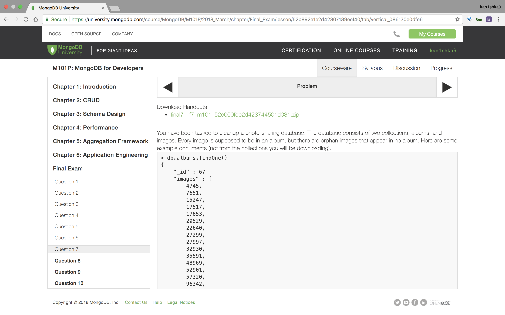
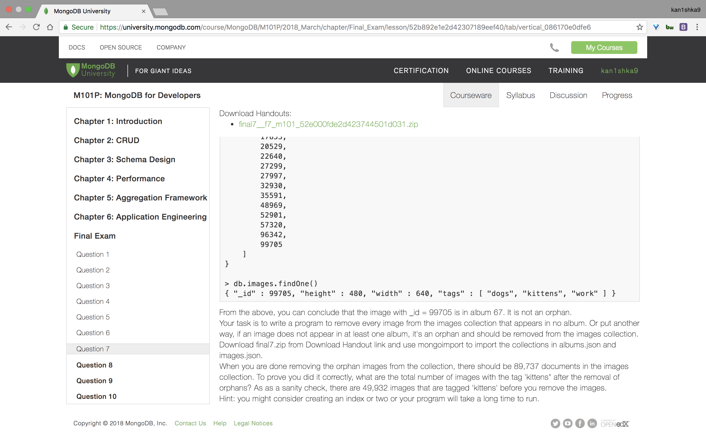
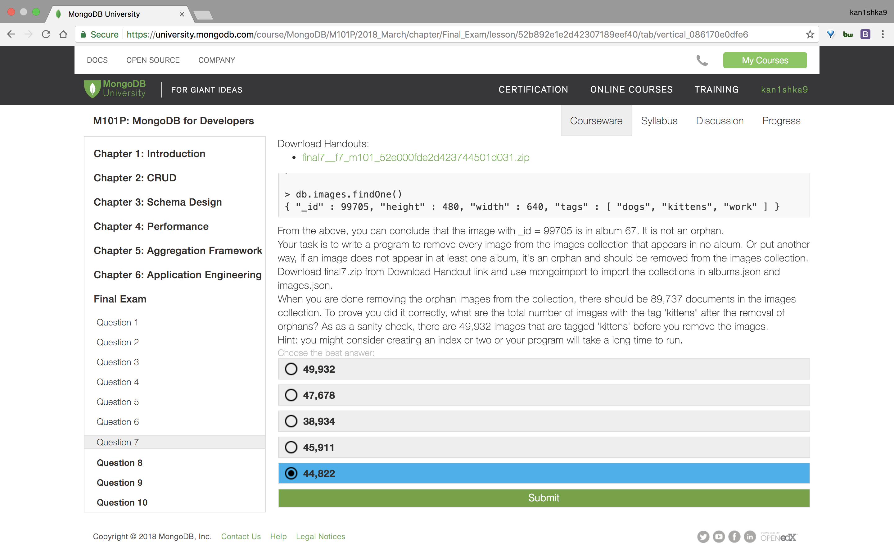
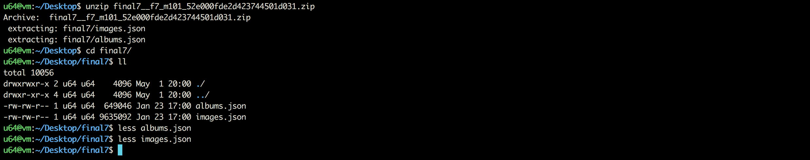
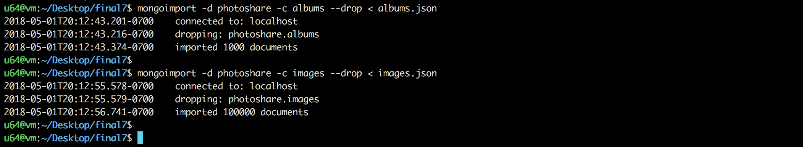
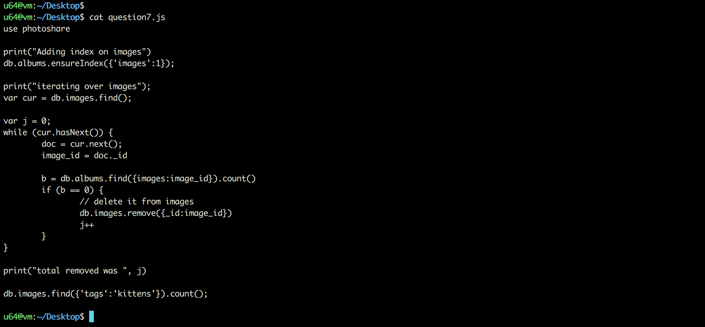

#### Question 7







```sh
u64@vm:~/Desktop$ unzip final7__f7_m101_52e000fde2d423744501d031.zip
Archive:  final7__f7_m101_52e000fde2d423744501d031.zip
 extracting: final7/images.json
 extracting: final7/albums.json
u64@vm:~/Desktop$ cd final7/
u64@vm:~/Desktop/final7$ ll
total 10056
drwxrwxr-x 2 u64 u64    4096 May  1 20:00 ./
drwxr-xr-x 4 u64 u64    4096 May  1 20:00 ../
-rw-rw-r-- 1 u64 u64  649046 Jan 23 17:00 albums.json
-rw-rw-r-- 1 u64 u64 9635092 Jan 23 17:00 images.json
u64@vm:~/Desktop/final7$
```

```sh
u64@vm:~/Desktop/final7$ mongoimport -d photoshare -c albums --drop < albums.json
2018-05-01T20:12:43.201-0700	connected to: localhost
2018-05-01T20:12:43.216-0700	dropping: photoshare.albums
2018-05-01T20:12:43.374-0700	imported 1000 documents
u64@vm:~/Desktop/final7$
```

```sh
u64@vm:~/Desktop/final7$ mongoimport -d photoshare -c images --drop < images.json
2018-05-01T20:12:55.578-0700	connected to: localhost
2018-05-01T20:12:55.579-0700	dropping: photoshare.images
2018-05-01T20:12:56.741-0700	imported 100000 documents
u64@vm:~/Desktop/final7$
```

`question7.js`

```js
use photoshare

print("Adding index on images")
db.albums.ensureIndex({'images':1});

print("iterating over images");
var cur = db.images.find();

var j = 0;
while (cur.hasNext()) {
	doc = cur.next();
	image_id = doc._id

	b = db.albums.find({images:image_id}).count()
	if (b == 0) {
		// delete it from images
		db.images.remove({_id:image_id})
		j++
	}
}

print("total removed was ", j)

db.images.find({'tags':'kittens'}).count();
```

```sh
u64@vm:~/Desktop$ mongo < question7.js
MongoDB shell version v3.6.3
connecting to: mongodb://127.0.0.1:27017
MongoDB server version: 3.6.3
switched to db photoshare
Adding index on images
{
	"createdCollectionAutomatically" : false,
	"numIndexesBefore" : 1,
	"numIndexesAfter" : 2,
	"ok" : 1
}
iterating over images
1
total removed was  10263
44822
bye
u64@vm:~/Desktop$
```







