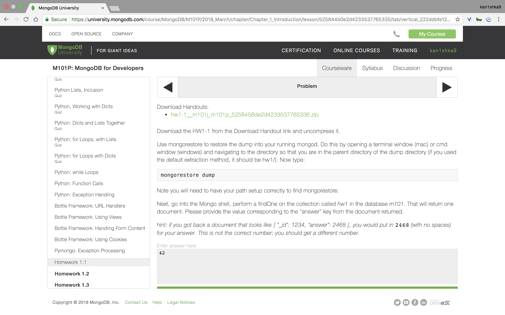
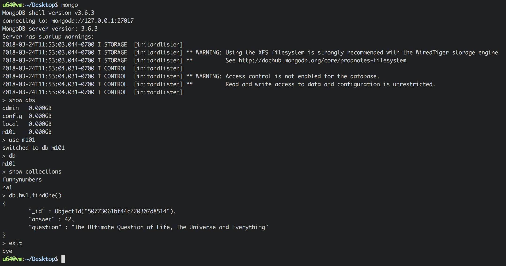

#### Homework 1.1



```sh
u64@vm:~$ sudo service mongod start
[sudo] password for u64:
u64@vm:~$
```

```sh
u64@vm:~/Desktop$ mongorestore dump/
2018-03-24T11:53:06.974-0700	preparing collections to restore from
2018-03-24T11:53:06.976-0700	don't know what to do with file "dump/.DS_Store", skipping...
2018-03-24T11:53:06.977-0700	reading metadata for m101.funnynumbers from dump/m101/funnynumbers.metadata.json
2018-03-24T11:53:06.979-0700	reading metadata for m101.hw1 from dump/m101/hw1.metadata.json
2018-03-24T11:53:06.986-0700	restoring m101.funnynumbers from dump/m101/funnynumbers.bson
2018-03-24T11:53:06.993-0700	restoring m101.hw1 from dump/m101/hw1.bson
2018-03-24T11:53:06.997-0700	no indexes to restore
2018-03-24T11:53:06.998-0700	finished restoring m101.funnynumbers (100 documents)
2018-03-24T11:53:06.999-0700	no indexes to restore
2018-03-24T11:53:06.999-0700	finished restoring m101.hw1 (1 document)
2018-03-24T11:53:07.003-0700	done
u64@vm:~/Desktop$
```

```sh
u64@vm:~/Desktop$ mongo
MongoDB shell version v3.6.3
connecting to: mongodb://127.0.0.1:27017
MongoDB server version: 3.6.3
Server has startup warnings:
2018-03-24T11:53:03.044-0700 I STORAGE  [initandlisten]
2018-03-24T11:53:03.044-0700 I STORAGE  [initandlisten] ** WARNING: Using the XFS filesystem is strongly recommended with the WiredTiger storage engine
2018-03-24T11:53:03.044-0700 I STORAGE  [initandlisten] **          See http://dochub.mongodb.org/core/prodnotes-filesystem
2018-03-24T11:53:04.031-0700 I CONTROL  [initandlisten]
2018-03-24T11:53:04.031-0700 I CONTROL  [initandlisten] ** WARNING: Access control is not enabled for the database.
2018-03-24T11:53:04.031-0700 I CONTROL  [initandlisten] **          Read and write access to data and configuration is unrestricted.
2018-03-24T11:53:04.031-0700 I CONTROL  [initandlisten]
> show dbs
admin   0.000GB
config  0.000GB
local   0.000GB
m101    0.000GB
> use m101
switched to db m101
> db
m101
> show collections
funnynumbers
hw1
> db.hw1.findOne()
{
	"_id" : ObjectId("50773061bf44c220307d8514"),
	"answer" : 42,
	"question" : "The Ultimate Question of Life, The Universe and Everything"
}
> exit
bye
u64@vm:~/Desktop$
```

