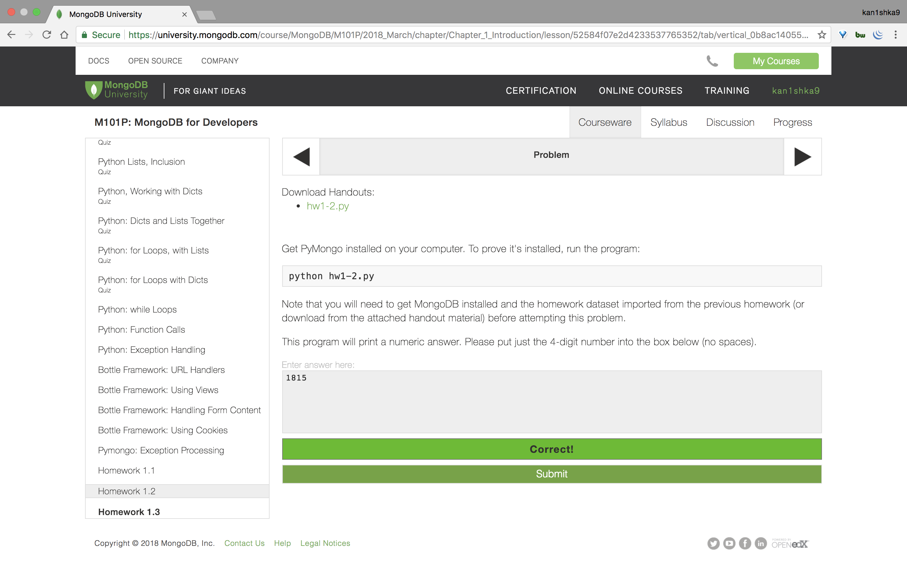
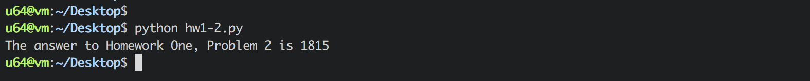

#### Homework 1.2



```sh
u64@vm:~$ sudo service mongod start
[sudo] password for u64:
u64@vm:~$
```

`hw1-2.py`

```python
#!/usr/bin/env python

import pymongo


# Copyright 2012-2016, 10gen, Inc.
# Author: Andrew Erlichson


# connect to the db on standard port
connection = pymongo.MongoClient("mongodb://localhost")


db = connection.m101                 # attach to db
collection = db.funnynumbers         # specify the collection


magic = 0

try:
    iter = collection.find()
    for item in iter:
        if ((item['value'] % 3) == 0):
            magic = magic + item['value']

except Exception as e:
    print "Error trying to read collection:", type(e), e


print "The answer to Homework One, Problem 2 is " + str(int(magic))
```

```sh
u64@vm:~/Desktop$ python hw1-2.py
The answer to Homework One, Problem 2 is 1815
u64@vm:~/Desktop$
```

