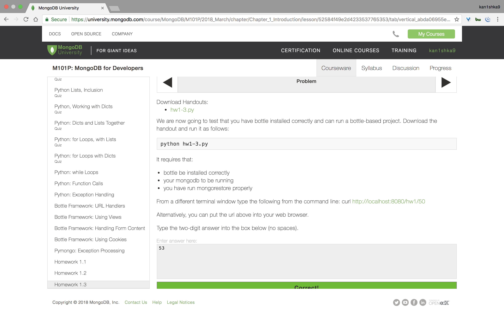
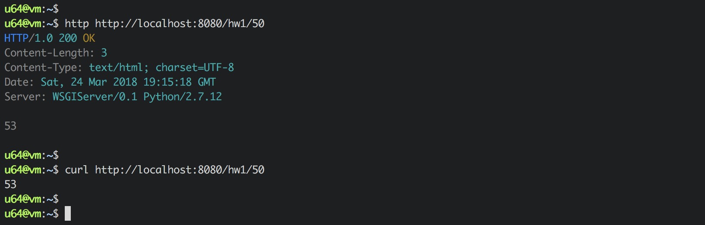
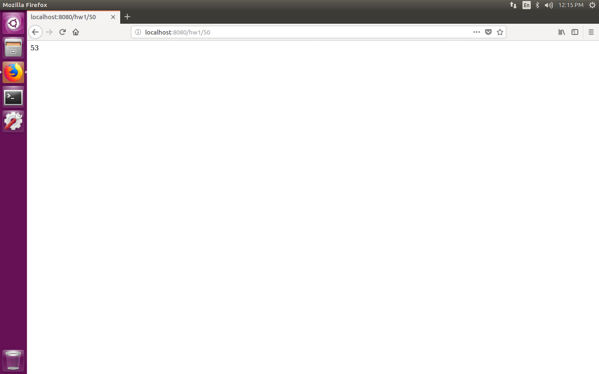

#### Homework 1.3



```sh
u64@vm:~$ sudo service mongod start
[sudo] password for u64:
u64@vm:~$
```

`hw1-3.py`

```python
#!/usr/bin/env python

import pymongo
import bottle
import sys


# Copyright 2014, MongoDB, Inc.
# Author: Andrew Erlichson


@bottle.get("/hw1/<n>")
def get_hw1(n):

    # connect to the db on standard port
    connection = pymongo.MongoClient("mongodb://localhost")

    n = int(n)

    db = connection.m101                 # attach to db
    collection = db.funnynumbers         # specify the collection


    magic = 0

    try:
        iter = collection.find({},limit=1, skip=n).sort('value', direction=1)
        for item in iter:
            return str(int(item['value'])) + "\n"
    except Exception as e:
        print "Error trying to read collection:", type(e), e


bottle.debug(True)
bottle.run(host='localhost', port=8080)
```

```sh
u64@vm:~$ http http://localhost:8080/hw1/50
HTTP/1.0 200 OK
Content-Length: 3
Content-Type: text/html; charset=UTF-8
Date: Sat, 24 Mar 2018 19:15:18 GMT
Server: WSGIServer/0.1 Python/2.7.12

53

u64@vm:~$
```

```sh
u64@vm:~$ curl http://localhost:8080/hw1/50
53
u64@vm:~$
```



```
http://localhost:8080/hw1/50
```

