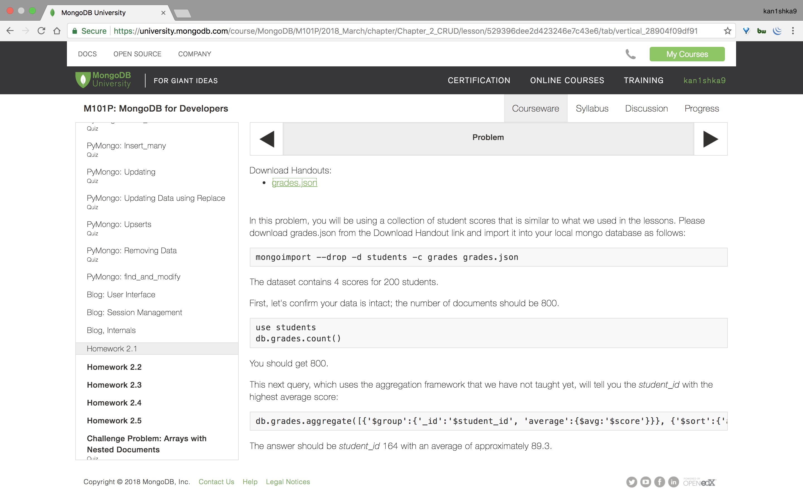

#### Homework 2.1




```sh
u64@vm:~/Desktop$ ls
grades.json
u64@vm:~/Desktop$
```

```sh
u64@vm:~/Desktop$ mongoimport --drop -d students -c grades grades.json
2018-03-30T23:06:34.295-0700	connected to: localhost
2018-03-30T23:06:34.304-0700	dropping: students.grades
2018-03-30T23:06:34.365-0700	imported 800 documents
u64@vm:~/Desktop$
```

```sh
u64@vm:~/Desktop$ mongo
MongoDB shell version v3.6.3
connecting to: mongodb://127.0.0.1:27017
MongoDB server version: 3.6.3
Server has startup warnings:
2018-03-30T09:49:35.659-0700 I STORAGE  [initandlisten]
2018-03-30T09:49:35.659-0700 I STORAGE  [initandlisten] ** WARNING: Using the XFS filesystem is strongly recommended with the WiredTiger storage engine
2018-03-30T09:49:35.659-0700 I STORAGE  [initandlisten] **          See http://dochub.mongodb.org/core/prodnotes-filesystem
2018-03-30T09:49:36.582-0700 I CONTROL  [initandlisten]
2018-03-30T09:49:36.582-0700 I CONTROL  [initandlisten] ** WARNING: Access control is not enabled for the database.
2018-03-30T09:49:36.582-0700 I CONTROL  [initandlisten] **          Read and write access to data and configuration is unrestricted.
2018-03-30T09:49:36.583-0700 I CONTROL  [initandlisten]
> show dbs
admin     0.000GB
config    0.000GB
reddit    0.000GB
school    0.000GB
students  0.000GB
test      0.000GB
> use students
switched to db students
> db.grades.count()
800
> db.grades.aggregate([{'$group':{'_id':'$student_id', 'average':{$avg:'$score'}}}, {'$sort':{'average':-1}}, {'$limit':1}])
{ "_id" : 164, "average" : 89.29771818263373 }
>
bye
u64@vm:~/Desktop$
```

```sh
u64@vm:~/Desktop$ mongo
MongoDB shell version v3.6.3
connecting to: mongodb://127.0.0.1:27017
MongoDB server version: 3.6.3
Server has startup warnings:
2018-03-30T09:49:35.659-0700 I STORAGE  [initandlisten]
2018-03-30T09:49:35.659-0700 I STORAGE  [initandlisten] ** WARNING: Using the XFS filesystem is strongly recommended with the WiredTiger storage engine
2018-03-30T09:49:35.659-0700 I STORAGE  [initandlisten] **          See http://dochub.mongodb.org/core/prodnotes-filesystem
2018-03-30T09:49:36.582-0700 I CONTROL  [initandlisten]
2018-03-30T09:49:36.582-0700 I CONTROL  [initandlisten] ** WARNING: Access control is not enabled for the database.
2018-03-30T09:49:36.582-0700 I CONTROL  [initandlisten] **          Read and write access to data and configuration is unrestricted.
2018-03-30T09:49:36.583-0700 I CONTROL  [initandlisten]
> show dbs
admin     0.000GB
config    0.000GB
reddit    0.000GB
school    0.000GB
students  0.000GB
test      0.000GB
> use students
switched to db students
> show collections
grades
> db.grades.findOne()
{
	"_id" : ObjectId("50906d7fa3c412bb040eb577"),
	"student_id" : 0,
	"type" : "exam",
	"score" : 54.6535436362647
}
> db.grades.find({ type: "exam", score: {"$gte": 65} }).sort( { score: 1} )
{ "_id" : ObjectId("50906d7fa3c412bb040eb5cf"), "student_id" : 22, "type" : "exam", "score" : 65.02518811936324 }
{ "_id" : ObjectId("50906d7fa3c412bb040eb743"), "student_id" : 115, "type" : "exam", "score" : 65.47329199925679 }
{ "_id" : ObjectId("50906d7fa3c412bb040eb637"), "student_id" : 48, "type" : "exam", "score" : 65.71867938396781 }
{ "_id" : ObjectId("50906d7fa3c412bb040eb65b"), "student_id" : 57, "type" : "exam", "score" : 65.91867871499709 }
{ "_id" : ObjectId("50906d7fa3c412bb040eb6d3"), "student_id" : 87, "type" : "exam", "score" : 66.0470217410135 }
{ "_id" : ObjectId("50906d7fa3c412bb040eb87f"), "student_id" : 194, "type" : "exam", "score" : 67.09136149008972 }
{ "_id" : ObjectId("50906d7fa3c412bb040eb747"), "student_id" : 116, "type" : "exam", "score" : 67.09938431313856 }
{ "_id" : ObjectId("50906d7fa3c412bb040eb733"), "student_id" : 111, "type" : "exam", "score" : 67.16752597563053 }
{ "_id" : ObjectId("50906d7fa3c412bb040eb893"), "student_id" : 199, "type" : "exam", "score" : 67.33828604577803 }
{ "_id" : ObjectId("50906d7fa3c412bb040eb6f7"), "student_id" : 96, "type" : "exam", "score" : 67.39154510277987 }
{ "_id" : ObjectId("50906d7fa3c412bb040eb803"), "student_id" : 163, "type" : "exam", "score" : 67.51445811302555 }
{ "_id" : ObjectId("50906d7fa3c412bb040eb683"), "student_id" : 67, "type" : "exam", "score" : 67.64289324359295 }
{ "_id" : ObjectId("50906d7fa3c412bb040eb80f"), "student_id" : 166, "type" : "exam", "score" : 68.42859593432789 }
{ "_id" : ObjectId("50906d7fa3c412bb040eb757"), "student_id" : 120, "type" : "exam", "score" : 68.695274154639 }
{ "_id" : ObjectId("50906d7fa3c412bb040eb677"), "student_id" : 64, "type" : "exam", "score" : 71.07663195175958 }
{ "_id" : ObjectId("50906d7fa3c412bb040eb86b"), "student_id" : 189, "type" : "exam", "score" : 71.2461033044598 }
{ "_id" : ObjectId("50906d7fa3c412bb040eb717"), "student_id" : 104, "type" : "exam", "score" : 72.42031903025907 }
{ "_id" : ObjectId("50906d7fa3c412bb040eb86f"), "student_id" : 190, "type" : "exam", "score" : 72.80738441829857 }
{ "_id" : ObjectId("50906d7fa3c412bb040eb847"), "student_id" : 180, "type" : "exam", "score" : 72.82141551673207 }
{ "_id" : ObjectId("50906d7fa3c412bb040eb857"), "student_id" : 184, "type" : "exam", "score" : 74.07556531186303 }
Type "it" for more
>
```

