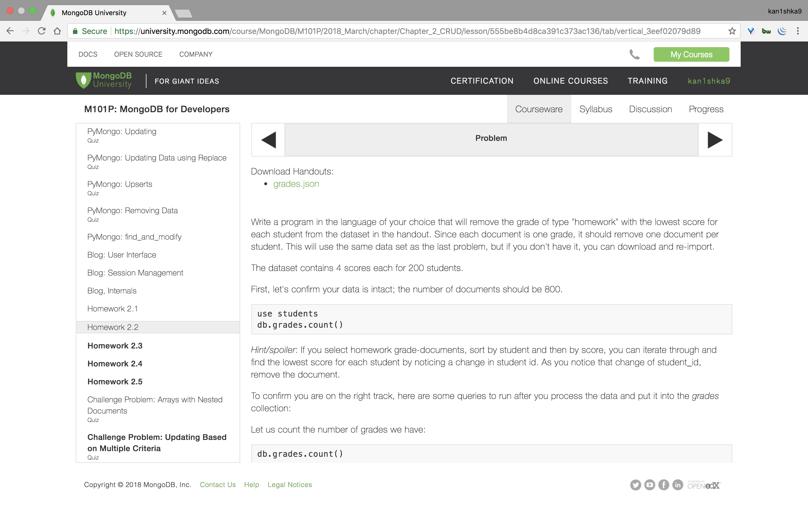
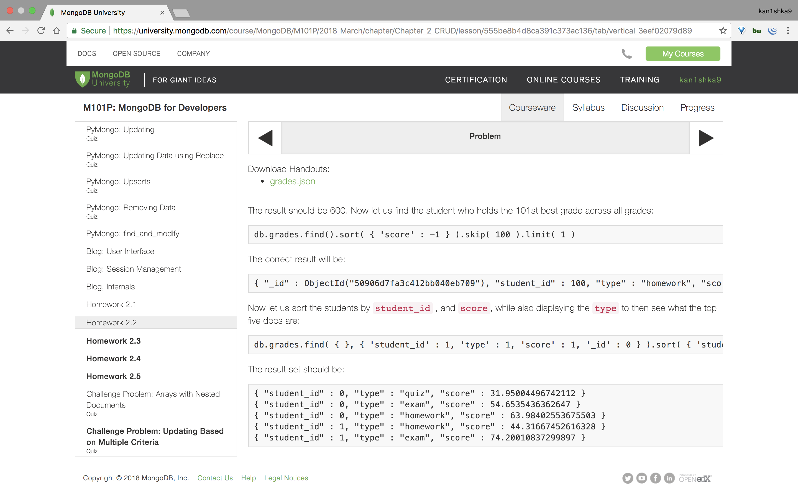
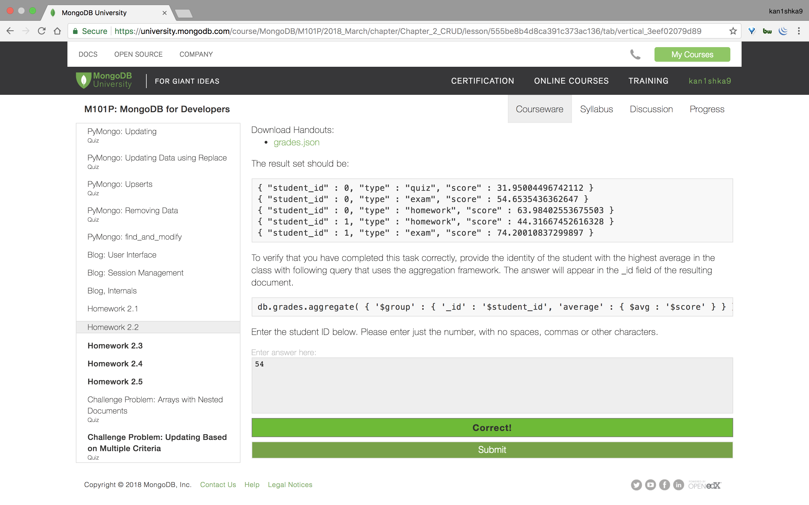
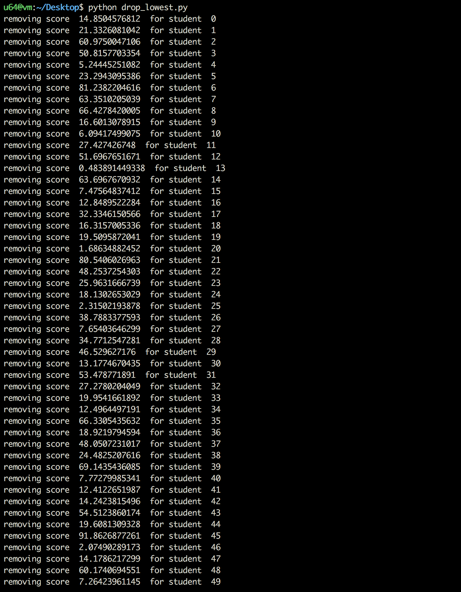
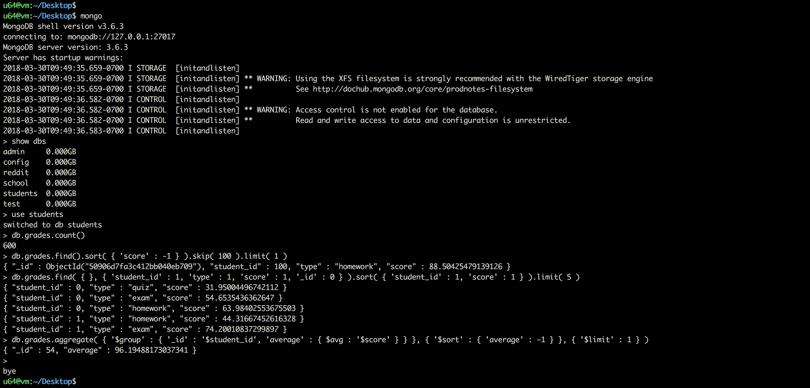

#### Homework 2.2







```sh
u64@vm:~/Desktop$ mongo
MongoDB shell version v3.6.3
connecting to: mongodb://127.0.0.1:27017
MongoDB server version: 3.6.3
Server has startup warnings:
2018-03-30T09:49:35.659-0700 I STORAGE  [initandlisten]
2018-03-30T09:49:35.659-0700 I STORAGE  [initandlisten] ** WARNING: Using the XFS filesystem is strongly recommended with the WiredTiger storage engine
2018-03-30T09:49:35.659-0700 I STORAGE  [initandlisten] **          See http://dochub.mongodb.org/core/prodnotes-filesystem
2018-03-30T09:49:36.582-0700 I CONTROL  [initandlisten]
2018-03-30T09:49:36.582-0700 I CONTROL  [initandlisten] ** WARNING: Access control is not enabled for the database.
2018-03-30T09:49:36.582-0700 I CONTROL  [initandlisten] **          Read and write access to data and configuration is unrestricted.
2018-03-30T09:49:36.583-0700 I CONTROL  [initandlisten]
> use students
switched to db students
> db.grades.count()
800
>
bye
u64@vm:~/Desktop$
```

###### `drop_lowest.py`

```python
import pymongo
import sys

connection = pymongo.MongoClient("mongodb://localhost")
db = connection.students
grades = db.grades

# find lowest scores

def remove_score(_id):
	try:
		doc = grades.find_one({'_id': _id})
		print "removing score ", doc['score'], " for student ", doc['student_id']
		grades.remove({"_id":_id})

	except:
		print "Unexpected error", sys.exc_info()[0]
		raise

def remove_lowest():

	cursor = grades.find({'type':'homework'}).sort([('student_id', pymongo.ASCENDING), ('score', pymongo.ASCENDING)])

	student_id = -1;
	for entry in cursor:
		if (entry['student_id'] != student_id):
			remove_score(entry['_id'])
		student_id = entry['student_id']

remove_lowest()
```



```sh
u64@vm:~/Desktop$ python drop_lowest.py
removing score  14.8504576812  for student  0
removing score  21.3326081042  for student  1
removing score  60.9750047106  for student  2
removing score  50.8157703354  for student  3
removing score  5.24445251082  for student  4
removing score  23.2943095386  for student  5
removing score  81.2382204616  for student  6
removing score  63.3510205039  for student  7
removing score  66.4278420005  for student  8
removing score  16.6013078915  for student  9
removing score  6.09417499075  for student  10
removing score  27.427426748  for student  11
removing score  51.6967651671  for student  12
removing score  0.483891449338  for student  13
removing score  63.6967670932  for student  14
removing score  7.47564837412  for student  15
removing score  12.8489522284  for student  16
removing score  32.3346150566  for student  17
removing score  16.3157005336  for student  18
removing score  19.5095872041  for student  19
removing score  1.68634882452  for student  20
removing score  80.5406026963  for student  21
removing score  48.2537254303  for student  22
removing score  25.9631666739  for student  23
removing score  18.1302653029  for student  24
removing score  2.31502193878  for student  25
removing score  38.7883377593  for student  26
removing score  7.65403646299  for student  27
removing score  34.7712547281  for student  28
removing score  46.529627176  for student  29
removing score  13.1774670435  for student  30
removing score  53.478771891  for student  31
removing score  27.2780204049  for student  32
removing score  19.9541661892  for student  33
removing score  12.4964497191  for student  34
removing score  66.3305435632  for student  35
removing score  18.9219794594  for student  36
removing score  48.0507231017  for student  37
removing score  24.4825207616  for student  38
removing score  69.1435436085  for student  39
removing score  7.77279985341  for student  40
removing score  12.4122651987  for student  41
removing score  14.2423815496  for student  42
removing score  54.5123860174  for student  43
removing score  19.6081309328  for student  44
removing score  91.8626877261  for student  45
removing score  2.07490289173  for student  46
removing score  14.1786217299  for student  47
removing score  60.1740694551  for student  48
removing score  7.26423961145  for student  49
removing score  0.117010102377  for student  50
removing score  6.30067744425  for student  51
removing score  22.3323703563  for student  52
removing score  32.5092168119  for student  53
removing score  23.952051863  for student  54
removing score  41.8764714672  for student  55
removing score  4.30764432911  for student  56
removing score  46.2459582163  for student  57
removing score  29.0395792595  for student  58
removing score  21.5499036843  for student  59
removing score  62.068452043  for student  60
removing score  51.0291865683  for student  61
removing score  4.88291890906  for student  62
removing score  65.3103812188  for student  63
removing score  35.8111547892  for student  64
removing score  8.83903669537  for student  65
removing score  34.4953701521  for student  66
removing score  38.6587331379  for student  67
removing score  26.0320721472  for student  68
removing score  5.15154801636  for student  69
removing score  5.81425265085  for student  70
removing score  29.8633356648  for student  71
removing score  3.11162465792  for student  72
removing score  45.908627501  for student  73
removing score  0.49451358822  for student  74
removing score  14.364803808  for student  75
removing score  83.2710789373  for student  76
removing score  0.781386646504  for student  77
removing score  27.7254802441  for student  78
removing score  67.4724255304  for student  79
removing score  20.7798252745  for student  80
removing score  32.113728943  for student  81
removing score  53.875522945  for student  82
removing score  36.030118435  for student  83
removing score  31.7249144717  for student  84
removing score  1.763772702  for student  85
removing score  82.8343381998  for student  86
removing score  37.2535470023  for student  87
removing score  60.1553273232  for student  88
removing score  10.6516663116  for student  89
removing score  17.0006181065  for student  90
removing score  42.3773025254  for student  91
removing score  49.66442388  for student  92
removing score  60.9392833943  for student  93
removing score  12.7869220636  for student  94
removing score  66.1266003332  for student  95
removing score  39.9715019968  for student  96
removing score  27.1942676307  for student  97
removing score  25.6419803422  for student  98
removing score  47.0946647034  for student  99
removing score  65.2921475676  for student  100
removing score  22.6828709486  for student  101
removing score  21.3908092132  for student  102
removing score  48.6618247055  for student  103
removing score  16.9805162012  for student  104
removing score  25.8724181976  for student  105
removing score  37.3348105042  for student  106
removing score  23.5334396872  for student  107
removing score  75.0264523831  for student  108
removing score  13.5290619537  for student  109
removing score  10.4763991967  for student  110
removing score  28.5615145443  for student  111
removing score  25.3516132455  for student  112
removing score  11.5029254358  for student  113
removing score  23.2239150297  for student  114
removing score  58.3577912338  for student  115
removing score  41.8250928585  for student  116
removing score  32.7966083483  for student  117
removing score  33.3025887766  for student  118
removing score  1.67376476354  for student  119
removing score  4.6141081984  for student  120
removing score  73.7872666031  for student  121
removing score  77.16872373  for student  122
removing score  84.2167603828  for student  123
removing score  21.0257900948  for student  124
removing score  0.776300737348  for student  125
removing score  76.0449560924  for student  126
removing score  59.0747026817  for student  127
removing score  65.4700280327  for student  128
removing score  69.5999240449  for student  129
removing score  3.80221834107  for student  130
removing score  72.7125241105  for student  131
removing score  0.880422444932  for student  132
removing score  54.5181603733  for student  133
removing score  16.6932551434  for student  134
removing score  4.09437262921  for student  135
removing score  37.6462439275  for student  136
removing score  91.7722008129  for student  137
removing score  29.6426699987  for student  138
removing score  23.4075813564  for student  139
removing score  3.912081737  for student  140
removing score  19.919934914  for student  141
removing score  43.6041217686  for student  142
removing score  68.6084864234  for student  143
removing score  26.3099638203  for student  144
removing score  47.7481524657  for student  145
removing score  30.7915838996  for student  146
removing score  1.88301886888  for student  147
removing score  58.164254455  for student  148
removing score  2.91261204713  for student  149
removing score  17.5316215124  for student  150
removing score  25.1739193283  for student  151
removing score  26.0742193701  for student  152
removing score  9.67036741356  for student  153
removing score  8.48627102231  for student  154
removing score  4.58952399489  for student  155
removing score  1.49562713373  for student  156
removing score  19.6278511403  for student  157
removing score  46.2607920076  for student  158
removing score  5.11421288603  for student  159
removing score  61.9293991487  for student  160
removing score  57.9276404425  for student  161
removing score  19.4344095106  for student  162
removing score  24.2669623528  for student  163
removing score  89.4712846291  for student  164
removing score  15.4441672185  for student  165
removing score  95.0151998631  for student  166
removing score  34.6417135446  for student  167
removing score  43.1715730884  for student  168
removing score  9.00421596233  for student  169
removing score  15.3881027461  for student  170
removing score  52.4190269388  for student  171
removing score  85.9875116069  for student  172
removing score  59.7308427593  for student  173
removing score  70.7189908621  for student  174
removing score  38.3699432608  for student  175
removing score  1.52752614707  for student  176
removing score  26.5249035452  for student  177
removing score  38.3878216638  for student  178
removing score  4.46231560482  for student  179
removing score  53.8969442081  for student  180
removing score  22.2290301844  for student  181
removing score  13.3958598828  for student  182
removing score  13.6588948183  for student  183
removing score  4.72372089831  for student  184
removing score  69.9595875753  for student  185
removing score  18.0222279398  for student  186
removing score  69.4841360311  for student  187
removing score  45.633508629  for student  188
removing score  35.405592316  for student  189
removing score  29.542533051  for student  190
removing score  23.0173075828  for student  191
removing score  13.6197135366  for student  192
removing score  42.1101447509  for student  193
removing score  22.6875585988  for student  194
removing score  51.5078974524  for student  195
removing score  93.8375370235  for student  196
removing score  10.9087242252  for student  197
removing score  17.4627990105  for student  198
removing score  49.3422306614  for student  199
u64@vm:~/Desktop$
```



```sh
u64@vm:~/Desktop$ mongo
MongoDB shell version v3.6.3
connecting to: mongodb://127.0.0.1:27017
MongoDB server version: 3.6.3
Server has startup warnings:
2018-03-30T09:49:35.659-0700 I STORAGE  [initandlisten]
2018-03-30T09:49:35.659-0700 I STORAGE  [initandlisten] ** WARNING: Using the XFS filesystem is strongly recommended with the WiredTiger storage engine
2018-03-30T09:49:35.659-0700 I STORAGE  [initandlisten] **          See http://dochub.mongodb.org/core/prodnotes-filesystem
2018-03-30T09:49:36.582-0700 I CONTROL  [initandlisten]
2018-03-30T09:49:36.582-0700 I CONTROL  [initandlisten] ** WARNING: Access control is not enabled for the database.
2018-03-30T09:49:36.582-0700 I CONTROL  [initandlisten] **          Read and write access to data and configuration is unrestricted.
2018-03-30T09:49:36.583-0700 I CONTROL  [initandlisten]
> show dbs
admin     0.000GB
config    0.000GB
reddit    0.000GB
school    0.000GB
students  0.000GB
test      0.000GB
> use students
switched to db students
> db.grades.count()
600
> db.grades.find().sort( { 'score' : -1 } ).skip( 100 ).limit( 1 )
{ "_id" : ObjectId("50906d7fa3c412bb040eb709"), "student_id" : 100, "type" : "homework", "score" : 88.50425479139126 }
> db.grades.find( { }, { 'student_id' : 1, 'type' : 1, 'score' : 1, '_id' : 0 } ).sort( { 'student_id' : 1, 'score' : 1 } ).limit( 5 )
{ "student_id" : 0, "type" : "quiz", "score" : 31.95004496742112 }
{ "student_id" : 0, "type" : "exam", "score" : 54.6535436362647 }
{ "student_id" : 0, "type" : "homework", "score" : 63.98402553675503 }
{ "student_id" : 1, "type" : "homework", "score" : 44.31667452616328 }
{ "student_id" : 1, "type" : "exam", "score" : 74.20010837299897 }
> db.grades.aggregate( { '$group' : { '_id' : '$student_id', 'average' : { $avg : '$score' } } }, { '$sort' : { 'average' : -1 } }, { '$limit' : 1 } )
{ "_id" : 54, "average" : 96.19488173037341 }
>
bye
u64@vm:~/Desktop$
```