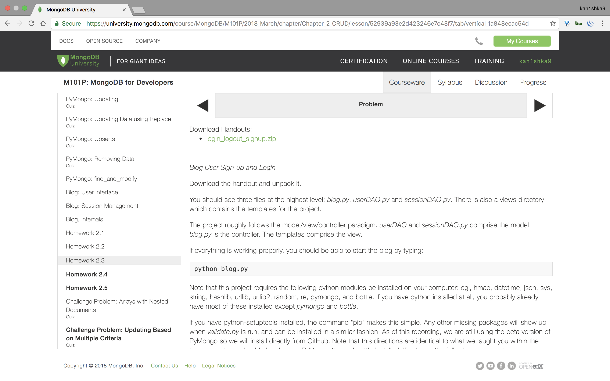
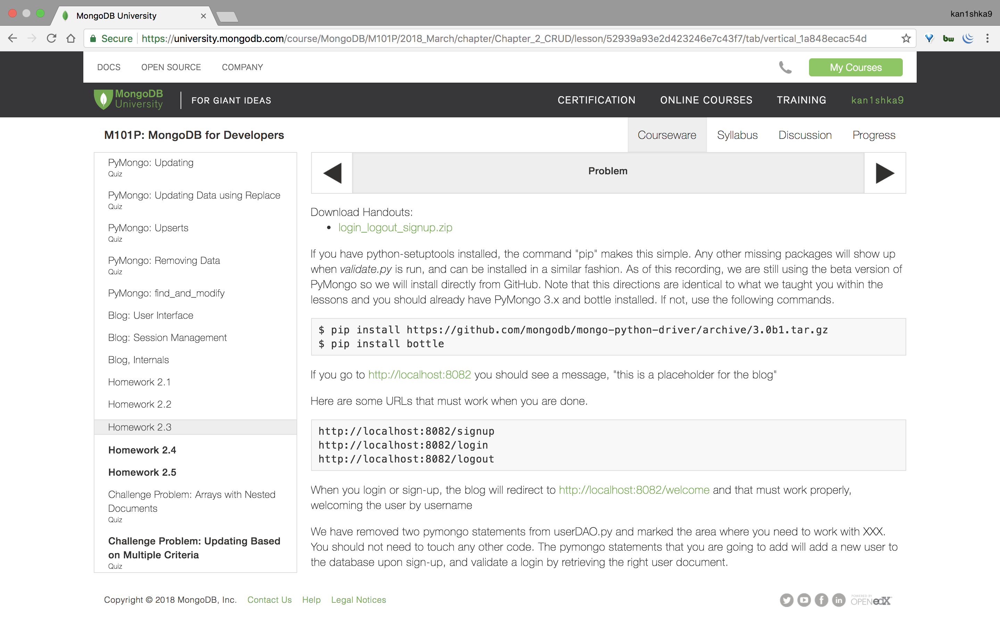
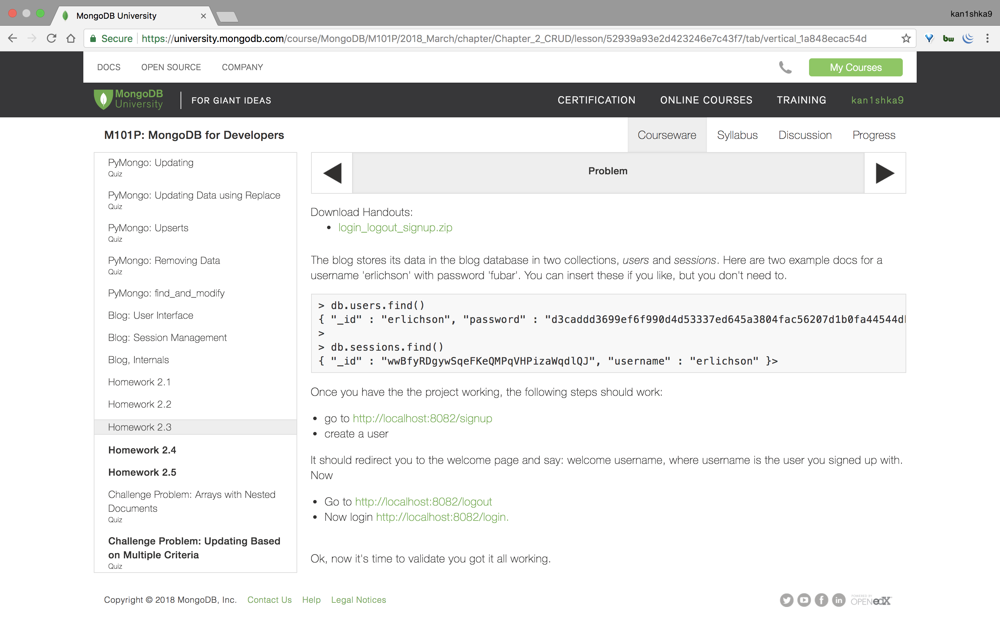
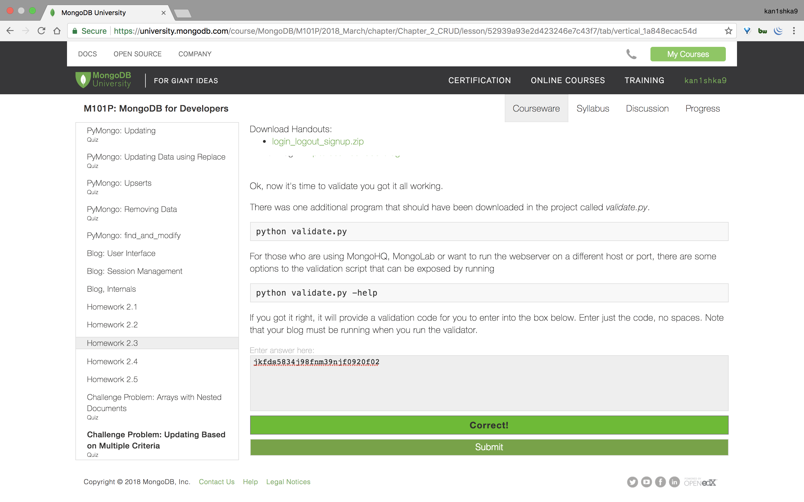
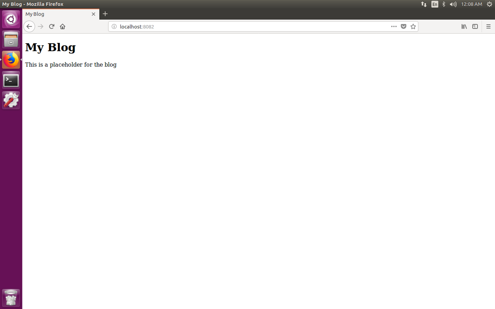
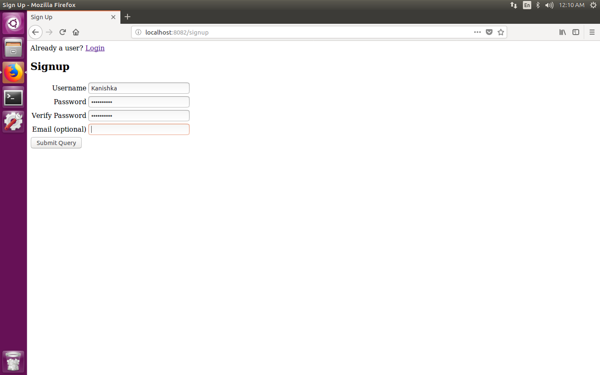
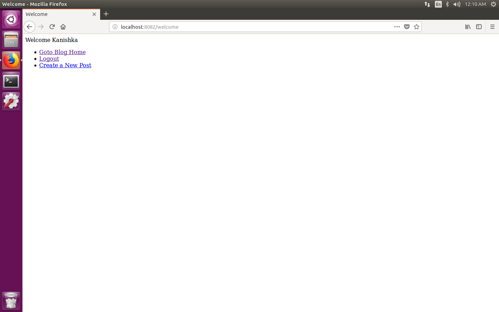
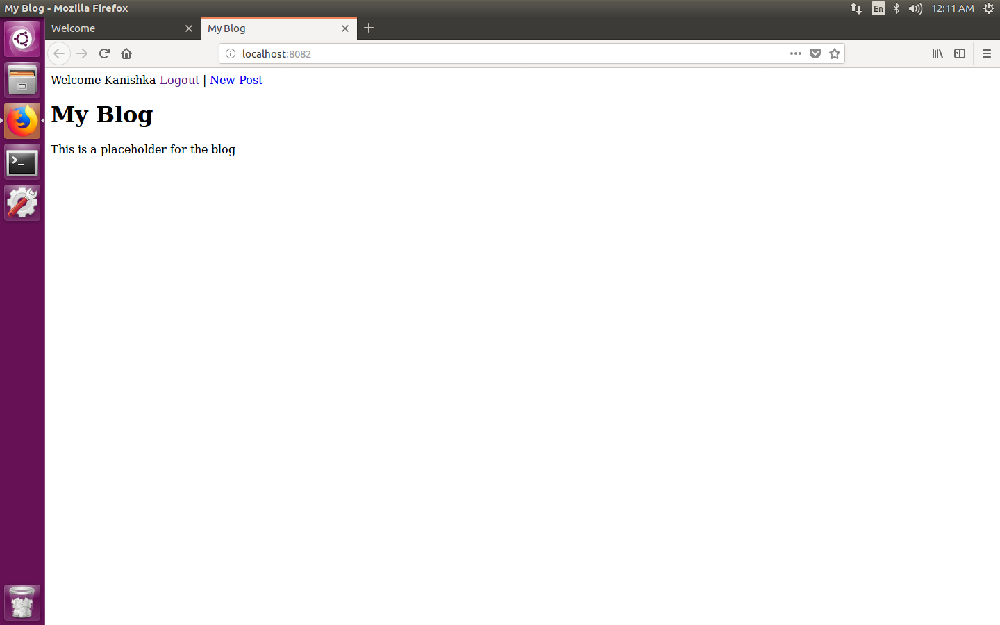
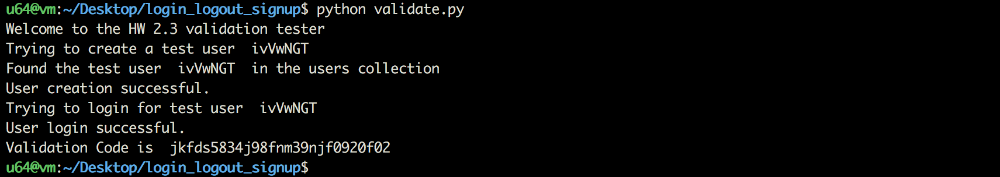
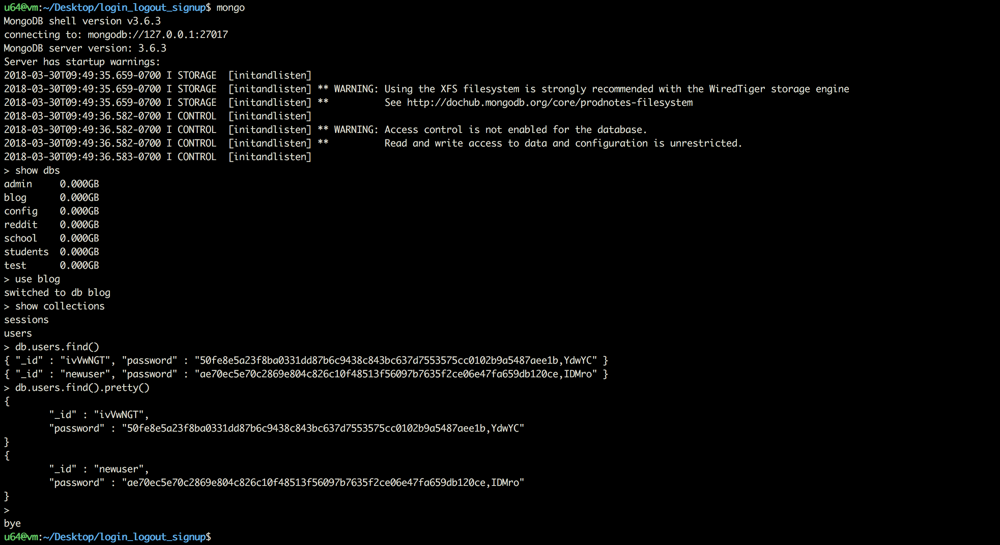

#### Homework 2.3









```sh
u64@vm:~/Desktop/login_logout_signup$ tree
.
├── blog.py
├── sessionDAO.py
├── userDAO.py
├── validate.py
└── views
    ├── blog_template.tpl
    ├── error_template.tpl
    ├── login.tpl
    ├── signup.tpl
    └── welcome.tpl

1 directory, 9 files
u64@vm:~/Desktop/login_logout_signup$
```

```sh
u64@vm:~/Desktop/login_logout_signup$ python blog.py
Bottle v0.12.13 server starting up (using WSGIRefServer())...
Listening on http://localhost:8082/
Hit Ctrl-C to quit.
```

```
http://localhost:8082/
http://localhost:8082/signup
http://localhost:8082/login
http://localhost:8082/logout
```









```sh
u64@vm:~/Desktop/login_logout_signup$ python validate.py
Welcome to the HW 2.3 validation tester
Trying to create a test user  EAJhafN
Could not find the test user  EAJhafN in the users collection.
Sorry, you have not solved it yet.
u64@vm:~/Desktop/login_logout_signup$
```

###### `userDAO.py`

```python
#
# Copyright (c) 2008 - 2013 10gen, Inc. <http://10gen.com>
#
# Licensed under the Apache License, Version 2.0 (the "License");
# you may not use this file except in compliance with the License.
# You may obtain a copy of the License at
#
#   http://www.apache.org/licenses/LICENSE-2.0
#
# Unless required by applicable law or agreed to in writing, software
# distributed under the License is distributed on an "AS IS" BASIS,
# WITHOUT WARRANTIES OR CONDITIONS OF ANY KIND, either express or implied.
# See the License for the specific language governing permissions and
# limitations under the License.
#
#
import hmac
import random
import string
import hashlib
import pymongo


# The User Data Access Object handles all interactions with the User collection.
class UserDAO:

    def __init__(self, db):
        self.db = db
        self.users = self.db.users
        self.SECRET = 'verysecret'

    # makes a little salt
    def make_salt(self):
        salt = ""
        for i in range(5):
            salt = salt + random.choice(string.ascii_letters)
        return salt

    # implement the function make_pw_hash(name, pw) that returns a hashed password
    # of the format:
    # HASH(pw + salt),salt
    # use sha256

    def make_pw_hash(self, pw,salt=None):
        if salt == None:
            salt = self.make_salt();
        return hashlib.sha256(pw + salt).hexdigest()+","+ salt

    # Validates a user login. Returns user record or None
    def validate_login(self, username, password):

        user = None
        try:
            # XXX HW 2.3 Students Work Here
            # you will need to retrieve right document from the users collection.
	    user = self.users.find_one({'_id': username})
            # print "This space intentionally left blank."
        except:
            print "Unable to query database for user"

        if user is None:
            print "User not in database"
            return None

        salt = user['password'].split(',')[1]

        if user['password'] != self.make_pw_hash(password, salt):
            print "user password is not a match"
            return None

        # Looks good
        return user


    # creates a new user in the users collection
    def add_user(self, username, password, email):
        password_hash = self.make_pw_hash(password)

        user = {'_id': username, 'password': password_hash}
        if email != "":
            user['email'] = email

        try:
            # XXX HW 2.3 Students work here
            # You need to insert the user into the users collection.
            # Don't over think this one, it's a straight forward insert.
	    self.users.insert(user)
            # print "This space intentionally left blank."

        except pymongo.errors.OperationFailure:
            print "oops, mongo error"
            return False
        except pymongo.errors.DuplicateKeyError as e:
            print "oops, username is already taken"
            return False

        return True
```

```sh
u64@vm:~/Desktop/login_logout_signup$ python blog.py
Bottle v0.12.13 server starting up (using WSGIRefServer())...
Listening on http://localhost:8082/
Hit Ctrl-C to quit.
```

```sh
u64@vm:~/Desktop/login_logout_signup$ python validate.py
Welcome to the HW 2.3 validation tester
Trying to create a test user  ivVwNGT
Found the test user  ivVwNGT  in the users collection
User creation successful.
Trying to login for test user  ivVwNGT
User login successful.
Validation Code is  jkfds5834j98fnm39njf0920f02
u64@vm:~/Desktop/login_logout_signup$
```




```sh
u64@vm:~/Desktop/login_logout_signup$ mongo
MongoDB shell version v3.6.3
connecting to: mongodb://127.0.0.1:27017
MongoDB server version: 3.6.3
Server has startup warnings:
2018-03-30T09:49:35.659-0700 I STORAGE  [initandlisten]
2018-03-30T09:49:35.659-0700 I STORAGE  [initandlisten] ** WARNING: Using the XFS filesystem is strongly recommended with the WiredTiger storage engine
2018-03-30T09:49:35.659-0700 I STORAGE  [initandlisten] **          See http://dochub.mongodb.org/core/prodnotes-filesystem
2018-03-30T09:49:36.582-0700 I CONTROL  [initandlisten]
2018-03-30T09:49:36.582-0700 I CONTROL  [initandlisten] ** WARNING: Access control is not enabled for the database.
2018-03-30T09:49:36.582-0700 I CONTROL  [initandlisten] **          Read and write access to data and configuration is unrestricted.
2018-03-30T09:49:36.583-0700 I CONTROL  [initandlisten]
> show dbs
admin     0.000GB
blog      0.000GB
config    0.000GB
reddit    0.000GB
school    0.000GB
students  0.000GB
test      0.000GB
> use blog
switched to db blog
> show collections
sessions
users
> db.users.find()
{ "_id" : "ivVwNGT", "password" : "50fe8e5a23f8ba0331dd87b6c9438c843bc637d7553575cc0102b9a5487aee1b,YdwYC" }
{ "_id" : "newuser", "password" : "ae70ec5e70c2869e804c826c10f48513f56097b7635f2ce06e47fa659db120ce,IDMro" }
> db.users.find().pretty()
{
	"_id" : "ivVwNGT",
	"password" : "50fe8e5a23f8ba0331dd87b6c9438c843bc637d7553575cc0102b9a5487aee1b,YdwYC"
}
{
	"_id" : "newuser",
	"password" : "ae70ec5e70c2869e804c826c10f48513f56097b7635f2ce06e47fa659db120ce,IDMro"
}
>
bye
u64@vm:~/Desktop/login_logout_signup$
```

