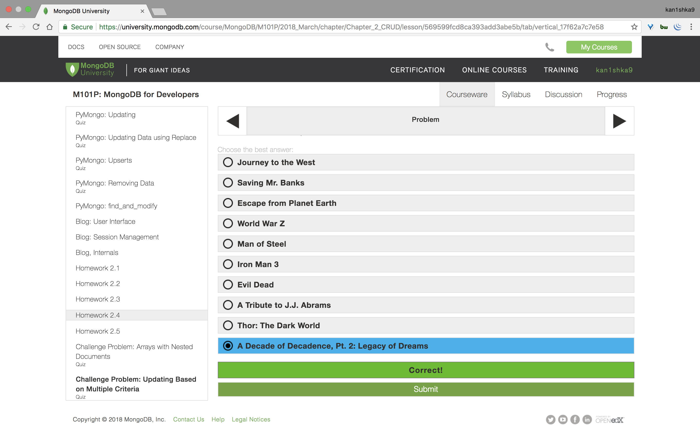

#### Homework 2.4




```sh
u64@vm:~/Desktop$ tree creating_documents/
creating_documents/
├── dump
│   └── video
│       ├── movieDetails.bson
│       ├── movieDetails.metadata.json
│       ├── movies.bson
│       ├── movies.metadata.json
│       ├── moviesScratch.bson
│       ├── moviesScratch.metadata.json
│       ├── reviews.bson
│       ├── reviews.metadata.json
│       └── system.indexes.bson
├── insertMany-ordered.js
├── insertMany-unordered.js
└── insertOne.js

2 directories, 12 files
u64@vm:~/Desktop$
```

```sh
u64@vm:~/Desktop$ cd creating_documents/dump/
```

```sh
u64@vm:~/Desktop/creating_documents/dump$ mongorestore -d video video/
2018-03-31T00:43:16.805-0700	the --db and --collection args should only be used when restoring from a BSON file. Other uses are deprecated and will not exist in the future; use --nsInclude instead
2018-03-31T00:43:16.806-0700	building a list of collections to restore from video dir
2018-03-31T00:43:16.808-0700	reading metadata for video.movieDetails from video/movieDetails.metadata.json
2018-03-31T00:43:16.810-0700	reading metadata for video.movies from video/movies.metadata.json
2018-03-31T00:43:16.821-0700	reading metadata for video.reviews from video/reviews.metadata.json
2018-03-31T00:43:16.823-0700	reading metadata for video.moviesScratch from video/moviesScratch.metadata.json
2018-03-31T00:43:16.829-0700	restoring video.movieDetails from video/movieDetails.bson
2018-03-31T00:43:16.918-0700	restoring video.movies from video/movies.bson
2018-03-31T00:43:16.921-0700	restoring video.reviews from video/reviews.bson
2018-03-31T00:43:16.923-0700	restoring video.moviesScratch from video/moviesScratch.bson
2018-03-31T00:43:16.937-0700	no indexes to restore
2018-03-31T00:43:16.940-0700	finished restoring video.moviesScratch (8 documents)
2018-03-31T00:43:16.943-0700	no indexes to restore
2018-03-31T00:43:16.943-0700	finished restoring video.reviews (20 documents)
2018-03-31T00:43:17.005-0700	no indexes to restore
2018-03-31T00:43:17.005-0700	finished restoring video.movies (3365 documents)
2018-03-31T00:43:17.025-0700	no indexes to restore
2018-03-31T00:43:17.025-0700	finished restoring video.movieDetails (2295 documents)
2018-03-31T00:43:17.025-0700	done
u64@vm:~/Desktop/creating_documents/dump$
```

```sh
u64@vm:~/Desktop$ mongo
MongoDB shell version v3.6.3
connecting to: mongodb://127.0.0.1:27017
MongoDB server version: 3.6.3
Server has startup warnings:
2018-03-30T09:49:35.659-0700 I STORAGE  [initandlisten]
2018-03-30T09:49:35.659-0700 I STORAGE  [initandlisten] ** WARNING: Using the XFS filesystem is strongly recommended with the WiredTiger storage engine
2018-03-30T09:49:35.659-0700 I STORAGE  [initandlisten] **          See http://dochub.mongodb.org/core/prodnotes-filesystem
2018-03-30T09:49:36.582-0700 I CONTROL  [initandlisten]
2018-03-30T09:49:36.582-0700 I CONTROL  [initandlisten] ** WARNING: Access control is not enabled for the database.
2018-03-30T09:49:36.582-0700 I CONTROL  [initandlisten] **          Read and write access to data and configuration is unrestricted.
2018-03-30T09:49:36.583-0700 I CONTROL  [initandlisten]
> show dbs
admin   0.000GB
config  0.000GB
video   0.000GB
> use video
switched to db video
> show collections
movieDetails
movies
moviesScratch
reviews
> db.movieDetails.findOne()
{
	"_id" : ObjectId("569190ca24de1e0ce2dfcd4f"),
	"title" : "Once Upon a Time in the West",
	"year" : 1968,
	"rated" : "PG-13",
	"released" : ISODate("1968-12-21T05:00:00Z"),
	"runtime" : 175,
	"countries" : [
		"Italy",
		"USA",
		"Spain"
	],
	"genres" : [
		"Western"
	],
	"director" : "Sergio Leone",
	"writers" : [
		"Sergio Donati",
		"Sergio Leone",
		"Dario Argento",
		"Bernardo Bertolucci",
		"Sergio Leone"
	],
	"actors" : [
		"Claudia Cardinale",
		"Henry Fonda",
		"Jason Robards",
		"Charles Bronson"
	],
	"plot" : "Epic story of a mysterious stranger with a harmonica who joins forces with a notorious desperado to protect a beautiful widow from a ruthless assassin working for the railroad.",
	"poster" : "http://ia.media-imdb.com/images/M/MV5BMTEyODQzNDkzNjVeQTJeQWpwZ15BbWU4MDgyODk1NDEx._V1_SX300.jpg",
	"imdb" : {
		"id" : "tt0064116",
		"rating" : 8.6,
		"votes" : 201283
	},
	"tomato" : {
		"meter" : 98,
		"image" : "certified",
		"rating" : 9,
		"reviews" : 54,
		"fresh" : 53,
		"consensus" : "A landmark Sergio Leone spaghetti western masterpiece featuring a classic Morricone score.",
		"userMeter" : 95,
		"userRating" : 4.3,
		"userReviews" : 64006
	},
	"metacritic" : 80,
	"awards" : {
		"wins" : 4,
		"nominations" : 5,
		"text" : "4 wins & 5 nominations."
	},
	"type" : "movie"
}
>
> db.movieDetails.find( { year: 2013, rated: "PG-13", "awards.wins": 0} ).count()
1
>
> db.movieDetails.find( { year: 2013, rated: "PG-13", "awards.wins": 0} ).pretty()
{
	"_id" : ObjectId("5692a3e124de1e0ce2dfda22"),
	"title" : "A Decade of Decadence, Pt. 2: Legacy of Dreams",
	"year" : 2013,
	"rated" : "PG-13",
	"released" : ISODate("2013-09-13T04:00:00Z"),
	"runtime" : 65,
	"countries" : [
		"USA"
	],
	"genres" : [
		"Documentary"
	],
	"director" : "Drew Glick",
	"writers" : [
		"Drew Glick"
	],
	"actors" : [
		"Gordon Auld",
		"Howie Boulware Jr.",
		"Tod Boulware",
		"Chen Drachman"
	],
	"plot" : "A behind the scenes look at the making of A Tiger in the Dark: The Decadence Saga.",
	"poster" : null,
	"imdb" : {
		"id" : "tt2199902",
		"rating" : 8,
		"votes" : 50
	},
	"awards" : {
		"wins" : 0,
		"nominations" : 0,
		"text" : ""
	},
	"type" : "movie"
}
>
```

