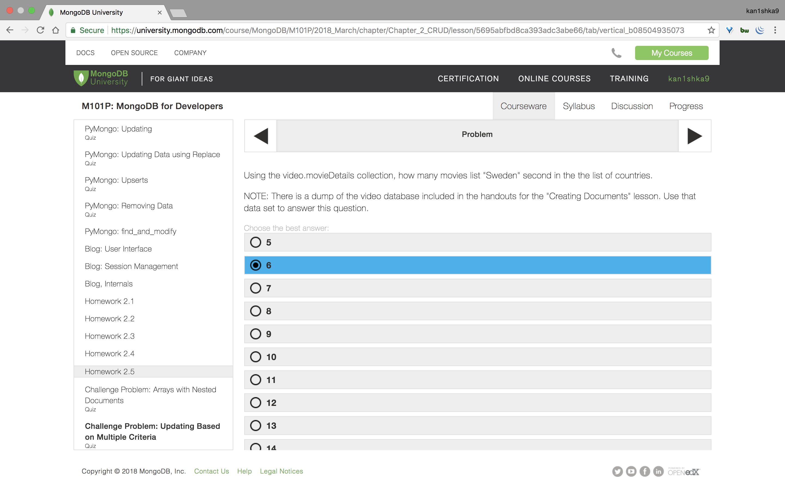
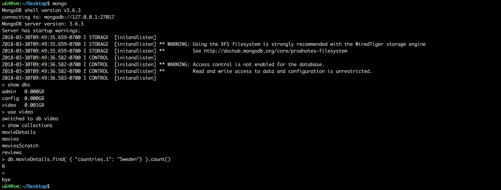

#### Homework 2.5



```sh
u64@vm:~/Desktop$ mongo
MongoDB shell version v3.6.3
connecting to: mongodb://127.0.0.1:27017
MongoDB server version: 3.6.3
Server has startup warnings:
2018-03-30T09:49:35.659-0700 I STORAGE  [initandlisten]
2018-03-30T09:49:35.659-0700 I STORAGE  [initandlisten] ** WARNING: Using the XFS filesystem is strongly recommended with the WiredTiger storage engine
2018-03-30T09:49:35.659-0700 I STORAGE  [initandlisten] **          See http://dochub.mongodb.org/core/prodnotes-filesystem
2018-03-30T09:49:36.582-0700 I CONTROL  [initandlisten]
2018-03-30T09:49:36.582-0700 I CONTROL  [initandlisten] ** WARNING: Access control is not enabled for the database.
2018-03-30T09:49:36.582-0700 I CONTROL  [initandlisten] **          Read and write access to data and configuration is unrestricted.
2018-03-30T09:49:36.583-0700 I CONTROL  [initandlisten]
> show dbs
admin   0.000GB
config  0.000GB
video   0.001GB
> use video
switched to db video
> show collections
movieDetails
movies
moviesScratch
reviews
> db.movieDetails.findOne()
{
	"_id" : ObjectId("569190ca24de1e0ce2dfcd4f"),
	"title" : "Once Upon a Time in the West",
	"year" : 1968,
	"rated" : "PG-13",
	"released" : ISODate("1968-12-21T05:00:00Z"),
	"runtime" : 175,
	"countries" : [
		"Italy",
		"USA",
		"Spain"
	],
	"genres" : [
		"Western"
	],
	"director" : "Sergio Leone",
	"writers" : [
		"Sergio Donati",
		"Sergio Leone",
		"Dario Argento",
		"Bernardo Bertolucci",
		"Sergio Leone"
	],
	"actors" : [
		"Claudia Cardinale",
		"Henry Fonda",
		"Jason Robards",
		"Charles Bronson"
	],
	"plot" : "Epic story of a mysterious stranger with a harmonica who joins forces with a notorious desperado to protect a beautiful widow from a ruthless assassin working for the railroad.",
	"poster" : "http://ia.media-imdb.com/images/M/MV5BMTEyODQzNDkzNjVeQTJeQWpwZ15BbWU4MDgyODk1NDEx._V1_SX300.jpg",
	"imdb" : {
		"id" : "tt0064116",
		"rating" : 8.6,
		"votes" : 201283
	},
	"tomato" : {
		"meter" : 98,
		"image" : "certified",
		"rating" : 9,
		"reviews" : 54,
		"fresh" : 53,
		"consensus" : "A landmark Sergio Leone spaghetti western masterpiece featuring a classic Morricone score.",
		"userMeter" : 95,
		"userRating" : 4.3,
		"userReviews" : 64006
	},
	"metacritic" : 80,
	"awards" : {
		"wins" : 4,
		"nominations" : 5,
		"text" : "4 wins & 5 nominations."
	},
	"type" : "movie"
}
>
> db.movieDetails.find( { "countries.1": "Sweden"} ).count()
6
>
bye
u64@vm:~/Desktop$
```

