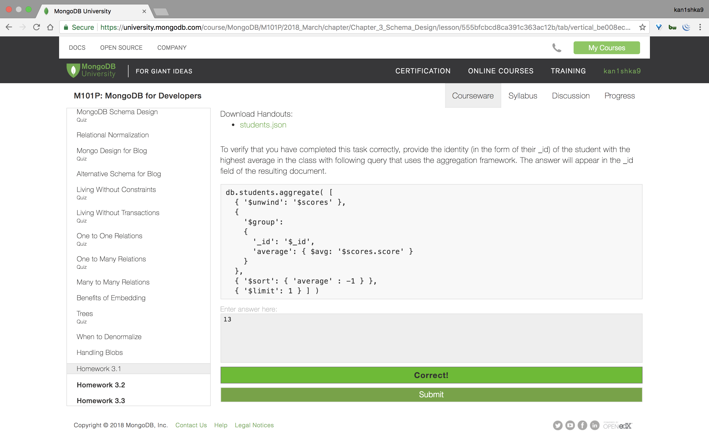
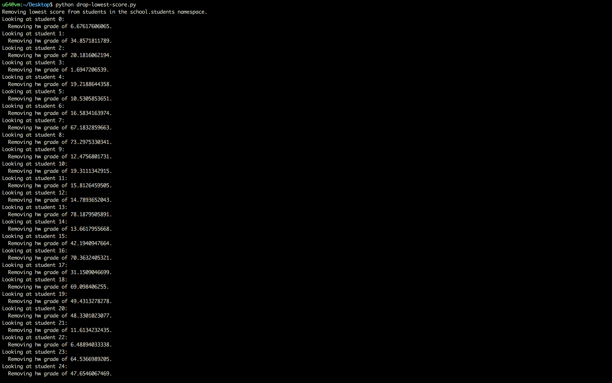
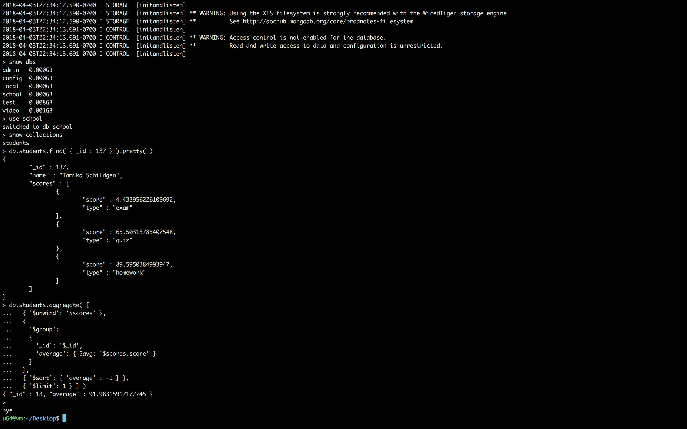

#### Homework 3.1



```sh
u64@vm:~/Desktop$ ls -l
total 52
-rw-r--r-- 1 u64 u64 52879 Apr  3 22:48 students.json
u64@vm:~/Desktop$
```

```sh
u64@vm:~/Desktop$ mongoimport --drop -d school -c students students.json
2018-04-03T22:51:33.007-0700	connected to: localhost
2018-04-03T22:51:33.009-0700	dropping: school.students
2018-04-03T22:51:33.022-0700	imported 200 documents
u64@vm:~/Desktop$
```

```sh
u64@vm:~/Desktop$ mongo
MongoDB shell version v3.6.3
connecting to: mongodb://127.0.0.1:27017
MongoDB server version: 3.6.3
Server has startup warnings:
2018-04-03T22:34:12.590-0700 I STORAGE  [initandlisten]
2018-04-03T22:34:12.590-0700 I STORAGE  [initandlisten] ** WARNING: Using the XFS filesystem is strongly recommended with the WiredTiger storage engine
2018-04-03T22:34:12.590-0700 I STORAGE  [initandlisten] **          See http://dochub.mongodb.org/core/prodnotes-filesystem
2018-04-03T22:34:13.691-0700 I CONTROL  [initandlisten]
2018-04-03T22:34:13.691-0700 I CONTROL  [initandlisten] ** WARNING: Access control is not enabled for the database.
2018-04-03T22:34:13.691-0700 I CONTROL  [initandlisten] **          Read and write access to data and configuration is unrestricted.
2018-04-03T22:34:13.691-0700 I CONTROL  [initandlisten]
> show dbs
admin   0.000GB
config  0.000GB
local   0.000GB
school  0.000GB
test    0.008GB
video   0.001GB
> use school
switched to db school
> show collections
students
> db.students.findOne()
{
	"_id" : 0,
	"name" : "aimee Zank",
	"scores" : [
		{
			"type" : "exam",
			"score" : 1.463179736705023
		},
		{
			"type" : "quiz",
			"score" : 11.78273309957772
		},
		{
			"type" : "homework",
			"score" : 6.676176060654615
		},
		{
			"type" : "homework",
			"score" : 35.8740349954354
		}
	]
}
> db.students.find( { _id : 137 } ).pretty( )
{
	"_id" : 137,
	"name" : "Tamika Schildgen",
	"scores" : [
		{
			"type" : "exam",
			"score" : 4.433956226109692
		},
		{
			"type" : "quiz",
			"score" : 65.50313785402548
		},
		{
			"type" : "homework",
			"score" : 89.5950384993947
		},
		{
			"type" : "homework",
			"score" : 54.75994689226145
		}
	]
}
> db.students.count()
200
>
bye
u64@vm:~/Desktop$
```

- `drop-lowest-score.py`

```python
#!/usr/bin/env python
"""
Drops the lowest score for each student in the collection.
Usage:
    python drop_lowest.py
"""

from pymongo import MongoClient
from sys import exc_info


def find_lowest_hw(scores):
    """
    Finds lowest hw score in the list.
    """
    lowest = None
    lowest_score = 101
    for item in scores:
        if ((item['type'] == "homework") and (item['score'] < lowest_score)):
            # found a new bound
            lowest = item
            lowest_score = lowest['score']

    return lowest


def remove_lowest(collection):
    """
    Drops the lowest score for each student.
    """
    cursor = collection.find()
    for student in cursor:
        _id = student["_id"]
        print "Looking at student {_id}:".format(_id=_id)
        scores = student['scores']
        lowest = find_lowest_hw(scores)
        if (lowest is not None):
            print ("  Removing hw grade of {score}."
                   ).format(score=lowest['score'])
            scores.remove(lowest)
            collection.update_one({'_id': _id},
                                  {'$set': {'scores': scores}})
        else:
            print "  Could not find a homework score to process"


def main():
    """
    Establishes a client and drops the lowest score for each student.
    """
    host = 'localhost'
    port = 27017
    dbname = 'school'
    collname = 'students'

    client = MongoClient(host=host, port=port)
    db = client[dbname]
    collection = db[collname]

    print ("Removing lowest score from students in the {db}.{collection} "
           "namespace."
           ).format(db=db.name, collection=collection.name)
    remove_lowest(collection=collection)


if __name__ == '__main__':
    main()
```



```sh
u64@vm:~/Desktop$ python drop-lowest-score.py
Removing lowest score from students in the school.students namespace.
Looking at student 0:
  Removing hw grade of 6.67617606065.
Looking at student 1:
  Removing hw grade of 34.8571811789.
Looking at student 2:
  Removing hw grade of 20.1816062194.
Looking at student 3:
  Removing hw grade of 1.6947206539.
Looking at student 4:
  Removing hw grade of 19.2188644358.
Looking at student 5:
  Removing hw grade of 10.5305853651.
Looking at student 6:
  Removing hw grade of 16.5834163974.
Looking at student 7:
  Removing hw grade of 67.1832859663.
Looking at student 8:
  Removing hw grade of 73.2975330341.
Looking at student 9:
  Removing hw grade of 12.4756801731.
Looking at student 10:
  Removing hw grade of 19.3111342915.
Looking at student 11:
  Removing hw grade of 15.8126459505.
Looking at student 12:
  Removing hw grade of 14.7893652043.
Looking at student 13:
  Removing hw grade of 78.1879505891.
Looking at student 14:
  Removing hw grade of 13.6617955668.
Looking at student 15:
  Removing hw grade of 42.1940947664.
Looking at student 16:
  Removing hw grade of 70.3632405321.
Looking at student 17:
  Removing hw grade of 31.1509046699.
Looking at student 18:
  Removing hw grade of 69.098406255.
Looking at student 19:
  Removing hw grade of 49.4313278278.
Looking at student 20:
  Removing hw grade of 48.3301023077.
Looking at student 21:
  Removing hw grade of 11.6134232435.
Looking at student 22:
  Removing hw grade of 6.48894033338.
Looking at student 23:
  Removing hw grade of 64.5366989205.
Looking at student 24:
  Removing hw grade of 47.6546067469.
Looking at student 25:
  Removing hw grade of 6.9432448119.
Looking at student 26:
  Removing hw grade of 5.6682637302.
Looking at student 27:
  Removing hw grade of 14.3594759438.
Looking at student 28:
  Removing hw grade of 7.69733166632.
Looking at student 29:
  Removing hw grade of 22.0093786616.
Looking at student 30:
  Removing hw grade of 27.2535373946.
Looking at student 31:
  Removing hw grade of 13.5368376939.
Looking at student 32:
  Removing hw grade of 35.3788193464.
Looking at student 33:
  Removing hw grade of 51.8194611848.
Looking at student 34:
  Removing hw grade of 32.2500869845.
Looking at student 35:
  Removing hw grade of 29.1891271805.
Looking at student 36:
  Removing hw grade of 39.440928398.
Looking at student 37:
  Removing hw grade of 25.3183139597.
Looking at student 38:
  Removing hw grade of 31.7446119765.
Looking at student 39:
  Removing hw grade of 16.4059830567.
Looking at student 40:
  Removing hw grade of 38.6162325674.
Looking at student 41:
  Removing hw grade of 19.3984199908.
Looking at student 42:
  Removing hw grade of 56.6601467539.
Looking at student 43:
  Removing hw grade of 0.70587715161.
Looking at student 44:
  Removing hw grade of 11.3399180628.
Looking at student 45:
  Removing hw grade of 13.3625292344.
Looking at student 46:
  Removing hw grade of 21.7574602602.
Looking at student 47:
  Removing hw grade of 12.1041892056.
Looking at student 48:
  Removing hw grade of 64.338976121.
Looking at student 49:
  Removing hw grade of 68.4065088255.
Looking at student 50:
  Removing hw grade of 51.0400125923.
Looking at student 51:
  Removing hw grade of 14.0768609426.
Looking at student 52:
  Removing hw grade of 68.6451113385.
Looking at student 53:
  Removing hw grade of 61.9194866926.
Looking at student 54:
  Removing hw grade of 2.9266506361.
Looking at student 55:
  Removing hw grade of 4.98884538563.
Looking at student 56:
  Removing hw grade of 4.92381940772.
Looking at student 57:
  Removing hw grade of 27.0691680328.
Looking at student 58:
  Removing hw grade of 9.96551516235.
Looking at student 59:
  Removing hw grade of 23.9130071571.
Looking at student 60:
  Removing hw grade of 24.7043376431.
Looking at student 61:
  Removing hw grade of 34.1325293841.
Looking at student 62:
  Removing hw grade of 19.1657926235.
Looking at student 63:
  Removing hw grade of 0.644407742091.
Looking at student 64:
  Removing hw grade of 92.2308421189.
Looking at student 65:
  Removing hw grade of 30.1277658366.
Looking at student 66:
  Removing hw grade of 49.4240323069.
Looking at student 67:
  Removing hw grade of 83.8722548113.
Looking at student 68:
  Removing hw grade of 23.2179192942.
Looking at student 69:
  Removing hw grade of 25.5792673685.
Looking at student 70:
  Removing hw grade of 21.3852286628.
Looking at student 71:
  Removing hw grade of 55.4770385973.
Looking at student 72:
  Removing hw grade of 38.2291439514.
Looking at student 73:
  Removing hw grade of 40.1862652426.
Looking at student 74:
  Removing hw grade of 23.9516325793.
Looking at student 75:
  Removing hw grade of 27.5184353824.
Looking at student 76:
  Removing hw grade of 59.5050860341.
Looking at student 77:
  Removing hw grade of 82.0387019995.
Looking at student 78:
  Removing hw grade of 16.6869522718.
Looking at student 79:
  Removing hw grade of 63.9510745214.
Looking at student 80:
  Removing hw grade of 75.6213249762.
Looking at student 81:
  Removing hw grade of 28.822835863.
Looking at student 82:
  Removing hw grade of 75.5803980161.
Looking at student 83:
  Removing hw grade of 20.0401886652.
Looking at student 84:
  Removing hw grade of 43.4625837572.
Looking at student 85:
  Removing hw grade of 5.95624158157.
Looking at student 86:
  Removing hw grade of 63.7465882427.
Looking at student 87:
  Removing hw grade of 18.9636875712.
Looking at student 88:
  Removing hw grade of 92.9904537789.
Looking at student 89:
  Removing hw grade of 14.7812251014.
Looking at student 90:
  Removing hw grade of 63.0968728899.
Looking at student 91:
  Removing hw grade of 18.658836141.
Looking at student 92:
  Removing hw grade of 31.7011644485.
Looking at student 93:
  Removing hw grade of 3.31601874534.
Looking at student 94:
  Removing hw grade of 26.8262352707.
Looking at student 95:
  Removing hw grade of 23.7378652822.
Looking at student 96:
  Removing hw grade of 2.81594452627.
Looking at student 97:
  Removing hw grade of 6.87253618443.
Looking at student 98:
  Removing hw grade of 10.2753709199.
Looking at student 99:
  Removing hw grade of 21.7475801455.
Looking at student 100:
  Removing hw grade of 19.8560496854.
Looking at student 101:
  Removing hw grade of 14.7776221615.
Looking at student 102:
  Removing hw grade of 12.145824447.
Looking at student 103:
  Removing hw grade of 14.2411307689.
Looking at student 104:
  Removing hw grade of 27.3167519368.
Looking at student 105:
  Removing hw grade of 52.6862967773.
Looking at student 106:
  Removing hw grade of 0.339844013464.
Looking at student 107:
  Removing hw grade of 29.824036289.
Looking at student 108:
  Removing hw grade of 0.0815736976414.
Looking at student 109:
  Removing hw grade of 65.9009850229.
Looking at student 110:
  Removing hw grade of 19.2708156689.
Looking at student 111:
  Removing hw grade of 34.5056558925.
Looking at student 112:
  Removing hw grade of 71.2196287645.
Looking at student 113:
  Removing hw grade of 55.7419897605.
Looking at student 114:
  Removing hw grade of 18.5203567413.
Looking at student 115:
  Removing hw grade of 19.6446859888.
Looking at student 116:
  Removing hw grade of 72.5482462412.
Looking at student 117:
  Removing hw grade of 33.1517726991.
Looking at student 118:
  Removing hw grade of 8.54873565152.
Looking at student 119:
  Removing hw grade of 28.1047757838.
Looking at student 120:
  Removing hw grade of 48.1862567301.
Looking at student 121:
  Removing hw grade of 1.53459923483.
Looking at student 122:
  Removing hw grade of 14.7304116521.
Looking at student 123:
  Removing hw grade of 9.83679437441.
Looking at student 124:
  Removing hw grade of 27.3684057557.
Looking at student 125:
  Removing hw grade of 31.1928277739.
Looking at student 126:
  Removing hw grade of 66.9969411041.
Looking at student 127:
  Removing hw grade of 66.556354168.
Looking at student 128:
  Removing hw grade of 0.530227647133.
Looking at student 129:
  Removing hw grade of 13.2106106411.
Looking at student 130:
  Removing hw grade of 61.188532325.
Looking at student 131:
  Removing hw grade of 6.63122062171.
Looking at student 132:
  Removing hw grade of 17.9030499425.
Looking at student 133:
  Removing hw grade of 1.70426292456.
Looking at student 134:
  Removing hw grade of 73.469458213.
Looking at student 135:
  Removing hw grade of 26.0091075223.
Looking at student 136:
  Removing hw grade of 32.1199801111.
Looking at student 137:
  Removing hw grade of 54.7599468923.
Looking at student 138:
  Removing hw grade of 42.6039959366.
Looking at student 139:
  Removing hw grade of 19.0053901125.
Looking at student 140:
  Removing hw grade of 51.522638485.
Looking at student 141:
  Removing hw grade of 37.4569019538.
Looking at student 142:
  Removing hw grade of 77.2506045.
Looking at student 143:
  Removing hw grade of 65.5137396628.
Looking at student 144:
  Removing hw grade of 6.35209942166.
Looking at student 145:
  Removing hw grade of 1.68889130981.
Looking at student 146:
  Removing hw grade of 19.8015892241.
Looking at student 147:
  Removing hw grade of 4.40484534475.
Looking at student 148:
  Removing hw grade of 22.4739785047.
Looking at student 149:
  Removing hw grade of 19.7927711304.
Looking at student 150:
  Removing hw grade of 9.96396307338.
Looking at student 151:
  Removing hw grade of 32.8699662015.
Looking at student 152:
  Removing hw grade of 3.57296743498.
Looking at student 153:
  Removing hw grade of 22.4218288031.
Looking at student 154:
  Removing hw grade of 47.3468473997.
Looking at student 155:
  Removing hw grade of 9.36808988966.
Looking at student 156:
  Removing hw grade of 61.1196275104.
Looking at student 157:
  Removing hw grade of 38.7272498428.
Looking at student 158:
  Removing hw grade of 37.2829219876.
Looking at student 159:
  Removing hw grade of 0.119606767841.
Looking at student 160:
  Removing hw grade of 26.5824304191.
Looking at student 161:
  Removing hw grade of 39.3392777985.
Looking at student 162:
  Removing hw grade of 50.6710362775.
Looking at student 163:
  Removing hw grade of 10.1516975891.
Looking at student 164:
  Removing hw grade of 26.9703608683.
Looking at student 165:
  Removing hw grade of 28.2658101456.
Looking at student 166:
  Removing hw grade of 45.3712121696.
Looking at student 167:
  Removing hw grade of 56.9040184357.
Looking at student 168:
  Removing hw grade of 23.125544029.
Looking at student 169:
  Removing hw grade of 77.0811967094.
Looking at student 170:
  Removing hw grade of 19.3959963123.
Looking at student 171:
  Removing hw grade of 53.3551177694.
Looking at student 172:
  Removing hw grade of 4.71704103557.
Looking at student 173:
  Removing hw grade of 53.3163123124.
Looking at student 174:
  Removing hw grade of 34.4262292338.
Looking at student 175:
  Removing hw grade of 6.53353459743.
Looking at student 176:
  Removing hw grade of 8.21781811285.
Looking at student 177:
  Removing hw grade of 90.0537911331.
Looking at student 178:
  Removing hw grade of 97.9592897956.
Looking at student 179:
  Removing hw grade of 2.92801559764.
Looking at student 180:
  Removing hw grade of 49.4239931344.
Looking at student 181:
  Removing hw grade of 58.5811689095.
Looking at student 182:
  Removing hw grade of 45.2330150993.
Looking at student 183:
  Removing hw grade of 13.9668168129.
Looking at student 184:
  Removing hw grade of 80.9743105402.
Looking at student 185:
  Removing hw grade of 62.0487205525.
Looking at student 186:
  Removing hw grade of 76.2392049996.
Looking at student 187:
  Removing hw grade of 48.8846993438.
Looking at student 188:
  Removing hw grade of 37.660837519.
Looking at student 189:
  Removing hw grade of 25.4006560605.
Looking at student 190:
  Removing hw grade of 28.138211517.
Looking at student 191:
  Removing hw grade of 67.1710589304.
Looking at student 192:
  Removing hw grade of 29.9935645604.
Looking at student 193:
  Removing hw grade of 48.6080333712.
Looking at student 194:
  Removing hw grade of 57.8004470119.
Looking at student 195:
  Removing hw grade of 11.2747718912.
Looking at student 196:
  Removing hw grade of 4.62951101259.
Looking at student 197:
  Removing hw grade of 56.1750414352.
Looking at student 198:
  Removing hw grade of 55.859529282.
Looking at student 199:
  Removing hw grade of 5.86161390379.
u64@vm:~/Desktop$
```

```sh
u64@vm:~/Desktop$ mongo
MongoDB shell version v3.6.3
connecting to: mongodb://127.0.0.1:27017
MongoDB server version: 3.6.3
Server has startup warnings:
2018-04-03T22:34:12.590-0700 I STORAGE  [initandlisten]
2018-04-03T22:34:12.590-0700 I STORAGE  [initandlisten] ** WARNING: Using the XFS filesystem is strongly recommended with the WiredTiger storage engine
2018-04-03T22:34:12.590-0700 I STORAGE  [initandlisten] **          See http://dochub.mongodb.org/core/prodnotes-filesystem
2018-04-03T22:34:13.691-0700 I CONTROL  [initandlisten]
2018-04-03T22:34:13.691-0700 I CONTROL  [initandlisten] ** WARNING: Access control is not enabled for the database.
2018-04-03T22:34:13.691-0700 I CONTROL  [initandlisten] **          Read and write access to data and configuration is unrestricted.
2018-04-03T22:34:13.691-0700 I CONTROL  [initandlisten]
> show dbs
admin   0.000GB
config  0.000GB
local   0.000GB
school  0.000GB
test    0.008GB
video   0.001GB
> use school
switched to db school
> show collections
students
> db.students.find( { _id : 137 } ).pretty( )
{
	"_id" : 137,
	"name" : "Tamika Schildgen",
	"scores" : [
		{
			"score" : 4.433956226109692,
			"type" : "exam"
		},
		{
			"score" : 65.50313785402548,
			"type" : "quiz"
		},
		{
			"score" : 89.5950384993947,
			"type" : "homework"
		}
	]
}
> db.students.aggregate( [
...   { '$unwind': '$scores' },
...   {
...     '$group':
...     {
...       '_id': '$_id',
...       'average': { $avg: '$scores.score' }
...     }
...   },
...   { '$sort': { 'average' : -1 } },
...   { '$limit': 1 } ] )
{ "_id" : 13, "average" : 91.98315917172745 }
>
bye
u64@vm:~/Desktop$
```

