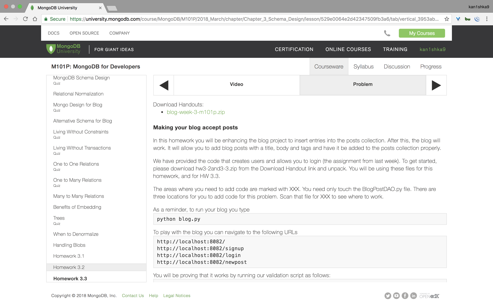
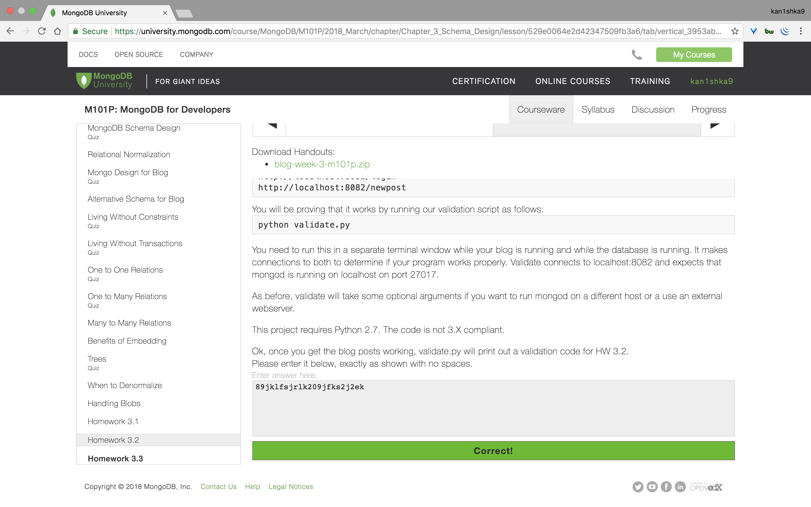
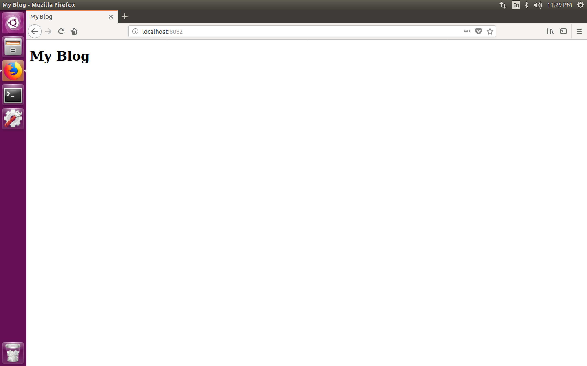
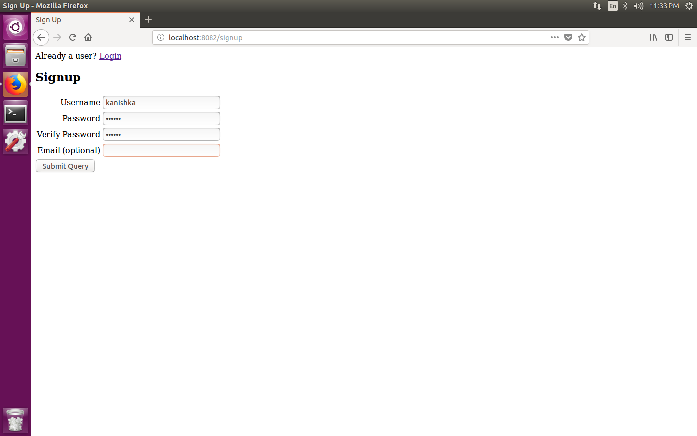
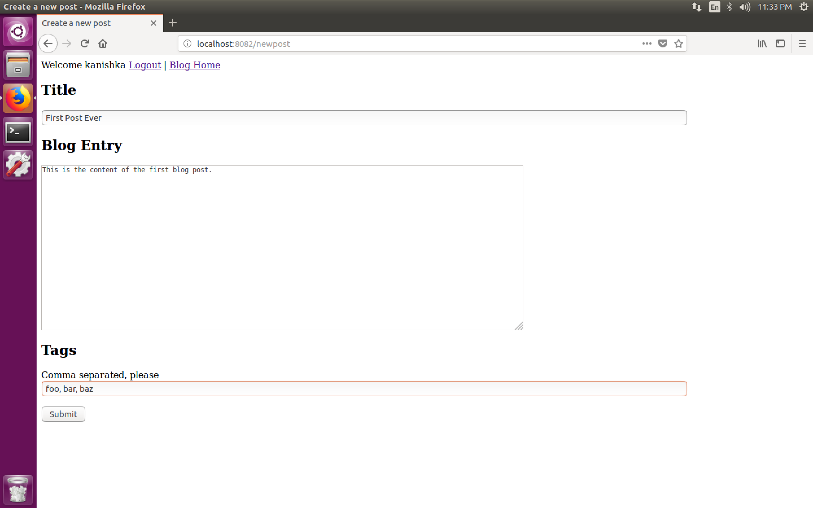
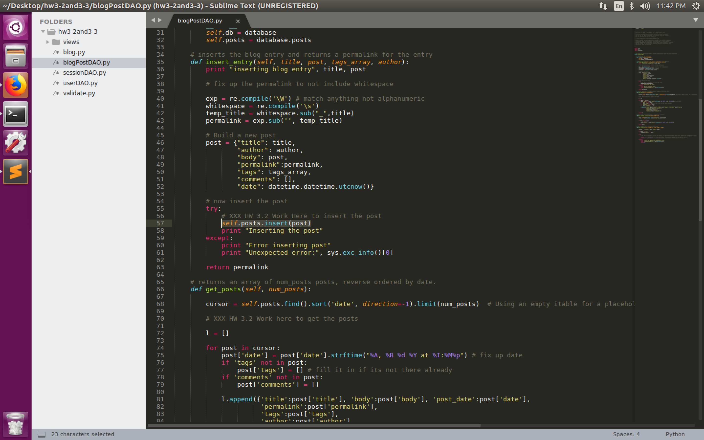
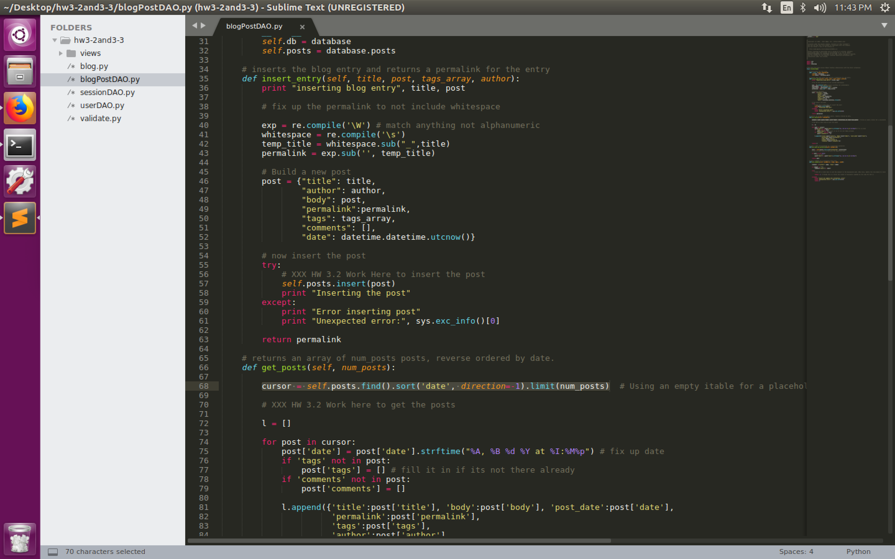
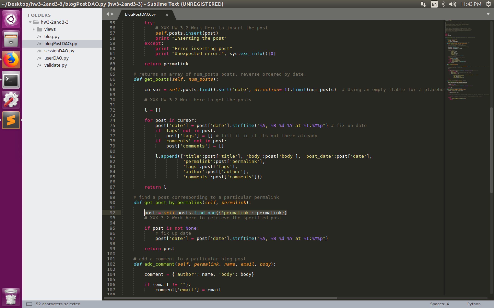
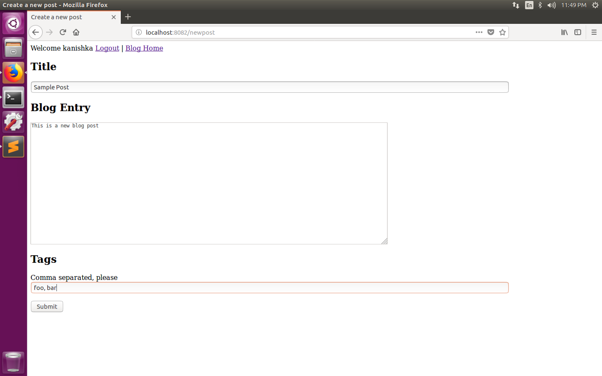
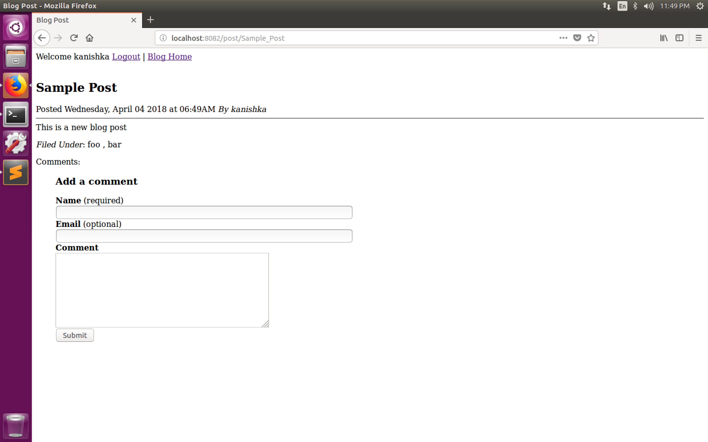

#### Homework 3.2





```sh
u64@vm:~/Desktop/hw3-2and3-3$ ll
total 52
drwxrwxr-x 3 u64 u64  4096 Apr  3 23:27 ./
drwxr-xr-x 3 u64 u64  4096 Apr  3 23:27 ../
-rw-rw-r-- 1 u64 u64  3813 Jan 23 17:00 blogPostDAO.py
-rw-rw-r-- 1 u64 u64 10552 Jan 23 17:00 blog.py
-rw-rw-r-- 1 u64 u64  2307 Jan 23 17:00 sessionDAO.py
-rw-rw-r-- 1 u64 u64  2578 Jan 23 17:00 userDAO.py
-rw-rw-r-- 1 u64 u64 13708 Jan 23 17:00 validate.py
drwxrwxr-x 2 u64 u64  4096 Apr  3 23:27 views/
u64@vm:~/Desktop/hw3-2and3-3$
```

```sh
u64@vm:~/Desktop/hw3-2and3-3$ python blog.py
Bottle v0.12.13 server starting up (using WSGIRefServer())...
Listening on http://localhost:8082/
Hit Ctrl-C to quit.

NleAktmwaPLfTwHIDpzYfrOgZUwKvXHR
127.0.0.1 - - [03/Apr/2018 23:28:52] "POST /signup HTTP/1.1" 303 0
127.0.0.1 - - [03/Apr/2018 23:28:52] "GET /welcome HTTP/1.1" 200 363
user submitted  aVDcTLC pass  wESHEJpR
127.0.0.1 - - [03/Apr/2018 23:28:52] "POST /login HTTP/1.1" 303 0
127.0.0.1 - - [03/Apr/2018 23:28:52] "GET /welcome HTTP/1.1" 200 363
inserting blog entry zVJRVOjuCQjWmWRUlInJCFnYSRghIf HxoflbvQpludsdJssQjDFMkjNiOlbr
Inserting the post
127.0.0.1 - - [03/Apr/2018 23:28:52] "POST /newpost HTTP/1.1" 303 0
about to query on permalink =  zVJRVOjuCQjWmWRUlInJCFnYSRghIf
127.0.0.1 - - [03/Apr/2018 23:28:52] "GET /post/zVJRVOjuCQjWmWRUlInJCFnYSRghIf HTTP/1.1" 303 0
127.0.0.1 - - [03/Apr/2018 23:28:52] "GET /post_not_found HTTP/1.1" 200 21
```

```sh
u64@vm:~/Desktop/hw3-2and3-3$ python validate.py
Welcome to the HW 3.2 and HW 3.3 validation tester
Trying to create a test user  aVDcTLC
Found the test user  aVDcTLC  in the users collection
User creation successful.
Trying to login for test user  aVDcTLC
User login successful.
Trying to submit a post with title  zVJRVOjuCQjWmWRUlInJCFnYSRghIf
When we tried to post, here is the output we got

Sorry, post not found
Unable to create a post
u64@vm:~/Desktop/hw3-2and3-3$
```

```
http://localhost:8082
```



```
http://localhost:8082/signup
```



```
http://localhost:8082/welcome
```


```
http://localhost:8082/newpost
```



```
http://localhost:8082/post_not_found
```


###### Modifications made

- Line `57, 68, 92`

```python
self.posts.insert(post)
cursor = self.posts.find().sort('date', direction=-1).limit(num_posts)
post = self.posts.find_one({'permalink': permalink})
```







```
http://localhost:8082/newpost
```



```
http://localhost:8082/post/Sample_Post
```



```sh
u64@vm:~/Desktop/hw3-2and3-3$ python blog.py
Bottle v0.12.13 server starting up (using WSGIRefServer())...
Listening on http://localhost:8082/
Hit Ctrl-C to quit.

oHzXnQgazzVvflPIcArUAPtBPyiXeNTS
127.0.0.1 - - [03/Apr/2018 23:46:00] "POST /signup HTTP/1.1" 303 0
127.0.0.1 - - [03/Apr/2018 23:46:00] "GET /welcome HTTP/1.1" 200 363
user submitted  KOakXTM pass  ZXfdXyeJ
127.0.0.1 - - [03/Apr/2018 23:46:00] "POST /login HTTP/1.1" 303 0
127.0.0.1 - - [03/Apr/2018 23:46:00] "GET /welcome HTTP/1.1" 200 363
inserting blog entry aEWNKBSlqgFxMtYFcxYcwxvxapmoUV mSxLbUZFTcWzEaLFImmZorblsTpcol
/home/u64/Desktop/hw3-2and3-3/blogPostDAO.py:57: DeprecationWarning: insert is deprecated. Use insert_one or insert_many instead.
  self.posts.insert(post)
Inserting the post
127.0.0.1 - - [03/Apr/2018 23:46:00] "POST /newpost HTTP/1.1" 303 0
about to query on permalink =  aEWNKBSlqgFxMtYFcxYcwxvxapmoUV
127.0.0.1 - - [03/Apr/2018 23:46:00] "GET /post/aEWNKBSlqgFxMtYFcxYcwxvxapmoUV HTTP/1.1" 200 786
inserting blog entry ATmXqsgKTqtbKVbmfLoqfpqdldMUJl XShGgzZkhsAzRBrocvyTgaflVwKHiE
Inserting the post
127.0.0.1 - - [03/Apr/2018 23:46:00] "POST /newpost HTTP/1.1" 303 0
about to query on permalink =  ATmXqsgKTqtbKVbmfLoqfpqdldMUJl
127.0.0.1 - - [03/Apr/2018 23:46:00] "GET /post/ATmXqsgKTqtbKVbmfLoqfpqdldMUJl HTTP/1.1" 200 786
127.0.0.1 - - [03/Apr/2018 23:46:00] "GET / HTTP/1.1" 200 1173
127.0.0.1 - - [03/Apr/2018 23:46:00] "POST /newcomment HTTP/1.1" 303 0
about to query on permalink =  aEWNKBSlqgFxMtYFcxYcwxvxapmoUV
127.0.0.1 - - [03/Apr/2018 23:46:00] "GET /post/aEWNKBSlqgFxMtYFcxYcwxvxapmoUV HTTP/1.1" 200 786
```

```sh
u64@vm:~/Desktop/hw3-2and3-3$ python validate.py
Welcome to the HW 3.2 and HW 3.3 validation tester
Trying to create a test user  KOakXTM
Found the test user  KOakXTM  in the users collection
User creation successful.
Trying to login for test user  KOakXTM
User login successful.
Trying to submit a post with title  aEWNKBSlqgFxMtYFcxYcwxvxapmoUV
Submission of single post successful
Trying to submit a post with title  ATmXqsgKTqtbKVbmfLoqfpqdldMUJl
Submission of second post successful
Trying to grab the blog home page at url  http://localhost:8082/
Block index looks good.
Found blog post in posts collection
Tests Passed for HW 3.2. Your HW 3.2 validation code is 89jklfsjrlk209jfks2j2ek
Trying to submit a blog comment for post with title aEWNKBSlqgFxMtYFcxYcwxvxapmoUV
Can't add blog comments (so HW 3.3 not yet complete)
u64@vm:~/Desktop/hw3-2and3-3$
```

