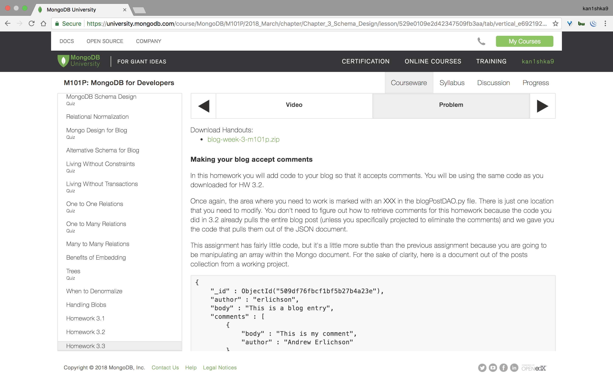
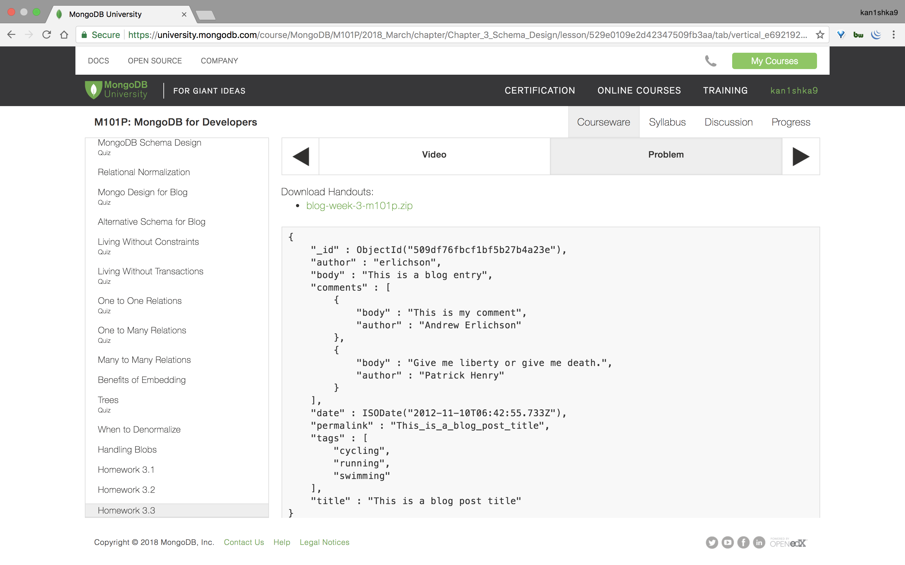
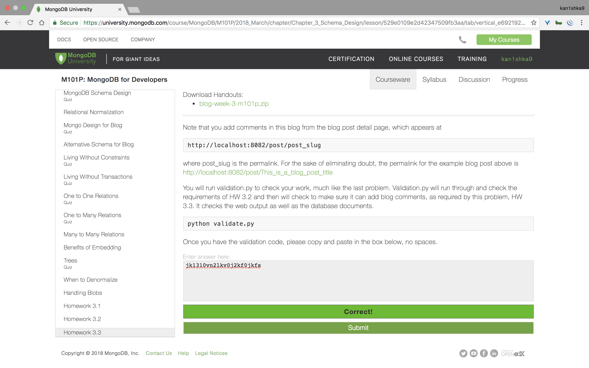
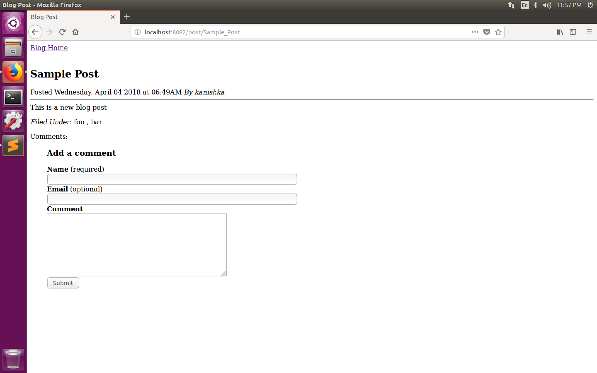
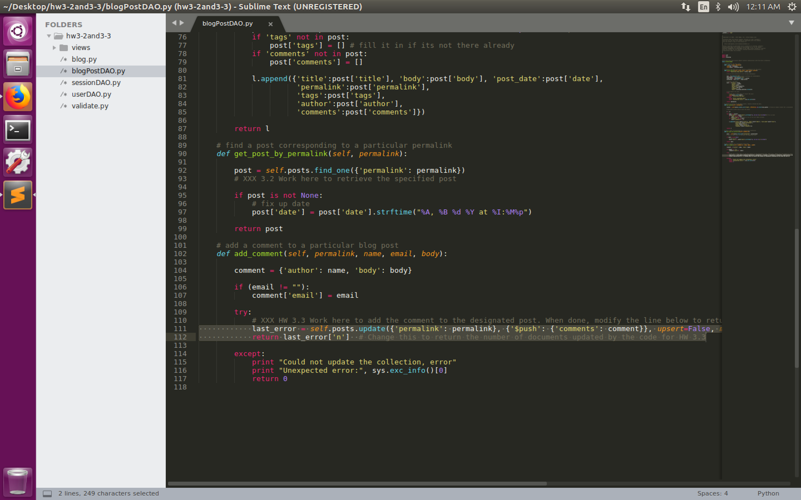
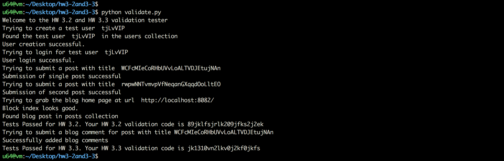

#### Homework 3.3







```sh
u64@vm:~/Desktop/hw3-2and3-3$ ll
total 64
drwxrwxr-x 3 u64 u64  4096 Apr  3 23:45 ./
drwxr-xr-x 3 u64 u64  4096 Apr  3 23:27 ../
-rw-rw-r-- 1 u64 u64  3943 Apr  3 23:41 blogPostDAO.py
-rw-rw-r-- 1 u64 u64  2665 Apr  3 23:45 blogPostDAO.pyc
-rw-rw-r-- 1 u64 u64 10552 Jan 23 17:00 blog.py
-rw-rw-r-- 1 u64 u64  2307 Jan 23 17:00 sessionDAO.py
-rw-rw-r-- 1 u64 u64  2033 Apr  3 23:28 sessionDAO.pyc
-rw-rw-r-- 1 u64 u64  2578 Jan 23 17:00 userDAO.py
-rw-rw-r-- 1 u64 u64  2258 Apr  3 23:28 userDAO.pyc
-rw-rw-r-- 1 u64 u64 13708 Jan 23 17:00 validate.py
drwxrwxr-x 2 u64 u64  4096 Apr  3 23:27 views/
u64@vm:~/Desktop/hw3-2and3-3$
```

```sh
u64@vm:~/Desktop/hw3-2and3-3$ python blog.py
Bottle v0.12.13 server starting up (using WSGIRefServer())...
Listening on http://localhost:8082/
Hit Ctrl-C to quit.
```

```sh
u64@vm:~/Desktop/hw3-2and3-3$ python validate.py
Welcome to the HW 3.2 and HW 3.3 validation tester
Trying to create a test user  KOakXTM
Found the test user  KOakXTM  in the users collection
User creation successful.
Trying to login for test user  KOakXTM
User login successful.
Trying to submit a post with title  aEWNKBSlqgFxMtYFcxYcwxvxapmoUV
Submission of single post successful
Trying to submit a post with title  ATmXqsgKTqtbKVbmfLoqfpqdldMUJl
Submission of second post successful
Trying to grab the blog home page at url  http://localhost:8082/
Block index looks good.
Found blog post in posts collection
Tests Passed for HW 3.2. Your HW 3.2 validation code is 89jklfsjrlk209jfks2j2ek
Trying to submit a blog comment for post with title aEWNKBSlqgFxMtYFcxYcwxvxapmoUV
Can't add blog comments (so HW 3.3 not yet complete)
u64@vm:~/Desktop/hw3-2and3-3$
```

```
http://localhost:8082/post/Sample_Post
```




###### Modifications made

- Line `111, 112`

```python
last_error = self.posts.update({'permalink': permalink}, {'$push': {'comments': comment}}, upsert=False, manipulate=False)
return last_error['n']
```




```sh
u64@vm:~/Desktop/hw3-2and3-3$ python validate.py
Welcome to the HW 3.2 and HW 3.3 validation tester
Trying to create a test user  tjLvVIP
Found the test user  tjLvVIP  in the users collection
User creation successful.
Trying to login for test user  tjLvVIP
User login successful.
Trying to submit a post with title  WCFcMIeCoRHbUVvLoALTVDJEtujNAn
Submission of single post successful
Trying to submit a post with title  rwpwNNTvmvpVfNeqanGXqqdOoLltEO
Submission of second post successful
Trying to grab the blog home page at url  http://localhost:8082/
Block index looks good.
Found blog post in posts collection
Tests Passed for HW 3.2. Your HW 3.2 validation code is 89jklfsjrlk209jfks2j2ek
Trying to submit a blog comment for post with title WCFcMIeCoRHbUVvLoALTVDJEtujNAn
Successfully added blog comments
Tests Passed for HW 3.3. Your HW 3.3 validation code is jk1310vn2lkv0j2kf0jkfs
u64@vm:~/Desktop/hw3-2and3-3$
```

