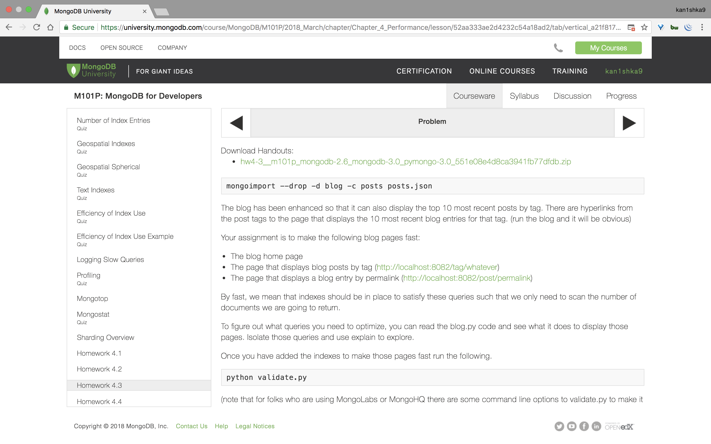

#### Homework 4.3





```sh
u64@vm:~/Desktop$ wget https://university.mongodb.com/static/MongoDB_2018_M101P_March/handouts/hw4-3__m101p_mongodb-2.6_mongodb-3.0_pymongo-3.0_551e08e4d8ca3941fb77dfdb.zip
--2018-04-12 11:02:00--  https://university.mongodb.com/static/MongoDB_2018_M101P_March/handouts/hw4-3__m101p_mongodb-2.6_mongodb-3.0_pymongo-3.0_551e08e4d8ca3941fb77dfdb.zip
Resolving university.mongodb.com (university.mongodb.com)... 52.21.89.200, 54.175.147.155, 54.173.82.137
Connecting to university.mongodb.com (university.mongodb.com)|52.21.89.200|:443... connected.
HTTP request sent, awaiting response... 200 OK
Length: 35591298 (34M) [application/zip]
Saving to: ‘hw4-3__m101p_mongodb-2.6_mongodb-3.0_pymongo-3.0_551e08e4d8ca3941fb77dfdb.zip’

hw4-3__m101p_mongodb-2.6_mongodb-3.0_pymongo-3.0_5 100%[================================================================================================================>]  33.94M  7.42MB/s    in 5.0s

2018-04-12 11:02:06 (6.82 MB/s) - ‘hw4-3__m101p_mongodb-2.6_mongodb-3.0_pymongo-3.0_551e08e4d8ca3941fb77dfdb.zip’ saved [35591298/35591298]

u64@vm:~/Desktop$
```

```sh
u64@vm:~/Desktop$ unzip hw4-3__m101p_mongodb-2.6_mongodb-3.0_pymongo-3.0_551e08e4d8ca3941fb77dfdb.zip
Archive:  hw4-3__m101p_mongodb-2.6_mongodb-3.0_pymongo-3.0_551e08e4d8ca3941fb77dfdb.zip
 extracting: hw4-3/validate.py
 extracting: hw4-3/blog.py
 extracting: hw4-3/views/welcome.tpl
 extracting: hw4-3/views/signup.tpl
 extracting: hw4-3/views/entry_template.tpl
 extracting: hw4-3/views/login.tpl
 extracting: hw4-3/views/newpost_template.tpl
 extracting: hw4-3/views/error_template.tpl
 extracting: hw4-3/views/blog_template.tpl
 extracting: hw4-3/userDAO.py
 extracting: hw4-3/posts.json
 extracting: hw4-3/README
 extracting: hw4-3/blogPostDAO.py
 extracting: hw4-3/sessionDAO.py
u64@vm:~/Desktop$
```

```sh
u64@vm:~/Desktop$ cd hw4-3/
u64@vm:~/Desktop/hw4-3$ ll
total 34780
drwxrwxr-x 3 u64 u64     4096 Apr 12 11:02 ./
drwxr-xr-x 3 u64 u64     4096 Apr 12 11:02 ../
-rw-rw-r-- 1 u64 u64     4673 Jan 23 17:00 blogPostDAO.py
-rw-rw-r-- 1 u64 u64    10946 Jan 23 17:00 blog.py
-rw-rw-r-- 1 u64 u64 35553830 Jan 23 17:00 posts.json
-rw-rw-r-- 1 u64 u64      446 Jan 23 17:00 README
-rw-rw-r-- 1 u64 u64     2307 Jan 23 17:00 sessionDAO.py
-rw-rw-r-- 1 u64 u64     2578 Jan 23 17:00 userDAO.py
-rw-rw-r-- 1 u64 u64     9463 Jan 23 17:00 validate.py
drwxrwxr-x 2 u64 u64     4096 Apr 12 11:02 views/
u64@vm:~/Desktop/hw4-3$
```

```sh
u64@vm:~/Desktop/hw4-3$ mongo
MongoDB shell version v3.6.3
connecting to: mongodb://127.0.0.1:27017
MongoDB server version: 3.6.3
Server has startup warnings:
2018-04-12T09:57:10.633-0700 I STORAGE  [initandlisten]
2018-04-12T09:57:10.633-0700 I STORAGE  [initandlisten] ** WARNING: Using the XFS filesystem is strongly recommended with the WiredTiger storage engine
2018-04-12T09:57:10.633-0700 I STORAGE  [initandlisten] **          See http://dochub.mongodb.org/core/prodnotes-filesystem
2018-04-12T09:57:11.610-0700 I CONTROL  [initandlisten]
2018-04-12T09:57:11.610-0700 I CONTROL  [initandlisten] ** WARNING: Access control is not enabled for the database.
2018-04-12T09:57:11.610-0700 I CONTROL  [initandlisten] **          Read and write access to data and configuration is unrestricted.
2018-04-12T09:57:11.610-0700 I CONTROL  [initandlisten]
> use blog
switched to db blog
> db.posts.drop()
true
>
bye
u64@vm:~/Desktop/hw4-3$
```

```sh
u64@vm:~/Desktop/hw4-3$ mongoimport --drop -d blog -c posts posts.json
2018-04-12T11:05:14.080-0700	connected to: localhost
2018-04-12T11:05:14.081-0700	dropping: blog.posts
2018-04-12T11:05:16.965-0700	imported 1000 documents
u64@vm:~/Desktop/hw4-3$
```

```sh
u64@vm:~/Desktop/hw4-3$ python blog.py
Bottle v0.12.13 server starting up (using WSGIRefServer())...
Listening on http://localhost:8082/
Hit Ctrl-C to quit.
```

```
http://localhost:8082/
```


```sh
u64@vm:~/Desktop/hw4-3$ python validate.py
Welcome to the HW 4.3 Checker. My job is to make sure you added the indexes
that make the blog fast in the following three situations
	When showing the home page
	When fetching a particular post
	When showing all posts for a particular tag
Data looks like it is properly loaded into the posts collection
Sorry, executing the query to display the home page is too slow.
We should be scanning no more than 10 documents. You scanned 1000
here is the output from explain
{u'executionStats': {u'allPlansExecution': [],
                     u'executionStages': {u'advanced': 10,
                                          u'executionTimeMillisEstimate': 10,
                                          u'inputStage': {u'advanced': 1000,
                                                          u'executionTimeMillisEstimate': 10,
                                                          u'inputStage': {u'advanced': 1000,
                                                                          u'direction': u'forward',
                                                                          u'docsExamined': 1000,
                                                                          u'executionTimeMillisEstimate': 10,
                                                                          u'invalidates': 0,
                                                                          u'isEOF': 1,
                                                                          u'nReturned': 1000,
                                                                          u'needTime': 1,
                                                                          u'needYield': 0,
                                                                          u'restoreState': 7,
                                                                          u'saveState': 7,
                                                                          u'stage': u'COLLSCAN',
                                                                          u'works': 1002},
                                                          u'invalidates': 0,
                                                          u'isEOF': 1,
                                                          u'nReturned': 1000,
                                                          u'needTime': 2,
                                                          u'needYield': 0,
                                                          u'restoreState': 7,
                                                          u'saveState': 7,
                                                          u'stage': u'SORT_KEY_GENERATOR',
                                                          u'works': 1003},
                                          u'invalidates': 0,
                                          u'isEOF': 1,
                                          u'limitAmount': 10,
                                          u'memLimit': 33554432,
                                          u'memUsage': 309832,
                                          u'nReturned': 10,
                                          u'needTime': 1003,
                                          u'needYield': 0,
                                          u'restoreState': 7,
                                          u'saveState': 7,
                                          u'sortPattern': {u'date': -1},
                                          u'stage': u'SORT',
                                          u'works': 1014},
                     u'executionSuccess': True,
                     u'executionTimeMillis': 7,
                     u'nReturned': 10,
                     u'totalDocsExamined': 1000,
                     u'totalKeysExamined': 0},
 u'ok': 1.0,
 u'queryPlanner': {u'indexFilterSet': False,
                   u'namespace': u'blog.posts',
                   u'parsedQuery': {},
                   u'plannerVersion': 1,
                   u'rejectedPlans': [],
                   u'winningPlan': {u'inputStage': {u'inputStage': {u'direction': u'forward',
                                                                    u'stage': u'COLLSCAN'},
                                                    u'stage': u'SORT_KEY_GENERATOR'},
                                    u'limitAmount': 10,
                                    u'sortPattern': {u'date': -1},
                                    u'stage': u'SORT'}},
 u'serverInfo': {u'gitVersion': u'9586e557d54ef70f9ca4b43c26892cd55257e1a5',
                 u'host': u'vm',
                 u'port': 27017,
                 u'version': u'3.6.3'}}
Sorry, the query to display the blog home page is too slow.
u64@vm:~/Desktop/hw4-3$
```

```sh
u64@vm:~/Desktop/hw4-3$ mongo
MongoDB shell version v3.6.3
connecting to: mongodb://127.0.0.1:27017
MongoDB server version: 3.6.3
Server has startup warnings:
2018-04-12T09:57:10.633-0700 I STORAGE  [initandlisten]
2018-04-12T09:57:10.633-0700 I STORAGE  [initandlisten] ** WARNING: Using the XFS filesystem is strongly recommended with the WiredTiger storage engine
2018-04-12T09:57:10.633-0700 I STORAGE  [initandlisten] **          See http://dochub.mongodb.org/core/prodnotes-filesystem
2018-04-12T09:57:11.610-0700 I CONTROL  [initandlisten]
2018-04-12T09:57:11.610-0700 I CONTROL  [initandlisten] ** WARNING: Access control is not enabled for the database.
2018-04-12T09:57:11.610-0700 I CONTROL  [initandlisten] **          Read and write access to data and configuration is unrestricted.
2018-04-12T09:57:11.610-0700 I CONTROL  [initandlisten]
> use blog
switched to db blog
> db.posts.createIndex({tags:1, date:-1})
{
	"createdCollectionAutomatically" : false,
	"numIndexesBefore" : 2,
	"numIndexesAfter" : 2,
	"note" : "all indexes already exist",
	"ok" : 1
}
> db.posts.createIndex({date:-1})
{
	"createdCollectionAutomatically" : false,
	"numIndexesBefore" : 2,
	"numIndexesAfter" : 3,
	"ok" : 1
}
> db.posts.createIndex({permalink:1})
{
	"createdCollectionAutomatically" : false,
	"numIndexesBefore" : 3,
	"numIndexesAfter" : 4,
	"ok" : 1
}
> db.posts.getIndexes()
[
	{
		"v" : 2,
		"key" : {
			"_id" : 1
		},
		"name" : "_id_",
		"ns" : "blog.posts"
	},
	{
		"v" : 2,
		"key" : {
			"tags" : 1,
			"date" : -1
		},
		"name" : "tags_1_date_-1",
		"ns" : "blog.posts"
	},
	{
		"v" : 2,
		"key" : {
			"date" : -1
		},
		"name" : "date_-1",
		"ns" : "blog.posts"
	},
	{
		"v" : 2,
		"key" : {
			"permalink" : 1
		},
		"name" : "permalink_1",
		"ns" : "blog.posts"
	}
]
>
```

```sh
u64@vm:~/Desktop/hw4-3$ python validate.py
Welcome to the HW 4.3 Checker. My job is to make sure you added the indexes
that make the blog fast in the following three situations
	When showing the home page
	When fetching a particular post
	When showing all posts for a particular tag
Data looks like it is properly loaded into the posts collection
Home page is super fast. Nice job.

Blog retrieval by permalink is super fast. Nice job.

Blog retrieval by tag is super fast. Nice job.

Tests Passed for HW 4.3. Your HW 4.3 validation code is 893jfns29f728fn29f20f2
u64@vm:~/Desktop/hw4-3$
```

