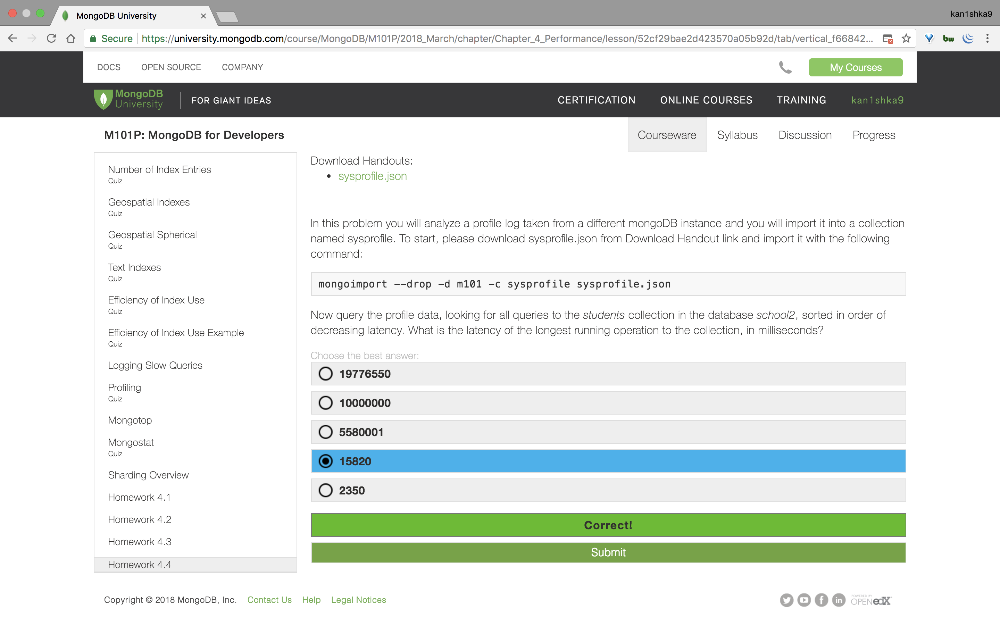

#### Homework 4.4



```sh
u64@vm:~/Desktop$ mongoimport --drop -d m101 -c sysprofile sysprofile.json
2018-04-12T10:47:54.160-0700	connected to: localhost
2018-04-12T10:47:54.162-0700	dropping: m101.sysprofile
2018-04-12T10:47:54.385-0700	imported 1515 documents
u64@vm:~/Desktop$
```

```sh
> db.profile.find({ns:"school2.students"},{_id:0,millis:1}).sort({millis:-1}).limit(3);
```