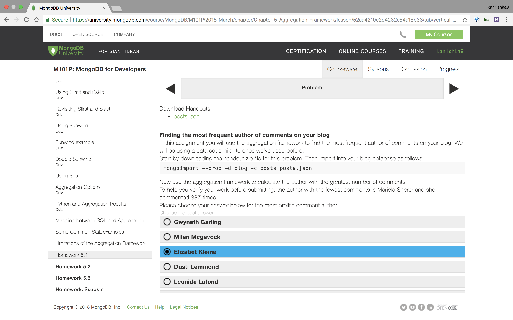

#### Homework 5.1



```sh
u64@vm:~/Desktop$ wc -l posts.json
1000 posts.json
u64@vm:~/Desktop$
```

```sh
u64@vm:~/Desktop$ mongoimport --drop -d blog -c posts posts.json
2018-04-23T11:09:30.357-0700	connected to: localhost
2018-04-23T11:09:30.362-0700	dropping: blog.posts
2018-04-23T11:09:33.528-0700	[###########.............] blog.posts	16.7MB/33.9MB (49.1%)
2018-04-23T11:09:36.858-0700	[###########.............] blog.posts	16.7MB/33.9MB (49.1%)
2018-04-23T11:09:38.531-0700	[########################] blog.posts	33.9MB/33.9MB (100.0%)
2018-04-23T11:09:38.531-0700	imported 1000 documents
u64@vm:~/Desktop$
```

`hw51.js`

```js
use blog;
db.posts.aggregate([
	{"$unwind":"$comments"},
	{"$group":
	 {
		_id:"$comments.author",
		num_comments: {$sum:1}
	 }
	},
	{"$sort":{'num_comments':-1}},
	{"$limit":10}
	])
```

```sh
u64@vm:~/Desktop$ mongo < hw51.js
MongoDB shell version v3.6.3
connecting to: mongodb://127.0.0.1:27017
MongoDB server version: 3.6.3
switched to db blog
{ "_id" : "Elizabet Kleine", "num_comments" : 503 }
{ "_id" : "Carli Belvins", "num_comments" : 480 }
{ "_id" : "Mariette Batdorf", "num_comments" : 478 }
{ "_id" : "Gwyneth Garling", "num_comments" : 477 }
{ "_id" : "Eugene Magdaleno", "num_comments" : 475 }
{ "_id" : "Corliss Zuk", "num_comments" : 472 }
{ "_id" : "Milan Mcgavock", "num_comments" : 472 }
{ "_id" : "Leonida Lafond", "num_comments" : 472 }
{ "_id" : "Dusti Lemmond", "num_comments" : 471 }
{ "_id" : "Sadie Jernigan", "num_comments" : 471 }
bye
u64@vm:~/Desktop$
```


