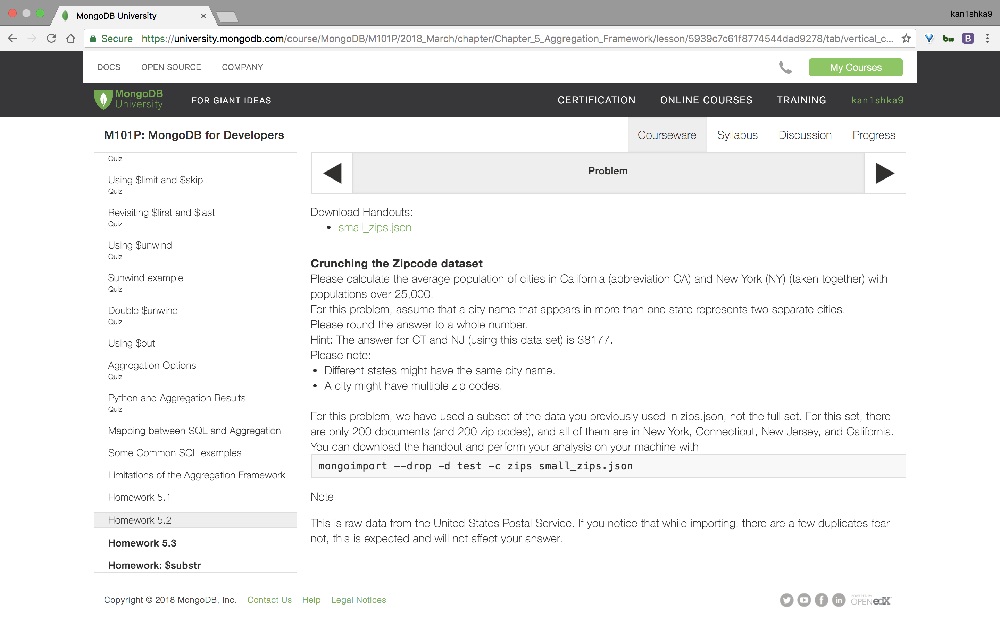
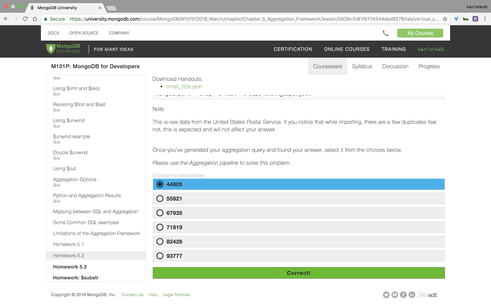
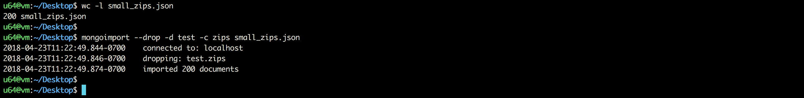
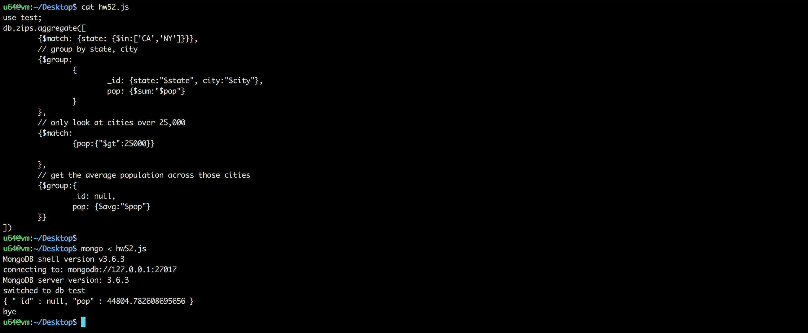

#### Homework 5.2





```sh
u64@vm:~/Desktop$ wc -l small_zips.json
200 small_zips.json
u64@vm:~/Desktop$
```

```sh
u64@vm:~/Desktop$ mongoimport --drop -d test -c zips small_zips.json
2018-04-23T11:34:19.877-0700	connected to: localhost
2018-04-23T11:34:19.878-0700	dropping: test.zips
2018-04-23T11:34:19.901-0700	imported 200 documents
u64@vm:~/Desktop$
```

`hw52.js`

```js
use test;
db.zips.aggregate([
	{$match: {state: {$in:['CA','NY']}}},
	// group by state, city
	{$group:
		{
			_id: {state:"$state", city:"$city"},
			pop: {$sum:"$pop"}
		}
	},
	// only look at cities over 25,000
	{$match:
		{pop:{"$gt":25000}}

	},
	// get the average population across those cities
	{$group:{
		_id: null,
		pop: {$avg:"$pop"}
	}}
])
```

```sh
u64@vm:~/Desktop$ mongo < hw52.js
MongoDB shell version v3.6.3
connecting to: mongodb://127.0.0.1:27017
MongoDB server version: 3.6.3
switched to db test
{ "_id" : null, "pop" : 44804.782608695656 }
bye
u64@vm:~/Desktop$
```



