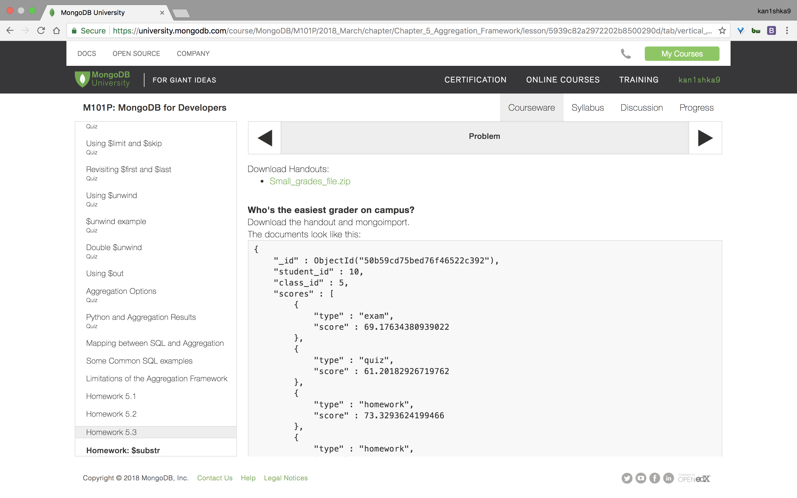
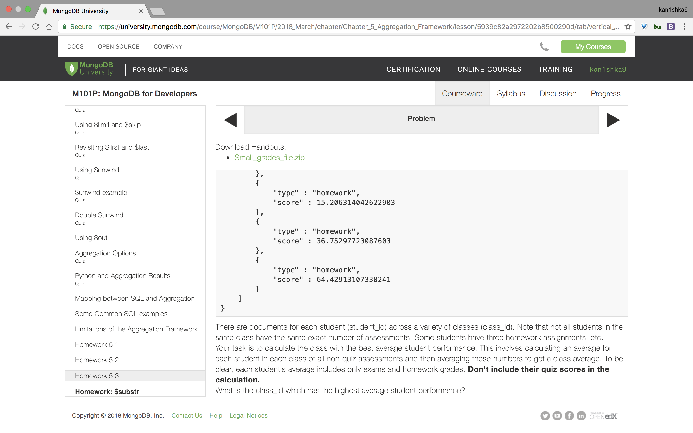
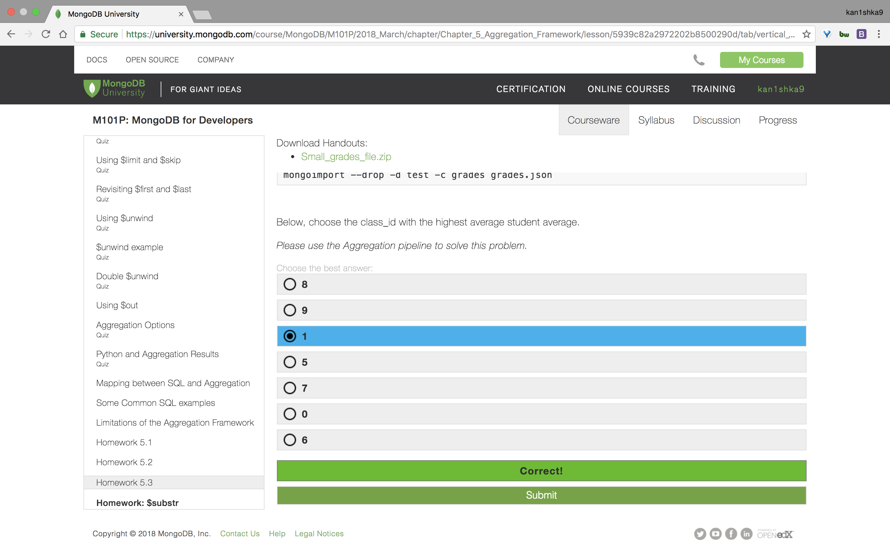
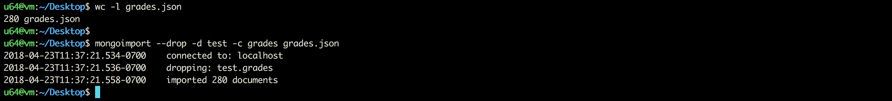
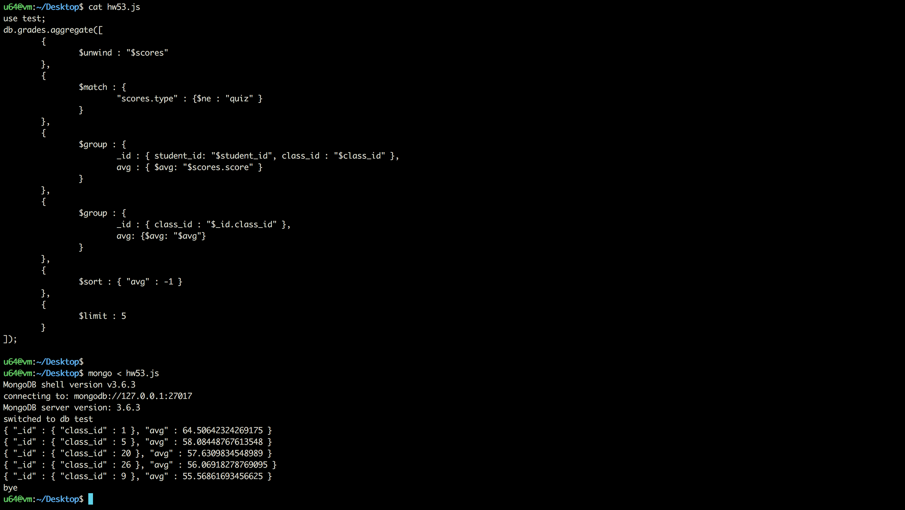

#### Homework 5.3







```sh
u64@vm:~/Desktop$ wc -l grades.json
280 grades.json
u64@vm:~/Desktop$
```

```sh
u64@vm:~/Desktop$ mongoimport --drop -d test -c grades grades.json
2018-04-23T11:37:21.534-0700	connected to: localhost
2018-04-23T11:37:21.536-0700	dropping: test.grades
2018-04-23T11:37:21.558-0700	imported 280 documents
u64@vm:~/Desktop$
```

`hw53.js`

```js
use test;
db.grades.aggregate([
	{
		$unwind : "$scores"
	},
	{
		$match : {
			"scores.type" : {$ne : "quiz" }
		}
	},
	{
		$group : {
			_id : { student_id: "$student_id", class_id : "$class_id" },
			avg : { $avg: "$scores.score" }
		}
	},
	{
		$group : {
			_id : { class_id : "$_id.class_id" },
			avg: {$avg: "$avg"}
		}
	},
	{
		$sort : { "avg" : -1 }
	},
	{
		$limit : 5
	}
]);
```

```sh
u64@vm:~/Desktop$ mongo < hw53.js
MongoDB shell version v3.6.3
connecting to: mongodb://127.0.0.1:27017
MongoDB server version: 3.6.3
switched to db test
{ "_id" : { "class_id" : 1 }, "avg" : 64.50642324269175 }
{ "_id" : { "class_id" : 5 }, "avg" : 58.08448767613548 }
{ "_id" : { "class_id" : 20 }, "avg" : 57.6309834548989 }
{ "_id" : { "class_id" : 26 }, "avg" : 56.06918278769095 }
{ "_id" : { "class_id" : 9 }, "avg" : 55.56861693456625 }
bye
u64@vm:~/Desktop$
```



