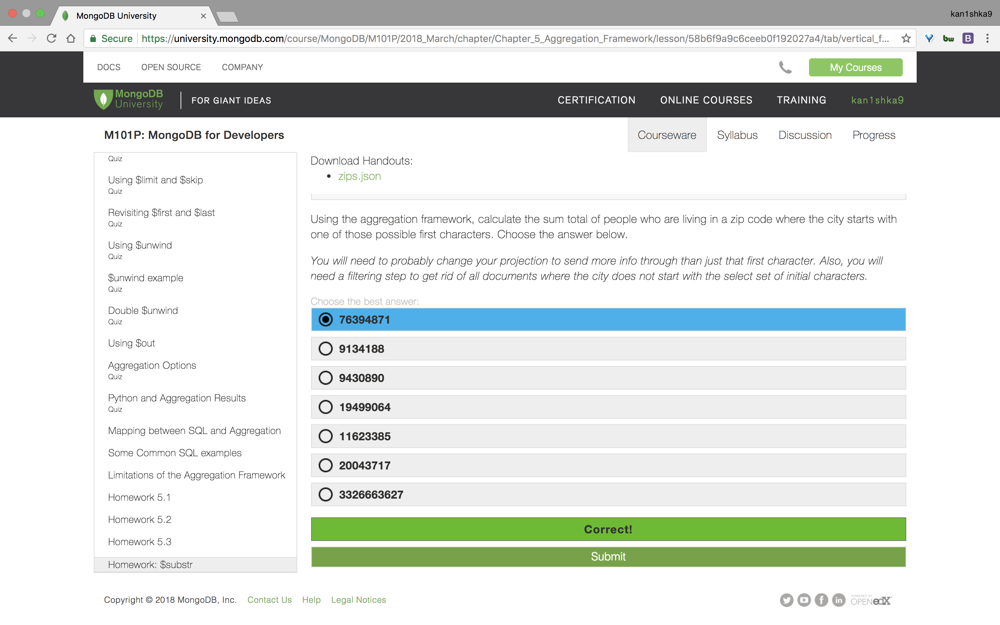

#### Homework 5.4




```sh
u64@vm:~/Desktop$ wc -l zips.json
29353 zips.json
u64@vm:~/Desktop$
```

```sh
u64@vm:~/Desktop$ mongoimport --drop -d test -c zips zips.json
2018-04-23T12:01:15.886-0700	connected to: localhost
2018-04-23T12:01:15.887-0700	dropping: test.zips
2018-04-23T12:01:16.261-0700	imported 29353 documents
u64@vm:~/Desktop$
```

```sh
u64@vm:~/Desktop$ mongo
MongoDB shell version v3.6.3
connecting to: mongodb://127.0.0.1:27017
MongoDB server version: 3.6.3
Server has startup warnings:
2018-04-22T11:05:02.839-0700 I STORAGE  [initandlisten]
2018-04-22T11:05:02.839-0700 I STORAGE  [initandlisten] ** WARNING: Using the XFS filesystem is strongly recommended with the WiredTiger storage engine
2018-04-22T11:05:02.839-0700 I STORAGE  [initandlisten] **          See http://dochub.mongodb.org/core/prodnotes-filesystem
2018-04-22T11:05:05.406-0700 I CONTROL  [initandlisten]
2018-04-22T11:05:05.406-0700 I CONTROL  [initandlisten] ** WARNING: Access control is not enabled for the database.
2018-04-22T11:05:05.406-0700 I CONTROL  [initandlisten] **          Read and write access to data and configuration is unrestricted.
2018-04-22T11:05:05.406-0700 I CONTROL  [initandlisten]
> use test
switched to db test
> db.zips.count()
29353
>
bye
u64@vm:~/Desktop$
```

`hw54.js`

```js
use test;
db.zips.aggregate([
   {
      $project:{
         first_char:{
            $substr:[
               "$city",
               0,
               1
            ]
         },
         pop:"$pop"
      }
   },
   {
      $group:{
         "_id":"$first_char",
         tot_pop:{
            $sum:"$pop"
         }
      }
   },
   {
      $match:{
         "_id":{
            $in:[
               "B",
               "D",
               "O",
               "G",
               "N",
               "M"
            ]
         }
      }
   },
   {
      $group:{
         "_id":null,
         "tot_pop":{
            $sum:"$tot_pop"
         }
      }
   }
])
```

```sh
u64@vm:~/Desktop$ mongo < hw54.js
MongoDB shell version v3.6.3
connecting to: mongodb://127.0.0.1:27017
MongoDB server version: 3.6.3
switched to db test
{ "_id" : null, "tot_pop" : 76394871 }
bye
u64@vm:~/Desktop$
```


