#### Homework 6.5

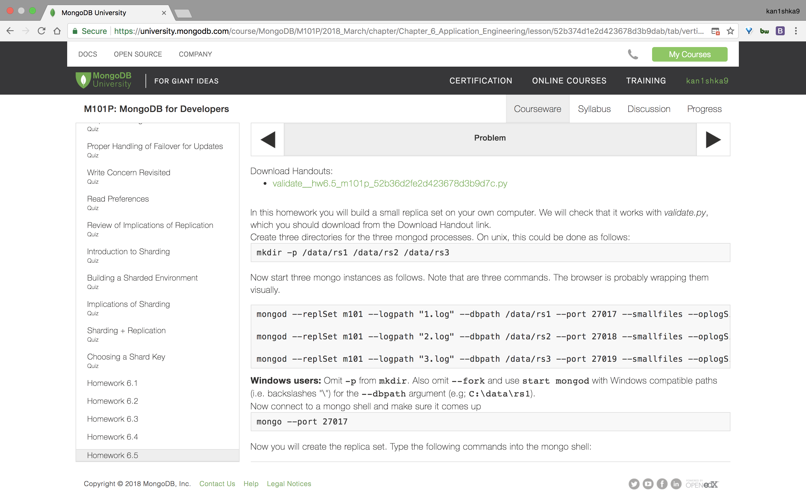

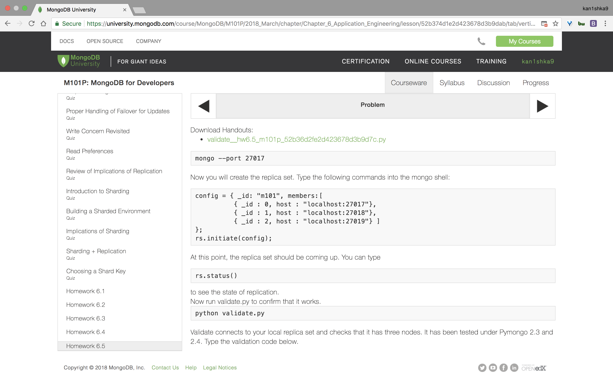

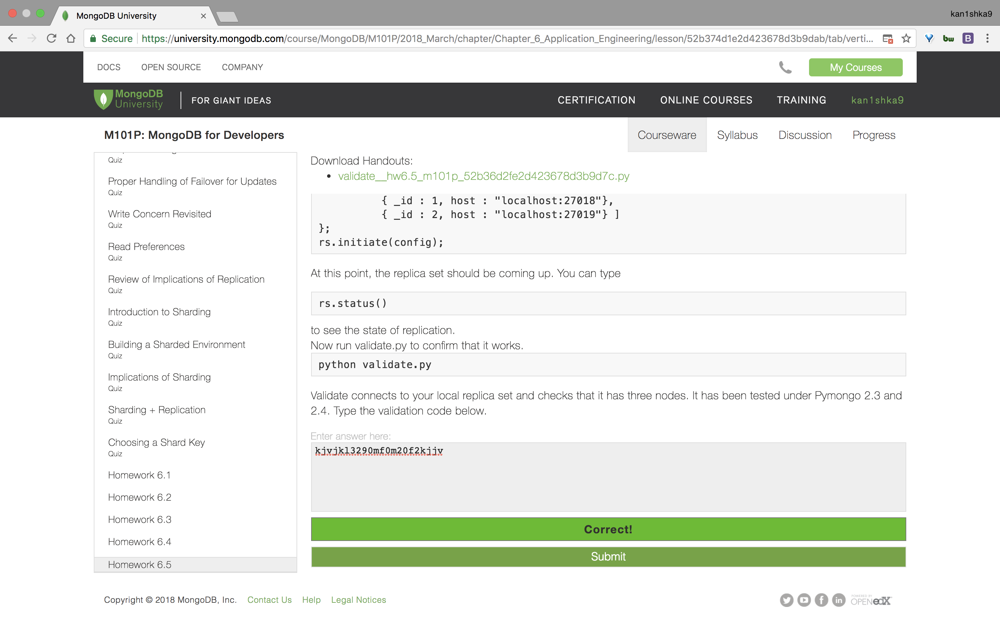

```sh
u64@vm:~/Desktop$ sudo mkdir -p /data/rs1 /data/rs2 /data/rs3
[sudo] password for u64:
u64@vm:~/Desktop$
```

```sh
u64@vm:~$ sudo chmod -R go+w /data/rs*
```

```sh
u64@vm:~$ mongod --replSet m101 --logpath "1.log" --dbpath /data/rs1 --port 27017 --smallfiles --oplogSize 64 --fork
about to fork child process, waiting until server is ready for connections.
forked process: 2473
child process started successfully, parent exiting
u64@vm:~$
```

```sh
u64@vm:~$ mongod --replSet m101 --logpath "2.log" --dbpath /data/rs2 --port 27018 --smallfiles --oplogSize 64 --fork
about to fork child process, waiting until server is ready for connections.
forked process: 2527
child process started successfully, parent exiting
u64@vm:~$
```

```sh
u64@vm:~$ mongod --replSet m101 --logpath "3.log" --dbpath /data/rs3 --port 27019 --smallfiles --oplogSize 64 --fork
about to fork child process, waiting until server is ready for connections.
forked process: 2555
child process started successfully, parent exiting
u64@vm:~$
```

`init_replica.js`

```js
config = { _id: "m101", members:[
          { _id : 0, host : "localhost:27017"},
          { _id : 1, host : "localhost:27018"},
          { _id : 2, host : "localhost:27019"} ]
};
```

```sh
u64@vm:~/Desktop$ mongo < init_replica.js
MongoDB shell version v3.6.3
connecting to: mongodb://127.0.0.1:27017
MongoDB server version: 3.6.3
{
	"_id" : "m101",
	"members" : [
		{
			"_id" : 0,
			"host" : "localhost:27017"
		},
		{
			"_id" : 1,
			"host" : "localhost:27018"
		},
		{
			"_id" : 2,
			"host" : "localhost:27019"
		}
	]
}
{
	"ok" : 1,
	"operationTime" : Timestamp(1525118631, 1),
	"$clusterTime" : {
		"clusterTime" : Timestamp(1525118631, 1),
		"signature" : {
			"hash" : BinData(0,"AAAAAAAAAAAAAAAAAAAAAAAAAAA="),
			"keyId" : NumberLong(0)
		}
	}
}
bye
u64@vm:~/Desktop$
```

```sh
u64@vm:~/Desktop$ mongo
MongoDB shell version v3.6.3
connecting to: mongodb://127.0.0.1:27017
MongoDB server version: 3.6.3
Server has startup warnings:
2018-04-30T13:02:18.181-0700 I STORAGE  [initandlisten]
2018-04-30T13:02:18.181-0700 I STORAGE  [initandlisten] ** WARNING: Using the XFS filesystem is strongly recommended with the WiredTiger storage engine
2018-04-30T13:02:18.181-0700 I STORAGE  [initandlisten] **          See http://dochub.mongodb.org/core/prodnotes-filesystem
2018-04-30T13:02:18.880-0700 I CONTROL  [initandlisten]
2018-04-30T13:02:18.880-0700 I CONTROL  [initandlisten] ** WARNING: Access control is not enabled for the database.
2018-04-30T13:02:18.880-0700 I CONTROL  [initandlisten] **          Read and write access to data and configuration is unrestricted.
2018-04-30T13:02:18.880-0700 I CONTROL  [initandlisten]
2018-04-30T13:02:18.880-0700 I CONTROL  [initandlisten] ** WARNING: This server is bound to localhost.
2018-04-30T13:02:18.880-0700 I CONTROL  [initandlisten] **          Remote systems will be unable to connect to this server.
2018-04-30T13:02:18.880-0700 I CONTROL  [initandlisten] **          Start the server with --bind_ip <address> to specify which IP
2018-04-30T13:02:18.880-0700 I CONTROL  [initandlisten] **          addresses it should serve responses from, or with --bind_ip_all to
2018-04-30T13:02:18.880-0700 I CONTROL  [initandlisten] **          bind to all interfaces. If this behavior is desired, start the
2018-04-30T13:02:18.880-0700 I CONTROL  [initandlisten] **          server with --bind_ip 127.0.0.1 to disable this warning.
2018-04-30T13:02:18.880-0700 I CONTROL  [initandlisten]
m101:PRIMARY> rs.status()
{
	"set" : "m101",
	"date" : ISODate("2018-04-30T20:04:14.997Z"),
	"myState" : 1,
	"term" : NumberLong(1),
	"heartbeatIntervalMillis" : NumberLong(2000),
	"optimes" : {
		"lastCommittedOpTime" : {
			"ts" : Timestamp(1525118643, 5),
			"t" : NumberLong(1)
		},
		"readConcernMajorityOpTime" : {
			"ts" : Timestamp(1525118643, 5),
			"t" : NumberLong(1)
		},
		"appliedOpTime" : {
			"ts" : Timestamp(1525118643, 5),
			"t" : NumberLong(1)
		},
		"durableOpTime" : {
			"ts" : Timestamp(1525118643, 5),
			"t" : NumberLong(1)
		}
	},
	"members" : [
		{
			"_id" : 0,
			"name" : "localhost:27017",
			"health" : 1,
			"state" : 1,
			"stateStr" : "PRIMARY",
			"uptime" : 116,
			"optime" : {
				"ts" : Timestamp(1525118643, 5),
				"t" : NumberLong(1)
			},
			"optimeDate" : ISODate("2018-04-30T20:04:03Z"),
			"infoMessage" : "could not find member to sync from",
			"electionTime" : Timestamp(1525118642, 1),
			"electionDate" : ISODate("2018-04-30T20:04:02Z"),
			"configVersion" : 1,
			"self" : true
		},
		{
			"_id" : 1,
			"name" : "localhost:27018",
			"health" : 1,
			"state" : 2,
			"stateStr" : "SECONDARY",
			"uptime" : 23,
			"optime" : {
				"ts" : Timestamp(1525118643, 5),
				"t" : NumberLong(1)
			},
			"optimeDurable" : {
				"ts" : Timestamp(1525118643, 5),
				"t" : NumberLong(1)
			},
			"optimeDate" : ISODate("2018-04-30T20:04:03Z"),
			"optimeDurableDate" : ISODate("2018-04-30T20:04:03Z"),
			"lastHeartbeat" : ISODate("2018-04-30T20:04:14.747Z"),
			"lastHeartbeatRecv" : ISODate("2018-04-30T20:04:14.865Z"),
			"pingMs" : NumberLong(0),
			"syncingTo" : "localhost:27017",
			"configVersion" : 1
		},
		{
			"_id" : 2,
			"name" : "localhost:27019",
			"health" : 1,
			"state" : 2,
			"stateStr" : "SECONDARY",
			"uptime" : 23,
			"optime" : {
				"ts" : Timestamp(1525118643, 5),
				"t" : NumberLong(1)
			},
			"optimeDurable" : {
				"ts" : Timestamp(1525118643, 5),
				"t" : NumberLong(1)
			},
			"optimeDate" : ISODate("2018-04-30T20:04:03Z"),
			"optimeDurableDate" : ISODate("2018-04-30T20:04:03Z"),
			"lastHeartbeat" : ISODate("2018-04-30T20:04:14.748Z"),
			"lastHeartbeatRecv" : ISODate("2018-04-30T20:04:14.865Z"),
			"pingMs" : NumberLong(0),
			"syncingTo" : "localhost:27017",
			"configVersion" : 1
		}
	],
	"ok" : 1,
	"operationTime" : Timestamp(1525118643, 5),
	"$clusterTime" : {
		"clusterTime" : Timestamp(1525118643, 5),
		"signature" : {
			"hash" : BinData(0,"AAAAAAAAAAAAAAAAAAAAAAAAAAA="),
			"keyId" : NumberLong(0)
		}
	}
}
m101:PRIMARY>
bye
u64@vm:~/Desktop$
```

```sh
u64@vm:~/Desktop$ python validate__hw6.5_m101p_52b36d2fe2d423678d3b9d7c.py
Welcome to the HW 6.x replica Checker. My job is to make sure you started a replica set with three nodes
Looks good. Replica set with three nodes running
Tests Passed for HW 6.5. Your HW 6.5 validation code is kjvjkl3290mf0m20f2kjjv
u64@vm:~/Desktop$
```

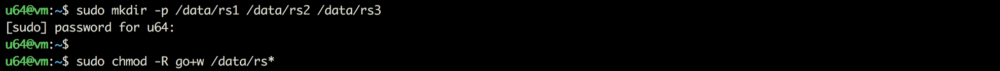

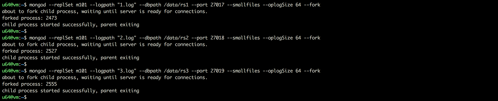

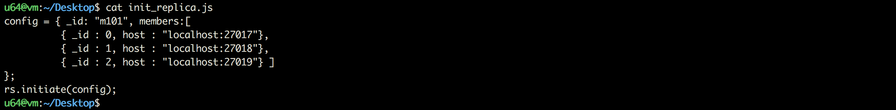

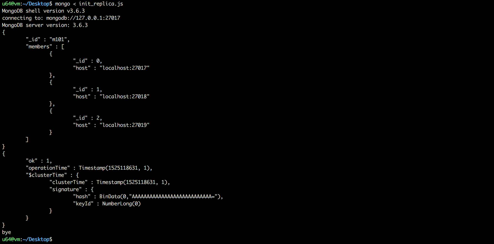

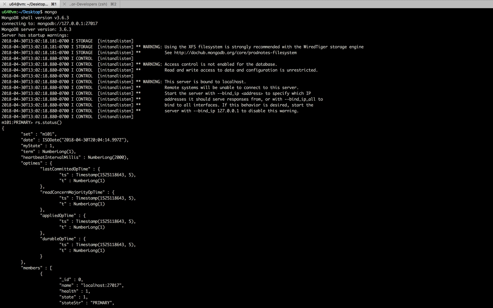

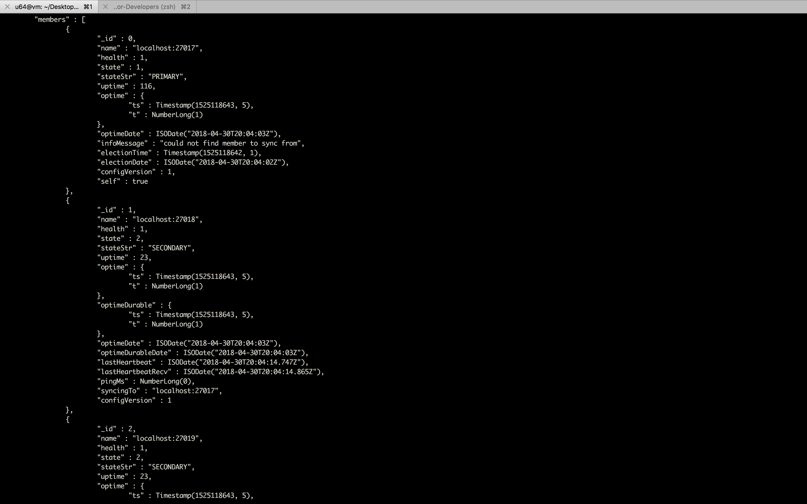

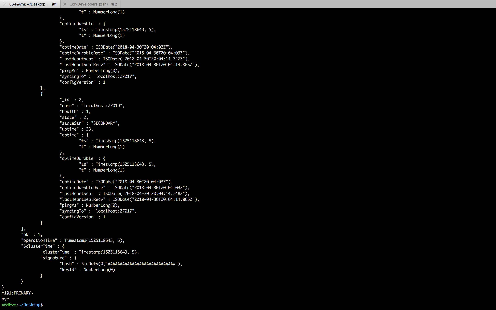

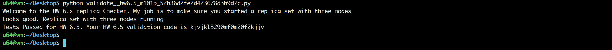